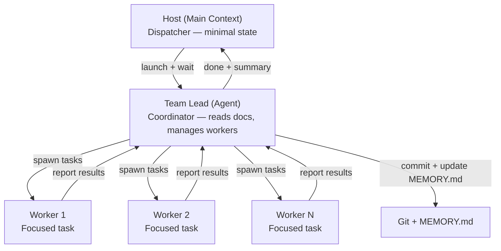

# KubexClaw Development Standards

## Overview
This document defines the development and testing standards for the KubexClaw project. All contributors (human and AI) must follow these rules.

## Architecture Reference
- **KubexClaw.md** is the project index. **docs/** contains all architecture and design documentation.
- **BRAINSTORM.md** has been archived to `archive/BRAINSTORM-v1.md`. The `docs/` files are the source of truth.
- **CLAUDE.md** contains project rules for AI assistants.
- All diagrams use Mermaid syntax. No ASCII art.
- Action items are tracked as checkbox lists in the relevant `docs/` file. Open gaps in `docs/gaps.md`.

## Testing Requirements

### Every PR Must Include Tests
No code change merges without corresponding tests. The type of test depends on what changed:

| What Changed | Required Tests |
|---|---|
| `libs/kubex-common/` | Unit tests in `tests/unit/kubex_common/` |
| `services/gateway/` | Unit tests for policy logic + integration tests |
| `services/kubex-broker/` | Integration tests for message routing |
| `services/kubex-manager/` | Integration tests for lifecycle operations |
| `services/kubex-registry/` | Integration tests for capability queries |
| `agents/*` | Unit tests for agent-specific skills |
| `policies/*.yaml` | Policy test fixtures asserting approve/deny/escalate |

### Coverage Minimums
| Component | Minimum Coverage |
|---|---|
| `kubex-common` | 90% |
| Gateway Policy Engine | 95% |
| Kubex Manager | 80% |
| Kubex Broker | 80% |
| Agent skills | 70% |

### Test Framework
- **pytest** is the only test framework. No unittest, no nose.
- Test files: `tests/{unit,integration,e2e,chaos}/test_*.py`
- Fixtures: `tests/fixtures/` for shared test data
- Integration/E2E tests use `docker-compose.test.yml`

### CI Pipeline
- **Every PR:** Lint + unit tests + policy fixtures + integration tests
- **Nightly:** E2E tests + chaos tests + `openclaw security audit`
- **Pre-deploy:** Full test suite must pass
- **No merging with red CI.** No exceptions.

## Security Rules
These are non-negotiable. Violations block the PR.

- Every agent (Kubex) is treated as an **untrusted workload**.
- No agent gets more access than its task requires (**least privilege**).
- Prompt injection defense is a **first-class architectural concern**.
- Human-in-the-loop is **mandatory** for high-tier actions.
- Kubexes have **zero direct internet access** — all external traffic proxied through Gateway.
- LLM API keys are held at the **Gateway only**, never inside Kubex containers.
- All inter-agent communication goes through the **Boundary Gateway** — no direct Kubex-to-Kubex calls.
- **Fail-closed** for all security components. If Gateway is down, no actions proceed.
- Secret values are **never logged**, **never returned via API**, **never stored in agent containers**.

## Code Standards

### Python
- Linting: **ruff**
- Formatting: **black**
- Type hints required for all public functions in `kubex-common`
- No `# type: ignore` without an explanatory comment
- Docstrings required for all public classes and functions in `kubex-common`

### Schemas
- All data contracts live in `kubex-common/src/kubex_common/schemas/`
- New action types require: enum entry in `actions.py` + parameter schema in `schemas/actions/` + policy test fixtures
- Schema changes to `kubex-common` that break backwards compatibility require a major version bump

### Docker
- All images based on `agents/_base/Dockerfile.base`
- OpenClaw version pinned to >= v2026.2.26 (see docs/agents.md, OpenClaw Security Audit section)
- No `latest` tag in production — always use git SHA tags
- Multi-stage builds to minimize image size

### Policy Files
- All policy files in `policies/` directory
- YAML format, validated against policy schema in CI
- Every policy change requires test fixtures
- Policy dry-run diff report must be reviewed before merge

## Naming Conventions
| Term | Meaning |
|---|---|
| **Kubex** | A single managed agent container |
| **Gateway** | The unified service (policy + proxy + scheduler + inbound gate) |
| **Policy Engine** | The rule evaluation component WITHIN the Gateway |
| **Kubex Manager** | Docker lifecycle service |
| **Kubex Broker** | Inter-agent message router (Redis Streams) |
| **Kubex Registry** | Capability discovery service |
| **Boundary** | Trust zone grouping related Kubexes |
| **Boundary Gateway** | Per-boundary lightweight Policy Engine Kubex |

**Retired terms (do not use):**
- ~~Gatekeeper~~ → use "Gateway" or "Policy Engine"
- ~~API Gateway~~ → use "Gateway"

## Git Workflow
- Branch from `main`, PR back to `main`
- PR title: concise, imperative (e.g., "Add egress allowlist validation to Gateway")
- Squash merge to keep history clean
- Commit messages reference the relevant docs/ file if applicable

## Agent Team Strategy

Implementation work uses a three-tier delegation model to keep the host context window lean.

### Architecture

### Tier 1 — Host (Main Context)
- Reads only `MEMORY.md` for current project status.
- Does NOT read docs, source files, or implementation plans into its own context.
- Launches a Team Lead agent with a high-level task description (e.g., "Implement Wave 3").
- Waits for the Team Lead to return a "done" signal with a concise summary.
- Records the summary and moves to the next wave or reports to the user.

### Tier 2 — Team Lead (Agent)
- Reads architecture docs (`docs/*.md`), implementation plans (`IMPLEMENTATION-PLAN.md`), and existing source code.
- Breaks the wave/task into independent streams and spawns Worker agents for each.
- Reviews worker output — verifies files were created/modified correctly.
- Commits code after each completed stream with descriptive commit messages.
- Updates `MEMORY.md` with: what was done, git hash, any blockers.
- Returns to Host: summary of changes, files touched, test results, open blockers.

### Tier 3 — Workers (Agents)
- Each worker receives a single, focused task from the Team Lead.
- Worker prompts are self-contained: include exact file paths, expected code patterns, and acceptance criteria.
- Workers MUST read target files before writing (Write tool safety requirement).
- Workers report back to the Team Lead with results (success/failure + details).

### Configuration Rules
- All sub-agents use `mode: "bypassPermissions"` to avoid interactive prompts.
- All sub-agents use `model: "sonnet"` for speed and cost efficiency.
- Worker prompts must NOT reference docs by name — instead, the Team Lead extracts the relevant details and includes them directly in the prompt.
- If a worker fails, the Team Lead retries with adjusted instructions. Only escalate to Host if fundamentally blocked (e.g., missing user decision).

### Progress Recording Protocol
- Team Lead commits after each completed stream (not at the end of all work).
- Team Lead updates `MEMORY.md` after each commit with: stream name, status, git hash.
- If the session compacts or crashes, `MEMORY.md` + git log provides full recovery context.
- Blockers are logged in `MEMORY.md` under "Open Questions" so the user can address them.
