# KubexClaw MVP — Architecture Diagrams

> Visual reference for the KubexClaw agent infrastructure. All diagrams use Mermaid syntax per project rules.
> Source of truth: `docs/` directory (architecture decisions, indexed by `KubexClaw.md`) and `MVP.md` (implementation details). The original `BRAINSTORM.md` is archived at `archive/BRAINSTORM-v1.md`.

---

## 1. System Overview — High-Level Architecture

### 1.1 System Context (C4 Level 1)

Who interacts with KubexClaw and what external systems does it depend on.

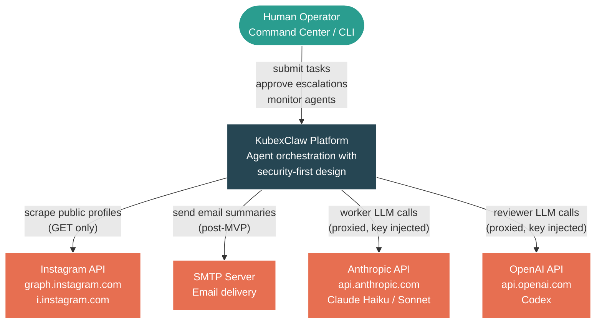

### 1.2 Container Diagram (C4 Level 2)

All Docker containers, their ports, networks, and relationships.

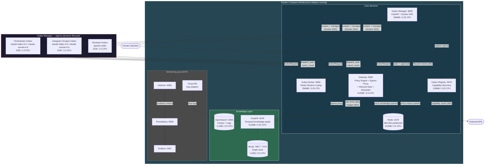

> Monitoring stack (Prometheus, Grafana, cAdvisor, Fluent Bit) is deferred to post-MVP. See BRAINSTORM.md Section 9.

---

## 2. Docker Network Topology

Three Docker networks enforce network-level isolation. Kubexes can ONLY reach the Gateway -- they cannot access data stores or the internet directly.

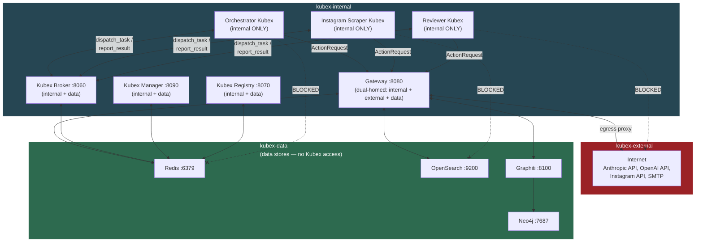

**Network membership summary:**

| Network | Members | Purpose |
|---------|---------|---------|
| `kubex-internal` | Gateway, Kubex Manager, Kubex Broker, Kubex Registry, ALL Kubexes | Agent communication. No external access. |
| `kubex-external` | Gateway ONLY | Internet access. Gateway is dual-homed. |
| `kubex-data` | Redis, OpenSearch, Neo4j, Graphiti, Gateway, Broker, Registry, Kubex Manager | Data stores. Kubexes cannot reach these directly. |

> See BRAINSTORM.md Section 13.8 (Docker Networking Topology).

---

## 3. Data Flow — ActionRequest Pipeline (Happy Path)

Full lifecycle of a request from human operator through Orchestrator dispatch to Instagram Scraper execution and result return.

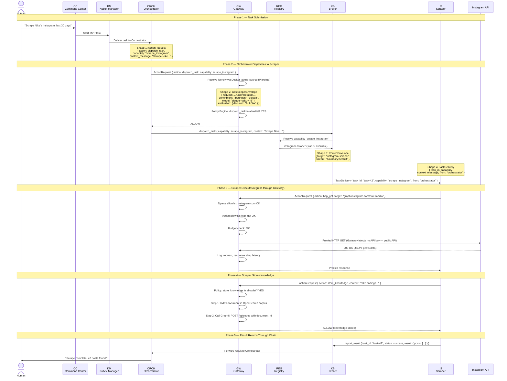

> See BRAINSTORM.md Section 16.2 for canonical schema definitions. See MVP.md Section 5 for data shapes.

---

## 4. Data Flow — Denied Request

What happens when the Policy Engine DENIES a request that violates the Kubex's policy.

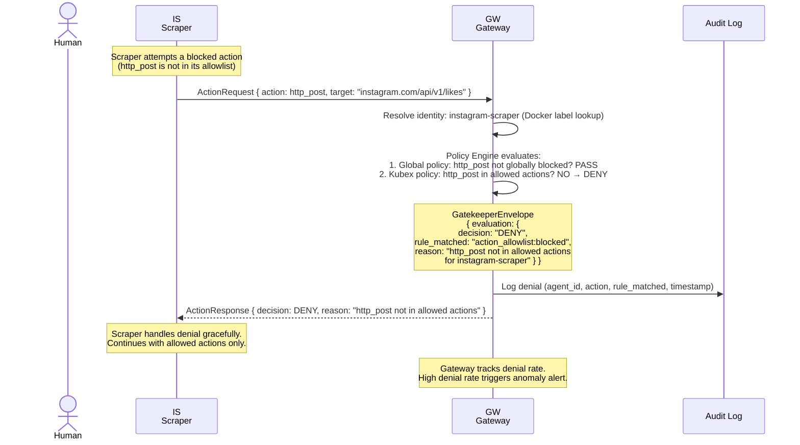

**Other denial scenarios follow the same pattern:**

| Scenario | Policy Check That Fails | Example |
|----------|------------------------|---------|
| Blocked egress domain | Egress allowlist | Scraper requests `api.twitter.com` (not in allowlist) |
| Blocked HTTP method | Egress method filter | Scraper sends POST to `instagram.com` (only GET allowed) |
| Budget exceeded | Per-task token limit | Scraper exceeds 10,000 token limit |
| Rate limit hit | Per-action rate limit | Scraper exceeds 100 http_get calls per task |
| Blocked URL path | Egress blocked paths | Scraper requests `instagram.com/accounts/login` |

> See MVP.md Section 6.2 for policy cascade. See BRAINSTORM.md Section 13.3 for rule categories.

---

## 5. Data Flow — Human Escalation (HITL)

What happens when the Policy Engine escalates a high-risk action to human approval.

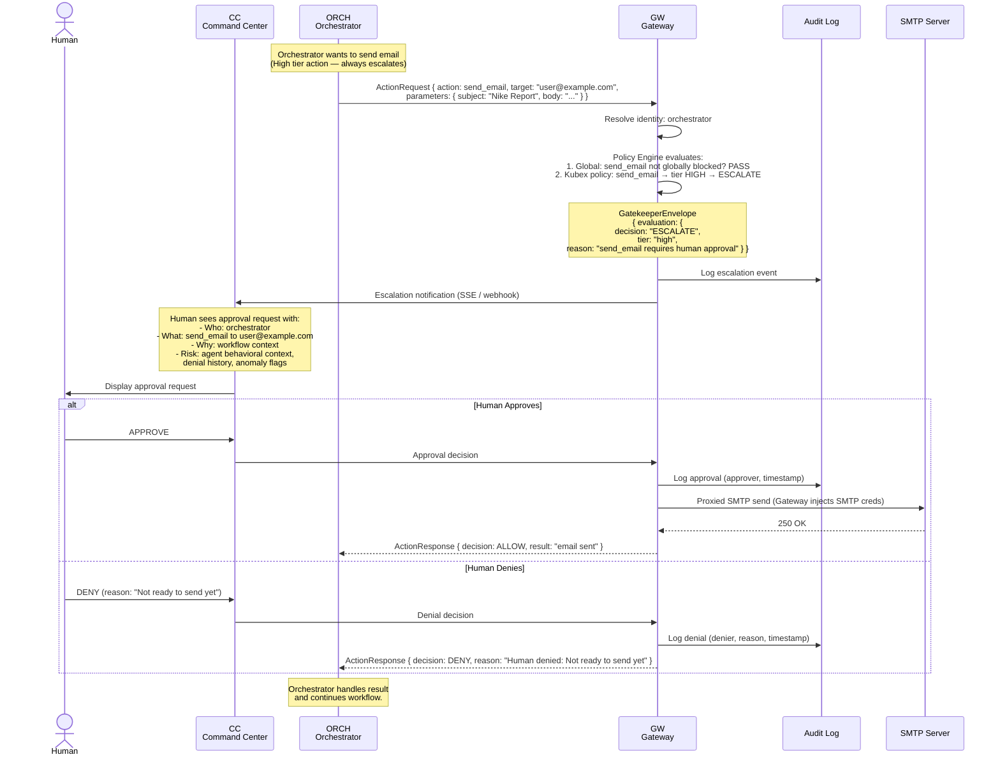

**Approval tiers (from BRAINSTORM.md Section 2):**

| Tier | Example | Approved By |
|------|---------|-------------|
| Low | Read a file the agent has access to | Auto-approved by Policy Engine |
| Medium | Send email to known contact | Reviewer LLM (post-MVP) |
| High | Send email to new external address | Human approval |
| Critical | Access credentials, bulk operations | Human + 2nd human |

> Note: For MVP, the Reviewer LLM escalation path is simplified. The Policy Engine handles all decisions deterministically. Human escalation is via CLI/API, not a full UI. See MVP.md Section 13 (deferred items).

---

## 6. Kubex Lifecycle

Full lifecycle of a Kubex container from creation to shutdown.

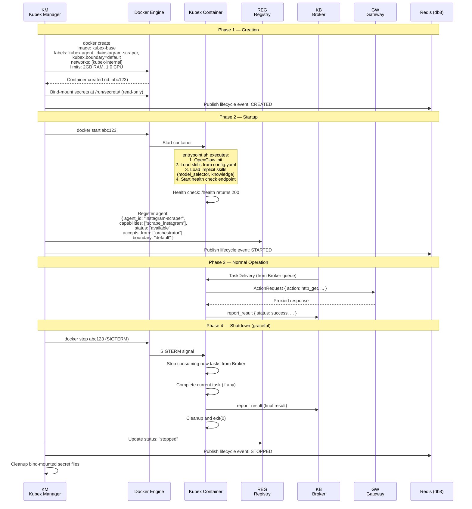

**Kubex status transitions:**

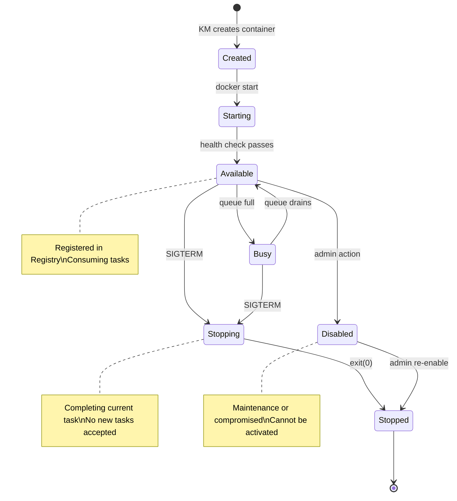

> See BRAINSTORM.md Section 6 (Kubex Registry status definitions), Section 13.8 (MVP deployment).

---

## 7. Knowledge Base Flow

### 7.1 Store Knowledge (Two-Step Ingestion)

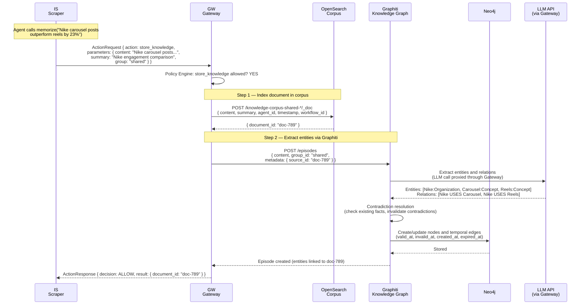

### 7.2 Query Knowledge (Graph Search + Corpus Follow-up)

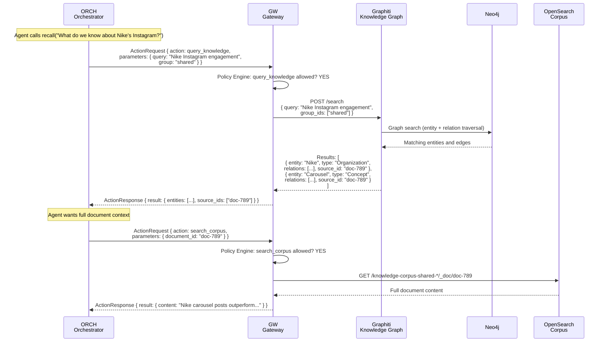

**Knowledge base ontology (10 entity types, 12 relationship types):**

| Entity Types | Relationship Types |
|--------------|--------------------|
| Person, Organization, Product | OWNS, WORKS_FOR, USES |
| Platform, Concept, Event | PRODUCES, REFERENCES, RELATES_TO |
| Location, Document, Metric, Workflow | PART_OF, OCCURRED_AT, MEASURED_BY, PRECEDED_BY, COMPETES_WITH, DEPENDS_ON |

> See BRAINSTORM.md Section 27 for full knowledge base architecture. See MVP.md Section 8 for MVP scope.

---

## 8. Inter-Agent Communication — MVP User Story

**Scenario:** "Human asks: Scrape Nike's Instagram, analyze the content, and email me a summary."

> Note: `send_email` is blocked for the Orchestrator in MVP policy. For this diagram, we show it as an ESCALATE/HITL flow to demonstrate the full pipeline. In practice, email is a post-MVP capability.

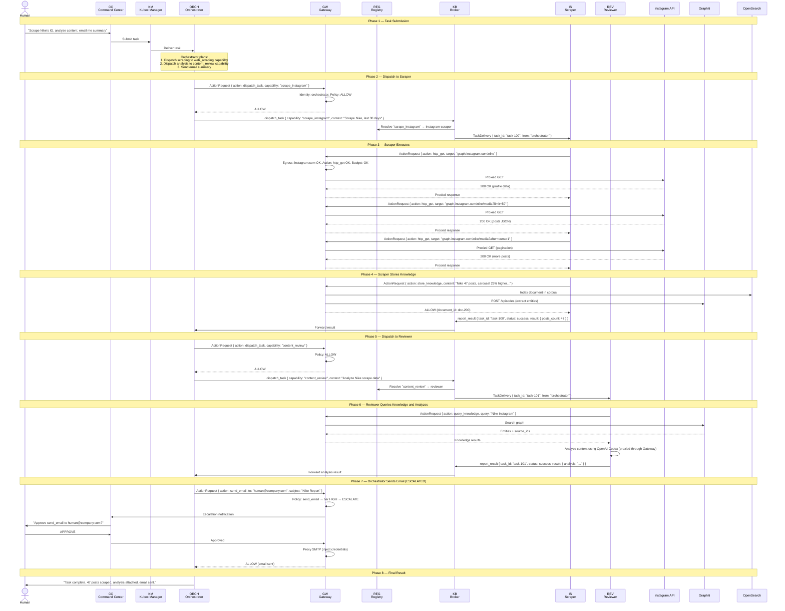

> See MVP.md Section 5.2 for the canonical MVP sequence. The email step above shows the HITL escalation path. In MVP, send_email is in the Orchestrator's blocked actions list, so this step would actually be denied unless policy is updated.

---

## 9. Security Architecture

### 9.1 Defense-in-Depth Layers

```mermaid
graph TD
    subgraph L1["Layer 1: Docker Network Isolation"]
        NET["3 networks: kubex-internal, kubex-external, kubex-data<br/>Kubexes ONLY on kubex-internal<br/>Zero direct internet or data store access"]
    end

    subgraph L2["Layer 2: Container Identity"]
        ID["Docker labels set by Kubex Manager at creation<br/>kubex.agent_id + kubex.boundary<br/>Gateway resolves via source IP → Docker API lookup<br/>Kubex-supplied agent_id is OVERWRITTEN"]
    end

    subgraph L3["Layer 3: Policy Engine"]
        POL["Deterministic rules — no AI, no LLM<br/>Global → Boundary → Per-Kubex (first-deny-wins)<br/>Action allowlist, egress allowlist, rate limits, budget"]
    end

    subgraph L4["Layer 4: Content Scanning (post-MVP)"]
        SCAN["Deterministic regex for known patterns<br/>LLM classifier for prompt injection detection<br/>Structured payloads only — no free-text between agents"]
    end

    subgraph L5["Layer 5: LLM API Key Isolation"]
        KEYS["Kubexes NEVER hold API keys<br/>Gateway injects keys per model allowlist<br/>Compromised Kubex cannot exfiltrate keys"]
    end

    subgraph L6["Layer 6: Anti-Collusion"]
        ANTI["Workers: Anthropic (Claude Haiku/Sonnet)<br/>Reviewer: OpenAI (Codex)<br/>Zero model overlap by design<br/>Workers receive only ALLOW/DENY — never reasoning"]
    end

    subgraph L7["Layer 7: Human-in-the-Loop"]
        HITL["High-risk actions always escalate to human<br/>Critical actions require 2 human approvals<br/>Approval queue with agent behavioral context"]
    end

    L1 --> L2 --> L3 --> L4 --> L5 --> L6 --> L7

    style L1 fill:#264653,stroke:#fff,color:#fff
    style L2 fill:#2a4a5f,stroke:#fff,color:#fff
    style L3 fill:#2d6a4f,stroke:#fff,color:#fff
    style L4 fill:#4a7a5f,stroke:#fff,color:#fff
    style L5 fill:#e76f51,stroke:#fff,color:#fff
    style L6 fill:#c45a3c,stroke:#fff,color:#fff
    style L7 fill:#9b2226,stroke:#fff,color:#fff
```

### 9.2 Policy Cascade (First-Deny-Wins)

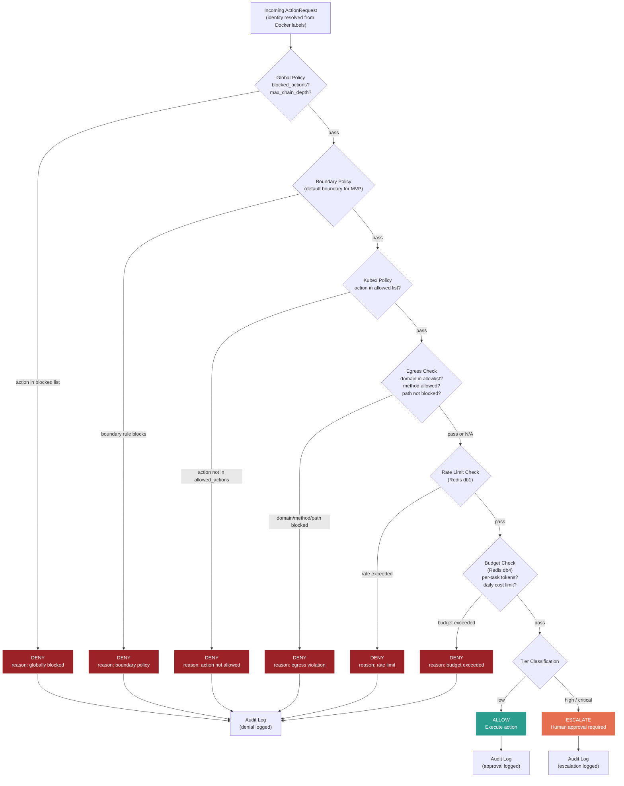

> See BRAINSTORM.md Section 2 (approval tiers), Section 13.3 (rule categories), Section 13.9 (unified Gateway). See MVP.md Section 6.2 for MVP policy cascade.

---

## 10. Redis Database Layout

Single Redis instance with 5 logical databases, partitioned by purpose.

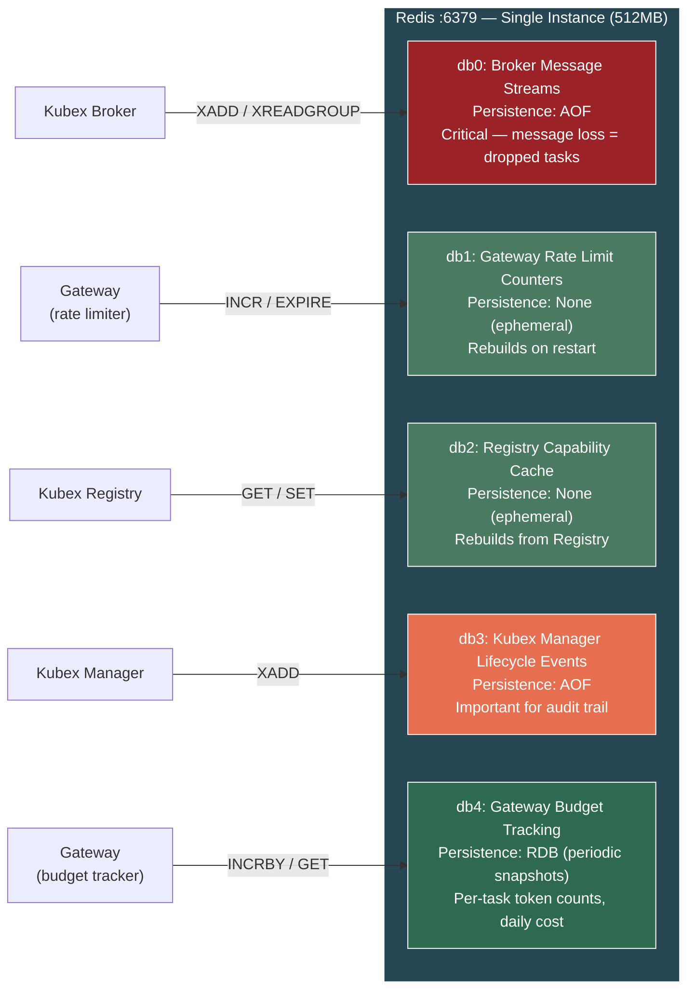

> See MVP.md Section 9 for full Redis database assignments. Post-MVP consideration: split into two Redis instances if memory pressure arises (persistent: db0/db3/db4, ephemeral: db1/db2).

---

## 11. Startup Sequence

Docker Compose startup order with health check dependencies.

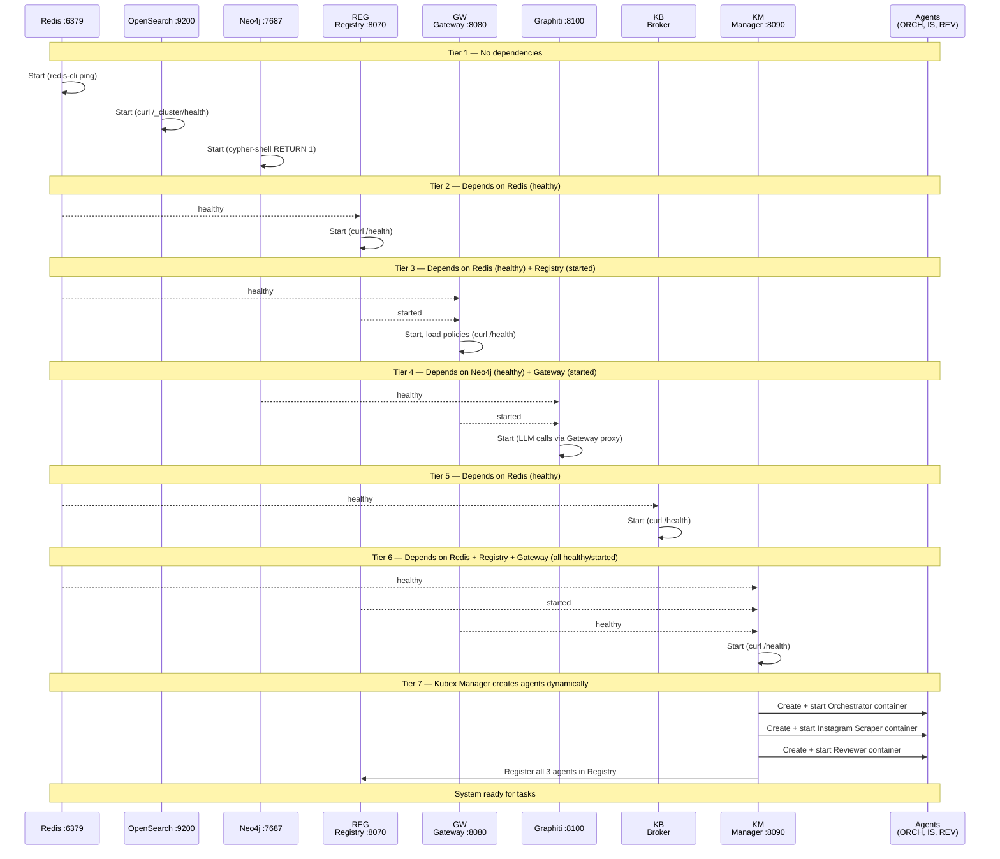

**Startup dependency graph:**

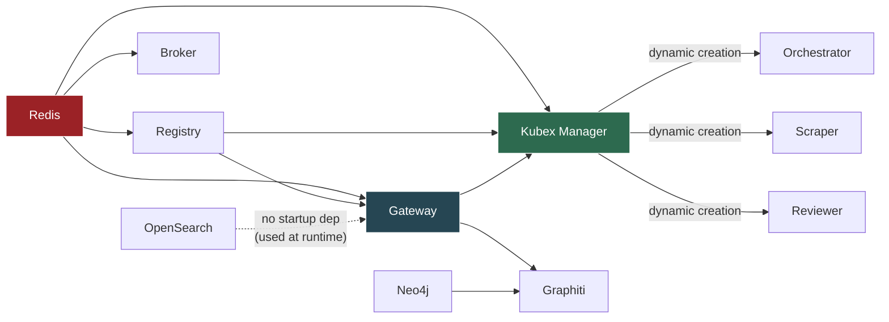

> See MVP.md Section 11 for Docker Compose service definitions with `depends_on` and `condition` settings.

---

## 12. MVP Component Summary Table

| Component | Type | Port | Network(s) | Depends On | Managed By | RAM | CPU |
|-----------|------|------|------------|------------|------------|-----|-----|
| **Gateway** | Infrastructure | 8080 | internal, external, data | Redis (healthy), Registry (started) | Docker Compose | 512MB | 0.5 |
| **Kubex Manager** | Infrastructure | 8090 | internal, data | Redis (healthy), Registry (started), Gateway (healthy) | Docker Compose | 256MB | 0.25 |
| **Kubex Broker** | Infrastructure | 8060 | internal, data | Redis (healthy) | Docker Compose | 256MB | 0.25 |
| **Kubex Registry** | Infrastructure | 8070 | internal, data | Redis (healthy) | Docker Compose | 128MB | 0.25 |
| **Redis** | Data Store | 6379 | data | None | Docker Compose | 512MB | 0.5 |
| **Neo4j** | Knowledge | 7687, 7474 | data | None | Docker Compose | 1.5GB | 0.5 |
| **Graphiti** | Knowledge | 8100 | data | Neo4j (healthy), Gateway (started) | Docker Compose | 512MB | 0.25 |
| **OpenSearch** | Knowledge + Logs | 9200 | data | None | Docker Compose | ~1.5GB | 0.5 |
| **Prometheus** | Monitoring (post-MVP) | 9090 | internal | None | Docker Compose | TBD | TBD |
| **Grafana** | Monitoring (post-MVP) | 3001 | internal | Prometheus | Docker Compose | TBD | TBD |
| **cAdvisor** | Monitoring (post-MVP) | 8081 | internal | None | Docker Compose | TBD | TBD |
| **Fluent Bit** | Monitoring (post-MVP) | -- | internal, data | OpenSearch | Docker Compose | TBD | TBD |
| **Orchestrator** | Agent (Kubex) | -- | internal ONLY | Gateway, Broker, Registry | Kubex Manager | 2GB | 1.0 |
| **Instagram Scraper** | Agent (Kubex) | -- | internal ONLY | Gateway, Broker, Registry | Kubex Manager | 2GB | 1.0 |
| **Reviewer** | Agent (Kubex) | -- | internal ONLY | Gateway, Broker, Registry | Kubex Manager | 2GB | 1.0 |

**Total MVP footprint:** ~9.7GB RAM + ~1.5GB OpenSearch = ~11.2GB of 24GB Docker budget. Remaining headroom: ~12.8GB (room for 4-6 additional Kubexes).

**Agent model assignments (zero overlap enforced):**

| Agent | Provider | Models | Purpose |
|-------|----------|--------|---------|
| Orchestrator | Anthropic | claude-haiku-4-5 (default), claude-sonnet-4-6 (escalation) | Task planning and delegation |
| Instagram Scraper | Anthropic | claude-haiku-4-5 (default), claude-sonnet-4-6 (escalation) | Data extraction and structuring |
| Reviewer | OpenAI | codex (single tier) | Security review of ambiguous actions |

> See BRAINSTORM.md Section 13.8 for port assignment table. See MVP.md Section 10 for resource budget.
