# KubexClaw Orchestration — Brainstorm & Action Items

> **Goal:** Build **KubexClaw Orchestration** — an OpenClaw-based agent infrastructure that operates as a company "employee", automating workflows with strong security guarantees.

### Naming Convention

| Term | Meaning |
|------|---------|
| **KubexClaw** | The overall orchestration system |
| **Kubex** | A single managed agent unit — the Docker container wrapping an OpenClaw instance, its isolated network, secrets, and resource limits. "Deploy a Kubex" = spin up a new agent. |
| **Kubex Manager** | The custom Docker lifecycle service (create, start, stop, kill Kubexes) |
| **Kubex Registry** | The agent discovery service (capabilities, status, accepts_from) |
| **Kubex Broker** | The inter-agent message broker |

---

## 0. Prerequisites

Before building the agent pipeline, the following must be in place.

### Knowledge & Skills
- [ ] Team familiarity with Docker and Docker Compose (networking, volumes, resource limits)
- [ ] Understanding of OpenClaw configuration, deployment, and plugin/skill system
- [ ] Understanding of Docker network isolation and iptables-based egress control
- [ ] Understanding of LLM prompt injection attack vectors and mitigations

### Infrastructure
- [ ] Host machine or VM provisioned with Docker Engine installed
- [ ] Container registry (private) for hosting agent images
- [ ] DNS and networking — internal DNS, reverse proxy, TLS certificates
- [ ] Secret management system deployed (HashiCorp Vault or Docker secrets)
- [ ] Central log store — OpenSearch cluster (see Section 10)
- [ ] Monitoring stack (Prometheus + Grafana or equivalent)
- [ ] Log shipper — Fluent Bit sidecar per Kubex/service (see Section 10)
- [ ] CI/CD pipeline for building and deploying agent images

### Accounts & Access
- [ ] LLM API keys / model access for worker agents (OpenAI, Anthropic, self-hosted, etc.)
- [ ] Separate LLM API key / model access for reviewer agent (different model recommended)
- [ ] Service credentials for target systems agents will interact with (SMTP, Git, databases, etc.)
- [ ] SSO / identity provider integration for human approval queue

### Security Baseline
- [ ] Threat model document — enumerate what each agent can access, what damage a compromised agent could cause
- [ ] Incident response plan — what happens when an agent is compromised (runbook)
- [ ] Data classification policy — which company data each agent tier is allowed to touch
- [ ] Compliance requirements identified (GDPR, SOC2, industry-specific)

### OpenClaw Specific
- [ ] OpenClaw version / fork selected and pinned
- [ ] Evaluate OpenClaw's built-in permission model — what it covers vs what we need to build around it
- [ ] Inventory of OpenClaw skills/plugins needed per agent role
- [ ] Test environment for validating agent behavior before production deployment

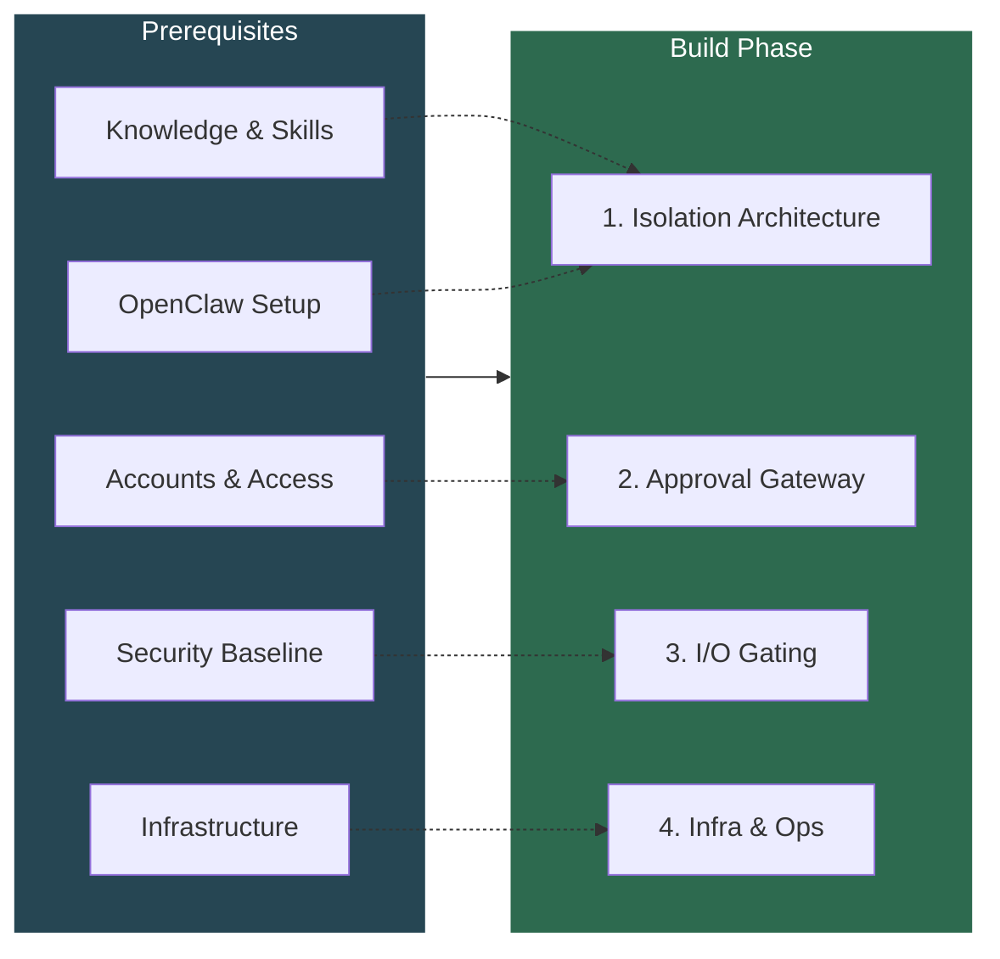

---

## 1. Isolation Architecture

**Decision:** Each agent runs as a **Kubex** — an isolated Docker container wrapping an OpenClaw instance, with its own dedicated network, scoped secrets, and resource limits.

**Rationale:**
- Blast radius containment — a compromised Kubex can only affect its own scope.
- Least privilege enforced via per-Kubex Docker networks, scoped secrets, read-only mounts, and **model allowlists**.
- Much simpler to operate than Kubernetes — no cluster management overhead.
- Each Kubex is started fresh per task (ephemeral) and stopped when done.
- Kill switch is a simple `docker stop` — no cluster API required.

### Model Allowlist Policy

Each Kubex's policy specifies which LLM models it is permitted to use. This is enforced at the Gatekeeper level — the Kubex never holds API keys directly; all LLM calls are proxied or gated.

**Why this matters:**
- Prevents a compromised worker from escalating to a more capable model (e.g. jumping from GPT-4o-mini to Claude Opus)
- Enforces worker/reviewer model separation — workers and reviewers must use different models (Section 2 anti-collusion)
- Controls cost — cheap agents use cheap models, expensive models require explicit policy
- Limits capability surface — a data-extraction agent doesn't need a code-generation model

**Per-Kubex model config (in agent's `config.yaml`):**

```yaml
models:
  allowed:
    - id: "gpt-4o-mini"
      tier: "light"
      cost_per_1k_tokens: 0.00015
    - id: "claude-haiku-4-5"
      tier: "light"
      cost_per_1k_tokens: 0.0008
    - id: "gpt-4o"
      tier: "standard"
      cost_per_1k_tokens: 0.005
    - id: "claude-sonnet-4-6"
      tier: "heavy"
      cost_per_1k_tokens: 0.012
  default: "gpt-4o-mini"
  max_tokens_per_request: 4096
  max_tokens_per_task: 50000

  auto_select:
    enabled: true
    strategy: "cost_effective"   # cost_effective | quality_first | balanced
    escalation_triggers:
      - condition: "task_complexity > 0.7"
        escalate_to_tier: "standard"
      - condition: "previous_attempt_failed"
        escalate_to_tier: "heavy"
      - condition: "output_quality_score < 0.5"
        escalate_to_tier: "heavy"
```

### Automatic Model Selection Skill

Each Kubex ships with a built-in **model selector skill** (part of `kubex-common`) that automatically picks the most effective model from its allowlist based on the task. The agent starts cheap and escalates only when needed — all governed by policy.

**How it works:**
1. Agent starts every task on the `default` model (cheapest/lightest)
2. The model selector skill evaluates task complexity, prior failures, and output quality
3. If an escalation trigger fires, the skill switches to the next tier up from the allowlist
4. All model switches are logged and visible to the Gatekeeper
5. The agent **cannot** select a model outside its allowlist — the skill only picks from what policy permits

**Escalation triggers (configurable per Kubex):**

| Trigger | Example | Escalates to |
|---------|---------|-------------|
| High task complexity | Multi-step reasoning, large codebase analysis | `standard` tier |
| Previous attempt failed | Model produced invalid output, action was denied | `heavy` tier |
| Low output quality score | Structured output failed validation, incomplete results | `heavy` tier |
| Explicit skill request | Agent's task definition requires a specific tier | That tier |

**Constraints:**
- Model escalation is **one-directional within a task** — once escalated, the agent stays at that tier for the remainder of the task (no bouncing)
- Escalation is **logged as an auditable event** — Gatekeeper sees which model was selected and why
- Policy can set a **max tier per Kubex** — e.g., email agent can never go above `standard` even if `heavy` models are in its allowlist for edge cases
- Budget limits (per-task token cap) still apply regardless of which model is selected

**Gatekeeper enforces:**
- Rejects any LLM call requesting a model not in the Kubex's allowlist
- Rejects calls exceeding per-request or per-task token limits
- Validates that model escalation follows the configured triggers (no jumping to heavy without cause)
- Logs all model usage for cost tracking and anomaly detection
- Reviewer Kubex model allowlist must have **zero overlap** with any worker Kubex's allowlist

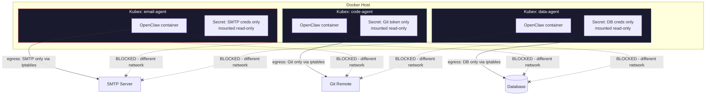

### Action Items
- [ ] Define the list of Kubex roles the company needs (email, code, data, etc.)
- [ ] Design one Kubex per agent with its own isolated Docker network
- [ ] Configure per-Kubex secret mounts (no environment variables for secrets)
- [ ] Set up iptables egress rules to allowlist each Kubex's permitted outbound endpoints
- [ ] Set resource limits per Kubex (`--cpus`, `--memory`) to prevent runaway agents
- [ ] Set up secret management (see Section 8 — Secrets Management Strategy)
- [ ] Define model allowlists per Kubex role in agent config (with tiers and cost metadata)
- [ ] Build model selector skill in `kubex-common` (auto-select from allowlist based on task complexity)
- [ ] Define escalation triggers per Kubex role (complexity, failure, quality score thresholds)
- [ ] Implement model allowlist enforcement in Gatekeeper (reject disallowed model calls)
- [ ] Implement model escalation validation in Gatekeeper (verify trigger conditions before allowing tier jump)
- [ ] Ensure zero model overlap between worker and reviewer Kubex allowlists
- [ ] Add per-request and per-task token limits to Kubex policy

---

## 2. Reviewer Agent / Approval Gateway

**Decision:** Implement a tiered approval system — deterministic policy engine first, LLM reviewer second, human escalation third.

**Rationale:**
- An LLM-only reviewer is itself vulnerable to prompt injection.
- A deterministic policy engine (not an LLM) handles 90% of decisions with zero injection risk.
- The LLM reviewer only handles ambiguous edge cases and receives structured action payloads, never free-text justifications from worker agents.
- High-risk and critical actions always escalate to human approval.

### Approval Flow

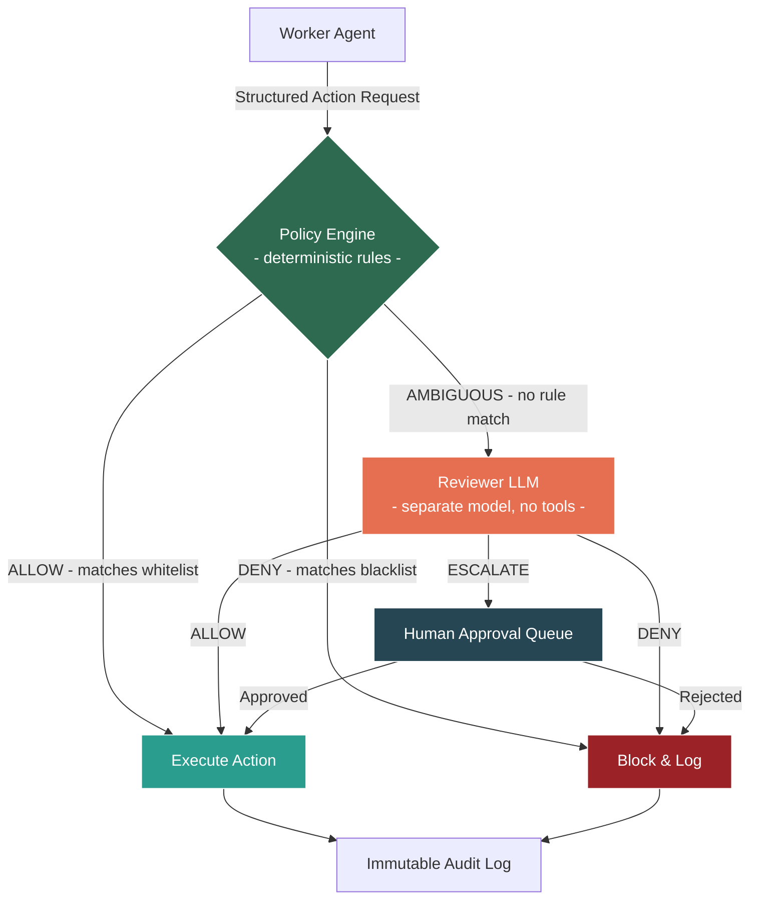

### Approval Tiers

| Tier | Example | Approved By |
|------|---------|-------------|
| Low | Read a file the agent already has access to | Auto-approved by policy engine |
| Medium | Send email to known contact | Reviewer LLM |
| High | Send email to new external address | Human approval |
| Critical | Access credentials, bulk operations | Human + 2nd human |

### Anti-Collusion Measures
- Workers receive only approve/deny — never the reviewer's reasoning.
- Anomaly detection flags workers with many denied requests.
- Reviewer uses a different model than workers.
- Reviewer prompts are rotated.

### Action Items
- [ ] Design the structured action request JSON schema (no free-text justifications)
- [ ] Build deterministic policy engine with hard rules
- [ ] Define the full action tier classification for company workflows
- [ ] Design the reviewer agent's isolation (separate Kubex, no tools, message queue only)
- [ ] Implement escalation queue for human approval (UI or Slack/Teams integration)
- [ ] Set up anomaly detection for repeated denied requests

---

## 3. Input/Output Gating

**Decision:** All agent I/O passes through a gateway service that validates, logs, and filters.

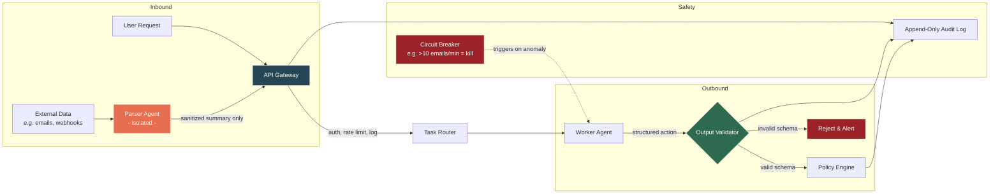

### Action Items
- [ ] Design API gateway service (auth, rate limiting, structured logging)
- [ ] Define output validation schemas per agent type
- [ ] Set up immutable append-only audit log storage
- [ ] Implement circuit breakers (e.g., agent tries to send 500 emails = auto-kill via `docker stop`)
- [ ] Build the two-agent pattern for untrusted content: parser agent -> sanitized summary -> actor agent

---

## 4. Infrastructure & Operations

### Action Items
- [ ] Install and harden Docker Engine on the host (disable unnecessary capabilities, enable user namespaces)
- [ ] Write Docker Compose files per Kubex with network isolation, resource limits, and secret mounts
- [ ] Disable outbound internet by default on each Kubex network; allowlist per Kubex via iptables
- [ ] Block host Docker socket from all Kubexes (never mount `/var/run/docker.sock`)
- [ ] Implement real-time alerting on anomalous Kubex behavior
- [ ] Build per-Kubex kill switch (`docker stop <container>` + rotate its secrets)
- [ ] Pin all image versions and verify digests in Compose files
- [ ] Design KubexClaw monitoring dashboard for Kubex activity

---

## 5. Architecture Overview — End-to-End

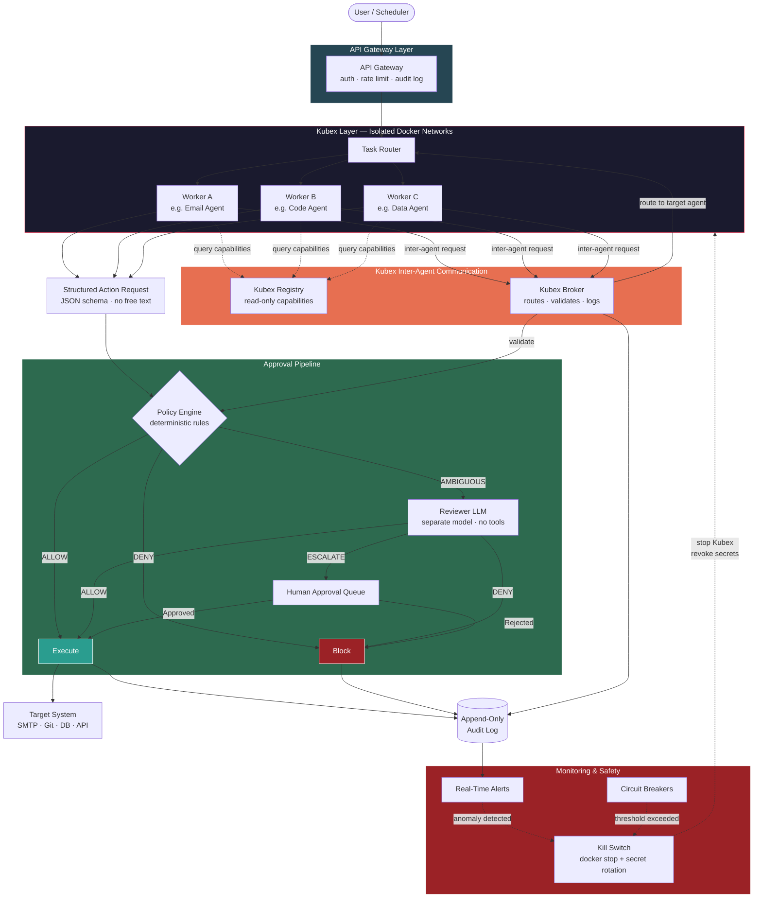

### Sequence — Single Agent Request

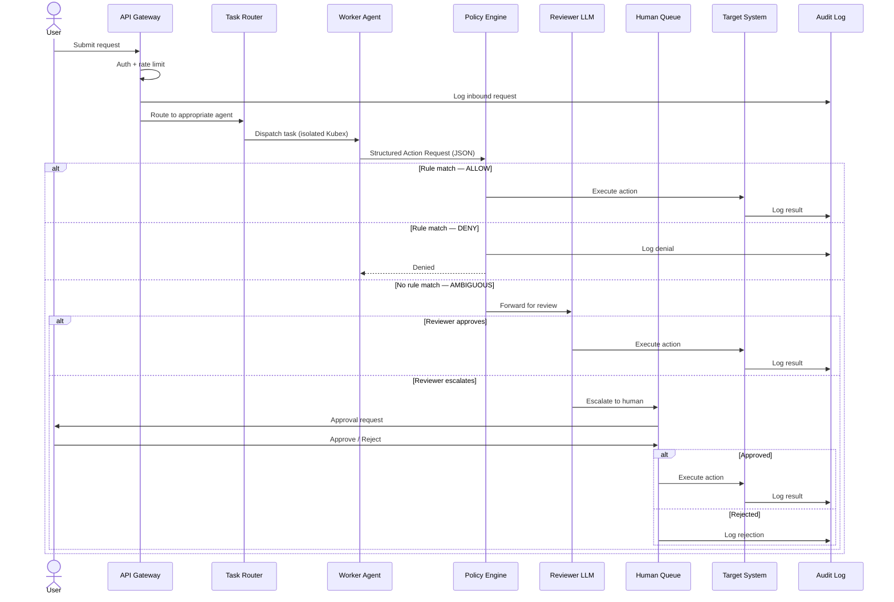

### Sequence — Inter-Agent Workflow Chain

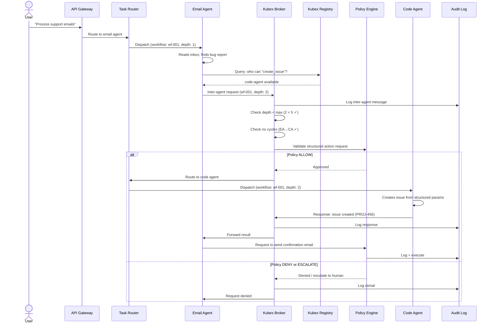

---

## 6. Inter-Agent Communication & Service Discovery

**Problem:** The current architecture assumes all workflows are linear: user → gateway → single agent → done. In reality, workflows will chain across agents. An email agent reads a support request, determines code needs to change, and hands off to the code agent. A data agent pulls a report and asks the email agent to send it. These handoffs need to be designed as a first-class concern — not bolted on later.

**Decision:** Kubexes never communicate directly. All inter-agent messages flow through the **Kubex Broker** which routes through the Policy Engine. Kubexes discover each other via the read-only **Kubex Registry**, which exposes capabilities — not addresses.

### Why Not Direct Agent-to-Agent?

- A compromised agent sending crafted messages to another agent is **internal prompt injection via a trusted channel** — one of the highest-risk attack vectors.
- Direct connections between Kubex networks would break the isolation model (Section 1).
- No audit trail if agents talk directly.
- No place to enforce approval tiers on inter-agent requests.

### Architecture

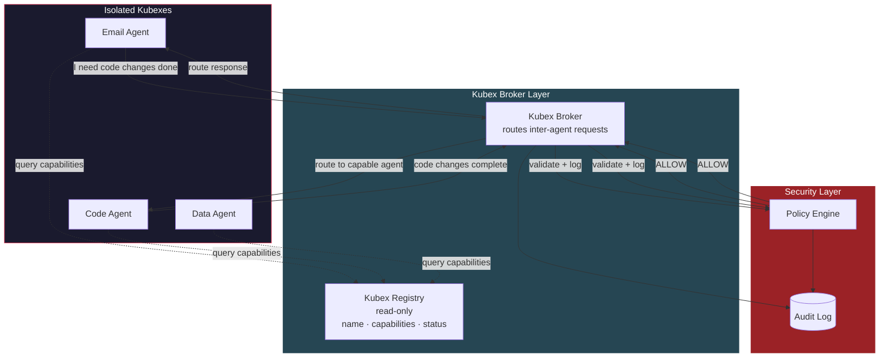

### Kubex Registry

A read-only service that Kubexes can query to discover **all registered Kubexes** — including stopped ones — and what they can do. Kubexes **never** learn each other's network addresses or Gateway ports. The Registry is a **full fleet catalog**, not just a list of running agents.

| Field | Example | Notes |
|-------|---------|-------|
| `agent_id` | `email-agent-01` | Unique identifier |
| `capabilities` | `["send_email", "read_inbox", "parse_attachments"]` | What this agent can do |
| `status` | `available` / `busy` / `stopped` / `disabled` | Current state (includes stopped Kubexes) |
| `accepts_from` | `["code-agent", "data-agent"]` | Allowlist of who can request work from this agent |
| `max_queue_depth` | `10` | Backpressure — reject if queue is full |
| `activatable` | `true` / `false` | Whether this Kubex can be activated by another Kubex via activation request |

**Status definitions:**
- `available` — running and ready to accept work
- `busy` — running but at capacity (queue full)
- `stopped` — not running, but registered and can be activated
- `disabled` — administratively disabled, cannot be activated (maintenance, compromised, etc.)

Agents request work by capability, not by name: _"I need an agent that can `send_email`"_ — the broker resolves this to the appropriate agent. If the only capable agent is `stopped`, the requesting agent can submit a **Kubex Activation Request** (see below).

### Kubex Activation Requests

**Problem:** A Kubex discovers via the Registry that the capability it needs exists, but the target Kubex is stopped. The requesting Kubex should be able to ask for that Kubex to be started — but **never autonomously**. A human must approve every activation.

**Decision:** Kubex activation is treated as a **High tier action minimum** that always requires human approval. The requesting Kubex must submit a plan justifying why it needs the target, what it intends to ask, and for how long.

#### Activation Request Schema

```json
{
  "from": "email-agent-01",
  "request_type": "activate_kubex",
  "target_capability": "create_issue",
  "plan": {
    "reason": "Received bug report in support inbox, need issue created in project tracker",
    "intended_actions": [
      {
        "action": "create_issue",
        "parameters": { "repo": "backend", "type": "bug" }
      }
    ],
    "estimated_duration_minutes": 5,
    "max_duration_minutes": 15
  },
  "context": {
    "originating_workflow": "wf-20260228-001",
    "originating_user_request": "ref:req-7712"
  }
}
```

#### Activation Flow

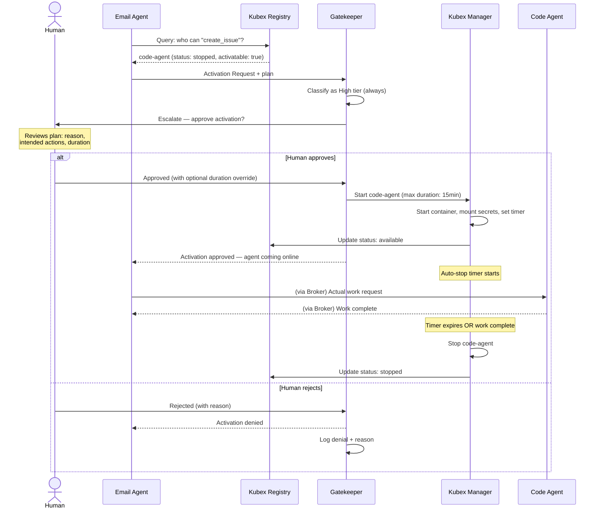

#### Activation Rules

- **Always High tier minimum** — no activation request is ever auto-approved by the policy engine
- **Plan is mandatory** — requests without `reason`, `intended_actions`, and `estimated_duration_minutes` are rejected by schema validation
- **Duration enforced** — Kubex Manager sets an auto-stop timer based on the approved duration. Human can override the duration at approval time.
- **One activation per request** — a Kubex cannot request activation of multiple Kubexes in a single request
- **No self-activation** — a stopped Kubex cannot request its own activation (obviously, but enforced in schema)
- **Activation is logged** — who requested, why, what was planned, who approved, actual duration

#### Kubex Lifecycle — Updated

A Kubex can now be started from two entry points:

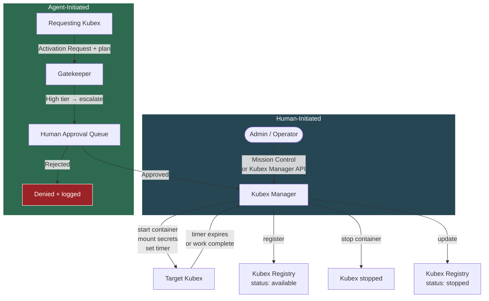

### Message Format

Inter-agent messages use the same **Structured Action Request** format as user-initiated requests (Section 2). No free-text. No passing raw content from external sources between agents.

```json
{
  "from": "code-agent-01",
  "request_type": "send_email",
  "parameters": {
    "to": "team-lead@company.com",
    "subject": "PR #142 merged",
    "body_template": "pr_merged_notification",
    "template_vars": { "pr_number": 142, "repo": "backend" }
  },
  "context": {
    "originating_workflow": "wf-20260222-001",
    "originating_user_request": "ref:req-5543"
  }
}
```

Key constraints:
- **No raw content passthrough** — agents cannot forward arbitrary text from external sources (emails, webhooks) to other agents. Only structured, schema-validated payloads.
- **Template-based outputs** — where an agent needs another agent to produce content (e.g., email body), it references a pre-approved template with typed variables.
- **Workflow traceability** — every inter-agent message carries the originating user request ID, so the full chain is auditable.

### Workflow Chains & Depth Limits

A user request can spawn a chain: User → Agent A → Agent B → Agent C. This needs guardrails:

- **Max chain depth** — configurable limit (e.g., 5). If Agent C tries to call Agent D and we're at depth 5, the request is rejected and escalated to human.
- **No cycles** — the Kubex Broker rejects any message that would create a circular dependency (A → B → A).
- **Timeout per chain** — entire workflow has a wall-clock timeout. If the chain hasn't completed in N minutes, all participating Kubexes are paused and the workflow is escalated.
- **Budget per chain** — total LLM token spend across all agents in a workflow is capped.

### Timed / Scheduled Workflows

Not all workflows start from a user request. Some are scheduled:

- Cron-triggered: _"Every morning at 9am, check inbox and process support emails"_
- Event-triggered: _"When a new PR is opened, run code review agent"_

These are treated as **system-initiated requests** that enter through the API Gateway (Section 3) with a `source: "scheduler"` tag. They follow the same approval pipeline — the policy engine evaluates them identically to user requests.

### Security Implications

| Threat | Mitigation |
|--------|------------|
| Compromised Kubex sends crafted messages to manipulate other Kubexes | All inter-Kubex messages go through Policy Engine; structured schema only; no free-text |
| Kubex impersonates another Kubex | Kubex Broker authenticates by container identity (not self-reported name) |
| Infinite loop / resource exhaustion via circular chains | Cycle detection + max depth + chain timeout + budget cap |
| Kubex discovers and targets high-privilege Kubexes | Kubex Registry only exposes capabilities, not addresses; `accepts_from` allowlist |
| Cascading compromise — one Kubex compromises another via chained requests | Each Kubex independently validates incoming requests against its own policy; anomaly detection flags unusual inter-Kubex patterns |
| Kubex tricks human into approving activation of high-privilege Kubex | Gatekeeper agent analyses the requesting Kubex's recent traffic history and includes a risk summary in the approval payload — human sees not just the plan but the agent's behavioral context (request patterns, denial history, anomaly flags) to make an informed decision |
| Activated Kubex outlives its approved scope | **Graduated response:** (1) Warning message to admin at 80% duration; (2) Rate limit ramp-up — Gatekeeper throttles the Kubex's action throughput as it approaches limit; (3) Hard cutoff at max duration — Kubex Manager kills container; (4) If the Kubex needs more time, it must submit a **new activation plan** through the full approval flow again — no silent extensions |
| Kubex submits many activation requests to overwhelm human approval queue | **Rate limit ramp-up** — Gatekeeper enforces escalating cooldowns per agent: 1st request normal, 2nd within window gets delayed, 3rd+ gets progressively throttled. Sustained flooding triggers circuit breaker — agent's activation privileges are suspended and admin is alerted |

### Action Items
- [ ] Design Kubex Broker service (likely a lightweight queue — Redis Streams, NATS, or custom)
- [ ] Define Kubex Registry schema and API (read-only for Kubexes, read-write for Kubex Manager)
- [ ] Extend Structured Action Request schema to support inter-Kubex routing fields
- [ ] Define inter-Kubex approval tier rules in Policy Engine (which Kubex-to-Kubex calls are auto-approved vs need review)
- [ ] Implement chain depth limits, cycle detection, and workflow timeout logic
- [ ] Design template system for content that agents pass between each other
- [ ] Define scheduled workflow entry point (cron integration through API Gateway)
- [ ] Add inter-agent message patterns to the threat model
- [ ] Define Kubex Activation Request schema in kubex-common
- [ ] Implement activation request handling in Gatekeeper (always High tier, always human escalation)
- [ ] Add auto-stop timer logic to Kubex Manager (enforce approved duration)
- [ ] Add activation rate limiting per agent in Gatekeeper anomaly detection
- [ ] Update Kubex Registry to include stopped Kubexes and `activatable` field

---

## 7. Admin Layer — Mission Control (Under Investigation)

**Candidate:** [openclaw-mission-control](https://github.com/abhi1693/openclaw-mission-control) by `abhi1693`

**What it is:** A full-stack centralized admin platform (Next.js + FastAPI + PostgreSQL) that connects to multiple OpenClaw Gateway instances via WebSocket. Docker Compose native — no Kubernetes dependency.

**Stack:** Next.js frontend (port 3000), Python/FastAPI backend (port 8000), PostgreSQL. Auth via bearer token or Clerk JWT.

### What It Covers

- **Multi-tenant hierarchy** — org → board group → board → agents — maps well to managing Kubexes
- **Session visibility** — list sessions, view session history, send messages into active sessions via Gateway API
- **Task-level approval workflows** — pending → approved/rejected lifecycle with SSE real-time streaming and agent notification
- **Agent provisioning & lifecycle** — CRUD agents, heartbeat tracking, SSE state streaming
- **Activity feed** — real-time event streaming filtered by board permissions
- **Metrics** — active agents, tasks in progress, error rate, cycle time with configurable time windows
- **Skills marketplace & agent templates** — centralized skill and identity management
- **Actively maintained** — daily commits, 540+ stars, 826 commits, 5 contributors (as of 2026-02-22)

### Gaps for Our Security-First Architecture

| Gap | Severity | Mitigation Strategy |
|-----|----------|---------------------|
| No kill switch — only delete, no pause/stop | 🔴 Critical | Build externally: `docker stop` + secret rotation via our own control script |
| No operation-level policy gating — approvals are task-scoped, not action-scoped | 🔴 Critical | Our Policy Engine (Section 2) remains a separate service; Mission Control is UI only |
| No comprehensive audit logging — activity feed tracks task comments, not full agent I/O | 🟡 High | Route all agent output through our I/O Gateway (Section 3) which logs to append-only store |
| Coarse auth model — org-admin or bearer token, no fine-grained RBAC | 🟡 High | Acceptable initially; extend or front with a reverse proxy for RBAC later |
| No cost / token tracking | 🟠 Medium | Add separately via LLM API usage monitoring |
| Gateway integration still stabilizing — open bugs on connectivity (issues #139, #150, #158, #159) | 🟠 Medium | Monitor project; pin to stable release |

### Claworc — Evaluated and Rejected

[Claworc](https://github.com/gluk-w/claworc) was evaluated as a Docker container lifecycle manager to complement Mission Control. **It is architecturally incompatible.**

- Claworc tunnels all instance ports (including Gateway 18789) through internal SSH tunnels
- These tunnels are consumed only by Claworc's own dashboard — no external WebSocket access
- Mission Control requires direct WebSocket connections to each Gateway for orchestration
- No way to combine them without forking Claworc and breaking its security model
- Additionally: project is only 2.5 weeks old (created 2026-02-06), 71 stars, requires Docker socket mount (`/var/run/docker.sock`)

### Proposed Architecture — Kubex Manager + Mission Control

The admin layer is split into three components:

1. **Kubex Manager (built by us)** — thin service using Docker SDK for Kubex lifecycle (create, start, stop, kill, restart). Exposes Gateway ports so Mission Control can connect. Handles secret mounts, network isolation, resource limits. ~200 lines of Python.
2. **Mission Control** — connects to exposed Gateways for agent orchestration, session visibility, task management, and approval workflows.
3. **Security Layer (built by us)** — Policy Engine, audit logging, circuit breakers, kill switch (calls Kubex Manager to stop Kubexes + rotate secrets).

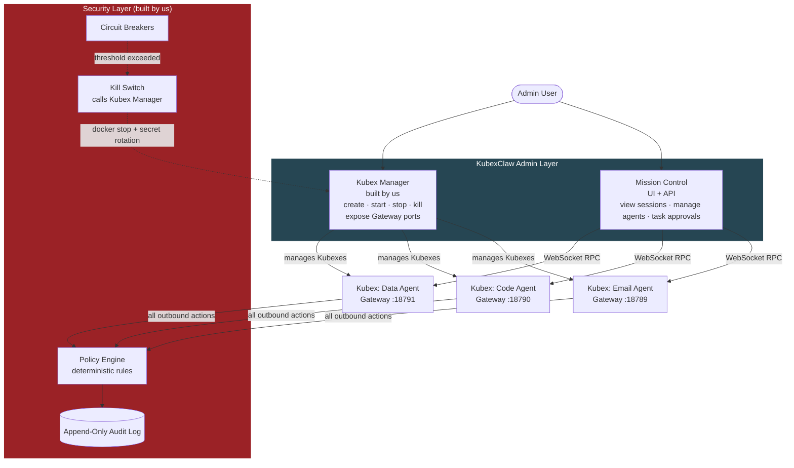

### Kubex Manager — Requirements

The Kubex Manager service needs to:
- Create Kubexes from pinned OpenClaw images with per-agent config
- Assign each Kubex to its own isolated Docker network
- Mount secrets read-only (no env vars)
- Set resource limits (CPU, memory)
- Expose each Kubex's Gateway port (18789) on a unique host port
- Provide REST API for lifecycle operations (start, stop, kill, restart, status)
- Register new Kubexes with Mission Control and Kubex Registry (or provide a discovery endpoint)
- Support emergency kill: stop Kubex + rotate secrets + log the event

### Alternatives Still on Radar

- [**ClawControl**](https://clawcontrol.dev/) — Advertises kill switches and cryptographic execution envelopes. Licensing/open-source status unclear. Worth revisiting if it turns out to be open source.
- [**crshdn/mission-control**](https://github.com/crshdn/mission-control) — Lighter alternative (Next.js + SQLite), Kanban task board, AI-assisted planning. Fallback if abhi1693 version proves too unstable.

### Action Items
- [ ] Deploy Mission Control locally via Docker Compose and evaluate hands-on
- [ ] Test Gateway connectivity with a single Kubex
- [ ] Verify session history API returns sufficient detail for monitoring Kubex communications
- [ ] Assess whether approval workflow can be extended or if our Policy Engine fully replaces it
- [ ] Evaluate open bugs (#139, #150, #158, #159) — are they blockers for our use case?
- [ ] Design Kubex Manager REST API schema (endpoints, auth, error handling)
- [ ] Prototype Kubex Manager — Python + Docker SDK, Kubex lifecycle + port mapping
- [ ] Define Kubex discovery mechanism (how Mission Control and Kubex Registry find new Gateways)

---

## 8. Secrets Management Strategy

**Decision:** Phased approach — start with Portainer + Docker Swarm secrets for MVP, graduate to more sophisticated tooling as needed.

**Hard Rule:** Secrets are **never** passed as environment variables. Always mounted as read-only files.

### Phase Plan

| Phase | Approach | When |
|-------|----------|------|
| **MVP** | **Portainer + Docker Swarm secrets** — native Docker, GUI management, zero extra infra | Now — get the agent pipeline working |
| **V1** | **Infisical** (self-hosted) — open-source secrets platform with dashboard, rotation, audit trail, syncs to Docker | When we need rotation, audit, or team management |
| **V2** | **HashiCorp Vault** — dynamic secrets, on-the-fly credential generation, lease-based expiry | If we need per-task ephemeral DB credentials, etc. |

### MVP — Portainer + Docker Swarm Secrets

**How it works:**
- Docker Swarm mode enabled (single-node is fine)
- Secrets created via Portainer GUI or `docker secret create`
- Secrets mounted into Kubexes as read-only files at `/run/secrets/<name>`
- Portainer provides the web dashboard for creating, deleting, and viewing which services use which secrets
- Kubex Manager references secrets by name in Docker Compose / service definitions

**What this gives us:**
- ✅ GUI for secret management (Portainer)
- ✅ Secrets encrypted at rest in the Swarm Raft log
- ✅ Per-Kubex scoping — each service only mounts the secrets it needs
- ✅ Secrets only available in-memory inside the container (`/run/secrets/`)
- ✅ No extra infrastructure beyond Portainer (which we'd likely use anyway for container management)

**What this doesn't give us:**
- ❌ No automatic rotation — must delete + recreate + redeploy
- ❌ No audit trail of secret access
- ❌ No dynamic/ephemeral credentials
- ❌ Can't view secret values after creation (by design)
- ❌ Revocation on kill switch is manual (delete secret + redeploy)

**Acceptable for MVP because:**
- We're proving the agent pipeline works, not operating at scale yet
- Secret rotation can be done manually with low agent count
- Kill switch still works — `docker stop` kills the container, secrets vanish from memory
- We can swap the backend to Infisical/Vault later without changing how Kubexes consume secrets (they always read from `/run/secrets/`)

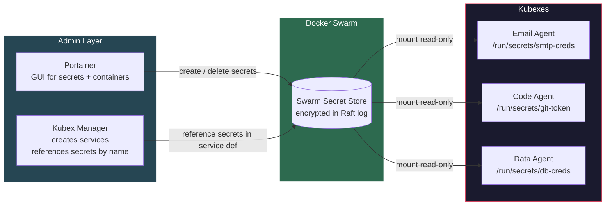

### Graduation Criteria — When to Move to V1 (Infisical)

Move to Infisical when any of these become true:
- [ ] More than ~10 Kubex roles with distinct secrets — manual management becomes painful
- [ ] Need to rotate secrets without redeploying Kubexes
- [ ] Need audit trail of who accessed which secret and when
- [ ] Multiple team members managing secrets — need RBAC
- [ ] Compliance requirements demand secret access logging

### Action Items
- [ ] Enable Docker Swarm mode on the host (single-node: `docker swarm init`)
- [ ] Deploy Portainer as a Swarm service
- [ ] Create initial secrets for the first Kubex roles (email, code, data agents)
- [ ] Update Kubex Manager design to reference Swarm secrets in service definitions
- [ ] Document the secret naming convention (e.g., `kubex-<role>-<secret-name>`)
- [ ] Test secret mount lifecycle: create → mount → Kubex reads → Kubex stops → verify secret not on disk
- [ ] Document the manual rotation procedure (for MVP)

---

## 9. Central Logging — OpenSearch

**Decision:** All KubexClaw logs flow into a single **OpenSearch** cluster. Every Kubex and infrastructure service ships logs via a **Fluent Bit** sidecar.

**Why OpenSearch:**
- All our logs are already structured JSON (action requests, Gatekeeper decisions, model usage, audit events) — perfect for search and aggregation
- OpenSearch Dashboards provides the monitoring UI from Section 4 out of the box
- Index lifecycle policies enforce append-only / immutable indices for tamper-evident audit trail
- Open source (Apache 2.0), self-hosted, no licensing issues
- Scales from single-node (MVP) to multi-node cluster

**Why not alternatives:**
- **Elasticsearch** — functionally similar but SSPL license since 2021, not truly open source
- **Loki + Grafana** — lighter weight but weaker full-text search; better for metrics than structured event search
- **Plain files** — not searchable, no dashboards, no alerting, doesn't scale

### Log Pipeline Architecture

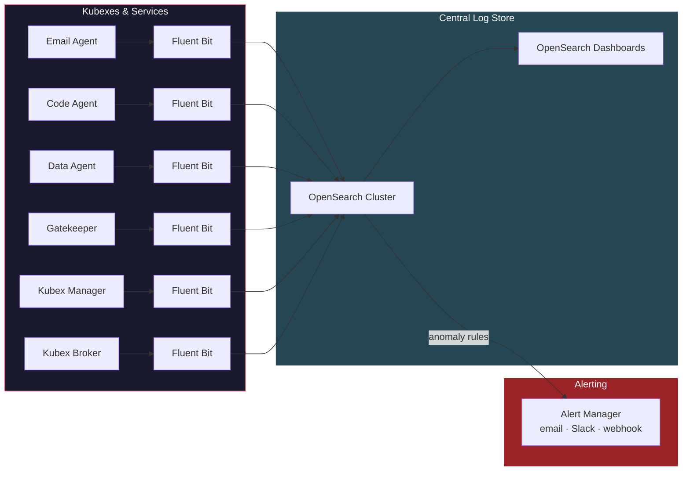

### Log Categories & Indices

Each log type gets its own OpenSearch index for independent retention policies and access control.

| Index | Source | Contents | Retention |
|-------|--------|----------|-----------|
| `kubex-actions` | Gatekeeper | Every action request: who, what, tier, decision, timestamp | 1 year (compliance) |
| `kubex-model-usage` | Gatekeeper + Kubexes | Model calls: which model, tokens used, cost, escalation reason | 6 months |
| `kubex-activations` | Gatekeeper + Kubex Manager | Activation requests: plan, approval, duration, actual runtime | 1 year |
| `kubex-inter-agent` | Kubex Broker | Inter-agent messages: from, to, capability, workflow chain | 1 year |
| `kubex-lifecycle` | Kubex Manager | Kubex start/stop/kill events, secret mounts, resource usage | 6 months |
| `kubex-anomalies` | Gatekeeper + all services | Anomaly events: denial spikes, rate limit hits, circuit breaker triggers | 1 year |
| `kubex-system` | All services | Application logs, errors, health checks | 30 days |

### Fluent Bit Sidecar Pattern

Every Kubex and service runs a Fluent Bit sidecar container on the same Docker network. The sidecar:
- Reads structured JSON logs from the main container's stdout/stderr
- Enriches with metadata: `agent_id`, `kubex_role`, `container_id`, timestamp
- Forwards to OpenSearch over HTTPS
- Buffers locally if OpenSearch is temporarily unreachable (filesystem buffer)

```yaml
# Example in docker-compose.yml per Kubex
services:
  email-agent:
    image: kubex-email-agent:latest
    logging:
      driver: "fluentd"
      options:
        tag: "kubex.email-agent"

  email-agent-logger:
    image: fluent/fluent-bit:latest
    volumes:
      - ./fluent-bit/fluent-bit.conf:/fluent-bit/etc/fluent-bit.conf:ro
    depends_on:
      - opensearch
```

### Append-Only / Tamper-Evident Guarantees

- OpenSearch Index State Management (ISM) policy transitions indices to **read-only** after a configurable period (e.g., 24 hours)
- Once read-only, no documents can be modified or deleted
- Snapshot to object storage (S3 / MinIO) for long-term retention and disaster recovery
- Optional: hash chain per index — each batch of logs includes a hash of the previous batch for tamper detection

### Live Swarm Overview — Grafana + Prometheus + OpenSearch

A single live dashboard requires **two data sources** working together:

| Data Source | What it provides | Tool |
|-------------|-----------------|------|
| **Prometheus** | Real-time metrics — Kubex up/down, CPU/memory, request throughput, latency | Scraped from each service's `/metrics` endpoint |
| **OpenSearch** | Event-based logs — Gatekeeper decisions, audit events, cost data, workflow traces | Fed by Fluent Bit sidecars |

**Grafana** unifies both into a single dashboard by querying Prometheus and OpenSearch side-by-side.

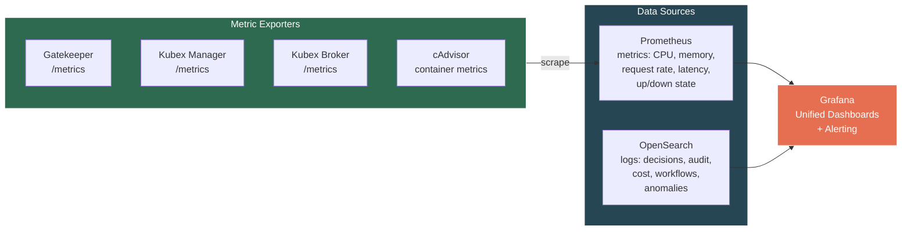

**Each service exposes a `/metrics` endpoint** (Prometheus format) via `kubex-common`. Prometheus scrapes them. **cAdvisor** runs on the Docker host to export container-level CPU, memory, network, and disk metrics for every Kubex without any instrumentation inside the containers.

### Swarm Overview Dashboard — Panels

The main Grafana dashboard is the **KubexClaw Swarm Overview** — the single pane of glass for the entire fleet:

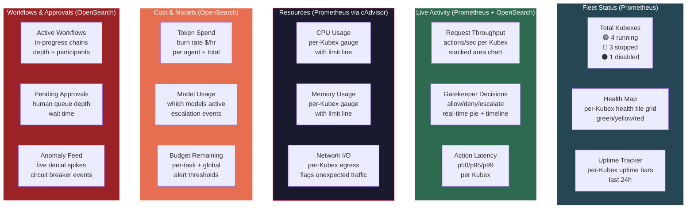

### Alerting Rules (Grafana)

Grafana fires alerts based on both metrics and logs:

| Alert | Source | Trigger | Action |
|-------|--------|---------|--------|
| Kubex down | Prometheus | Kubex health check fails for >30s | Notify admin (Slack/email) |
| CPU/Memory spike | Prometheus (cAdvisor) | Kubex exceeds 80% resource limit | Warn admin; 95% = circuit breaker |
| Gatekeeper denial spike | OpenSearch | >10 denials/min from single agent | Flag agent, notify admin |
| Budget overrun | OpenSearch | Token spend exceeds 80% of task/global budget | Warn admin; 100% = kill task |
| Approval queue backlog | OpenSearch | >5 pending approvals waiting >10min | Escalate to admin |
| Activation duration overrun | OpenSearch | Kubex at 80% of approved duration | Warn admin; 100% = auto-stop |
| Unexpected egress | Prometheus | Network traffic to non-allowlisted destination | Kill Kubex, alert admin |

### OpenSearch Dashboards (Log Analytics)

For deeper investigation beyond the live overview, OpenSearch Dashboards provides:

| Dashboard | Purpose |
|-----------|---------|
| **Gatekeeper Decisions** | Historical action decisions: allow/deny/escalate ratios, tier breakdown, trends |
| **Agent Activity Deep Dive** | Per-Kubex action history, model usage over time, active duration |
| **Cost Analytics** | Token spend per agent, per model, per workflow — historical trends + forecasting |
| **Anomaly Investigation** | Drill into denial spikes, rate limit events, circuit breaker triggers |
| **Workflow Trace Explorer** | End-to-end workflow traces: which agents participated, duration, outcome |
| **Activation Audit** | Activation request history: plans submitted, approved/rejected, duration compliance |

### Action Items
- [ ] Deploy single-node OpenSearch + OpenSearch Dashboards via Docker Compose
- [ ] Deploy Prometheus + Grafana + cAdvisor via Docker Compose
- [ ] Define Fluent Bit config template for Kubex sidecars
- [ ] Define index schemas for each log category (mappings + ISM policies)
- [ ] Implement structured log format in `kubex-common` (shared JSON log schema all components use)
- [ ] Implement `/metrics` endpoint in `kubex-common` (Prometheus exporter for all services)
- [ ] Build Fluent Bit metadata enrichment (inject `agent_id`, `kubex_role`, `container_id`)
- [ ] Set up append-only ISM policy (read-only after 24h)
- [ ] Build KubexClaw Swarm Overview Grafana dashboard (fleet status, activity, resources, cost, approvals)
- [ ] Configure Grafana alerting rules (Kubex down, CPU spike, denial spike, budget overrun, egress anomaly)
- [ ] Create OpenSearch Dashboards for deep-dive log analytics
- [ ] Add Prometheus + Grafana + cAdvisor to root `docker-compose.yml`
- [ ] Add OpenSearch + Fluent Bit to root `docker-compose.yml`

---

## 10. KubexClaw Command Center

**Problem:** The current tooling is fragmented — Mission Control for agent sessions, Grafana for metrics, OpenSearch Dashboards for logs, and nothing for watching live LLM conversations or inter-agent message flow. An operator needs **one screen** to understand what the swarm is doing, watch any agent think in real-time, and intervene when needed.

**Decision:** Build a custom **KubexClaw Command Center** — a web UI that is the single operational interface for the entire swarm. Mission Control is repurposed as the agent provisioning backend, but the day-to-day operating screen is the Command Center.

### What It Replaces vs What It Wraps

| Current Tool | Command Center Relationship |
|--------------|----------------------------|
| Mission Control | Backend only — Command Center calls its API for agent provisioning, but operators don't use the MC UI directly |
| Grafana dashboards | Embedded panels — Grafana iframes or API-driven charts within Command Center |
| OpenSearch Dashboards | Replaced for daily ops — Command Center queries OpenSearch directly; OS Dashboards kept for deep forensic investigation |
| Kubex Manager API | Called directly — Command Center is the UI for lifecycle operations |

### Core Views

#### 1. Swarm Overview (Home Screen)

The landing page — live map of the entire fleet.

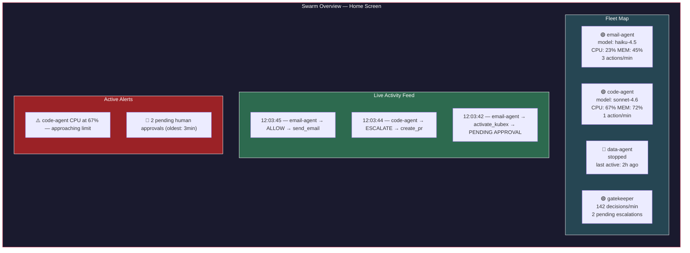

- Click any Kubex tile → opens the **Agent Detail View**
- Click any feed item → opens the **action detail** with full context
- Click any alert → opens the relevant view with pre-filtered context

#### 2. Agent Detail View (Click into a Kubex)

Deep dive into a single Kubex — **the key view**. This is where you watch an agent work.

**Tab: LLM Conversation (Live)**

Real-time stream of the agent's conversation with its LLM. Every prompt sent and every response received, as it happens.

```
┌─────────────────────────────────────────────────────┐
│  email-agent-01 — LLM Conversation (LIVE)           │
│  Model: claude-haiku-4.5 │ Tokens: 2,847 │ $0.0023  │
├─────────────────────────────────────────────────────┤
│                                                     │
│  [SYSTEM] You are an email processing agent...      │
│                                                     │
│  [USER/TASK] Process inbox, workflow wf-20260228-01 │
│                                                     │
│  [ASSISTANT] I'll check the inbox for new emails.   │
│  → Action: read_inbox                               │
│  → Status: ✅ ALLOWED by policy engine              │
│                                                     │
│  [TOOL RESULT] 3 new emails found...                │
│                                                     │
│  [ASSISTANT] Email #1 is a bug report. I need to    │
│  create an issue. Let me check who can do that.     │
│  → Action: query_registry(create_issue)             │
│  → Status: ✅ ALLOWED                               │
│                                                     │
│  [ASSISTANT] code-agent is stopped. Submitting      │
│  activation request with plan...                    │
│  → Action: activate_kubex(code-agent)               │
│  → Status: ⏳ PENDING HUMAN APPROVAL                │
│                                                     │
│  ● streaming...                                     │
└─────────────────────────────────────────────────────┘
```

- **Source:** OpenClaw Gateway WebSocket — streams session messages in real-time
- Each action request is annotated inline with its Gatekeeper decision (allow/deny/escalate)
- Token counter and cost ticker update live
- Model escalation events highlighted when the agent switches models
- Operator can **pause** the agent from this view (sends pause signal via Kubex Manager)

**Tab: Actions & Decisions**

Table of every action this Kubex has submitted, with Gatekeeper verdicts:

| Time | Action | Tier | Decision | Latency | Details |
|------|--------|------|----------|---------|---------|
| 12:03:45 | `send_email` | Medium | ✅ Allow | 12ms | to: team@company.com |
| 12:03:44 | `activate_kubex` | High | ⏳ Pending | — | target: code-agent |
| 12:03:40 | `read_inbox` | Low | ✅ Allow | 3ms | — |

**Tab: Resources**

Embedded Grafana panels for this Kubex: CPU, memory, network I/O, uptime.

**Tab: Config**

Read-only view of the Kubex's config: model allowlist, capabilities, policy rules, secrets (names only, never values).

#### 3. Inter-Agent Message View

Live stream of all messages flowing through the Kubex Broker. The operator sees the full picture of agent collaboration.

```
┌──────────────────────────────────────────────────────────┐
│  Inter-Agent Messages (LIVE)                              │
│  Filter: [All Agents ▼] [All Workflows ▼] [All Types ▼]  │
├──────────────────────────────────────────────────────────┤
│                                                          │
│  12:04:01  email-agent → code-agent                      │
│  workflow: wf-20260228-001 │ depth: 2/5                  │
│  action: create_issue                                    │
│  params: { repo: "backend", type: "bug" }                │
│  status: ✅ DELIVERED                                    │
│  ─ ─ ─ ─ ─ ─ ─ ─ ─ ─ ─ ─ ─ ─ ─ ─ ─ ─ ─               │
│  12:04:15  code-agent → email-agent                      │
│  workflow: wf-20260228-001 │ depth: 2/5 (response)       │
│  result: { issue_key: "PROJ-456", status: "created" }    │
│  status: ✅ DELIVERED                                    │
│  ─ ─ ─ ─ ─ ─ ─ ─ ─ ─ ─ ─ ─ ─ ─ ─ ─ ─ ─               │
│  12:04:16  email-agent → gatekeeper                      │
│  action: send_email (confirmation to reporter)           │
│  status: ✅ ALLOWED                                      │
│                                                          │
└──────────────────────────────────────────────────────────┘
```

- Filter by agent, workflow, message type
- Click any message → expands full structured payload
- Workflow chain visualized as a graph (which agents participated, message flow direction)
- **Blocked/denied messages highlighted in red** with the Gatekeeper's reason

#### 4. Approval Queue

Inline approval interface — no need to switch to a separate tool.

```
┌──────────────────────────────────────────────────────────┐
│  Pending Approvals (2)                                    │
├──────────────────────────────────────────────────────────┤
│                                                          │
│  ⏳ Activation Request — waiting 3m 12s                  │
│  From: email-agent-01 │ Workflow: wf-20260228-001        │
│  Target: code-agent (capability: create_issue)           │
│  Plan:                                                   │
│    Reason: Bug report in inbox, need issue created       │
│    Actions: create_issue(repo:backend, type:bug)         │
│    Duration: 5min (max: 15min)                           │
│  Agent Context:                                          │
│    Denial rate: 2% (normal) │ Last 1h: 14 actions        │
│    Anomaly flags: none                                   │
│                                                          │
│  [ ✅ Approve ] [ ✅ Approve (custom duration) ] [ ❌ Reject ] │
│  ─ ─ ─ ─ ─ ─ ─ ─ ─ ─ ─ ─ ─ ─ ─ ─ ─ ─ ─ ─ ─ ─        │
│  ⏳ Action Escalation — waiting 1m 45s                   │
│  From: code-agent-01 │ Workflow: wf-20260228-001         │
│  Action: create_pr (repo: backend, branch: fix/bug-123) │
│  Tier: High │ Reviewer verdict: ESCALATE                 │
│  Reviewer note: "PR targets main branch — needs human"   │
│                                                          │
│  [ ✅ Approve ] [ ❌ Reject ] [ 👁️ View Agent Chat ]      │
│                                                          │
└──────────────────────────────────────────────────────────┘
```

- "View Agent Chat" opens the LLM Conversation tab for that agent — so the operator can see **what the agent was thinking** before deciding
- Agent behavioral context (from Gatekeeper analysis) shown inline
- Approval/rejection logged immediately to OpenSearch

#### 5. Control Panel (Top Nav — Always Accessible)

Emergency and operational controls — persistent in the top navigation bar.

**Emergency Controls:**
- **Kill single Kubex** — dropdown to select, confirms, calls Kubex Manager (stop + rotate secrets)
- **Kill workflow** — stops all Kubexes participating in a specific workflow chain
- **Kill all** — emergency stop for entire swarm
- Every kill action requires confirmation dialog and is logged with operator identity

**Operational Controls:**
- **Pause / Resume Kubex** — freeze a Kubex without killing it (suspend container, preserve state). Paused Kubexes show as `paused` in fleet map. Resume picks up where it left off.
- **Inject Task** — send a manual task to a specific running Kubex from the UI. Uses the same Structured Action Request format. Goes through the Gatekeeper like any other request.
- **Restart Kubex** — stop and re-start a Kubex with the same config (clears ephemeral state, keeps secrets and policy)
- **Adjust Rate Limits (Live)** — slider to throttle a Kubex's action throughput without restart. Takes effect immediately via Gatekeeper hot-reload.

#### 6. Kubex Configuration Manager

Manage Kubex configs from the UI — no SSH, no file edits, no redeployment required for policy changes.

**Policy Editor:**
- View and edit YAML policy rules per Kubex and global policies
- Syntax validation before save
- Diff view showing what changed
- **Policy versioning** — every save creates a version; rollback to any previous version
- Changes are staged → reviewed → applied (no direct edit to live policy)

**Model Allowlist Manager:**
- View/edit which models each Kubex can use
- Set tier assignments (light/standard/heavy) and cost metadata
- Enforce the zero-overlap rule between worker and reviewer Kubexes (UI warns if violated)
- Adjust auto-select strategy and escalation triggers

**Template Manager:**
- Create/edit/version inter-agent content templates (Section 6)
- Preview template rendering with sample variables
- Assign templates to Kubex roles

**Kubex Provisioning:**
- Create new Kubex from a role template (select role → auto-configure network, secrets, policies, models)
- Clone existing Kubex config to create a variant
- Edit Kubex config: capabilities, `accepts_from` allowlist, resource limits, egress allowlist
- Decommission Kubex: stop → disable in Registry → archive config

#### 7. Workflow Manager

Full visibility and control over workflow chains — not just individual messages.

**Active Workflows:**

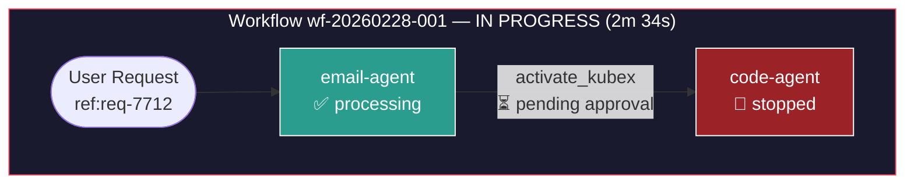

- Visual graph of each active workflow chain — which agents are involved, what state they're in, where the chain is blocked
- Click any node → opens that agent's Detail View
- Click any edge → shows the message payload
- **Cancel workflow** — stops all participating Kubexes, logs cancellation reason

**Workflow History:**
- Searchable table of completed workflows
- **Workflow replay** — step through a completed workflow event-by-event in chronological order, showing LLM conversations, actions, decisions, and inter-agent messages as they happened
- Filter by outcome (success/failure/cancelled), duration, agents involved, cost

**Scheduled Workflows:**
- View all cron-triggered and event-triggered workflows (Section 6)
- Create / edit / disable schedules from the UI
- View execution history per schedule
- Next-run countdown timer
- Manual trigger button ("run this scheduled workflow now")

#### 8. Audit & Investigation

Dedicated views for security investigation and compliance — beyond what the live feeds show.

**Audit Trail Browser:**
- Searchable, filterable timeline of every event across the swarm
- Filter by: agent, action type, decision, tier, workflow, time range, operator
- Full-text search across action parameters and context
- Export to CSV/JSON for compliance reporting
- Bookmark events for incident investigation

**Operator Activity Log:**
- Every action taken by a human operator through the Command Center is logged:
  - Approvals / rejections (with response time)
  - Kill switch activations (with reason)
  - Policy changes (with diff)
  - Config modifications
  - Manual task injections
- Operator identity tied to auth (JWT claims)
- Cannot be edited or deleted — append-only like all audit logs

**Security Posture View:**

Per-Kubex security health at a glance:

| Kubex | Risk Score | Denial Rate | Anomaly Flags | Open Alerts | Last Incident |
|-------|-----------|-------------|---------------|-------------|---------------|
| email-agent | 🟢 Low (12) | 2.1% | None | 0 | Never |
| code-agent | 🟡 Medium (45) | 8.7% | High CPU pattern | 1 | 2d ago |
| data-agent | 🟢 Low (8) | 0.4% | None | 0 | Never |

- Risk score calculated from: denial rate, anomaly frequency, escalation rate, resource usage patterns
- Click any agent → opens a security-focused timeline (denials, anomalies, escalations only)

**Incident Investigation Mode:**
- Select a time range and set of agents
- Command Center builds a unified timeline: LLM conversations + actions + decisions + inter-agent messages + resource metrics — all interleaved chronologically
- Annotate events with investigation notes
- Export full incident report (PDF/markdown)

#### 9. Cost & Budget Management

Not just tracking — active budget control.

**Budget Configuration:**
- Set budgets at three levels: **per-task**, **per-Kubex** (daily/weekly/monthly), **global** (daily/weekly/monthly)
- Budget alerts at configurable thresholds (e.g., 50%, 80%, 95%)
- **Hard cap behavior**: when budget is exceeded → pause Kubex, escalate to human, or kill (configurable per Kubex)

**Cost Dashboard:**
- Real-time burn rate ($/hour) per Kubex and total
- Cost breakdown by: agent, model, workflow, action type
- Historical spend charts (daily/weekly/monthly)
- **Forecast** — projected monthly spend based on trailing 7-day average
- Compare actual vs budgeted spend

**Cost Allocation:**
- Tag workflows and tasks with cost centers / project codes
- Generate per-project cost reports
- Identify most expensive workflows and agents

#### 10. Infrastructure Health

Visibility into the platform itself — not just the agents.

**System Status Panel:**

| Component | Status | Details |
|-----------|--------|---------|
| Docker Host | 🟢 Healthy | CPU: 34%, Memory: 58%, Disk: 42% |
| Redis (Broker backend) | 🟢 Healthy | Connected, 23 keys, 0 pending |
| OpenSearch | 🟢 Healthy | 3 indices, 142MB, 0 pending tasks |
| Prometheus | 🟢 Healthy | 847 active targets, 0 scrape failures |
| Kubex Registry | 🟢 Healthy | 6 agents registered, 3 running |
| Kubex Broker | 🟢 Healthy | Queue depth: 2, 0 dead letters |

- Auto-refreshing health checks for every infrastructure component
- **Dependency graph** — shows which services depend on which, highlights impact if a component goes down
- Docker host resources: CPU, memory, disk, network — with historical charts
- **Broker queue depth** — backpressure monitoring; alert if queues are growing faster than draining

**Secret Lifecycle View:**
- Which secrets are mounted to which Kubexes (names only, never values)
- Secret creation date and age
- **Rotation status**: never rotated, last rotated N days ago, overdue for rotation
- Rotation action button → triggers secret rotation via Kubex Manager (stop Kubex → rotate → restart)
- Does NOT display secret values — only metadata

#### 11. Agent Performance & Analytics

Understand which agents are effective and which are problematic.

**Agent Scorecard:**

| Kubex | Task Success Rate | Avg Task Duration | Model Escalation Rate | Cost per Task | Denial Rate |
|-------|------------------|-------------------|-----------------------|---------------|-------------|
| email-agent | 94% | 1m 23s | 12% (light → standard) | $0.004 | 2.1% |
| code-agent | 87% | 4m 56s | 31% (light → heavy) | $0.023 | 8.7% |
| data-agent | 98% | 0m 45s | 3% | $0.001 | 0.4% |

- Track per-agent: success rate, average task duration, model escalation rate, cost efficiency, denial rate
- Historical trends — is an agent getting better or worse over time?
- **Compare agents** — side-by-side performance comparison
- Identify agents that frequently escalate models (may need policy tuning or a better default model)
- Flag agents with declining success rates for investigation

**Reporting:**
- **Daily digest** — auto-generated summary: tasks completed, decisions made, cost, anomalies, pending approvals
- **Weekly report** — trends, top workflows, cost analysis, agent performance changes
- **Compliance export** — full audit trail export for a date range, formatted for compliance review (SOC2, GDPR)
- Reports delivered via email or available as downloads from the Command Center

### Tech Stack

| Component | Technology | Rationale |
|-----------|-----------|-----------|
| Frontend | Next.js (React) | Real-time UI with SSR, same stack as Mission Control — can share components |
| Backend | FastAPI (Python) | Consistent with Kubex Manager and other services; async WebSocket support |
| Real-time transport | WebSocket + SSE | WebSocket for LLM conversation streams (from OpenClaw Gateway); SSE for activity feeds |
| Data queries | OpenSearch client + Prometheus API | Pull logs and metrics for display |
| Auth | Same as Mission Control (bearer token / Clerk JWT) | Single auth system across all admin tools |

### Data Flow

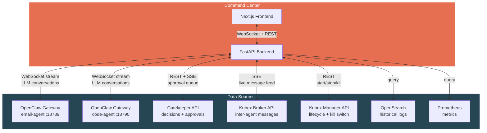

### Relationship to Existing Tools

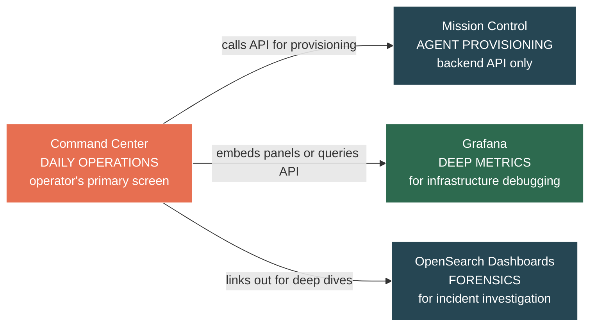

- **Command Center** = daily operations, live monitoring, approvals, kill switches
- **Mission Control** = agent provisioning backend (create/configure agents, manage skills)
- **Grafana** = deep infrastructure debugging (when you need to investigate a performance issue)
- **OpenSearch Dashboards** = forensic investigation (when you need to trace exactly what happened during an incident)

### Action Items

**Core Infrastructure:**
- [ ] Design Command Center API schema (FastAPI endpoints for all 11 views)
- [ ] Implement WebSocket proxy in backend (aggregate multiple OpenClaw Gateway streams)
- [ ] Implement auth (shared with Mission Control — bearer token / Clerk JWT)
- [ ] Design the action annotation layer (inline Gatekeeper decisions on LLM conversation stream)
- [ ] Add Command Center to root `docker-compose.yml`
- [ ] Add Command Center to repo structure (`services/command-center/`)

**Monitoring Views (1-4):**
- [ ] Build Swarm Overview home screen (fleet map, live feed, alerts)
- [ ] Build Agent Detail view with LLM Conversation live streaming
- [ ] Build Inter-Agent Message view (live stream from Kubex Broker)
- [ ] Build inline Approval Queue (integrated with Gatekeeper escalation API)

**Control Views (5-6):**
- [ ] Build Control Panel — kill switch, pause/resume, inject task, restart, live rate limit adjustment
- [ ] Build Kubex Configuration Manager — policy editor with versioning, model allowlist manager, template manager, provisioning
- [ ] Implement pause/resume support in Kubex Manager API (`docker pause` / `docker unpause`)
- [ ] Implement Gatekeeper hot-reload for live rate limit changes

**Workflow & Audit Views (7-8):**
- [ ] Build Workflow Manager — active workflow graph visualization, workflow replay, scheduled workflow CRUD
- [ ] Build Audit & Investigation views — audit trail browser, operator activity log, security posture scoring
- [ ] Build Incident Investigation mode — unified cross-agent timeline with annotation and export
- [ ] Define risk score calculation formula (denial rate, anomaly frequency, escalation rate, resource patterns)

**Cost & Infrastructure Views (9-10):**
- [ ] Build Cost & Budget Management — budget configuration at three levels, cost dashboard, forecasting, cost allocation tagging
- [ ] Build Infrastructure Health panel — component health checks, dependency graph, Docker host metrics, Broker queue depth
- [ ] Build Secret Lifecycle view — mount mapping, rotation status, rotation trigger

**Analytics & Reporting (11):**
- [ ] Build Agent Performance Scorecard — success rate, duration, model escalation, cost efficiency, denial rate
- [ ] Implement auto-generated daily digest and weekly report
- [ ] Build compliance export (full audit trail for date range, SOC2/GDPR formatted)

---

## 11. Kubex Boundaries — Group Policy & Trust Zones

**Problem:** Every Kubex is currently treated as an isolated individual. In practice, agents naturally cluster into functional groups — a customer support pod (email + ticketing + knowledge base), an engineering pod (code + review + deploy), a finance pod (reporting + invoicing + reconciliation). These groups share common policies, budgets, secrets, and communication patterns. Configuring each Kubex individually creates duplication, inconsistency, and operational overhead.

**Decision:** Introduce **Kubex Boundaries** — named trust zones that group related Kubexes under shared policies, budgets, secrets, and communication rules. Every Kubex belongs to exactly one boundary. A `default` boundary exists for ungrouped Kubexes.

### Core Concepts

| Term | Definition |
|------|-----------|
| **Boundary** | A named group of related Kubexes that share policies, budgets, and trust level |
| **Boundary Policy** | Policy rules that apply to all Kubexes within the boundary |
| **Intra-boundary** | Communication between Kubexes in the same boundary |
| **Cross-boundary** | Communication between Kubexes in different boundaries |
| **Boundary Admin** | Human operator with management rights over a specific boundary |

### Boundary Configuration

```yaml
# boundaries/engineering.yaml
boundary:
  id: "engineering"
  display_name: "Engineering Pod"
  description: "Code, review, and deployment agents"

  members:
    - code-agent
    - review-agent
    - deploy-agent

  policy:
    # Boundary-level rules — apply to all members
    allowed_actions:
      - "read_file"
      - "write_file"
      - "create_pr"
      - "create_issue"
      - "run_tests"
    blocked_actions:
      - "send_email"         # Engineering agents don't send emails
      - "access_database"    # No direct DB access
    max_chain_depth: 4
    allowed_egress:
      - "github.com"
      - "registry.npmjs.org"
      - "pypi.org"

  models:
    allowed:
      - id: "claude-haiku-4-5"
        tier: "light"
      - id: "claude-sonnet-4-6"
        tier: "standard"
      - id: "gpt-4o"
        tier: "heavy"
    default: "claude-haiku-4-5"
    max_tier: "heavy"

  budget:
    daily_token_limit: 500000
    daily_cost_limit_usd: 5.00
    per_task_token_limit: 50000
    hard_cap_behavior: "pause_and_escalate"  # pause | escalate | kill

  secrets:
    shared:                  # Available to all members
      - "github-org-token"
      - "npm-registry-token"
    # Per-Kubex secrets are still defined in each agent's config

  communication:
    intra_boundary_tier: "low"       # Agents within this boundary can talk freely
    cross_boundary_default_tier: "high"  # Talking to agents outside requires human approval
    cross_boundary_overrides:
      - target_boundary: "customer-support"
        tier: "medium"               # Engineering → Support is reviewer-approved, not human
```

### Policy Cascade Model

Policies cascade from global → boundary → individual Kubex. **Each level can only restrict, never relax.**

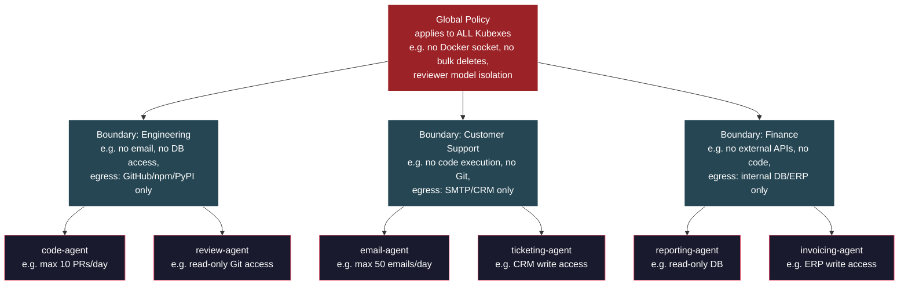

**Cascade rules:**
- Global blocks `send_email` → no boundary or Kubex can allow it
- Boundary allows `create_pr` → individual Kubex can still block it for itself
- Individual Kubex adds `max 10 PRs/day` → tighter than boundary, so it's valid
- Individual Kubex tries to allow `send_email` (blocked by boundary) → **rejected, invalid config**

**Gatekeeper enforcement:** When evaluating an action, the Gatekeeper checks all three levels in order: global → boundary → kubex. First deny wins. All three must allow for the action to proceed.

### Intra-Boundary vs Cross-Boundary Communication

This is the biggest operational impact of boundaries. Agents within the same boundary are on the same "team" — they trust each other more.

```mermaid
flowchart TD
    subgraph eng["Engineering Boundary"]
        CA[code-agent]
        RA[review-agent]
        DA2[deploy-agent]
        CA -->|"intra-boundary\nTier: Low (auto-approved)"| RA
        RA -->|"intra-boundary\nTier: Low (auto-approved)"| DA2
    end

    subgraph support["Customer Support Boundary"]
        EA[email-agent]
        TA[ticketing-agent]
        EA -->|"intra-boundary\nTier: Low (auto-approved)"| TA
    end

    CA -->|"cross-boundary\nTier: Medium (reviewer)"| EA
    EA -->|"cross-boundary\nTier: High (human approval)"| CA

    style eng fill:#264653,stroke:#fff,color:#fff
    style support fill:#2d6a4f,stroke:#fff,color:#fff
```

**Tier defaults:**

| Communication Path | Default Tier | Approved By |
|--------------------|-------------|-------------|
| Intra-boundary (same group) | Low | Policy engine auto-approve |
| Cross-boundary (different groups) | High | Human approval |
| Cross-boundary with override | Medium | Reviewer LLM |
| Any → outside KubexClaw | Critical | Human + 2nd human |

Cross-boundary overrides allow specific boundary-to-boundary paths to be relaxed (e.g., engineering → support at Medium instead of High). These overrides are defined in boundary config and **must be mutual** — both boundaries must agree to the override.

### Group Budgets

Boundary budgets work as a shared pool with individual sub-limits.

```mermaid
flowchart TD
    subgraph eng-budget["Engineering Boundary Budget"]
        POOL["Shared Pool: $5.00/day\n$3.47 remaining"]
        CA_B["code-agent\nper-task limit: $0.50\ntoday: $0.89"]
        RA_B["review-agent\nper-task limit: $0.20\ntoday: $0.42"]
        DA_B["deploy-agent\nper-task limit: $0.10\ntoday: $0.22"]
        POOL --> CA_B & RA_B & DA_B
    end

    style eng-budget fill:#264653,stroke:#fff,color:#fff
```

- **Group daily limit** — total spend across all members. When exhausted, entire boundary pauses.
- **Per-Kubex task limit** — individual agent can't blow the whole group budget on one task.
- **Budget alerts cascade** — 80% of group budget → warn boundary admin. 80% of Kubex task budget → warn Kubex.
- **Overspend isolation** — if one Kubex hits its task limit, only that Kubex is throttled, not the whole boundary (unless group budget is also hit).

### Group Secrets

Boundaries support shared secrets available to all members, in addition to per-Kubex secrets.

```
Secret resolution order:
  1. Per-Kubex secret (highest priority — overrides group)
  2. Boundary shared secret
  3. (Global secrets — future, if needed)
```

- Boundary shared secrets are mounted at `/run/secrets/<name>` just like per-Kubex secrets
- If a Kubex has a per-Kubex secret with the same name as a boundary secret, the per-Kubex secret wins
- Boundary admin can manage shared secrets from the Command Center
- Rotating a boundary secret affects all members — Kubex Manager restarts all members in sequence

### Boundary Networking (Optional)

By default, Kubexes within a boundary still have **separate Docker networks** (maximum isolation). But boundaries can optionally enable a **shared network segment** for performance-sensitive intra-boundary communication:

| Mode | Network Setup | Use Case |
|------|---------------|----------|
| `isolated` (default) | Each Kubex on its own network, all traffic through Broker | Maximum security, standard for most boundaries |
| `shared-network` | Boundary members share a Docker network, still route through Broker | Lower latency for high-frequency intra-boundary workflows |

Even in `shared-network` mode, **all messages still flow through the Kubex Broker and Gatekeeper** — the shared network only affects transport latency, not security enforcement.

### Boundary Lifecycle & Kill Switch

- **Create boundary** — define config, assign members
- **Add/remove Kubex** — move a Kubex between boundaries (requires restart, policy re-evaluation)
- **Kill boundary** — stops ALL Kubexes in the boundary, rotates all shared secrets, logs event
- **Pause boundary** — pauses all members, preserves state
- **Disable boundary** — all members set to `disabled` in Registry, no activation requests accepted

```mermaid
flowchart LR
    ADMIN([Boundary Admin]) -->|"kill engineering boundary"| CC[Command Center]
    CC --> KM[Kubex Manager]

    KM -->|stop| CA[code-agent]
    KM -->|stop| RA[review-agent]
    KM -->|stop| DA[deploy-agent]
    KM -->|rotate| SEC[(Shared Secrets)]
    KM -->|update| REG[Kubex Registry\nall 3 → stopped]
    KM -->|log| AUDIT[(Audit Log\nboundary kill event)]

    style CA fill:#9b2226,stroke:#fff,color:#fff
    style RA fill:#9b2226,stroke:#fff,color:#fff
    style DA fill:#9b2226,stroke:#fff,color:#fff
```

### Kubex Registry — Updated for Boundaries

| Field | Example | Notes |
|-------|---------|-------|
| `agent_id` | `code-agent-01` | Unique identifier |
| `boundary` | `engineering` | **Which boundary this Kubex belongs to** |
| `capabilities` | `["create_pr", "run_tests"]` | What this agent can do |
| `status` | `available` / `busy` / `stopped` / `disabled` | Current state |
| `accepts_from` | `["review-agent", "deploy-agent"]` | Allowlist (defaults to same-boundary members) |
| `activatable` | `true` / `false` | Whether this Kubex can be activated via request |
| `max_queue_depth` | `10` | Backpressure |

The `accepts_from` field now defaults to **all members of the same boundary** unless explicitly overridden. Cross-boundary requests must be explicitly allowed.

### Command Center — Boundary Views

The Command Center gets new boundary-aware views:

**Boundary Overview (new top-level view):**

```mermaid
flowchart TD
    subgraph boundaries["Boundary Map"]
        direction LR
        subgraph eng["🟢 Engineering\n3 agents │ 2 running │ $1.53 today"]
            CA2[code-agent 🟢]
            RA2[review-agent 🟢]
            DA3[deploy-agent 🔴]
        end
        subgraph sup["🟢 Customer Support\n2 agents │ 2 running │ $0.87 today"]
            EA2[email-agent 🟢]
            TA2[ticketing-agent 🟢]
        end
        subgraph fin["🟡 Finance\n2 agents │ 1 running │ $0.12 today"]
            REP[reporting-agent 🟢]
            INV[invoicing-agent 🔴]
        end
    end

    style eng fill:#264653,stroke:#fff,color:#fff
    style sup fill:#2d6a4f,stroke:#fff,color:#fff
    style fin fill:#e76f51,stroke:#fff,color:#fff
```

- Click any boundary → drill into boundary detail (member list, shared policy, budget status, communication map)
- Boundary health indicator (green/yellow/red) based on aggregate member health
- Cross-boundary message flow visualized as edges between boundary boxes

**Boundary Detail View:**
- Member list with individual status
- Shared policy viewer/editor (same policy editor from Section 10, scoped to boundary)
- Budget burn-down chart (group pool + per-member breakdown)
- Intra-boundary message feed
- Cross-boundary communication log
- Boundary-level kill/pause/disable buttons

### Security Implications

| Threat | Mitigation |
|--------|------------|
| Compromised Kubex exploits intra-boundary low-tier approval to manipulate peers | Intra-boundary is low tier, not no-tier — actions still go through Gatekeeper and are schema-validated. Anomaly detection flags unusual intra-boundary patterns. |
| Attacker compromises one boundary and pivots cross-boundary | Cross-boundary is High tier by default (human approval). Boundary kill switch isolates the compromised group. |
| Boundary policy misconfigured to be more permissive than global | Cascade enforcement — Gatekeeper checks global first, boundary second. Invalid configs rejected at save time. |
| Shared secrets exposed if one boundary member is compromised | Shared secrets are the trade-off of grouping. Mitigation: minimize shared secrets, prefer per-Kubex secrets where possible. Boundary kill rotates all shared secrets. |
| Kubex moved between boundaries to gain access to different secrets/policies | Boundary changes require admin approval, trigger Kubex restart, and are logged as audit events. Old boundary secrets are revoked on move. |

### Action Items
- [ ] Define boundary config schema (`boundaries/<name>.yaml`)
- [ ] Implement policy cascade in Gatekeeper (global → boundary → kubex, first-deny-wins)
- [ ] Update Kubex Registry schema to include `boundary` field
- [ ] Implement intra-boundary vs cross-boundary tier logic in Gatekeeper
- [ ] Implement mutual cross-boundary override validation (both boundaries must agree)
- [ ] Add boundary-level budget tracking in Gatekeeper (shared pool + per-member sub-limits)
- [ ] Implement boundary shared secrets in Kubex Manager (mount to all members)
- [ ] Implement boundary lifecycle in Kubex Manager (kill/pause/disable all members)
- [ ] Build Boundary Overview and Boundary Detail views in Command Center
- [ ] Add `boundaries/` directory to repo structure
- [ ] Update `accepts_from` defaults — same-boundary members auto-allowed
- [ ] Add boundary membership to Kubex provisioning flow (assign boundary on create)
- [ ] Validate boundary configs at save time — reject any rule that relaxes a parent level

---

## 12. Repository Structure

> **Note:** Updated to include OpenSearch + Fluent Bit in the stack.

**Decision:** Monorepo with a shared library (`kubex-common`). Every service and every agent depends on the shared library for schema contracts, auth primitives, and audit log format.

**Rationale:**
- The Structured Action Request schema, audit log format, and auth primitives are shared across every component. If these drift between components, the system breaks.
- A monorepo keeps the shared contract in one place — change once, all components pick it up.
- Single `docker-compose.yml` at root for full-stack local dev.
- Each service/agent has its own Dockerfile and can build/deploy independently.
- Adding a new agent is just adding a folder — no touching infrastructure code.

### Layout

```
openclaw/
├── BRAINSTORM.md
├── CLAUDE.md
├── docker-compose.yml              # Full stack local dev
├── docker-compose.dev.yml          # Dev overrides (hot reload, debug ports)
│
├── libs/                            # Shared Python packages
│   └── kubex-common/                # THE shared contract library
│       ├── pyproject.toml
│       └── src/kubex_common/
│           ├── schemas/             # Structured Action Request, Response, etc.
│           │   ├── action_request.py
│           │   ├── action_response.py
│           │   └── agent_capability.py
│           ├── enums.py             # Tiers, decisions, agent status
│           ├── auth/                # Container identity verification
│           ├── audit/               # Audit log writer (shared format)
│           └── config.py            # Shared config patterns
│
├── services/                        # Infrastructure services (NOT agents)
│   ├── gatekeeper/                  # Policy Engine + Approval Gateway
│   │   ├── Dockerfile
│   │   ├── pyproject.toml           # depends on kubex-common
│   │   ├── policies/               # YAML rule files
│   │   ├── src/gatekeeper/
│   │   └── tests/
│   │
│   ├── kubex-manager/               # Docker lifecycle (create/start/stop/kill)
│   │   ├── Dockerfile
│   │   ├── pyproject.toml
│   │   ├── src/kubex_manager/
│   │   └── tests/
│   │
│   ├── kubex-broker/                # Inter-agent message routing
│   │   ├── Dockerfile
│   │   ├── pyproject.toml
│   │   ├── src/kubex_broker/
│   │   └── tests/
│   │
│   ├── kubex-registry/              # Agent discovery (capabilities, status)
│   │   ├── Dockerfile
│   │   ├── pyproject.toml
│   │   ├── src/kubex_registry/
│   │   └── tests/
│   │
│   ├── api-gateway/                 # Auth, rate limiting, I/O gating
│   │   ├── Dockerfile
│   │   ├── pyproject.toml
│   │   ├── src/api_gateway/
│   │   └── tests/
│   │
│   └── command-center/              # KubexClaw Command Center (Section 10)
│       ├── Dockerfile
│       ├── pyproject.toml           # FastAPI backend
│       ├── src/command_center/
│       ├── frontend/                # Next.js frontend
│       │   ├── package.json
│       │   └── src/
│       └── tests/
│
├── agents/                          # Worker Kubex agent definitions
│   ├── _base/                       # Base Dockerfile + shared agent bootstrap
│   │   ├── Dockerfile.base          # Common OpenClaw + kubex-common install
│   │   └── entrypoint.sh
│   │
│   ├── email-agent/
│   │   ├── Dockerfile               # FROM kubex-base
│   │   ├── config.yaml              # OpenClaw config + capabilities declaration
│   │   ├── skills/                  # Agent-specific OpenClaw skills
│   │   └── policies/               # Agent-specific policy overrides
│   │
│   ├── code-agent/
│   │   ├── Dockerfile
│   │   ├── config.yaml
│   │   ├── skills/
│   │   └── policies/
│   │
│   └── data-agent/
│       ├── Dockerfile
│       ├── config.yaml
│       ├── skills/
│       └── policies/
│
├── policies/                        # Global policy rules (loaded by gatekeeper)
│   ├── global.yaml                  # Rules that apply to ALL Kubexes
│   ├── tiers.yaml                   # Tier definitions
│   └── inter-agent.yaml             # Cross-boundary communication rules
│
├── boundaries/                      # Kubex Boundary definitions (Section 11)
│   ├── engineering.yaml             # Engineering pod: code, review, deploy agents
│   ├── customer-support.yaml        # Support pod: email, ticketing agents
│   └── finance.yaml                 # Finance pod: reporting, invoicing agents
│
├── logging/                         # Central logging stack
│   ├── opensearch/
│   │   ├── opensearch.yml           # OpenSearch node config
│   │   ├── dashboards.yml           # OpenSearch Dashboards config
│   │   └── index-templates/         # Index mappings + ISM policies per log category
│   └── fluent-bit/
│       ├── fluent-bit.conf          # Base Fluent Bit config
│       └── parsers.conf             # JSON parser definitions
│
├── monitoring/                      # Metrics + live dashboards
│   ├── prometheus/
│   │   └── prometheus.yml           # Scrape targets (all services + cAdvisor)
│   ├── grafana/
│   │   ├── datasources.yml          # Prometheus + OpenSearch data sources
│   │   └── dashboards/
│   │       └── swarm-overview.json  # KubexClaw Swarm Overview dashboard
│   └── alerting/
│       └── alert-rules.yml          # Grafana alert rule definitions
│
├── deploy/                          # Deployment configs beyond local dev
│   ├── swarm/                       # Docker Swarm production configs
│   └── scripts/                     # Helper scripts (init swarm, create secrets, etc.)
│
└── docs/                            # Architecture docs, runbooks
    └── threat-model.md
```

### Key Design Decisions

**`libs/kubex-common` is the linchpin.** Every service and agent depends on it via local path dependency:

```toml
[project]
dependencies = [
    "kubex-common @ file://../../libs/kubex-common",
]
```

**`services/` vs `agents/` separation.** Services are infrastructure (they run the platform). Agents are workloads (they do business tasks). Different security posture, different lifecycle, different teams can own them independently.

**`agents/_base/` base image.** All worker Kubexes share a base image with OpenClaw + kubex-common pre-installed. Individual agents layer on their skills and config. Adding a new agent is:
1. Create a folder in `agents/`
2. Write a `config.yaml` declaring capabilities
3. Add any custom skills
4. Write a thin Dockerfile that inherits from base

**`policies/` at root + per-agent overrides.** Global rules live at root, agent-specific overrides live inside each agent's folder. Gatekeeper loads both and merges them — agent rules can restrict but never relax global rules.

### Dependency Graph

```mermaid
flowchart TD
    KC[libs/kubex-common] --> GK[services/gatekeeper]
    KC --> KM[services/kubex-manager]
    KC --> KB[services/kubex-broker]
    KC --> KR[services/kubex-registry]
    KC --> AG[services/api-gateway]
    KC --> BASE[agents/_base]

    BASE --> EA[agents/email-agent]
    BASE --> CA[agents/code-agent]
    BASE --> DA[agents/data-agent]

    GP[policies/ global rules] --> GK
    EA_P[agents/email-agent/policies/] --> GK
    CA_P[agents/code-agent/policies/] --> GK
    DA_P[agents/data-agent/policies/] --> GK

    style KC fill:#e76f51,stroke:#fff,color:#fff
    style BASE fill:#264653,stroke:#fff,color:#fff
    style GK fill:#2d6a4f,stroke:#fff,color:#fff
    style KM fill:#2d6a4f,stroke:#fff,color:#fff
    style KB fill:#2d6a4f,stroke:#fff,color:#fff
    style KR fill:#2d6a4f,stroke:#fff,color:#fff
    style AG fill:#2d6a4f,stroke:#fff,color:#fff
    style EA fill:#1a1a2e,stroke:#e94560,color:#fff
    style CA fill:#1a1a2e,stroke:#0f3460,color:#fff
    style DA fill:#1a1a2e,stroke:#16213e,color:#fff
```

### Action Items
- [x] Decide on monorepo vs polyrepo (monorepo with shared lib)
- [ ] Scaffold the repo directory structure
- [ ] Initialize `libs/kubex-common` with `pyproject.toml` and base schemas
- [ ] Set up root `docker-compose.yml` skeleton (services + Redis + shared network)
- [ ] Create `agents/_base/Dockerfile.base` with OpenClaw + kubex-common
- [ ] Define the local dependency pattern and verify it works across services
- [ ] Set up a root-level test runner that can run all service tests

---

## Open Questions
- [ ] What specific workflows/tasks should the first batch of agents handle?
- [ ] Which OpenClaw version/fork to base on?
- [ ] Host machine specs — bare metal or cloud VM?
- [ ] What model(s) to use for workers vs reviewer?
- [ ] Integration points with existing company systems (email, Slack, Git, databases)?
- [ ] ClawControl — is it open source? Does it solve enough to replace our custom Kubex Manager?
