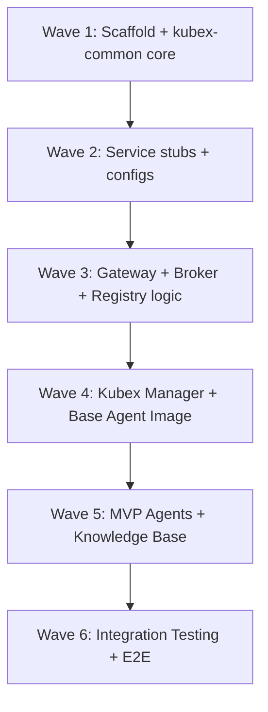

# KubexClaw — Implementation Plan

> Created 2026-03-08. Execution plan for scaffolding the monorepo and building MVP components.

---

## Execution Strategy

Work is organized into **6 waves**. Each wave has parallelizable streams that sub-agent teams can work on concurrently. A wave must complete before the next begins (dependencies flow downward).

### Progress Recording Protocol

After every sizable chunk of work completes (a full stream, a wave, or a significant sub-task):

1. **Update MEMORY.md** — Record what was completed, what failed, and what's next.
2. **Commit staged work** — Don't let uncommitted changes accumulate. Commit after each stream completes.
3. **Update task checkboxes** — Mark completed items `[x]` in this plan and in relevant `docs/` files.
4. **Log blockers** — If a sub-agent fails or hits a gap, record the failure mode and workaround in MEMORY.md immediately.

### Sub-Agent Rules

1. **Always read before write** — Sub-agents MUST read any existing file before overwriting it (Write tool safety check).
2. **Use `mode: "bypassPermissions"`** — All implementation agents run with bypass permissions to avoid interactive prompts.
3. **Create directories via Bash first** — Ensure parent directories exist before writing files.
4. **Atomic streams** — Each stream should be independently committable. Don't cross-depend on uncommitted work from another stream.



---

## Wave 1: Scaffold + kubex-common Core

**Goal:** Monorepo structure exists, `kubex-common` is importable with all schemas, and `uv sync` works across all packages.

### Stream 1A: Repo Scaffolding

Create the full directory structure and all `pyproject.toml` files.

- [ ] Create root `pyproject.toml` with uv workspace definition
  ```toml
  [project]
  name = "kubexclaw"
  version = "0.1.0"
  requires-python = ">=3.12"

  [tool.uv.workspace]
  members = ["libs/*", "services/*"]

  [tool.pytest.ini_options]
  testpaths = ["tests", "libs", "services"]
  markers = ["unit", "integration", "e2e", "chaos"]

  [tool.ruff]
  target-version = "py312"
  line-length = 120

  [tool.black]
  target-version = ["py312"]
  line-length = 120
  ```
- [ ] Create `libs/kubex-common/pyproject.toml` with dependencies: pydantic>=2.0, httpx, redis[asyncio]>=5.0, structlog, PyYAML
- [ ] Create `services/gateway/pyproject.toml` — depends on kubex-common (local path), fastapi, uvicorn, docker, opensearch-py
- [ ] Create `services/broker/pyproject.toml` — depends on kubex-common, fastapi, uvicorn
- [ ] Create `services/registry/pyproject.toml` — depends on kubex-common, fastapi, uvicorn
- [ ] Create `services/kubex-manager/pyproject.toml` — depends on kubex-common, fastapi, uvicorn, docker
- [ ] Create directory stubs for all service packages (empty `__init__.py` files)
- [ ] Create `agents/` directory with `_base/`, `orchestrator/`, `instagram-scraper/`, `knowledge/`, `reviewer/`
- [ ] Create `skills/` directory with `data-collection/web-scraping/`, `knowledge/recall/`
- [ ] Create `policies/` directory
- [ ] Create `tests/unit/`, `tests/integration/`, `tests/e2e/`, `tests/chaos/` directories
- [ ] Create `config/` directory for Redis ACL and other config files
- [ ] Create `secrets/.gitignore` (ignore everything except .gitignore itself)
- [ ] Run `uv sync` to verify workspace resolution works

### Stream 1B: kubex-common Schemas

The schemas are the data contracts that every service depends on. This is the most critical path.

- [ ] `kubex_common/__init__.py` — package root with version
- [ ] `kubex_common/schemas/__init__.py` — re-export all schemas
- [ ] `kubex_common/schemas/actions.py` — `ActionType` enum (all 22 action types from vocabulary), `ActionRequest` Pydantic model, `ActionResponse` model, `ACTION_PARAM_SCHEMAS` registry
- [ ] `kubex_common/schemas/envelope.py` — `GatekeeperEnvelope` with enrichment + evaluation sections
- [ ] `kubex_common/schemas/routing.py` — `RoutedRequest`, `BrokeredRequest`, `TaskDelivery` models
- [ ] `kubex_common/schemas/config.py` — `AgentConfig`, `SkillManifest`, `BoundaryConfig`, `ModelAllowlist` models
- [ ] `kubex_common/schemas/events.py` — `ProgressUpdate`, `LifecycleEvent`, `ControlMessage` models
- [ ] `kubex_common/schemas/knowledge.py` — `KnowledgeQuery`, `KnowledgeStore`, `CorpusSearch` parameter models, entity/relationship type enums (10 entity types, 12 relationship types)
- [ ] Unit tests for all schemas (validation, serialization, edge cases) — target 95%+ coverage

### Stream 1C: kubex-common Service Infrastructure

- [ ] `kubex_common/constants.py` — ports (Gateway=8080, Broker=8060, Registry=8070, Manager=8090, Graphiti=8100, Redis=6379, Neo4j=7687, OpenSearch=9200), Redis DB numbers (0-4), network names, rate limit defaults
- [ ] `kubex_common/errors.py` — `KubexError` base, `PolicyDeniedError`, `BudgetExceededError`, `AgentNotFoundError`, `ActionNotAllowedError`, `RateLimitError`, standardized error response format
- [ ] `kubex_common/logging.py` — structlog JSON configuration with service context binding, correlation ID propagation
- [ ] `kubex_common/clients/redis.py` — async Redis helper: DB-number-aware factory, connection pool management, health check method
- [ ] `kubex_common/clients/http.py` — httpx AsyncClient wrapper: retry policy (3 retries, exponential backoff), timeout defaults (connect=5s, read=30s), request ID header injection
- [ ] `kubex_common/service/base.py` — `KubexService` base class: FastAPI app factory, config loading from YAML, structlog init, Redis connection pool lifecycle, graceful shutdown handler
- [ ] `kubex_common/service/health.py` — `/health` endpoint factory: service name, version, uptime, Redis connectivity check
- [ ] `kubex_common/service/middleware.py` — request ID middleware (generates/propagates `X-Request-ID`), structured logging middleware (log every request with timing)
- [ ] Unit tests for all infrastructure modules — target 90%+ coverage

---

## Wave 2: Service Stubs + Config Files

**Goal:** Every service has a runnable FastAPI app with `/health` endpoint. All agent configs and policy files exist. `docker compose up` starts all infrastructure (even if logic is stubbed).

### Stream 2A: Service Stubs

Each service gets a minimal FastAPI app that boots, connects to Redis, and serves `/health`. Route handlers are stubbed (return 501 Not Implemented).

- [ ] `services/gateway/gateway/main.py` — FastAPI app, subclass KubexService, mount route stubs
- [ ] `services/gateway/gateway/routes/` — stub files for actions, tasks, proxy, health
- [ ] `services/gateway/Dockerfile` — Python 3.12-slim, install kubex-common + gateway deps, uvicorn entrypoint
- [ ] `services/broker/broker/main.py` — FastAPI app, subclass KubexService
- [ ] `services/broker/Dockerfile`
- [ ] `services/registry/registry/main.py` — FastAPI app, subclass KubexService
- [ ] `services/registry/Dockerfile`
- [ ] `services/kubex-manager/kubex_manager/main.py` — FastAPI app, subclass KubexService
- [ ] `services/kubex-manager/Dockerfile`
- [ ] Production `docker-compose.yml` — copy from MVP.md Section 11 skeleton, verify all services start

### Stream 2B: Agent Configs + Policies

- [ ] `agents/orchestrator/config.yaml` — per docs/agents.md Section 13.3.6
- [ ] `agents/orchestrator/policies/policy.yaml` — per MVP.md Section 7.2
- [ ] `agents/instagram-scraper/config.yaml` — per docs/agents.md Section 13.1
- [ ] `agents/instagram-scraper/policies/policy.yaml` — per MVP.md Section 7.3
- [ ] `agents/knowledge/config.yaml` — per docs/agents.md Section 13.2
- [ ] `agents/knowledge/policies/policy.yaml` — derived from knowledge agent allowed/blocked actions
- [ ] `agents/reviewer/config.yaml` — per docs/agents.md (o3-mini, no tools)
- [ ] `agents/reviewer/policies/policy.yaml` — per MVP.md Section 7.4
- [ ] `policies/global.yaml` — per MVP.md Section 7.1
- [ ] `boundaries/default.yaml` — per MVP.md Section 7.5
- [ ] `config/redis/users.acl` — Redis ACL: per-service accounts (gateway-svc, broker-svc, registry-svc, manager-svc) with db-level access restrictions

### Stream 2C: Skill Manifests

- [ ] `skills/data-collection/web-scraping/skill.yaml` — scrape_profile, scrape_posts, scrape_hashtag, extract_metrics
- [ ] `skills/knowledge/recall/skill.yaml` — query_knowledge, store_knowledge, search_corpus
- [ ] `skills/dispatch/task-management/skill.yaml` — dispatch_task, check_task_status, cancel_task, report_result
- [ ] Create skill manifest JSON schema for validation

### Stream 2D: Test Infrastructure

- [ ] `conftest.py` at root — shared pytest fixtures (Redis mock, httpx mock, FastAPI test client factory)
- [ ] `tests/conftest.py` — integration test fixtures
- [ ] GitHub Actions CI workflow: lint (ruff) → format check (black) → unit tests → coverage report
- [ ] `.github/workflows/ci.yml`

---

## Wave 3: Gateway + Broker + Registry Logic

**Goal:** The three core routing services have working logic. Gateway evaluates policies, Broker routes messages, Registry serves capability queries.

### Stream 3A: Gateway Core

- [ ] Identity resolution — Docker label lookup via Docker API (source IP → container → labels → agent_id + boundary)
- [ ] `agent_id` overwrite — replace ActionRequest body `agent_id` with resolved container identity
- [ ] Policy loader — read `policies/global.yaml` + per-agent policy files, build rule index
- [ ] Policy evaluation engine — first-deny-wins cascade (global → boundary → kubex), 3 MVP rule categories: egress/network, action type, budget/model
- [ ] `POST /actions` endpoint — receive ActionRequest, wrap in GatekeeperEnvelope, evaluate, route to appropriate handler
- [ ] Egress proxy — httpx client that proxies Kubex external requests through allowed domains
- [ ] LLM reverse proxy — `POST /v1/proxy/anthropic/*`, `POST /v1/proxy/openai/*` — inject API keys from secrets, enforce model allowlist, count tokens
- [ ] Rate limiting — Redis db1, per-agent per-action counters with sliding window
- [ ] Budget tracking — Redis db4, per-task and per-day token/cost tracking
- [ ] `POST /actions` dispatch_task handler — resolve capability via Registry, write TaskDelivery to Broker, return task_id
- [ ] `GET /tasks/{task_id}/stream` — SSE endpoint, subscribe to Redis pub/sub `progress:{task_id}`
- [ ] `POST /tasks/{task_id}/progress` — receive harness progress chunks, publish to Redis pub/sub
- [ ] `POST /tasks/{task_id}/cancel` — resolve task_id → agent_id, publish cancel to Redis `control:{agent_id}`, verify caller is originator
- [ ] `GET /tasks/{task_id}/result` — read result from Redis `task:{task_id}:result`
- [ ] Unit tests for policy engine (minimum 95% coverage per CLAUDE.md)
- [ ] Policy fixture tests — every policy file gets test cases asserting approve/deny/escalate outcomes

### Stream 3B: Broker

- [ ] Redis Streams transport — single stream `boundary:default` for MVP
- [ ] `POST /messages` — publish TaskDelivery to stream
- [ ] Consumer group management — create groups per agent, track acknowledgments
- [ ] Message consumption — agents poll/consume from their consumer group
- [ ] Dead letter handling — retry after 60s, max 3 retries, then DLQ
- [ ] Audit forwarding — log all messages to audit stream
- [ ] Stream trimming — `MAXLEN ~10000`
- [ ] `GET /tasks/{task_id}/result` — read result stored against task_id
- [ ] Unit tests

### Stream 3C: Registry

- [ ] In-memory capability store backed by Redis db2
- [ ] `POST /agents` — register agent with capabilities, status, boundary, accepts_from
- [ ] `GET /agents` — list all agents
- [ ] `GET /agents/{agent_id}` — get agent details
- [ ] `DELETE /agents/{agent_id}` — deregister agent
- [ ] `GET /capabilities/{capability}` — resolve capability to agent(s)
- [ ] `PATCH /agents/{agent_id}/status` — update agent status (running, stopped, busy)
- [ ] Unit tests

---

## Wave 4: Kubex Manager + Base Agent Image

**Goal:** Kubex Manager can create, start, stop, and kill worker containers. Base agent image exists with kubex-harness entrypoint.

### Stream 4A: Kubex Manager

- [ ] Docker SDK integration — create/start/stop/kill containers
- [ ] Container creation — set Docker labels (`kubex.agent_id`, `kubex.boundary`), network assignment (`kubex-internal` only), resource limits
- [ ] `*_BASE_URL` env var injection — read agent manifest `providers`, set `ANTHROPIC_BASE_URL`, `OPENAI_BASE_URL` pointing to Gateway proxy
- [ ] CLI credential mounting — bind-mount `secrets/cli-credentials/<provider>/` read-only into containers
- [ ] Bind-mounted secrets — write to host paths, mount read-only at `/run/secrets/<name>`
- [ ] Registry integration — register agents on create, deregister on kill
- [ ] Lifecycle events — publish to Redis db3 stream
- [ ] Kill switch — `docker stop` + secret file cleanup
- [ ] Harness env vars — set `KUBEX_PROGRESS_BUFFER_MS`, `KUBEX_PROGRESS_MAX_CHUNK_KB`, `KUBEX_ABORT_KEYSTROKE`, `KUBEX_ABORT_GRACE_PERIOD_S`, `GATEWAY_URL` on worker containers
- [ ] REST API — lifecycle endpoints (create/start/stop/kill/restart/list/get)
- [ ] Bearer token auth for Management API
- [ ] Unit + integration tests

### Stream 4B: Base Agent Image + kubex-harness

- [ ] `agents/_base/Dockerfile` — Python 3.12, OpenClaw runtime (>= v2026.2.26), kubex-common installed, kubex-harness installed
- [ ] `kubex-harness` entrypoint script:
  - PTY spawn of CLI LLM
  - stdout/stderr capture with chunk buffering (`KUBEX_PROGRESS_BUFFER_MS`, `KUBEX_PROGRESS_MAX_CHUNK_KB`)
  - `POST /tasks/{task_id}/progress` to Gateway
  - Redis `control:{agent_id}` subscription for cancel commands
  - Graceful cancellation escalation: keystroke → SIGTERM → SIGKILL with grace period
  - Final progress update with `exit_reason`
- [ ] `agents/_base/entrypoint.sh` — bootstrap: load skills, invoke kubex-harness

> **OPEN QUESTION for user:** The kubex-harness needs to spawn a CLI LLM (e.g., Claude Code). What exact CLI LLM binary will be available inside the container? Is it `claude` (Claude Code CLI)? How is it installed in the base image? What version/source?

---

## Wave 5: MVP Agents + Knowledge Base

**Goal:** All 4 MVP agents (Orchestrator, Scraper, Knowledge, Reviewer) work. Knowledge base stores and retrieves data.

### Stream 5A: Orchestrator + MCP Bridge

- [ ] `agents/orchestrator/Dockerfile` — extends base, pre-packages MCP bridge
- [ ] MCP Bridge server (`agents/orchestrator/mcp-bridge/server.py`) — FastMCP or mcp-python
- [ ] MCP tools: `dispatch_task`, `check_task_status`, `cancel_task`, `subscribe_task_progress`, `get_task_progress`, `list_agents`, `query_knowledge`, `store_knowledge`, `report_result`, `request_user_input`
- [ ] Gateway HTTP client (`mcp-bridge/client/gateway.py`) — sole connection to `http://gateway:8080`
- [ ] SSE consumer for progress streaming
- [ ] Clarification routing logic
- [ ] System prompt with decomposition rules (Section 13.3.4)
- [ ] Orchestrator Dockerfile with `tail -f /dev/null` CMD (waits for docker exec)

### Stream 5B: Worker Agents

- [ ] Instagram Scraper agent — config already in Stream 2B, build Dockerfile extending _base
- [ ] Scraper skills: `scrape_profile`, `scrape_posts`, `scrape_hashtag`, `extract_metrics` — these are OpenClaw tool definitions
- [ ] Knowledge Kubex agent — config already in Stream 2B, build Dockerfile extending _base
- [ ] Knowledge skills: `query_knowledge`, `store_knowledge`, `search_corpus` — OpenClaw tool definitions
- [ ] Reviewer agent — config already in Stream 2B, build Dockerfile extending _base

> **OPEN QUESTION for user:** How do OpenClaw skills/tools get defined? Is there a specific format (Python functions with decorators? YAML + Python? Pure YAML?)? We need to understand the OpenClaw tool authoring model to implement the actual skill code.

### Stream 5C: Knowledge Base Integration

- [ ] OpenSearch index templates — `knowledge-corpus-shared-*` with mapping (content, source_description, workflow_id, task_id, timestamp, embedding vector field)
- [ ] Gateway proxy routes for Graphiti (`/v1/proxy/graphiti/*`)
- [ ] Gateway proxy routes for OpenSearch knowledge queries (`/v1/proxy/opensearch/knowledge/*`)
- [ ] Two-step ingestion handler in Gateway: OpenSearch index → Graphiti episode POST
- [ ] `query_knowledge` action handler — proxy to Graphiti search
- [ ] `store_knowledge` action handler — two-step ingestion
- [ ] `search_corpus` action handler — proxy to OpenSearch
- [ ] Built-in `knowledge` skill (recall + memorize tools) in kubex-common
- [ ] Knowledge rate limiting at Gateway (query: 30/min, store: 10/min, search: 20/min per agent)
- [ ] `valid_at` window enforcement (±24h)

---

## Wave 6: Integration Testing + E2E

**Goal:** Full pipeline works end-to-end. All security guarantees validated.

- [ ] E2E: human → orchestrator → gateway → broker → scraper → result flows back
- [ ] Kill switch: stop scraper mid-task, verify cleanup
- [ ] Policy enforcement: scraper attempts http_post → DENY
- [ ] Egress enforcement: scraper attempts non-allowlisted domain → DENY
- [ ] Budget enforcement: exceed per-task token limit → DENY
- [ ] Identity resolution: Gateway overwrites agent_id from Docker labels
- [ ] Identity spoofing: reject forged agent_id
- [ ] Task cancellation: full escalation chain (Ctrl+C → SIGTERM → SIGKILL)
- [ ] Cancel authorization: only originator can cancel
- [ ] Clarification flow (autonomous + human)
- [ ] Knowledge base: store → recall round-trip
- [ ] Model separation: workers=Anthropic, reviewer=OpenAI
- [ ] Credential setup: Kubex Manager sets correct `*_BASE_URL` env vars
- [ ] All policy files have fixture tests (approve/deny/escalate)

---

## Open Questions (Need User Input)

These gaps need decisions before their respective waves can complete. Implementation proceeds on everything else.

### Q1: OpenClaw Tool Authoring Model (Blocks Wave 5B)

How are OpenClaw skills/tools authored? We need to know:
- What format are tool definitions in? (Python decorators? YAML manifests? Both?)
- Is there a specific SDK or base class for creating tools?
- How does the OpenClaw runtime discover and load tools at startup?
- Is there documentation or example code we can reference?

**Impact:** Without this, we can scaffold everything but can't write the actual skill implementations (scraper tools, knowledge tools).

### Q2: CLI LLM Binary in Base Image (Blocks Wave 4B)

What CLI LLM runs inside the Orchestrator and worker containers?
- Is it `claude` (Claude Code CLI)?
- How is it installed? (npm? pip? Binary download?)
- What version?
- Does it need auth configuration inside the container, or does the `*_BASE_URL` env var + mounted CLI credentials suffice?

**Impact:** The kubex-harness PTY spawn and the Orchestrator Dockerfile depend on knowing the exact binary and its configuration.

### Q3: OpenClaw Base Image Source (Blocks Wave 4B)

The architecture references OpenClaw >= v2026.2.26:
- Is there a public Docker image (`openclaw/openclaw:latest`)?
- Or do we build from source?
- What is the installation method?

**Impact:** The `_base/Dockerfile` needs to install OpenClaw.

### Q4: MCP Bridge SDK (Blocks Wave 5A)

Which MCP server SDK to use for the MCP Bridge?
- `mcp` (official Python SDK from Anthropic)?
- `fastmcp`?
- Something else?

**Impact:** Minor — affects import style but not architecture. Defaulting to official `mcp` Python SDK unless directed otherwise.

---

## Team Assignment Plan

When executing, spawn these sub-agent teams:

| Team | Streams | Description |
|------|---------|-------------|
| **scaffold** | 1A | Repo structure, pyproject.toml files, directory creation |
| **schemas** | 1B | All Pydantic models in kubex-common/schemas/ |
| **infra** | 1C | kubex-common service base, clients, utilities |
| **services** | 2A, 2D | Service stubs, Dockerfiles, CI |
| **configs** | 2B, 2C | Agent configs, policies, skill manifests, Redis ACL |
| **gateway** | 3A | Gateway business logic (biggest single stream) |
| **broker-registry** | 3B, 3C | Broker + Registry logic |
| **manager** | 4A | Kubex Manager Docker lifecycle |
| **agents** | 4B, 5A, 5B | Base image, harness, MCP bridge, agent Dockerfiles |
| **knowledge** | 5C | Knowledge base integration |
| **testing** | 6 | Integration + E2E tests |

**Wave 1 parallelism:** Teams scaffold + schemas + infra run simultaneously.
**Wave 2 parallelism:** Teams services + configs + test-infra run simultaneously (after Wave 1).
**Wave 3 parallelism:** Teams gateway + broker-registry run simultaneously (after Wave 2).
**Wave 4-5:** Teams manager + agents + knowledge run (partially parallel, after Wave 3).
**Wave 6:** Team testing runs after all others complete.

---

## What Gets Built Now (Wave 1-2)

Waves 1-2 have **zero open questions** — everything needed is fully specified in the docs. These can start immediately:

1. Full repo scaffolding with all `pyproject.toml` files
2. Complete kubex-common package (schemas, service base, clients, utilities)
3. Service stubs with health endpoints and Dockerfiles
4. All agent config YAML files and policy files
5. Skill manifests
6. Redis ACL configuration
7. Production docker-compose.yml
8. CI pipeline
9. Full unit test suite for kubex-common

This represents the foundation that all subsequent waves build on.
