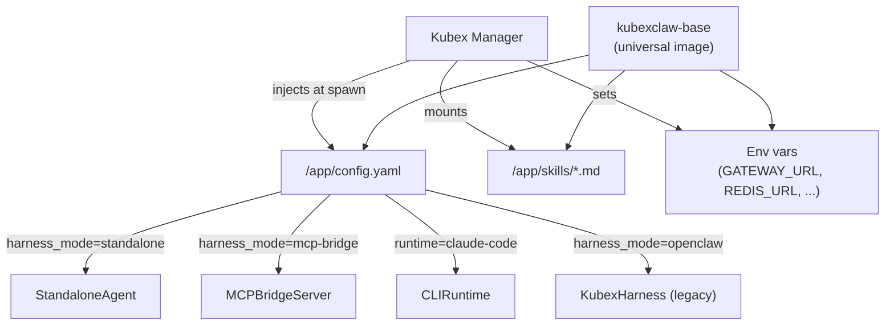
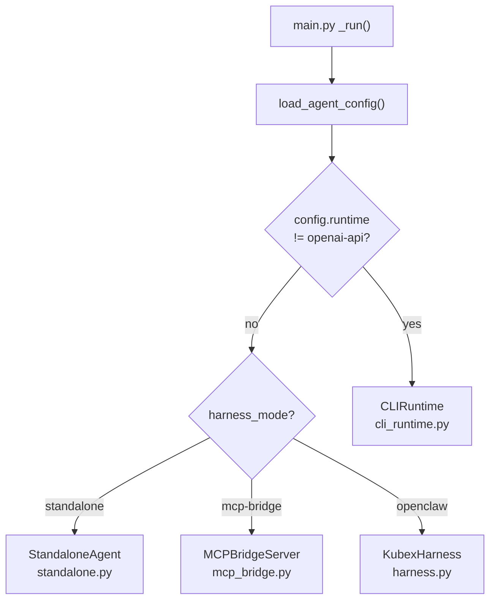
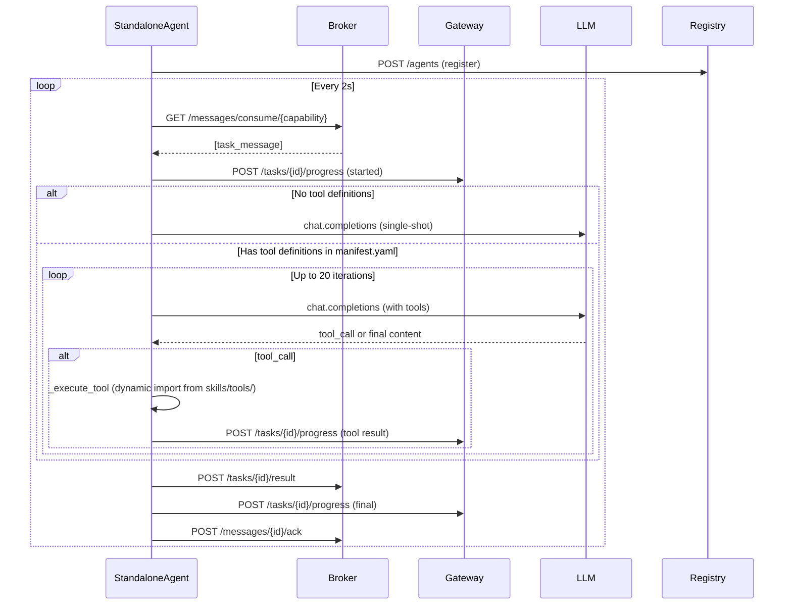
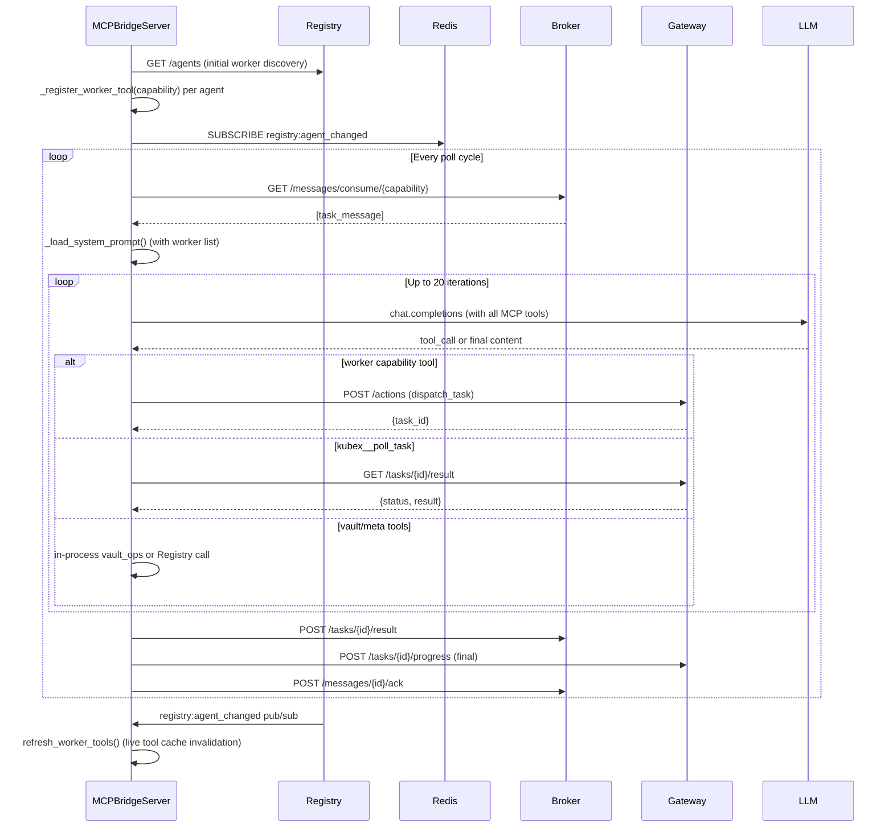
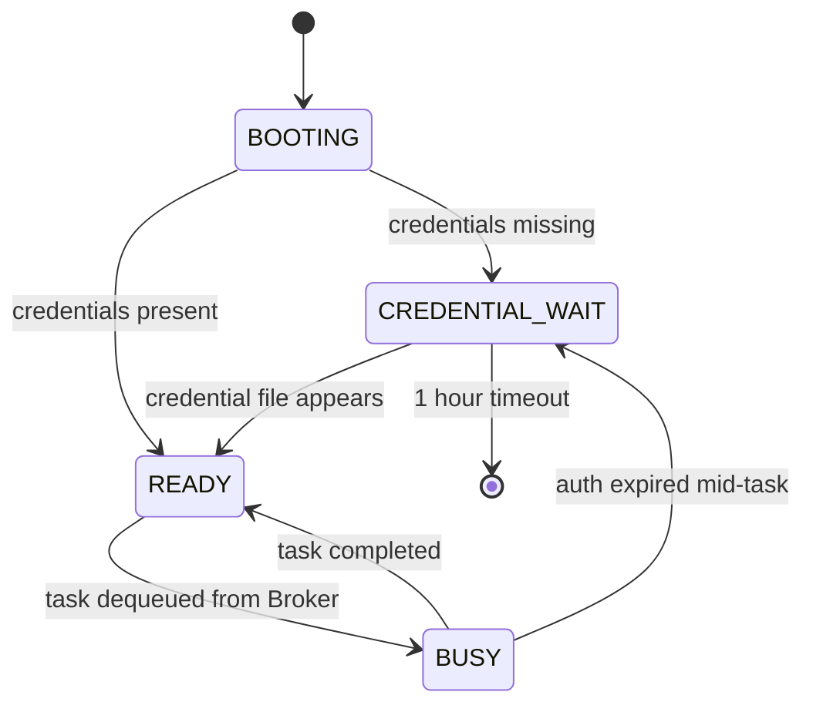
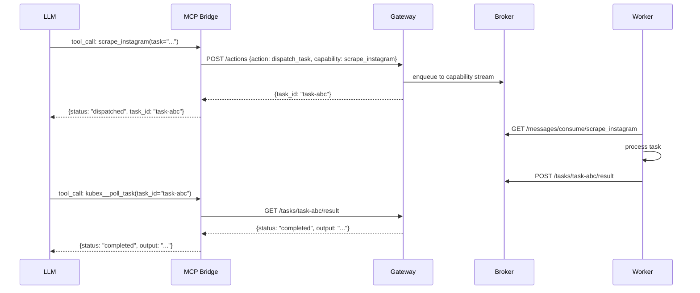

# Agent System Reference

**Analysis Date:** 2026-03-27

This document maps the KubexClaw agent runtime in full — stem cell architecture, harness modes, skill system, agent configs, worker dispatch, and HITL.

---

## 1. Stem Cell Architecture

Every deployed agent runs the same Docker image (`kubexclaw-base`). There are no per-agent Dockerfiles. An agent is specialized at spawn time by Kubex Manager injecting three things:

- `/app/config.yaml` — identity, capabilities, harness mode, model, policy, budget
- `/app/skills/` — markdown skill files mounted into the container
- Environment variables — URLs, tokens, runtime overrides

The result is a universal container that reads its config on boot and becomes whatever agent is needed.



### Boot Sequence (`entrypoint.sh`)

`agents/_base/entrypoint.sh` runs before the Python harness:

1. Install `KUBEX_PIP_DEPS` and `KUBEX_SYSTEM_DEPS` — trusted, no policy gate
2. Create `~/.openclaw/` config directory
3. Write `openclaw.json` from `/run/secrets/openclaw.json` or `OPENCLAW_CONFIG_JSON` env var
4. Copy `/app/skills/` into `~/.openclaw/skills/`
5. If `runtime != openai-api`, generate `/app/CLAUDE.md` or equivalent by concatenating all `SKILL.md` files
6. Exec `python -m kubex_harness.main`

### Config Loader (`config_loader.py`)

`agents/_base/kubex_harness/config_loader.py` loads `/app/config.yaml` on boot and fails fast if it is missing or lacks `agent.id`. The `AgentConfig` pydantic model is the single in-memory representation of an agent's identity.

Key fields:

| Field | Type | Description |
|---|---|---|
| `agent_id` | `str` | Unique identifier, read from `agent.id` |
| `model` | `str` | LLM model name (default: `gpt-5.2`) |
| `harness_mode` | `str` | `standalone`, `mcp-bridge`, `openclaw` |
| `runtime` | `str` | `openai-api` (in-memory) or CLI runtime name |
| `capabilities` | `list[str]` | Broker consumer group names |
| `skills` | `list[str]` | Ordered skill directory names to load |
| `policy` | `PolicyConfig` | `allowed_actions`, `blocked_actions` |
| `budget` | `BudgetConfig` | `per_task_token_limit`, `daily_cost_limit_usd` |
| `boundary` | `str` | Policy boundary name (default: `default`) |

URL fields (`gateway_url`, `broker_url`, `registry_url`) allow env var override so Kubex Manager can inject service addresses without modifying config files.

---

## 2. Harness Modes

`agents/_base/kubex_harness/main.py` is the Python entry point. It loads config, logs a boot summary, then routes to one of four harness implementations.

### Routing Logic



CLI runtime check runs before `harness_mode` — setting `runtime: claude-code` in config.yaml activates `CLIRuntime` regardless of `harness_mode`.

---

### Mode 1: Standalone (`standalone.py`)

**Used by:** `instagram-scraper`, `knowledge`, `reviewer`, `hello-world`

The primary worker runtime. Implements a poll-process-acknowledge loop:



**Tool execution:** When the LLM returns a `tool_call`, `StandaloneAgent._get_tool_handler()` dynamically imports `skills_dir/**/tools/{name}.py` and calls the function named `{name}`. Tool errors are returned as strings so the LLM can decide how to proceed — they are never raised.

**System prompt construction:** On init, `StandaloneAgent` calls `build_system_prompt(config, skill_content)` from `prompt_builder.py`. Skill content is loaded by scanning `/app/skills/**/*.md` recursively.

---

### Mode 2: MCP Bridge (`mcp_bridge.py`)

**Used by:** `orchestrator`

Replaces the legacy 8-tool OpenAI function-calling loop with a FastMCP server. The orchestrator's LLM calls tools that are registered on the `FastMCP` instance. Worker agents appear as capability tools discovered live from the Registry.



**Transport selection** (`_transport` field):
- `runtime == "openai-api"` → `inmemory` — bridge and LLM share the same asyncio loop
- Any other runtime value → `stdio` — external CLI connects as MCP client

**Static tools always registered:**
- `kubex__poll_task` — poll task status, surface `need_info`
- `vault_search_notes`, `vault_get_note`, `vault_list_notes`, `vault_find_backlinks` — in-process vault reads
- `vault_create_note`, `vault_update_note` — writes route through Gateway policy check first
- `kubex__list_agents`, `kubex__agent_status`, `kubex__cancel_task` — Registry/Broker meta
- `kubex__forward_hitl_response` — HITL answer forwarding (Phase 14)

**Dynamic tools:** One tool per worker capability, registered via `_register_worker_tool(capability, description)`. Each tool dispatches `dispatch_task` to Gateway and returns `{status: "dispatched", task_id: ...}` immediately (async task_id pattern, avoids MCP SDK timeout issues).

---

### Mode 3: CLI Runtime (`cli_runtime.py`)

**Used by:** Agents with `runtime: claude-code`, `runtime: gemini-cli`, or `runtime: codex-cli`

Manages a CLI tool (Claude Code, Gemini CLI, Codex CLI) running inside a PTY subprocess. The harness is the process supervisor — it does not call an LLM directly.

**State machine:**



State transitions are published to Redis `lifecycle:{agent_id}` and written to `agent:state:{agent_id}`.

**Boot sequence:**
1. `_write_skill_file()` — concatenates all `SKILL.md` files into `/app/CLAUDE.md` (or `GEMINI.md`)
2. `_credential_gate()` — checks credential file exists and is non-empty; sends HITL request if missing
3. Start hook server (claude-code only) for Claude Code hooks (`PostToolUse`, `Stop`, etc.)
4. Register with Registry
5. `_task_loop()` — poll Broker, execute via `_run_cli_process()`, ACK

**CLI process execution:** `pexpect.spawn()` allocates a PTY. Output is drained in a thread pool executor (avoids blocking asyncio). Output is truncated at 1 MB. Failure is classified from exit code and last-50-lines output patterns: `auth_expired`, `subscription_limit`, `runtime_not_available`, `cli_crash`. Retry once for non-auth failures; `auth_expired` goes directly to `CREDENTIAL_WAIT`.

**Credential paths per runtime:**
- `claude-code`: `~/.claude/.credentials.json`
- `gemini-cli`: `~/.gemini/oauth_creds.json`
- `codex-cli`: `~/.codex/.credentials.json`

---

### Mode 4: KubexHarness / OpenClaw (`harness.py`)

**Legacy mode.** Spawns `openclaw agent --local --message "<task>"` as a subprocess via PTY. Streams stdout to Gateway as progress chunks. Listens on Redis `control:{agent_id}` pub/sub for cancel commands. Cancel escalation: abort keystroke → SIGTERM → SIGKILL. Stores final result via Broker.

Not used by any currently deployed agent. Present as fallback if `harness_mode: openclaw` is set.

---

## 3. Skill System

### Skill Structure

Skills live in `skills/` at the repo root and are injected into containers at spawn time. Each skill is a directory with at minimum a `SKILL.md` file:

```
skills/
├── data-collection/
│   └── web-scraping/
│       ├── SKILL.md          # Instructions injected into LLM system prompt
│       └── skill.yaml        # Metadata (name, version, tags, tools, egress)
├── examples/
│   ├── hello-world/
│   │   ├── SKILL.md
│   │   └── manifest.yaml
│   └── hitl-test/
│       └── SKILL.md
├── knowledge/
│   └── obsidian-vault/
│       ├── SKILL.md
│       ├── manifest.yaml
│       └── tools/            # Python tool handlers (dynamically loaded)
│           ├── create_note.py
│           ├── get_note.py
│           ├── search_notes.py
│           └── ...
├── orchestration/
│   └── task-management/
│       ├── SKILL.md
│       ├── manifest.yaml
│       └── tools/
│           ├── dispatch_task.py
│           ├── check_task_status.py
│           └── ...
└── security/
    └── review/
        ├── SKILL.md
        └── manifest.yaml
```

### How Skills Enter the System Prompt

**Standalone and MCP Bridge modes (`openai-api` runtime):**

`standalone._load_skill_files(skills_dir)` recursively scans `/app/skills/**/*.md` and concatenates them with headers:

```
## Loaded Skills

--- Skill: web-scraping/SKILL.md ---
<content>

--- Skill: recall/SKILL.md ---
<content>
```

This string is passed to `build_system_prompt(config, skill_content)` which prepends the filled `PREAMBLE.md` template.

**CLI runtime (claude-code, gemini-cli):**

`CLIRuntime._write_skill_file()` writes `/app/CLAUDE.md` (or `GEMINI.md`) by concatenating all `SKILL.md` files separated by `---`. The CLI picks up this file from its working directory (`/app`) and uses it as its instructions.

`entrypoint.sh` also performs this step at boot (step 4b) so the file is present before the CLI starts.

### `skill_loader.py` (Ordered Loading)

`agents/_base/kubex_harness/skill_loader.py` provides `load_skills_from_config(skills_dir, skill_order)`. When `skill_order` is provided (from `config.yaml agent.skills`), skills are loaded in that order. When absent, falls back to alphabetical recursive scan.

### `manifest.yaml` — Tool Definitions

Skills that provide Python tool handlers declare them in `manifest.yaml`. `standalone._load_tool_definitions()` scans all `manifest.yaml` files and converts the `tools:` list into OpenAI function-calling format for the `tool_choice: auto` loop.

Example manifest tool entry:

```yaml
tools:
  - name: dispatch_task
    description: "Dispatch a task to a worker agent"
    parameters:
      capability:
        type: string
        description: "Worker capability to invoke"
        required: true
      task:
        type: string
        description: "Task description"
        required: true
```

---

## 4. PREAMBLE.md — System Prompt Template

`agents/_base/kubex_harness/PREAMBLE.md` is the base template filled by `prompt_builder.build_system_prompt()`. Template variables:

| Variable | Source |
|---|---|
| `{agent_id}` | `config.agent_id` |
| `{description}` | `config.description` |
| `{capabilities}` | `config.capabilities` joined |
| `{boundary}` | `config.boundary` |
| `{policy_summary}` | Formatted allowed/blocked action lists |
| `{budget_summary}` | Token limit and daily cost limit |
| `{worker_list_section}` | Worker agent list (orchestrator only) |

Key sections in the filled preamble:
- **Agent Identity** — who this agent is
- **Capability Boundaries** — what tasks to accept and refuse
- **Policy Summary** — allowed and blocked actions
- **Budget Awareness** — per-task token and cost limits
- **Security Directives** — prompt injection resistance instructions
- **Output Contract** — mandates JSON envelope: `{status, result, metadata}`

The `status` field must be one of: `completed`, `error`, `need_info`.

---

## 5. Agent Config Format

Full `config.yaml` structure:

```yaml
agent:
  id: "<agent_id>"                        # required
  description: >
    <human-readable description>
  model: "gpt-5.2"                        # default
  boundary: "default"
  harness_mode: "standalone"              # standalone | mcp-bridge | openclaw
  runtime: "openai-api"                   # openai-api | claude-code | gemini-cli | codex-cli
  gateway_url: "http://gateway:8080"
  broker_url: "http://kubex-broker:8060"

  skills:
    - "skill-directory-name"              # ordered; loaded in this sequence

  capabilities:
    - "capability_name"                   # broker consumer group names

  policy:
    allowed_actions:
      - "http_get"
      - "dispatch_task"
    blocked_actions:
      - "execute_code"
    allowed_egress:                       # optional: domain whitelist
      - "instagram.com"

  budget:
    per_task_token_limit: 10000
    daily_cost_limit_usd: 1.00

  harness:                                # optional: harness tuning
    progress_buffer_ms: 500
    progress_max_chunk_kb: 16

  vault_path: "/app/vault"               # optional: knowledge agent only
```

`policies/policy.yaml` (separate file in each agent directory) is the Gateway-side policy fixture. It mirrors the `policy` stanza in `config.yaml` and is consumed by the Gateway Policy Engine at enforce time.

---

## 6. Deployed Agents

### `orchestrator`

- **Config:** `agents/orchestrator/config.yaml`
- **Harness mode:** `mcp-bridge`
- **Runtime:** `openai-api`
- **Model:** `gpt-5.2`
- **Capabilities:** `task_orchestration`, `task_management`
- **Skills:** none loaded via file — skill instructions are baked into `orchestration/task-management/SKILL.md` at spawn
- **Role:** Receives tasks from humans. Never performs work directly. Breaks tasks into subtasks and delegates to workers via capability tools. Uses `kubex__list_agents` for runtime worker discovery. Manages multi-step workflows with up to 20 tool iterations.
- **Allowed actions:** `dispatch_task`, `check_task_status`, `cancel_task`, `report_result`, `request_user_input`, `query_registry`, `query_knowledge`, `store_knowledge`, `search_corpus`, `vault_create`, `vault_update`
- **Blocked actions:** All HTTP verbs, `execute_code`, `send_email`
- **Budget:** 50,000 tokens / task, $5.00 / day

### `instagram-scraper`

- **Config:** `agents/instagram-scraper/config.yaml`
- **Harness mode:** `standalone`
- **Model:** `gpt-5.2`
- **Capabilities:** `scrape_instagram`, `extract_metrics`
- **Skills:** `web-scraping` (`skills/data-collection/web-scraping/SKILL.md`)
- **Role:** Scrapes public Instagram profiles, posts, and hashtags. Extracts engagement metrics. Read-only — no write or auth operations.
- **Allowed egress:** `instagram.com`, `i.instagram.com`, `graph.instagram.com`
- **Allowed actions:** `http_get`, `write_output`, `report_result`, `progress_update`, `query_knowledge`, `store_knowledge`, `search_corpus`
- **Budget:** 10,000 tokens / task, $1.00 / day

### `knowledge`

- **Config:** `agents/knowledge/config.yaml`
- **Harness mode:** `standalone`
- **Model:** `gpt-5.2`
- **Capabilities:** `knowledge_management`, `knowledge_query`, `knowledge_storage`
- **Skills:** `obsidian-vault` (`skills/knowledge/obsidian-vault/SKILL.md`)
- **Tool handlers:** `create_note.py`, `get_note.py`, `list_notes.py`, `search_notes.py`, `update_note.py`, `find_backlinks.py` (in `skills/knowledge/obsidian-vault/tools/`)
- **Role:** Manages the Obsidian knowledge vault. Searches, retrieves, creates, and updates notes. Multi-turn tool-use loop (manifest.yaml declares tools).
- **Vault path:** `/app/vault`
- **Budget:** 5,000 tokens / task, $2.00 / day

### `reviewer`

- **Config:** `agents/reviewer/config.yaml`
- **Harness mode:** `standalone`
- **Model:** `o3-mini` (intentionally different from all other agents — anti-collusion design)
- **Capabilities:** `security_review`
- **Skills:** `review` (`skills/security/review/SKILL.md`)
- **Role:** Evaluates Gateway ESCALATE actions. Returns `ALLOW`, `DENY`, or `ESCALATE` verdicts with structured JSON reasoning and confidence score. Is the last line of defense before any ambiguous action executes. Intentionally uses a different model from all agents it reviews.
- **Allowed actions:** `report_result` only
- **Blocked actions:** All HTTP verbs, `execute_code`, `send_email`, `dispatch_task`, `write_output`, `read_input`
- **Budget:** 20,000 tokens / task, $2.00 / day

### `hello-world`

- **Config:** `agents/hello-world/config.yaml`
- **Harness mode:** `standalone` (default)
- **Model:** `gpt-5.2`
- **Capabilities:** `hello`, `hitl-test`
- **Skills:** `hello-world`, `hitl-test` (`skills/examples/hello-world/SKILL.md`, `skills/examples/hitl-test/SKILL.md`)
- **Role:** Template/test agent. Responds with "Hello from KubexClaw!" to `hello` tasks. For `hitl-test` tasks, exercises the full `need_info` → HITL → `completed` pipeline with three trivial questions.
- **No policy or budget constraints** (minimal config — no `policy:` or `budget:` stanzas)

---

## 7. Worker Dispatch via MCP Bridge

The orchestrator discovers workers at two points:

**1. On task start (snapshot):** `_load_system_prompt()` calls `_fetch_worker_descriptions()` which hits `GET /agents` on the Registry synchronously. The worker list is injected into the system prompt via the `{worker_list_section}` PREAMBLE.md variable.

**2. At boot and on registry changes (live):** `refresh_worker_tools()` fetches all agents from Registry, iterates their capabilities, and calls `_register_worker_tool(capability, description)` for each. A background task subscribes to Redis `registry:agent_changed` pub/sub and calls `refresh_worker_tools()` on every notification — enabling hot-reload of new workers without orchestrator restart.

### Worker Dispatch Flow



Worker tool names match capability names exactly (e.g., `scrape_instagram` capability → `scrape_instagram` MCP tool). Each dispatch tool accepts `task: str` and optional `delegation_depth: int` (default 0). Max delegation depth is 3 (configurable via `MAX_DELEGATION_DEPTH` env var).

---

## 8. Human-in-the-Loop (HITL)

### Worker-Side: `need_info` Status

Workers return `need_info` status in their JSON result envelope when they require clarification:

```json
{
  "status": "need_info",
  "request": "Which hashtags should I filter to?",
  "data": {"scraped_posts": 47, "candidate_hashtags": ["#travel", "#food"]},
  "result": {},
  "metadata": {"agent_id": "...", "task_id": "..."}
}
```

The broker stores this as the task result. `kubex__poll_task` returns it to the orchestrator's LLM.

### `request_user_input` Action

For agents that need operator input (not worker-to-orchestrator), the `request_user_input` action posts to `Gateway /actions`:

```python
# From cli_runtime.py _request_hitl()
payload = {
    "action": "request_user_input",
    "agent_id": self.config.agent_id,
    "payload": {"message": "Agent needs CLI authentication. Please run: ..."}
}
```

Only the `orchestrator` has `request_user_input` in its allowed actions. Worker agents may not send it.

### Phase 14 Participant Events

The MCP Bridge emits three structured event types as progress chunks to Gateway (`POST /tasks/{id}/progress`). These are consumed by the Command Center UI SSE stream.

**`agent_joined`** — emitted once per sub-task when a worker first returns `need_info`:

```json
{
  "type": "agent_joined",
  "agent_id": "instagram-scraper",
  "sub_task_id": "task-xyz",
  "capability": "scrape_instagram"
}
```

Emitted in `_handle_poll_task()` when `result_status == "need_info"` and `task_id not in self._joined_sub_tasks`. The set `_joined_sub_tasks` prevents duplicate events.

**`hitl_request`** — emitted on every `need_info` poll:

```json
{
  "type": "hitl_request",
  "prompt": "Which hashtags should I filter to?",
  "source_agent": "instagram-scraper"
}
```

The `source_agent` field identifies which worker issued the request (tracked in `_sub_task_agent: dict[str, str]`).

**`agent_left`** — emitted after `kubex__forward_hitl_response` delivers the user's answer:

```json
{
  "type": "agent_left",
  "agent_id": "instagram-scraper",
  "sub_task_id": "task-xyz",
  "status": "resolved"
}
```

### HITL Answer Forwarding

When the operator provides an answer, `kubex__forward_hitl_response(sub_task_id, answer)` stores it as a `hitl_answer` result on the sub-task via Broker:

```python
await broker.post(f"/tasks/{sub_task_id}/result", json={
    "result": {
        "status": "hitl_answer",
        "agent_id": self.config.agent_id,
        "output": answer,
    }
})
```

The worker's next poll picks up the answer. After forwarding, `agent_left` is emitted and participant tracking state is cleaned up.

### HITL State Tracking (MCPBridgeServer fields)

| Field | Type | Purpose |
|---|---|---|
| `_joined_sub_tasks` | `set[str]` | Sub-task IDs that already emitted `agent_joined` |
| `_task_capability` | `dict[str, str]` | sub_task_id → capability (set at dispatch, used at poll time) |
| `_active_task_id` | `str \| None` | Current orchestrator task_id for routing progress events |
| `_sub_task_agent` | `dict[str, str]` | sub_task_id → worker agent_id (for `agent_left`) |

All four are cleared on task completion (`completed`, `failed`, `cancelled`) or after `kubex__forward_hitl_response` fires.

---

## 9. Output Contract

All agents (standalone and MCP bridge) must produce JSON matching the PREAMBLE.md output contract:

```json
{
  "status": "completed|error|need_info",
  "result": { "<domain-specific data>" },
  "metadata": {
    "agent_id": "<agent_id>",
    "task_id": "<task_id>",
    "duration_ms": "<elapsed ms>"
  }
}
```

The Broker stores raw `output` text from the harness. It is the LLM's responsibility to produce valid JSON matching this schema — the harness does not enforce or re-serialize it.

---

## 10. Key File Locations

| File | Purpose |
|---|---|
| `agents/_base/kubex_harness/main.py` | Entry point, harness mode routing |
| `agents/_base/kubex_harness/config_loader.py` | Loads `/app/config.yaml`, `AgentConfig` model |
| `agents/_base/kubex_harness/standalone.py` | Worker poll-LLM-result loop |
| `agents/_base/kubex_harness/mcp_bridge.py` | Orchestrator MCP server, dynamic worker tools |
| `agents/_base/kubex_harness/cli_runtime.py` | PTY-based CLI subprocess manager |
| `agents/_base/kubex_harness/harness.py` | Legacy OpenClaw PTY harness |
| `agents/_base/kubex_harness/prompt_builder.py` | Preamble template filling |
| `agents/_base/kubex_harness/skill_loader.py` | Ordered skill file loading |
| `agents/_base/kubex_harness/PREAMBLE.md` | System prompt base template |
| `agents/_base/entrypoint.sh` | Container boot script, dep install, skill copy |
| `agents/orchestrator/config.yaml` | Orchestrator config (mcp-bridge, gpt-5.2) |
| `agents/instagram-scraper/config.yaml` | Scraper config (standalone, web-scraping skill) |
| `agents/knowledge/config.yaml` | Knowledge config (standalone, obsidian-vault skill) |
| `agents/reviewer/config.yaml` | Reviewer config (standalone, o3-mini, review skill) |
| `agents/hello-world/config.yaml` | Template agent config |
| `skills/orchestration/task-management/SKILL.md` | Orchestrator workflow instructions |
| `skills/security/review/SKILL.md` | Reviewer decision framework |
| `skills/data-collection/web-scraping/SKILL.md` | Instagram scraper instructions |
| `skills/knowledge/obsidian-vault/SKILL.md` | Vault operations instructions |
| `skills/examples/hitl-test/SKILL.md` | HITL pipeline test skill |
| `libs/kubex-common/kubex_common/schemas/actions.py` | `ActionType` enum, `ActionRequest` schema |
| `libs/kubex-common/kubex_common/schemas/events.py` | `ProgressUpdate`, `LifecycleEvent` schemas |

---

*Agent system analysis: 2026-03-27*
