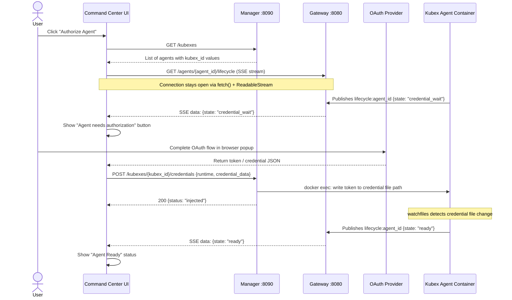

# Phase 12 OAuth Command Center — Frontend Handoff

**From:** Backend
**To:** FE team building Command Center OAuth UI
**Date:** 2026-03-24
**Version:** 1.0
**Audience:** Frontend engineers building the Command Center OAuth provisioning UI
**Supersedes:** `docs/HANDOFF-oauth-command-center.md` (Phase 9 — that document described planned endpoints, not all of which existed yet; this document is the authoritative reference post-Phase 12)

---

## What Changed in Phase 12

Phase 12 delivered two backend pieces:

1. **Gateway `GET /agents/{agent_id}/lifecycle`** (AUTH-01) — SSE endpoint FE uses to observe agent state transitions in real time
2. **Manager `POST /kubexes/{kubex_id}/credentials`** path fix (AUTH-02) — the credential injection endpoint existed in Phase 9 but the gemini-cli credential path was wrong; it is now correct

AUTH-03 (credential expiry handling) is implemented agent-side: the agent checks credentials before each task attempt and re-gates if they have expired. FE does not need to trigger this — the SSE stream will show the `credential_wait` state automatically.

---

## Endpoint Inventory

| Endpoint | Method | Service | Port | Status |
|----------|--------|---------|------|--------|
| `/agents/{agent_id}/lifecycle` | GET (SSE) | Gateway | 8080 | **New in Phase 12** |
| `/kubexes/{kubex_id}/credentials` | POST | Manager | 8090 | Existing (path fix in Phase 12) |
| `/kubexes` | GET | Manager | 8090 | Existing |
| `/kubexes/{kubex_id}` | GET | Manager | 8090 | Existing |
| `/kubexes` | POST | Manager | 8090 | Existing |
| `/kubexes/{kubex_id}/start` | POST | Manager | 8090 | Existing |
| `/kubexes/{kubex_id}/stop` | POST | Manager | 8090 | Existing |
| `/kubexes/{kubex_id}/restart` | POST | Manager | 8090 | Existing |
| `/kubexes/{kubex_id}/respawn` | POST | Manager | 8090 | Existing |

---

## Authentication

All endpoints require a Bearer token. The token is the `KUBEX_MGMT_TOKEN` environment variable.

```
Authorization: Bearer <KUBEX_MGMT_TOKEN>
```

**Dev default:** `kubex-mgmt-token`

Requests without a valid token return:

```json
HTTP 401 Unauthorized
{"error": "Unauthorized", "message": "Invalid or missing Bearer token"}
```

---

## API Contracts

### `GET /agents/{agent_id}/lifecycle` — Lifecycle SSE Stream

**New in Phase 12**

Streams agent lifecycle state transitions as Server-Sent Events.

**Request:**

```
GET /agents/{agent_id}/lifecycle
Authorization: Bearer <KUBEX_MGMT_TOKEN>
Accept: text/event-stream
```

**Response:**

```
Content-Type: text/event-stream
Cache-Control: no-cache
X-Accel-Buffering: no
```

**Event format:**

```
data: {"agent_id": "string", "state": "string", "timestamp": "string"}\n\n
```

**Possible `state` values:**

| State | Meaning |
|-------|---------|
| `booting` | Container starting up, initializing |
| `credential_wait` | Agent is waiting for OAuth credentials to be injected |
| `ready` | Agent is idle and ready to accept tasks |
| `busy` | Agent is executing a task |

**No terminal event.** The stream runs until the client disconnects. There is no `done` or `close` event — the server keeps the connection open indefinitely.

**Redis unavailable error event:**

```
data: {"error": "Redis not available"}\n\n
```

When this event is received, the stream closes immediately.

**curl example:**

```bash
curl -N \
  -H "Authorization: Bearer kubex-mgmt-token" \
  http://gateway:8080/agents/my-agent/lifecycle
```

**IMPORTANT — EventSource limitation:** The native browser `EventSource` API does NOT support custom headers. Because this endpoint requires `Authorization: Bearer`, you MUST use `fetch()` with a `ReadableStream` reader instead.

**JavaScript example using `fetch`:**

```javascript
async function subscribeToLifecycle(agentId, token, onEvent) {
  const response = await fetch(`http://gateway:8080/agents/${agentId}/lifecycle`, {
    headers: {
      'Authorization': `Bearer ${token}`,
      'Accept': 'text/event-stream',
    },
  });

  if (!response.ok) {
    throw new Error(`Lifecycle stream failed: ${response.status}`);
  }

  const reader = response.body.getReader();
  const decoder = new TextDecoder();
  let buffer = '';

  while (true) {
    const { value, done } = await reader.read();
    if (done) break;

    buffer += decoder.decode(value, { stream: true });
    const lines = buffer.split('\n');
    buffer = lines.pop(); // Incomplete last line

    for (const line of lines) {
      if (line.startsWith('data: ')) {
        const payload = JSON.parse(line.slice(6));
        onEvent(payload);
      }
    }
  }
}

// Usage:
subscribeToLifecycle('my-agent', 'kubex-mgmt-token', (event) => {
  console.log('Agent state:', event.state);
  if (event.state === 'credential_wait') {
    showReauthButton(event.agent_id);
  } else if (event.state === 'ready') {
    showReadyStatus(event.agent_id);
  }
});
```

---

### `POST /kubexes/{kubex_id}/credentials` — Inject OAuth Credentials

Writes an OAuth token into the agent container's credential volume via `docker exec`.

**Request:**

```
POST /kubexes/{kubex_id}/credentials
Authorization: Bearer <KUBEX_MGMT_TOKEN>
Content-Type: application/json
```

**Request body:**

```json
{
  "runtime": "claude-code",
  "credential_data": {
    "token": "sk-ant-...",
    "...": "...any token JSON fields..."
  }
}
```

| Field | Type | Description |
|-------|------|-------------|
| `runtime` | string | CLI runtime identifier. One of: `claude-code`, `gemini-cli`, `codex-cli` |
| `credential_data` | object | The token JSON as returned by the OAuth provider. Written verbatim to the credential file. |

**Credential file paths per runtime:**

| Runtime | Path inside container |
|---------|----------------------|
| `claude-code` | `/root/.claude/.credentials.json` |
| `gemini-cli` | `/root/.gemini/oauth_creds.json` |
| `codex-cli` | `/root/.codex/.credentials.json` |

**Response 200 — Success:**

```json
{
  "status": "injected",
  "kubex_id": "my-kubex",
  "runtime": "claude-code",
  "path": "/root/.claude/.credentials.json"
}
```

**Response 404 — Kubex not found:**

```json
{
  "error": "KubexNotFound",
  "message": "Kubex not found: my-kubex"
}
```

**Response 422 — Unknown runtime:**

```json
{
  "error": "UnknownRuntime",
  "message": "No credential path for runtime: unknown-cli"
}
```

**Response 500 — Injection failed:**

```json
{
  "error": "InjectionFailed",
  "message": "Failed to inject credentials: ..."
}
```

**curl example:**

```bash
curl -X POST \
  -H "Authorization: Bearer kubex-mgmt-token" \
  -H "Content-Type: application/json" \
  -d '{"runtime":"claude-code","credential_data":{"token":"sk-ant-..."}}' \
  http://manager:8090/kubexes/my-kubex/credentials
```

---

### `GET /kubexes` — List All Kubexes

**Request:**

```
GET /kubexes
Authorization: Bearer <KUBEX_MGMT_TOKEN>
```

**Response 200:**

```json
[
  {
    "kubex_id": "kubex-abc123",
    "agent_id": "my-agent",
    "boundary": "default",
    "container_id": "sha256:...",
    "status": "running",
    "image": "kubexclaw-base:latest"
  }
]
```

| Field | Type | Description |
|-------|------|-------------|
| `kubex_id` | string | Manager-assigned unique identifier |
| `agent_id` | string | Agent identity from config.yaml |
| `boundary` | string | Policy boundary name |
| `container_id` | string | Docker container ID |
| `status` | string | Container status from Docker: `running`, `exited`, `created`, etc. |
| `image` | string | Docker image name used |

**Note:** `status` reflects the Docker container status, not the agent's lifecycle state. For lifecycle state (`booting`, `credential_wait`, `ready`, `busy`), subscribe to the SSE lifecycle stream.

---

### `GET /kubexes/{kubex_id}` — Get Single Kubex

**Request:**

```
GET /kubexes/{kubex_id}
Authorization: Bearer <KUBEX_MGMT_TOKEN>
```

**Response 200:** Same schema as a single entry in the `GET /kubexes` array response above.

**Response 404:**

```json
{
  "error": "KubexNotFound",
  "message": "Kubex not found: {kubex_id}"
}
```

---

### `POST /kubexes` — Create a New Kubex

**Request:**

```
POST /kubexes
Authorization: Bearer <KUBEX_MGMT_TOKEN>
Content-Type: application/json
```

**Request body:**

```json
{
  "config": {
    "agent": {
      "id": "my-agent",
      "runtime": "claude-code"
    }
  },
  "resource_limits": {},
  "image": "kubexclaw-base:latest",
  "skill_mounts": []
}
```

**Response 201:** Same schema as a single Kubex record (see `GET /kubexes/{kubex_id}`).

**Response 422:**

```json
{
  "error": "InvalidConfig",
  "message": "Config missing required field: agent.id"
}
```

---

## Mermaid Sequence Diagram — Full OAuth Provisioning Flow



---

## Edge Cases

### Token Expiry Mid-Session (AUTH-03 Behavior)

**What happens:** The agent performs a pre-flight credential check before each task attempt (agent-side, per D-09). If credentials have expired or been removed, the agent:

1. Enters `CREDENTIAL_WAIT` state
2. Publishes `{state: "credential_wait"}` on the lifecycle channel
3. Blocks all further task execution until new credentials are injected

**What FE should do:** When the SSE stream receives `state: credential_wait` (at any point, not just on startup), show a re-authorization button.

**Important timing detail:** One task failure may occur before the state change becomes visible. The agent only detects expiry when attempting to execute a task — not proactively. FE should not assume the agent will immediately enter `credential_wait` when a token expires.

### Container Restart

When a container restarts, it goes through `booting` first, then:

- `booting` → `credential_wait` — if the named credential volume does not contain a valid token
- `booting` → `ready` — if the named credential volume has valid credentials from a previous session

The SSE stream does not replay history. If FE reconnects after the agent has already transitioned past `booting`, FE will not see the `booting` event. For the current state, call `GET /kubexes/{kubex_id}` to check Docker container status, and note the next lifecycle event from the stream.

### Multiple Agents

Each agent has its own lifecycle SSE stream on its own channel (`lifecycle:{agent_id}`). FE opens one `fetch()` connection per agent being monitored. There is no "all agents" lifecycle stream — iterate over `GET /kubexes` to get the agent list, then open streams individually.

### SSE Reconnection

If the SSE connection drops (network interruption, server restart), FE should reconnect. The stream will pick up from the current state on reconnect — there is no event history replay. The last published state may have been missed. For critical flows, FE should check `GET /kubexes/{kubex_id}` on reconnect to determine current Docker container status, then resume streaming for future transitions.

### Credential Injection to Non-Running Container

If `POST /kubexes/{kubex_id}/credentials` is called on a kubex whose container is not running, the Manager returns `404 ContainerNotFound` (not `404 KubexNotFound` — the record exists, but the container does not). FE should distinguish these two 404 cases by the `error` field.

---

## Error Code Reference

| HTTP Status | `error` Value | Endpoint | Recommended FE Handling |
|-------------|---------------|----------|------------------------|
| 401 | `Unauthorized` | All | Check token configuration — show auth error to user |
| 404 | `KubexNotFound` | Any `/kubexes/{id}*` | Kubex record doesn't exist — refresh agent list |
| 404 | `ContainerNotFound` | `POST /credentials` | Container not running — prompt user to start the agent first |
| 422 | `InvalidConfig` | `POST /kubexes` | Config payload is missing required fields |
| 422 | `UnknownRuntime` | `POST /credentials` | Runtime value is not one of `claude-code`, `gemini-cli`, `codex-cli` |
| 500 | `InjectionFailed` | `POST /credentials` | Docker exec failed inside container — show error, offer retry |
| 503 | `DockerUnavailable` | `POST /kubexes` | Docker daemon unreachable on the host — escalate to ops |

---

## Files for Reference (If Needed)

These are the backend files corresponding to the APIs above. FE should not need to read them — this document is self-contained. Listed here for completeness.

| File | Implements |
|------|------------|
| `services/gateway/gateway/main.py` | `GET /agents/{agent_id}/lifecycle` SSE endpoint |
| `services/kubex-manager/kubex_manager/main.py` | All `/kubexes/*` endpoints including credential injection |
| `agents/_base/kubex_harness/cli_runtime.py` | Agent-side state machine and `_publish_state()` payload format |

---

*Phase: 12-oauth-command-center-web-flow*
*Completed: 2026-03-24*
