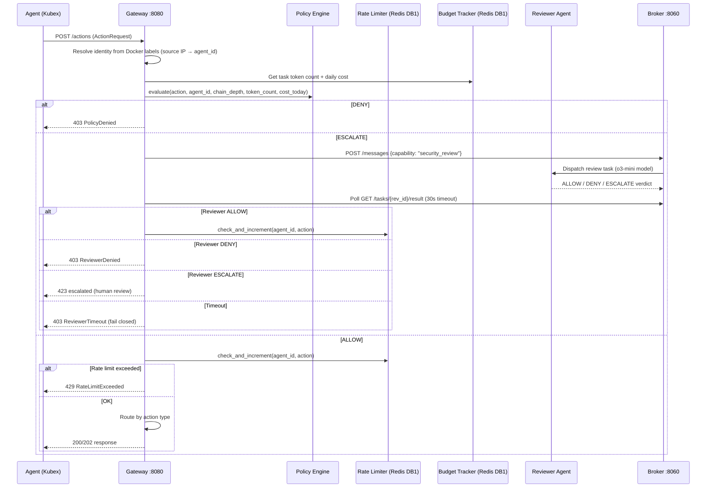
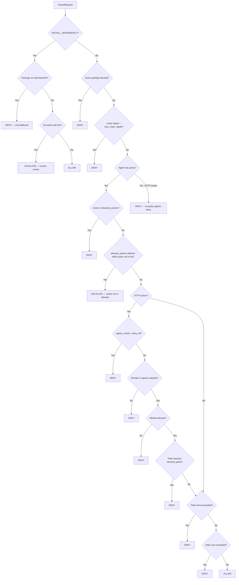
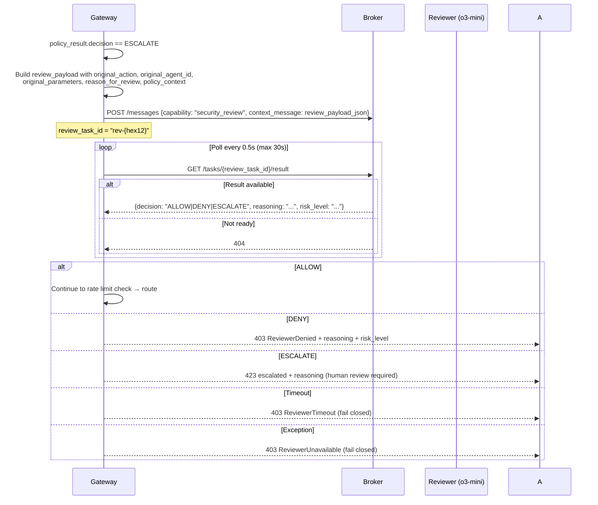

# Policy Engine & Security Model

**Analysis Date:** 2026-03-27

---

## Overview

The KubexClaw security model treats every agent as an untrusted workload. All agent actions pass through a deterministic policy engine inside the Gateway before anything reaches the outside world. The system is built on three principles: **fail closed** (ambiguous = ESCALATE, error = DENY), **least privilege** (explicit allowlists per agent), and **identity pinning** (agent ID is read from Docker labels, never trusted from request bodies).

---

## Architecture: Request Flow



---

## Gateway Service

**Location:** `services/gateway/gateway/`

**Port:** 8080

### Endpoints

| Endpoint | Auth | Purpose |
|---|---|---|
| `POST /actions` | None (identity from Docker labels) | Primary action pipeline — all agent actions |
| `GET /proxy/{provider}/{path}` | None | LLM reverse proxy (OpenAI, Anthropic, Google) |
| `GET /tasks/{task_id}/stream` | None | SSE stream of task progress events |
| `GET /agents/{agent_id}/lifecycle` | Bearer token | SSE stream of agent lifecycle transitions |
| `GET /agents/{agent_id}/state` | Bearer token | Latest lifecycle state snapshot |

### Action Routing (after policy ALLOW)

`services/gateway/gateway/main.py` routes at lines 259–297:

| Action Type | Handler |
|---|---|
| `dispatch_task` | Validates capability in Registry, creates `TaskDelivery`, POSTs to Broker |
| `http_get / http_post / http_put / http_delete` | `_handle_egress` — direct HTTP proxy |
| `query_knowledge` | Proxies to Graphiti `POST /search`, deducts 500 estimated tokens |
| `store_knowledge` | Two-step: OpenSearch index + Graphiti episode, deducts 1500 estimated tokens |
| `search_corpus` | Proxies to OpenSearch `/_search` with query DSL |
| `vault_create / vault_update` | Policy-only gate; actual write done by caller |
| All others | Acknowledged with `{"status": "accepted"}` |

---

## Policy Engine

**Location:** `services/gateway/gateway/policy.py`

### Decision Types

```python
class PolicyDecision(StrEnum):
    ALLOW = "allow"
    DENY = "deny"
    ESCALATE = "escalate"
```

### Evaluation Cascade (first-deny-wins)



### Rule Matched Identifiers

| `rule_matched` value | Trigger |
|---|---|
| `global.blocked_actions` | Action in global blocked list |
| `global.max_chain_depth` | Chain depth exceeded |
| `agent.actions.blocked` | Action in agent's blocked list |
| `agent.actions.escalate` | Action not in allowlist, not blocked |
| `agent.actions.allowed` | Action not in allowlist (when also blocked — unreachable, defensive) |
| `agent.egress.deny_all` | Egress mode is deny_all |
| `agent.egress.method` | HTTP method not allowed for domain |
| `agent.egress.blocked_path` | Path matches blocked pattern |
| `agent.egress.not_in_allowlist` | Domain not in allowlist |
| `no_policy_egress_deny` | No agent policy found, egress fail-closed |
| `budget.per_task_token_limit` | Per-task token limit exceeded |
| `global.budget.daily_cost_limit` | Global daily cost limit exceeded |
| `global.package_blocklist.deny` | Package on hard pip/cli blocklist |
| `global.runtime_install_soft_limit.escalate` | Runtime dep soft limit reached |

---

## Policy File Format

### Global Policy

**Location:** `policies/global.yaml`

```yaml
global:
  blocked_actions:
    - "activate_kubex"           # Globally blocked for all agents
  max_chain_depth: 5             # Max orchestration depth before DENY

  rate_limits:
    default:
      http_get: 60/min           # Format: N/window (min | hour | day | task)
      http_post: 30/min
      dispatch_task: 30/min
      query_knowledge: 30/min
      store_knowledge: 10/min
      search_corpus: 20/min

  budget:
    default_daily_cost_limit_usd: 10.00

  security:
    max_request_size_kb: 512
    prompt_injection_detection: true

  package_blocklist:             # PSEC-02: Hard blocklist — reviewer cannot override
    pip:
      - paramiko
      - pwntools
      - scapy
      - cryptography
    cli: []

  runtime_install_soft_limit: 10 # ESCALATE after this many installs/agent/day
```

### Per-Agent Policy

**Location:** `agents/{agent_id}/policies/policy.yaml`

```yaml
agent_policy:
  actions:
    allowed:                     # If defined, any action NOT here → ESCALATE
      - "http_get"
      - "write_output"
      - "report_result"
    blocked:                     # Hard block regardless of allowed list
      - "execute_code"
      - "send_email"
    rate_limits:
      http_get: 100/task         # Per-action rate limit overrides global
      write_output: 50/task

  egress:
    mode: "allowlist"            # "allowlist" or "deny_all"
    allowed:
      - domain: "instagram.com"
        methods: ["GET"]
        blocked_paths:
          - "*/accounts/*"       # Glob-style path pattern

  budget:
    per_task_token_limit: 10000
    daily_cost_limit_usd: 1.00

  allowed_skills:                # PSEC-03: Spawn-time skill check
    - web-scraping
    - recall
```

### Per-Agent Policy Matrix

| Agent | egress_mode | per_task_tokens | daily_cost_usd | Notable restrictions |
|---|---|---|---|---|
| `orchestrator` | `deny_all` | 50,000 | $5.00 | No HTTP; dispatch/registry/knowledge only; `request_user_input` allowed |
| `instagram-scraper` | `allowlist` | 10,000 | $1.00 | GET only to instagram.com domains; accounts/friendships paths blocked |
| `knowledge` | `deny_all` | 5,000 | $2.00 | Knowledge ops only; no dispatch, no HTTP |
| `reviewer` | `deny_all` | 20,000 | $2.00 | `report_result` only; all other actions blocked; model locked to o3-mini |

---

## Reviewer Agent (ESCALATE Flow)

**Config:** `agents/reviewer/config.yaml`
**Policy:** `agents/reviewer/policies/policy.yaml`
**Capability:** `security_review`
**Model:** `o3-mini` (OpenAI) — anti-collusion: different model family from workers

### ESCALATE Dispatch Flow



### Anti-Collusion Design

The reviewer uses `o3-mini` (OpenAI reasoning model) while the rest of the system uses GPT-5.2. This prevents a compromised or prompt-injected worker from using knowledge of the evaluator's decision logic.

The reviewer's own policy (`agents/reviewer/policies/policy.yaml`) permits only `report_result`. All HTTP actions, knowledge writes, dispatching, and code execution are explicitly blocked — ensuring the reviewer cannot itself take side-effecting actions.

### Fail-Closed Guarantee

Three separate failure paths all return 403 to the requesting agent:

1. `TimeoutError` (reviewer did not respond within 30s) → `ReviewerTimeout`
2. Any exception during broker publish or result poll → `ReviewerUnavailable`
3. Reviewer returns `DENY` → `ReviewerDenied`

Only an explicit `ALLOW` from the reviewer permits the action to proceed.

---

## LLM Reverse Proxy

**Location:** `services/gateway/gateway/llm_proxy.py`

Agents never hold LLM API keys. All LLM calls go through the Gateway's reverse proxy.

### Supported Providers

| Provider | Base URL | Auth Header |
|---|---|---|
| `openai` | `https://api.openai.com/v1` | `Authorization: Bearer {key}` |
| `anthropic` | `https://api.anthropic.com` | `x-api-key: {key}` |
| `google` | `https://generativelanguage.googleapis.com` | `x-goog-api-key: {key}` |

**Proxy endpoints:** `GET/POST /proxy/{provider}/{path}`

### Key Security Properties

- API keys are loaded from `/run/secrets/llm_api_keys.json` (Docker secret mount) with env var fallback for dev
- All hop-by-hop headers stripped from forwarded requests
- Any existing `Authorization`, `x-api-key`, or `x-goog-api-key` headers from the agent are stripped before forwarding — agents cannot inject their own keys
- Token counts are extracted from provider responses and fed into the BudgetTracker
- Model allowlist hook exists (`check_model_allowed`) but is currently ALLOW-all; enforcement is a post-MVP feature

---

## Budget Enforcement

**Location:** `services/gateway/gateway/budget.py`

**Redis DB:** DB1 (shared with rate limiter)

### Redis Key Structure

| Key | TTL | Purpose |
|---|---|---|
| `budget:task:{task_id}:tokens` | 7 days | Cumulative token count per task |
| `budget:agent:{agent_id}:daily:{YYYY-MM-DD}` | 2 days | Daily cost accumulator per agent |
| `budget:daily:{agent_id}` | — | Legacy fallback key (backward compat) |

### Enforcement Points

1. **Pre-action check:** `BudgetTracker.get_task_tokens()` and `get_daily_cost()` called before policy evaluation. Current values passed into `PolicyEngine.evaluate()`.
2. **Policy engine:** Enforces `per_task_token_limit` (from agent policy) and `default_daily_cost_limit_usd` (from global policy).
3. **Post-LLM proxy:** Token counts extracted from provider response body and incremented via `BudgetTracker.increment_tokens()`.
4. **Knowledge operations:** Estimated token costs deducted inline (500 for `query_knowledge`, 1500 for `store_knowledge`).

---

## Rate Limiting

**Location:** `services/gateway/gateway/ratelimit.py`

**Redis DB:** DB1

### Rate Limit Format

`N/window` where `window` is one of: `min`, `hour`, `day`, `task`

- `min` / `hour` / `day`: Sliding window using Redis sorted sets (timestamps as scores)
- `task`: Simple counter per `task_id + agent_id + action` (increments on each call)

### Failure Behavior

Rate limiter errors **fail open** (does not block requests if Redis is unavailable). This is intentional to avoid policy infrastructure outages blocking all agent activity.

### Rate Limit Sources

1. Agent policy's `actions.rate_limits` (per-action override)
2. Global policy's `rate_limits.default` (fallback)

---

## Identity Resolution

**Location:** `services/gateway/gateway/identity.py`

Agents cannot self-report their identity. The Gateway reads Docker container labels to determine the true `agent_id` for any incoming request.

### Resolution Process

1. Extract source IP from the HTTP request (`request.client.host`)
2. Query Docker daemon for all running containers
3. Match IP against container `NetworkSettings.Networks[*].IPAddress`
4. Read Docker labels:
   - `kubex.agent_id` → agent identifier
   - `kubex.boundary` → boundary name (default: `"default"`)
5. Cache the result for 30 seconds
6. Overwrite the `agent_id` field in the `ActionRequest` with the resolved value

### Spoofing Prevention

Any `agent_id` in the request body is **overwritten** by the resolved Docker label value. An agent cannot claim to be another agent.

### Strict Mode

When `KUBEX_STRICT_IDENTITY=true`, identity resolution failure returns `401 IdentityResolutionFailed`. In dev/test mode, resolution failure falls back to the request-supplied `agent_id` with a warning.

---

## Agent Registration (Registry)

**Location:** `services/registry/registry/`

**Port:** 8070
**Redis DB:** DB2

### Registration Schema (`AgentRegistration`)

```python
agent_id: str               # Unique identifier
capabilities: list[str]     # e.g. ["security_review", "web_scraping"]
status: AgentStatus         # running | stopped | busy | booting | ready | idle | credential_wait
boundary: str               # default | ...
accepts_from: list[str]     # Agent IDs this agent accepts tasks from
metadata: dict              # Arbitrary metadata
```

### Registration Flow

Agents register by posting to `POST /agents`. Kubex Manager calls this on `start_kubex`. Deregistration happens on stop/kill/remove.

### Capability Resolution

`GET /capabilities/{capability}` returns all agents with that capability in `running` or `busy` status. Used by the Gateway when processing `dispatch_task` to validate the target capability exists before publishing to the Broker.

### Persistence

In-memory dict is authoritative at runtime. Persisted to Redis as `HSET registry:agents {agent_id} {json}` and `SADD registry:capability:{cap} {agent_id}`. Restored on Registry startup.

---

## Kubex Manager Authentication

**Location:** `services/kubex-manager/kubex_manager/main.py`

All `/kubexes` endpoints require a Bearer token:

```
Authorization: Bearer {KUBEX_MGMT_TOKEN}
```

The token is read from the `KUBEX_MGMT_TOKEN` environment variable (default: `"kubex-mgmt-token"` for local dev). The same token is also checked by the Gateway for management endpoints (`/agents/{id}/lifecycle`, `/agents/{id}/state`).

**Important:** Both services read `KUBEX_MGMT_TOKEN` independently. They must be set to the same value in production. Currently no token rotation mechanism exists.

---

## Prompt Injection Defenses

### Skill Validator (spawn-time)

**Location:** `services/kubex-manager/kubex_manager/skill_validator.py`

Two-layer validation before any skill markdown is injected into an agent's system prompt:

1. **Regex layer:** Case-insensitive substring scan against `kubex_manager/blocklist.yaml`:
   - `ignore previous instructions`
   - `disregard system prompt`
   - `disregard all prior`
   - `you are now`
   - `jailbreak`
   - `exfiltrate data`
2. **LM layer (optional):** If an LM client is injected, clean content is also analyzed by an LM for subtle injection patterns not caught by regex.

Skills that fail validation receive no `ValidationStamp`. Stamps include a `SHA-256` hash of the content and a timestamp.

### Skill Allowlist (PSEC-03)

Agent policies can declare `allowed_skills`. At spawn time, the manager validates that skills being mounted match the agent's allowlist. An agent that is policy-constrained to `["web-scraping", "recall"]` cannot be spawned with a `file-system-access` skill.

### Runtime Dependency Blocklist (PSEC-02)

Packages in `policies/global.yaml#package_blocklist` are **unconditionally denied** — not even the reviewer agent can override a blocklisted package denial. Current hard blocklist for pip: `paramiko`, `pwntools`, `scapy`, `cryptography`. CLI blocklist is currently empty.

### Identity Pinning

Docker label-based identity (see [Identity Resolution](#identity-resolution)) prevents cross-agent impersonation even in a multi-tenant container network.

---

## Agent Isolation Model

### Network

- All containers run on `openclaw_kubex-internal` (Docker bridge network)
- Agents cannot reach the internet directly — all external HTTP must go through `POST /actions {action: "http_get", target: "..."}` which is subject to egress policy
- The Gateway itself (running inside the same network) proxies approved egress requests

### Filesystem

- No shared volumes between agents by default
- Skill files are mounted read-only at spawn time
- OAuth credential volumes are agent-specific (e.g., `/root/.claude` for claude-code agents)

### Resource Limits

Default resource limits applied to every container by Kubex Manager (`services/kubex-manager/kubex_manager/lifecycle.py`):

- Memory: `1g`
- CPU: `0.5` vCPUs (`500_000_000` nano-CPUs)

### Chain Depth

The `context.chain_depth` field on every `ActionRequest` is enforced at the global level. Depth > 5 is hard-denied. This prevents runaway orchestration chains.

---

## Redis Database Allocation

| DB | Owner | Purpose |
|---|---|---|
| DB0 | Broker + Gateway | Task results (`task:result:{id}`), agent state (`agent:state:{id}`), lifecycle events |
| DB1 | Gateway | Budget tracking, rate limiting |
| DB2 | Registry | Agent registrations, capability sets |
| DB3 | Kubex Manager | Lifecycle events stream (`kubex:lifecycle`) |
| DB4 | (legacy/budget) | Originally planned for budget, superseded by DB1 |

---

## Security Gaps and Known Limitations

1. **Model allowlist not enforced:** `LLMProxy.check_model_allowed()` always returns `True`. The reviewer's `o3-mini` lock is enforced by config/policy convention, not by the proxy. A bug in config could allow a reviewer agent to use a different model.

2. **No token on `POST /actions`:** The action endpoint itself has no authentication — all callers on the container network can submit actions. Identity comes from Docker labels, but the Gateway is accessible to anything on `kubex-internal`.

3. **`KUBEX_MGMT_TOKEN` default is insecure:** The default value `"kubex-mgmt-token"` is public. Production deployments must set this env var explicitly.

4. **Rate limiter fails open:** If Redis DB1 is unavailable, rate limiting is bypassed. A Redis outage could allow burst traffic.

5. **Reviewer poll is blocking:** `_handle_reviewer_evaluation` blocks the Gateway request handler for up to 30 seconds while polling. High ESCALATE volume will exhaust the async worker pool.

6. **No audit log:** Policy decisions, ESCALATE events, and reviewer verdicts are logged via structured logging only. There is no write-ahead log or append-only audit trail for compliance purposes.
