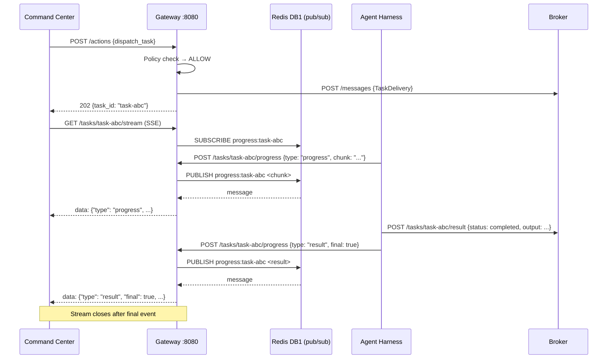
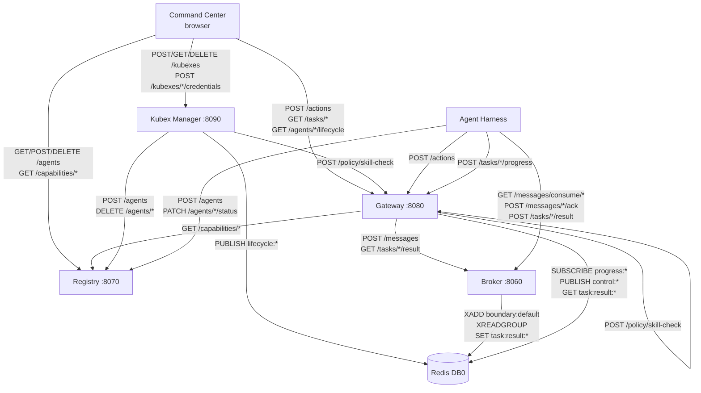

# Services API Reference

**Last updated:** 2026-03-27
**Source of truth:** live source code — every route below was read directly from the service files.

---

## Table of Contents

1. [Service Ports & Default URLs](#service-ports--default-urls)
2. [Common Conventions](#common-conventions)
3. [Gateway — `services/gateway/gateway/main.py`](#gateway)
4. [Broker — `services/broker/broker/main.py`](#broker)
5. [Registry — `services/registry/registry/main.py`](#registry)
6. [Kubex Manager — `services/kubex-manager/kubex_manager/main.py`](#kubex-manager)
7. [Redis Key & Channel Patterns](#redis-key--channel-patterns)
8. [Core Data Models](#core-data-models)
9. [SSE / Progress Flow](#sse--progress-flow)
10. [Inter-Service Call Map](#inter-service-call-map)

---

## Service Ports & Default URLs

| Service       | Internal URL              | Host Port | Redis DB |
|---------------|---------------------------|-----------|----------|
| Gateway       | `http://gateway:8080`     | 8080      | DB 1 (rate limits + pub/sub), DB 0 (result reads) |
| Broker        | `http://broker:8060`      | —         | DB 0 (streams + results) |
| Registry      | `http://registry:8070`    | 8070      | DB 2 (agent cache) |
| Kubex Manager | `http://kubex-manager:8090` | 8090    | DB 3 (lifecycle events) |

All services expose `GET /health` via the shared `KubexService` base (see `libs/kubex-common/kubex_common/service/health.py`).

---

## Common Conventions

### Auth
- **Kubex Manager** and **Gateway management endpoints** require `Authorization: Bearer <KUBEX_MGMT_TOKEN>`.
- Default token: `kubex-mgmt-token` (override via `KUBEX_MGMT_TOKEN` env var).
- Agent-facing Gateway endpoints (e.g. `POST /actions`) do **not** require a Bearer token — identity is resolved from the caller's Docker container IP.

### Error Shape
All errors follow `ErrorResponse` from `libs/kubex-common/kubex_common/errors.py`:

```json
{
  "error": "ErrorCode",
  "message": "Human-readable reason",
  "details": { ... }
}
```

### Health Response Shape

```json
{
  "service": "kubex-gateway",
  "version": "0.1.0",
  "status": "healthy",
  "uptime_seconds": 42.5,
  "redis": { "connected": true }
}
```

---

## Gateway

**File:** `services/gateway/gateway/main.py`
**Base URL:** `http://gateway:8080`

The Gateway is the single inbound/outbound chokepoint for all agent traffic. It enforces:
1. Identity resolution (Docker container IP → `agent_id`)
2. Policy cascade (global → boundary → agent): ALLOW / DENY / ESCALATE
3. Rate limiting (Redis sliding window, DB 1)
4. Budget tracking (token count + daily cost, DB 1)
5. LLM reverse proxy (injects API keys, strips auth headers)

### Action Endpoint

| Method | Path | Auth | Description |
|--------|------|------|-------------|
| `POST` | `/actions` | None (identity from IP) | Core policy gate — every agent action passes through here |

**Request body:** `ActionRequest`

```json
{
  "request_id": "ar-20260327-a1b2c3d4",
  "agent_id": "orchestrator-01",
  "action": "dispatch_task",
  "target": null,
  "parameters": {
    "capability": "instagram_scraper",
    "context_message": "Scrape top 10 posts from @example"
  },
  "context": {
    "workflow_id": "wf-001",
    "task_id": null,
    "originating_request_id": null,
    "chain_depth": 1
  },
  "priority": "normal"
}
```

**Response variants:**

| Condition | Status | Body |
|-----------|--------|------|
| Action allowed + routed | 200/202 | Action-specific (see routing table below) |
| Policy DENY | 403 | `ErrorResponse` with `error: "PolicyDenied"` |
| Policy ESCALATE → reviewer DENY | 403 | `error: "ReviewerDenied"` |
| Policy ESCALATE → reviewer ESCALATE | 423 | `{"status": "escalated", ...}` |
| Reviewer timeout | 403 | `error: "ReviewerTimeout"` |
| Rate limit exceeded | 429 | `error: "RateLimitExceeded"` |

**Action routing table (inside `POST /actions`):**

| `action` value | Handler | Response |
|----------------|---------|----------|
| `dispatch_task` | Validates capability against Registry, writes `TaskDelivery` to Broker | `{"task_id": "task-xxx", "status": "dispatched", "capability": "..."}` |
| `http_get` / `http_post` / `http_put` / `http_delete` | Egress proxy — forwards to `target` URL | `{"status_code": N, "headers": {}, "body": "..."}` |
| `query_knowledge` | Proxies to Graphiti `POST /search` (or `GET /episodes`) | `{"results": [...], "total": N}` |
| `store_knowledge` | Two-step: OpenSearch index + Graphiti episode write | `{"nodes_created": N, "edges_created": N, "opensearch_id": "...", "status": "stored"}` |
| `search_corpus` | Full-text search via OpenSearch `GET /_search` | `{"documents": [...], "results": [...], "total": N}` |
| `vault_create` / `vault_update` | Policy approval only (filesystem write by caller) | `{"status": "approved", "action": "...", "agent_id": "..."}` |
| All others (report_result, progress_update, etc.) | Pass-through acknowledge | `{"status": "accepted", "agent_id": "...", "action": "..."}` |

### Task Endpoints

| Method | Path | Auth | Description |
|--------|------|------|-------------|
| `GET` | `/tasks/{task_id}/result` | None | Read completed task result from Redis `task:result:{task_id}` (DB 0) |
| `GET` | `/tasks/{task_id}/stream` | None | SSE stream of task progress; subscribes to Redis pub/sub `progress:{task_id}` |
| `POST` | `/tasks/{task_id}/progress` | None | Receive a progress chunk from agent harness; publishes to Redis pub/sub `progress:{task_id}` |
| `POST` | `/tasks/{task_id}/cancel` | None | Cancel a task — verifies caller is originator, publishes to `control:{agent_id}` |
| `GET` | `/tasks/{task_id}/audit` | None | Return audit trail from Redis sorted set `audit:{task_id}` |
| `POST` | `/tasks/{task_id}/input` | None | HITL: provide user input for a paused task (consumed by agent harness) |

**`GET /tasks/{task_id}/result` response:**

```json
{
  "status": "completed",
  "output": "...",
  "agent_id": "orchestrator-01",
  "task_id": "task-abc123"
}
```

**`GET /tasks/{task_id}/stream` SSE events:**

| Event `type` | Meaning | `final` |
|--------------|---------|---------|
| `progress` | Intermediate output chunk | `false` |
| `result` | Final result payload | `true` |
| `cancelled` | Task was cancelled | `true` |
| `failed` | Task failed | `true` |

If a result already exists in Redis when the client connects, it is emitted immediately and the stream closes (BUG-007 fix).

### Agent Management Endpoints

| Method | Path | Auth | Description |
|--------|------|------|-------------|
| `GET` | `/agents/{agent_id}/lifecycle` | Bearer token | SSE stream of lifecycle state transitions; subscribes to `lifecycle:{agent_id}` on Redis DB 0 |
| `GET` | `/agents/{agent_id}/state` | Bearer token | Point-in-time agent state snapshot from `agent:state:{agent_id}` on Redis DB 0 |

**`GET /agents/{agent_id}/state` response:**

```json
{
  "agent_id": "orchestrator-01",
  "state": "idle",
  "timestamp": "2026-03-27T12:00:00Z"
}
```

### Policy & Auth Endpoints

| Method | Path | Auth | Description |
|--------|------|------|-------------|
| `POST` | `/policy/skill-check` | None | Validate agent skill list against policy allowlist; used by Kubex Manager at spawn |
| `GET` | `/auth/runtimes` | Bearer token | List auth info for all supported CLI runtimes (claude-code, gemini-cli, codex-cli) |
| `GET` | `/auth/runtimes/{runtime}` | Bearer token | Auth info for a specific CLI runtime |

**`POST /policy/skill-check` request:**

```json
{
  "agent_id": "orchestrator-01",
  "skills": ["internet-search", "code-execution"]
}
```

**`POST /policy/skill-check` response:**

```json
{
  "decision": "allow",
  "reason": "All skills on allowlist",
  "rule_matched": "agent.skills.allow",
  "agent_id": "orchestrator-01"
}
```

Decision is `"allow"` or `"escalate"`. Never `"deny"`.

### LLM Reverse Proxy

| Method | Path | Auth | Description |
|--------|------|------|-------------|
| `GET/POST/PUT/DELETE/PATCH` | `/v1/proxy/{provider}/{path}` | None (agent IP-based) | Transparent reverse proxy to LLM providers; injects real API keys, tracks token usage |

**Supported providers:** `anthropic`, `openai`, `google`

**Provider URL mapping:**

| `{provider}` | Upstream base URL |
|---|---|
| `anthropic` | `https://api.anthropic.com` |
| `openai` | `https://api.openai.com/v1` |
| `google` | `https://generativelanguage.googleapis.com` |

Agents set `OPENAI_BASE_URL=http://gateway:8080/v1/proxy/openai` and send requests normally. The Gateway strips any `Authorization`/`x-api-key` headers and injects the real provider key from the secret mount at `LLM_API_KEYS_PATH` (default: `/run/secrets/llm_api_keys.json`).

**Required request headers from agent:**
- `X-Kubex-Agent-Id: <agent_id>` — for budget tracking
- `X-Kubex-Task-Id: <task_id>` — for per-task token counting

### Health

| Method | Path | Auth | Description |
|--------|------|------|-------------|
| `GET` | `/health` | None | Service health + Redis connectivity |

### Escalations (frontend-facing, not yet implemented in backend)

The `command-center/src/api.ts` calls these endpoints, which are expected but not yet present in `main.py`:
- `GET /escalations` — list pending escalations
- `POST /escalations/{id}/resolve` — approve or reject
- `GET /agents` — list agents (proxied from registry)
- `POST /tasks/{task_id}/input` — HITL user input

These are referenced in the frontend but have no matching route handlers in the current gateway source. They will 404.

---

## Broker

**File:** `services/broker/broker/main.py`
**Base URL:** `http://broker:8060`
**Redis DB:** 0

The Broker is an internal-only service (no host port). It manages Redis Streams for task delivery between agents, and stores/retrieves task results.

### Endpoints

| Method | Path | Auth | Description |
|--------|------|------|-------------|
| `GET` | `/health` | None | Service health |
| `POST` | `/messages` | None | Publish a `TaskDelivery` to stream `boundary:default` |
| `GET` | `/messages/consume/{agent_id}` | None | Consume messages for an agent's consumer group |
| `POST` | `/messages/{message_id}/ack` | None | Acknowledge a message (XACK) |
| `POST` | `/tasks/{task_id}/result` | None | Store a completed task result in Redis with 24h TTL |
| `GET` | `/tasks/{task_id}/result` | None | Retrieve a stored task result |

### `POST /messages`

**Request:**
```json
{
  "delivery": {
    "task_id": "task-abc123",
    "workflow_id": "wf-001",
    "capability": "instagram_scraper",
    "context_message": "Scrape top 10 posts from @example",
    "from_agent": "orchestrator-01",
    "priority": "normal"
  }
}
```

**Response (202):**
```json
{
  "message_id": "1711537200000-0",
  "task_id": "task-abc123"
}
```

Consumer groups are named by **capability** (not `agent_id`). All messages land in the single stream `boundary:default`. A consumer group for the target capability is created automatically via `XGROUP CREATE ... MKSTREAM` if it does not exist.

### `GET /messages/consume/{agent_id}`

Query parameters:
- `count` (default 10) — max messages to return
- `block_ms` (default 0) — milliseconds to block waiting (0 = non-blocking)

**Response:** Array of message dicts, each including `message_id` plus all stream fields:
```json
[
  {
    "message_id": "1711537200000-0",
    "task_id": "task-abc123",
    "capability": "instagram_scraper",
    "context_message": "...",
    "from_agent": "orchestrator-01",
    "priority": "normal",
    "published_at": "2026-03-27T12:00:00Z"
  }
]
```

Messages whose `capability` field does not match `agent_id` (the consumer group) are auto-acked and filtered out.

### `POST /messages/{message_id}/ack`

**Request:**
```json
{
  "message_id": "1711537200000-0",
  "group": "instagram_scraper"
}
```

**Response:** 204 No Content

### `POST /tasks/{task_id}/result`

**Request:**
```json
{
  "result": {
    "status": "completed",
    "output": "Scraped 10 posts",
    "agent_id": "instagram-scraper-01"
  }
}
```

**Response:** 204 No Content. Stores under key `task:result:{task_id}` with 24-hour TTL.

### `GET /tasks/{task_id}/result`

**Response (200):** The stored result JSON.
**Response (404):** `{"detail": "Result not found for task: {task_id}"}`

### Pending Reaper

A background task runs every 60 seconds. For each consumer group on `boundary:default` it calls `handle_pending()`:
- Messages idle > 60 seconds and delivered < 3 times: re-claimed (XCLAIM) for retry.
- Messages delivered ≥ 3 times: moved to `boundary:dlq` dead-letter stream and acknowledged.

---

## Registry

**File:** `services/registry/registry/main.py`
**Base URL:** `http://registry:8070`
**Redis DB:** 2

The Registry is an in-memory capability store, persisted to Redis DB 2. Agents register on boot and deregister on shutdown.

### Endpoints

| Method | Path | Auth | Description |
|--------|------|------|-------------|
| `GET` | `/health` | None | Service health |
| `POST` | `/agents` | None | Register or update an agent |
| `GET` | `/agents` | None | List all registered agents |
| `GET` | `/agents/{agent_id}` | None | Get a specific agent record |
| `DELETE` | `/agents/{agent_id}` | None | Deregister an agent |
| `PATCH` | `/agents/{agent_id}/status` | None | Update agent status |
| `GET` | `/capabilities/{capability}` | None | Resolve a capability to agents that support it |

### `POST /agents` — Register Agent

**Request body:** `AgentRegistration`
```json
{
  "agent_id": "instagram-scraper-01",
  "capabilities": ["instagram_scraper"],
  "status": "running",
  "boundary": "default",
  "accepts_from": ["orchestrator-01"],
  "metadata": {}
}
```

**Response (201):** Same `AgentRegistration` shape with `registered_at` and `updated_at` timestamps added.

### `AgentRegistration` model

| Field | Type | Notes |
|-------|------|-------|
| `agent_id` | string | Unique identifier |
| `capabilities` | `string[]` | Task types this agent can handle |
| `status` | enum | `running`, `stopped`, `busy`, `unknown`, `booting`, `credential_wait`, `ready`, `idle` |
| `boundary` | string | Defaults to `"default"` |
| `accepts_from` | `string[]` | Agent IDs allowed to dispatch tasks to this agent |
| `metadata` | object | Arbitrary extra data |
| `registered_at` | ISO datetime | Set on first registration |
| `updated_at` | ISO datetime | Updated on every mutation |

### `GET /capabilities/{capability}`

Returns only agents with status `running` or `busy`. Returns 404 with `CapabilityNotFoundError` if none match.

**Response (200):**
```json
[
  {
    "agent_id": "instagram-scraper-01",
    "capabilities": ["instagram_scraper"],
    "status": "running",
    ...
  }
]
```

### `PATCH /agents/{agent_id}/status`

**Request:**
```json
{ "status": "busy" }
```

**Response (200):** Updated `AgentRegistration`.

### Redis Persistence (DB 2)

| Key pattern | Type | Contents |
|-------------|------|----------|
| `registry:agents` | Hash | `{agent_id: AgentRegistration JSON}` for all agents |
| `registry:capability:{capability}` | Set | `{agent_id, ...}` of agents supporting the capability |

On startup, Registry restores its in-memory state from `registry:agents` hash via `HGETALL`.

After every register/deregister, publishes `agent_id` to Redis pub/sub channel `registry:agent_changed` (used by Command Center for live updates).

---

## Kubex Manager

**File:** `services/kubex-manager/kubex_manager/main.py`
**Base URL:** `http://kubex-manager:8090`
**Redis DB:** 3
**Auth:** All `/kubexes` and `/configs` endpoints require `Authorization: Bearer <KUBEX_MGMT_TOKEN>`

The Manager wraps the Docker SDK to manage agent container lifecycle. State is persisted in Redis DB 3 so it survives restarts.

### Kubex Lifecycle Endpoints

| Method | Path | Auth | Description |
|--------|------|------|-------------|
| `GET` | `/health` | None | Service health |
| `POST` | `/kubexes` | Bearer | Create and start a new Kubex container |
| `GET` | `/kubexes` | Bearer | List all managed Kubex containers |
| `GET` | `/kubexes/{kubex_id}` | Bearer | Get status of a specific Kubex |
| `POST` | `/kubexes/{kubex_id}/start` | Bearer | Start a created container; registers with Registry |
| `POST` | `/kubexes/{kubex_id}/stop` | Bearer | Gracefully stop; deregisters from Registry |
| `POST` | `/kubexes/{kubex_id}/kill` | Bearer | Force-kill; deregisters from Registry |
| `POST` | `/kubexes/{kubex_id}/restart` | Bearer | Restart container |
| `POST` | `/kubexes/{kubex_id}/respawn` | Bearer | Kill + re-create from persisted config |
| `POST` | `/kubexes/{kubex_id}/install-dep` | Bearer | Install a runtime dependency inside the container |
| `GET` | `/kubexes/{kubex_id}/config` | Bearer | Return the full merged config.yaml for a Kubex |
| `POST` | `/kubexes/{kubex_id}/credentials` | Bearer | Inject OAuth credentials into a running container |
| `DELETE` | `/kubexes/{kubex_id}` | Bearer | Remove Kubex: stop + deregister + drop record |
| `GET` | `/configs` | Bearer | List saved config.yaml files with metadata |

### `POST /kubexes` — Create Kubex

**Request:**
```json
{
  "config": {
    "agent": {
      "id": "instagram-scraper-01",
      "capabilities": ["instagram_scraper"],
      "skills": ["instagram-scraper"]
    }
  },
  "resource_limits": {
    "mem_limit": "1g",
    "cpu_period": 100000,
    "cpu_quota": 50000
  },
  "image": "kubexclaw-base:latest",
  "skill_mounts": ["instagram-scraper"]
}
```

**Response (201):** `KubexRecord`
```json
{
  "kubex_id": "kbx-abc123",
  "agent_id": "instagram-scraper-01",
  "boundary": "default",
  "container_id": "sha256:...",
  "status": "created",
  "image": "kubexclaw-base:latest"
}
```

**Validation:**
- `config.agent.id` is required (422 otherwise).
- Before creation, Kubex Manager calls `POST /policy/skill-check` on the Gateway to validate requested skills.
- Config is written as `config.yaml` into a temp directory and bind-mounted into the container.

### `POST /kubexes/{kubex_id}/credentials`

Injects OAuth credentials into a running container via `docker exec`.

**Request:**
```json
{
  "runtime": "claude-code",
  "credential_data": {
    "accessToken": "sk-ant-...",
    "refreshToken": "...",
    "expiresAt": "2026-04-26T00:00:00Z"
  }
}
```

**Credential paths per runtime:**

| `runtime` | Path inside container |
|-----------|----------------------|
| `claude-code` | `/root/.claude/.credentials.json` |
| `codex-cli` | `/root/.codex/.credentials.json` |
| `gemini-cli` | `/root/.gemini/oauth_creds.json` |

**Response (200):**
```json
{
  "status": "injected",
  "kubex_id": "kbx-abc123",
  "runtime": "claude-code",
  "path": "/root/.claude/.credentials.json"
}
```

### `POST /kubexes/{kubex_id}/install-dep`

**Request:**
```json
{
  "package": "requests",
  "type": "pip"
}
```

`type` is `"pip"` or `"cli"` (runs `apt-get install` for `cli`).

**Response (200):**
```json
{
  "kubex_id": "kbx-abc123",
  "package": "requests",
  "type": "pip",
  "status": "installed",
  "runtime_deps": ["requests (type=pip)"]
}
```

### `GET /configs`

**Response (200):**
```json
{
  "configs": [
    {
      "agent_id": "orchestrator",
      "file": "orchestrator.yaml",
      "skills": ["orchestrator"],
      "capabilities": ["general_task"]
    }
  ]
}
```

---

## Redis Key & Channel Patterns

All Redis DBs are on the same Redis instance (default: `redis://redis:6379`).

### DB 0 — Broker Streams (owned by Broker, read by Gateway)

| Key | Type | TTL | Owner | Contents |
|-----|------|-----|-------|----------|
| `boundary:default` | Stream | None (capped at 10k entries) | Broker | All task delivery messages |
| `boundary:dlq` | Stream | None | Broker | Dead-letter queue (>3 failed deliveries) |
| `audit:messages` | Stream | None (capped at 10k) | Broker | Audit log of published messages |
| `task:result:{task_id}` | String | 24 hours | Broker (write), Gateway (read) | JSON-encoded task result |
| `agent:state:{agent_id}` | String | TTL set by harness | Agent harness | Latest agent state snapshot |
| `audit:{task_id}` | Sorted set | None | Agent harness | Ordered audit trail entries for a task |

### DB 1 — Gateway (Rate limits + Pub/Sub)

| Key | Type | TTL | Contents |
|-----|------|-----|----------|
| `rl:{agent_id}:{action}:{window}` | String (counter) | Window-length | Rate limit counter |
| `task:originator:{task_id}` | String | 24 hours | `agent_id` of the task originator (for cancel auth) |
| `budget:task:{task_id}:tokens` | String (int) | 7 days | Running token count for a task |
| `budget:agent:{agent_id}:daily:{YYYY-MM-DD}` | String (float) | 2 days | Running daily cost in USD |
| `budget:daily:{agent_id}` | String (float) | None | Legacy daily cost key (compat) |

**Pub/Sub Channels (DB 1):**

| Channel | Publisher | Subscriber | Event |
|---------|-----------|------------|-------|
| `progress:{task_id}` | Agent harness → `POST /tasks/{id}/progress` | Gateway `GET /tasks/{id}/stream` SSE | Progress chunk or final result |
| `control:{agent_id}` | Gateway `POST /tasks/{id}/cancel` | Agent harness | `{"command": "cancel", "task_id": "..."}` |

### DB 2 — Registry Cache

| Key | Type | Contents |
|-----|------|----------|
| `registry:agents` | Hash | `{agent_id: AgentRegistration JSON}` |
| `registry:capability:{capability}` | Set | Set of `agent_id` strings |

**Pub/Sub Channel (DB 2):**

| Channel | Publisher | Contents |
|---------|-----------|----------|
| `registry:agent_changed` | Registry on register/deregister/status update | `agent_id` string |

### DB 0 — Lifecycle Events (Pub/Sub, published by Kubex Manager)

| Channel | Publisher | Subscriber | Event |
|---------|-----------|------------|-------|
| `lifecycle:{agent_id}` | Kubex Manager on container events | Gateway `GET /agents/{id}/lifecycle` SSE | `{"agent_id": "...", "state": "...", "timestamp": "..."}` |

---

## Core Data Models

### `ActionRequest` (`libs/kubex-common/kubex_common/schemas/actions.py`)

```python
class ActionRequest(BaseModel):
    request_id: str          # "ar-20260327-a1b2c3d4"
    agent_id: str            # overwritten by Gateway from Docker labels
    action: ActionType       # see ActionType enum below
    target: str | None       # URL, path, or agent ID
    parameters: dict         # action-specific payload
    context: RequestContext
    priority: Priority       # "low" | "normal" | "high"
    timestamp: datetime
```

### `ActionType` enum

| Category | Values |
|----------|--------|
| HTTP egress | `http_get`, `http_post`, `http_put`, `http_delete` |
| Communication | `send_email` |
| File I/O | `read_input`, `write_output`, `read_file`, `write_file` |
| Data processing | `execute_code`, `parse_json`, `parse_html`, `search_web` |
| Inter-agent | `dispatch_task`, `check_task_status`, `cancel_task`, `report_result`, `progress_update`, `query_registry`, `activate_kubex` |
| Knowledge | `query_knowledge`, `store_knowledge`, `search_corpus` |
| Vault | `vault_create`, `vault_update` |
| User interaction | `request_user_input`, `needs_clarification` |
| Task progress | `subscribe_task_progress`, `get_task_progress` |
| Runtime deps | `install_dependency` |

### `TaskDelivery` (`libs/kubex-common/kubex_common/schemas/routing.py`)

```python
class TaskDelivery(BaseModel):
    task_id: str
    workflow_id: str | None
    capability: str
    context_message: str
    from_agent: str
    priority: Priority
```

### `AgentRegistration` (`services/registry/registry/store.py`)

```python
class AgentRegistration(BaseModel):
    agent_id: str
    capabilities: list[str]
    status: AgentStatus  # running | stopped | busy | unknown | booting | credential_wait | ready | idle
    boundary: str        # default: "default"
    accepts_from: list[str]
    metadata: dict
    registered_at: datetime
    updated_at: datetime
```

### `PolicyResult` (Gateway internal)

```json
{
  "decision": "allow | deny | escalate",
  "reason": "Human-readable explanation",
  "rule_matched": "global.blocked_actions | agent.actions.allowed | ...",
  "agent_id": "orchestrator-01"
}
```

---

## SSE / Progress Flow



**Late-join case (BUG-007):** If a client connects to `/tasks/{id}/stream` after the task is already done, the Gateway checks Redis `task:result:{task_id}` first, emits the cached result, and closes without subscribing to pub/sub.

---

## Inter-Service Call Map



---

## Notes on Missing / Stub Endpoints

The `command-center/src/api.ts` calls these endpoints that do not currently exist in the Gateway source:

| Called from frontend | Status |
|---------------------|--------|
| `GET /escalations` | Not implemented — will 404 |
| `POST /escalations/{id}/resolve` | Not implemented — will 404 |
| `GET /agents` (via `getGatewayAgents`) | Not implemented in Gateway — only exists in Registry at `GET /agents` |
| `POST /tasks/{id}/input` (HITL) | Not implemented — will 404 |
| `POST /kubexes/kill-all` | Not implemented in Manager — will 404 |
| `POST /kubexes/{id}/pause` | Not implemented in Manager — will 404 |
| `POST /kubexes/{id}/resume` | Not implemented in Manager — will 404 |

These represent open gaps between the frontend contract and backend reality. See `docs/gaps.md` for tracking.
