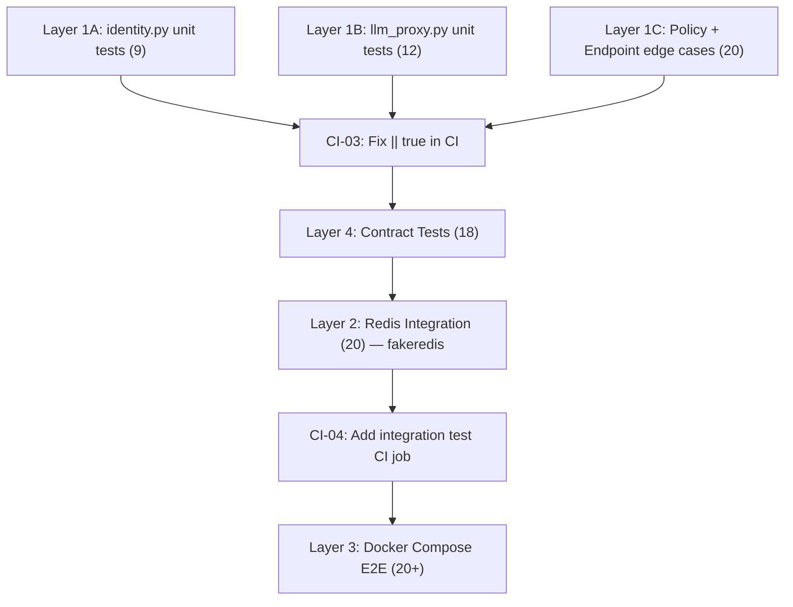

# KubexClaw Wave 3 Test Plan

> Created: 2026-03-08
> Scope: Additional testing for Wave 1-3 implementation (kubex-common, Gateway, Broker, Registry).
> Baseline: 165 unit tests passing (all mocked). Integration, e2e, and chaos directories are empty.

---

## Current Coverage Snapshot

| Module | Existing Tests | Type | Gap |
|---|---|---|---|
| `kubex_common` (constants, errors, logging, schemas) | Yes | Unit (mocked) | Minor edge cases |
| `gateway/policy.py` | Yes — comprehensive | Unit (mocked) + real YAML | None critical |
| `gateway/ratelimit.py` | Yes | Unit (mocked Redis) | No real-Redis test |
| `gateway/budget.py` | Yes | Unit (mocked Redis) | No real-Redis test |
| `gateway/identity.py` | **No tests** | — | Full gap |
| `gateway/llm_proxy.py` | **No tests** | — | Full gap |
| `gateway/main.py` (endpoints) | Partial | TestClient (no Redis) | Missing: dispatch, SSE, cancel auth |
| `broker/streams.py` | Yes | Unit (mocked Redis) | No real-Redis test |
| `broker/main.py` (endpoints) | Partial | TestClient (no Redis) | No publish+consume cycle |
| `registry/store.py` | Yes | Unit (in-memory only) | No Redis persistence test |
| `registry/main.py` (endpoints) | Yes | TestClient (in-memory) | No Redis restore-on-startup test |

---

## Layer 1: Unit Test Gaps

These tests require no external services. They fill the gaps in the existing mocked test suite.

### 1.1 IdentityResolver (`gateway/identity.py`)

**No tests exist for this module.**

- [ ] **UT-ID-01** `test_resolve_raises_when_no_docker_client` — P0
  - `IdentityResolver(docker_client=None).resolve("1.2.3.4")` raises `IdentityResolutionError`

- [ ] **UT-ID-02** `test_resolve_returns_agent_id_from_docker_labels` — P0
  - Mock Docker client returns container with matching IP and `kubex.agent_id` label

- [ ] **UT-ID-03** `test_resolve_uses_cache_on_second_call` — P1
  - Call `resolve()` twice for same IP; Docker API called only once

- [ ] **UT-ID-04** `test_cache_expires_after_ttl` — P1
  - Inject stale cache entry (timestamp = now - 31s); verify Docker API re-called

- [ ] **UT-ID-05** `test_resolve_raises_when_no_matching_container` — P0
  - Docker client returns containers, none match the source IP

- [ ] **UT-ID-06** `test_resolve_uses_default_boundary_when_label_missing` — P1
  - Container has `kubex.agent_id` but no `kubex.boundary` label; defaults to `"default"`

- [ ] **UT-ID-07** `test_invalidate_cache_clears_single_ip` — P2
  - `invalidate_cache("1.2.3.4")` removes only that entry

- [ ] **UT-ID-08** `test_invalidate_cache_clears_all` — P2
  - `invalidate_cache()` with no argument clears entire cache

- [ ] **UT-ID-09** `test_resolve_raises_on_docker_api_exception` — P0
  - Docker client raises `RuntimeError` during `containers.list()` — wrapped in `IdentityResolutionError`

### 1.2 LLMProxy (`gateway/llm_proxy.py`)

**No tests exist for this module.**

- [ ] **UT-LLM-01** `test_check_model_allowed_no_policy_returns_true` — P0
  - No policy = allow all models

- [ ] **UT-LLM-02** `test_count_tokens_anthropic_response` — P0
  - Parse Anthropic-format response JSON with `usage.input_tokens` and `usage.output_tokens`

- [ ] **UT-LLM-03** `test_count_tokens_openai_response` — P0
  - Parse OpenAI-format response JSON with `usage.prompt_tokens` and `usage.completion_tokens`

- [ ] **UT-LLM-04** `test_count_tokens_malformed_json_returns_zeros` — P0
  - `count_tokens_from_response("anthropic", b"not json")` returns zeros, no exception

- [ ] **UT-LLM-05** `test_count_tokens_missing_usage_key_returns_zeros` — P1
  - Valid JSON but no `usage` key returns zeros

- [ ] **UT-LLM-06** `test_forward_raises_when_not_connected` — P0
  - Call `forward()` before `connect()` raises `RuntimeError`

- [ ] **UT-LLM-07** `test_forward_raises_on_unknown_provider` — P0
  - `forward(provider="xyzzy", ...)` raises `ValueError`

- [ ] **UT-LLM-08** `test_forward_injects_anthropic_api_key` — P0
  - Forwarded request to `api.anthropic.com` has `x-api-key` header

- [ ] **UT-LLM-09** `test_forward_injects_openai_bearer_token` — P0
  - Forwarded request has `Authorization: Bearer <key>` header

- [ ] **UT-LLM-10** `test_forward_strips_existing_auth_headers` — P0 (security)
  - Incoming auth headers are NOT forwarded; only injected key

- [ ] **UT-LLM-11** `test_forward_strips_hop_by_hop_headers` — P1
  - `connection`, `transfer-encoding`, `keep-alive` not forwarded

- [ ] **UT-LLM-12** `test_load_api_keys_falls_back_to_env_when_no_secret_file` — P1
  - Env var `ANTHROPIC_API_KEY=test123` used when secret file doesn't exist

### 1.3 Gateway Endpoint Edge Cases

- [ ] **UT-GW-01** `test_dispatch_task_missing_capability_returns_400` — P0
- [ ] **UT-GW-02** `test_http_action_missing_target_returns_400` — P0
- [ ] **UT-GW-03** `test_cancel_task_non_originator_blocked` — P0 (security)
- [ ] **UT-GW-04** `test_task_result_returns_404_when_key_missing` — P1
- [ ] **UT-GW-05** `test_rate_limit_config_falls_back_to_global` — P1
- [ ] **UT-GW-06** `test_kubex_strict_identity_rejects_unknown_ip` — P0 (security)

### 1.4 Policy Engine Missing Edge Cases

- [ ] **UT-POL-01** `test_egress_subdomain_matches_parent_rule` — P1
- [ ] **UT-POL-02** `test_path_matches_wildcard_pattern` — P1
- [ ] **UT-POL-03** `test_path_matches_no_match` — P1
- [ ] **UT-POL-04** `test_global_policy_missing_file_uses_defaults` — P0
- [ ] **UT-POL-05** `test_knowledge_agent_dispatch_task_blocked` — P0
- [ ] **UT-POL-06** `test_reviewer_report_result_allowed` — P0
- [ ] **UT-POL-07** `test_reviewer_write_output_blocked` — P0
- [ ] **UT-POL-08** `test_knowledge_agent_has_deny_all_egress` — P0

### 1.5 RateLimiter Edge Cases

- [ ] **UT-RL-01** `test_parse_per_day_window` — P1
- [ ] **UT-RL-02** `test_task_limit_exactly_at_limit_is_allowed` — P1
- [ ] **UT-RL-03** `test_window_limit_adds_entry_on_allow` — P1
- [ ] **UT-RL-04** `test_window_limit_unknown_window_defaults_to_60s` — P2

### 1.6 BudgetTracker Edge Cases

- [ ] **UT-BT-01** `test_increment_tokens_accumulates_daily_cost` — P0
- [ ] **UT-BT-02** `test_budget_status_combines_task_and_daily` — P1
- [ ] **UT-BT-03** `test_task_tokens_ttl_set_on_increment` — P1

---

## Layer 2: Integration Tests (Services + Real Redis via fakeredis)

**Prerequisite:** `fakeredis[aioredis]>=2.25` installed. Use `fakeredis.aioredis.FakeRedis` as drop-in async Redis client.

**Test file:** `tests/integration/test_redis_integration.py`

### 2.1 Broker Streams

- [ ] **INT-BR-01** `test_publish_then_consume_round_trip` — P0
- [ ] **INT-BR-02** `test_consumer_group_created_on_first_publish` — P0
- [ ] **INT-BR-03** `test_acknowledge_removes_from_pending` — P0
- [ ] **INT-BR-04** `test_multiple_agents_get_independent_consumer_groups` — P0
- [ ] **INT-BR-05** `test_store_and_retrieve_result` — P0
- [ ] **INT-BR-06** `test_result_expires_after_ttl` — P1
- [ ] **INT-BR-07** `test_audit_stream_written_on_publish` — P1
- [ ] **INT-BR-08** `test_handle_pending_sends_to_dlq_after_max_retries` — P1
- [ ] **INT-BR-09** `test_stream_maxlen_is_applied` — P2

### 2.2 Registry Store

- [ ] **INT-REG-01** `test_register_writes_to_redis` — P0
- [ ] **INT-REG-02** `test_capability_set_updated_on_register` — P0
- [ ] **INT-REG-03** `test_deregister_removes_from_redis` — P0
- [ ] **INT-REG-04** `test_restore_from_redis_repopulates_memory` — P0
- [ ] **INT-REG-05** `test_restore_from_redis_handles_corrupt_entry` — P1
- [ ] **INT-REG-06** `test_update_status_syncs_to_redis` — P0

### 2.3 Gateway Rate Limiter

- [ ] **INT-RL-01** `test_sliding_window_allows_under_limit` — P0
- [ ] **INT-RL-02** `test_sliding_window_blocks_at_limit` — P0
- [ ] **INT-RL-03** `test_sliding_window_allows_after_expiry` — P0
- [ ] **INT-RL-04** `test_task_counter_resets_for_new_task` — P1

### 2.4 Gateway Budget Tracker

- [ ] **INT-BT-01** `test_daily_cost_accumulates_across_calls` — P0
- [ ] **INT-BT-02** `test_task_tokens_accumulate_correctly` — P0
- [ ] **INT-BT-03** `test_daily_key_rolls_over_at_midnight` — P1

---

## Layer 3: Service Smoke Tests (Docker Compose)

**Tag:** `@pytest.mark.e2e` — requires Docker running.

**Test file:** `tests/e2e/test_smoke.py`

### 3.1 Health Endpoints

- [ ] **E2E-HEALTH-01** `test_gateway_health` — P0
- [ ] **E2E-HEALTH-02** `test_broker_health` — P0
- [ ] **E2E-HEALTH-03** `test_registry_health` — P0
- [ ] **E2E-HEALTH-04** `test_manager_health` — P0
- [ ] **E2E-HEALTH-05** `test_redis_health` — P0

### 3.2 Registry E2E Flows

- [ ] **E2E-REG-01** `test_register_agent_via_http` — P0
- [ ] **E2E-REG-02** `test_capability_resolution` — P0
- [ ] **E2E-REG-03** `test_deregister_agent` — P0
- [ ] **E2E-REG-04** `test_registry_survives_restart` — P1

### 3.3 Gateway to Broker E2E Flow

- [ ] **E2E-FLOW-01** `test_dispatch_task_lands_in_stream` — P0
- [ ] **E2E-FLOW-02** `test_task_result_roundtrip` — P0
- [ ] **E2E-FLOW-03** `test_progress_event_via_pubsub` — P1
- [ ] **E2E-FLOW-04** `test_acknowledge_message` — P0

### 3.4 Policy Enforcement E2E

- [ ] **E2E-POL-01** `test_globally_blocked_action_returns_403` — P0
- [ ] **E2E-POL-02** `test_orchestrator_blocked_from_http_get` — P0
- [ ] **E2E-POL-03** `test_scraper_allowed_instagram_get` — P1
- [ ] **E2E-POL-04** `test_scraper_blocked_from_external_domain` — P0
- [ ] **E2E-POL-05** `test_chain_depth_exceeded_returns_403` — P0

### 3.5 Rate Limiting E2E

- [ ] **E2E-RL-01** `test_rate_limit_triggered_after_burst` — P1
- [ ] **E2E-RL-02** `test_task_scoped_rate_limit` — P1

### 3.6 Cancel Authorization E2E

- [ ] **E2E-CANCEL-01** `test_only_originator_can_cancel_task` — P0 (security)
- [ ] **E2E-CANCEL-02** `test_originator_can_cancel_own_task` — P0
- [ ] **E2E-CANCEL-03** `test_cancel_publishes_to_redis_control_channel` — P1

---

## Layer 4: Contract Tests

**Test file:** `tests/unit/test_contracts.py`

### 4.1 Schema Contract Tests

- [ ] **CT-SCH-01** `test_action_request_serializes_to_valid_json` — P0
- [ ] **CT-SCH-02** `test_task_delivery_matches_broker_publish_request` — P0
- [ ] **CT-SCH-03** `test_agent_registration_json_schema_consistency` — P0
- [ ] **CT-SCH-04** `test_gatekeeper_envelope_includes_all_required_sections` — P1
- [ ] **CT-SCH-05** `test_error_response_schema_consistent_across_services` — P0
- [ ] **CT-SCH-06** `test_action_type_enum_values_match_policy_yaml_strings` — P0

### 4.2 Policy File Contract Tests

- [ ] **CT-POL-01** `test_all_policy_files_are_valid_yaml` — P0
- [ ] **CT-POL-02** `test_global_policy_has_required_keys` — P0
- [ ] **CT-POL-03** `test_agent_policy_has_required_keys` — P0
- [ ] **CT-POL-04** `test_all_policy_action_strings_are_known_action_types` — P0
- [ ] **CT-POL-05** `test_scraper_policy_approve_expected_actions` — P0
- [ ] **CT-POL-06** `test_scraper_policy_deny_expected_actions` — P0
- [ ] **CT-POL-07** `test_orchestrator_policy_approve_expected_actions` — P0
- [ ] **CT-POL-08** `test_orchestrator_policy_deny_expected_actions` — P0
- [ ] **CT-POL-09** `test_reviewer_policy_approve_expected_actions` — P0
- [ ] **CT-POL-10** `test_reviewer_policy_deny_expected_actions` — P0
- [ ] **CT-POL-11** `test_knowledge_policy_approve_expected_actions` — P0
- [ ] **CT-POL-12** `test_knowledge_policy_deny_expected_actions` — P0

---

## Layer 5: CI Integration

- [ ] **CI-01** Add `fakeredis[aioredis]` to root dev dependencies
- [ ] **CI-02** Add `respx` to gateway dev dependencies for LLM proxy HTTP mocking
- [ ] **CI-03** Fix CI workflow: remove `|| true` from pytest calls so failures block CI
- [ ] **CI-04** Add `pytest -m integration` job to CI (uses fakeredis, no Docker)
- [ ] **CI-05** Add `pytest -m e2e` job to CI (nightly/manual, requires Docker)
- [ ] **CI-06** Add `pytest -m "unit"` marker to all unit tests
- [ ] **CI-07** Add coverage requirement for `services/gateway` (90% for identity.py, llm_proxy.py)

---

## Implementation Sequencing

**Suggested waves:**
- **Wave A:** Layers 1 + 4 (no external deps) — 59 tests
- **Wave B:** Layer 2 (fakeredis) — 20 tests
- **Wave C:** Layer 3 (Docker) — 20+ tests

## Test Count Summary

| Layer | Tests | External Deps | Priority |
|---|---|---|---|
| Layer 1: Unit gaps | 41 | None | P0/P1 mix |
| Layer 2: Redis integration | 20 | fakeredis | P0/P1 mix |
| Layer 3: Docker Compose E2E | 20 | Docker | P0/P1 mix |
| Layer 4: Contract tests | 18 | None | P0 mostly |
| **Total new tests** | **99** | | |

Combined with existing 165 unit tests = **~264 tests total**.
