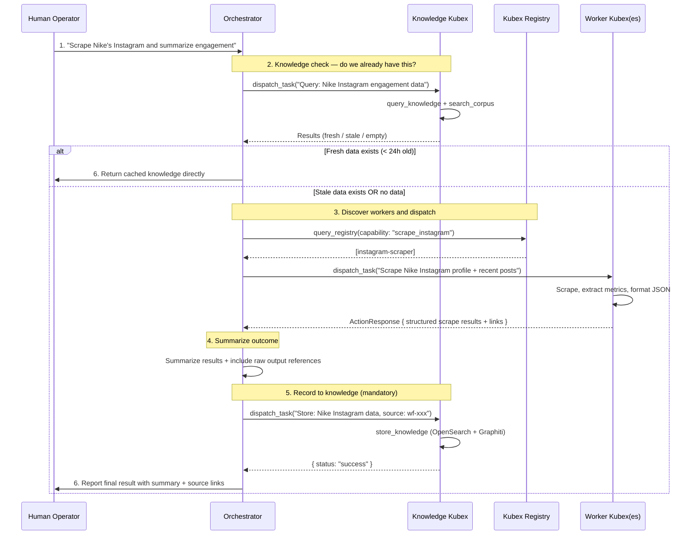
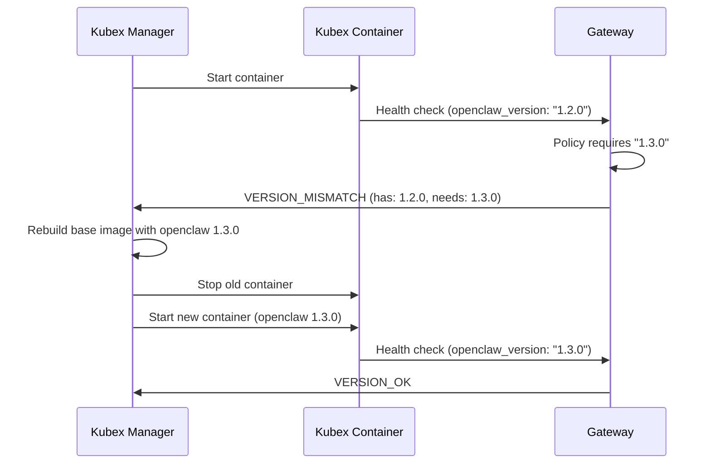
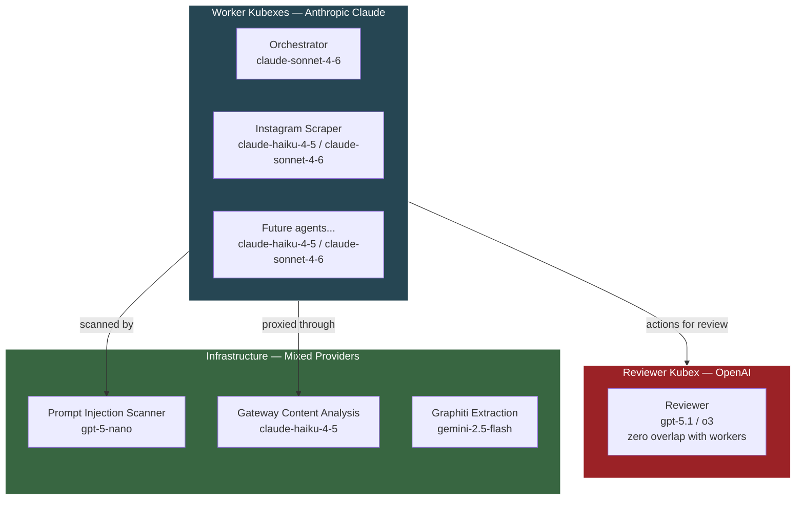

# Agent Configuration — Roster, Models & Security

> Extracted from BRAINSTORM.md. See [KubexClaw.md](../KubexClaw.md) for the full index.

---

### 13.1 First Batch of Agents & Kubex Identity Model

**Question:** What specific workflows/tasks should the first batch of agents handle?

**Decision:** Start with three Kubexes for MVP:

1. **Orchestrator Kubex** — AI supervisor that receives tasks from human operators and dispatches them to worker Kubexes. Cannot perform work directly, only delegates. Records every task outcome to the Knowledge Kubex.
2. **Instagram Scraper Kubex** — Read-only data collection agent that scrapes public Instagram profiles and posts, returning structured JSON output.
3. **Knowledge Kubex** — Manages the swarm's institutional memory. Handles all knowledge graph queries, entity extraction, and document corpus operations. See Section 13.2.

**Key Insight — Kubex Identity Model:** A Kubex is **not** a separate codebase or implementation. Every Kubex runs the same OpenClaw runtime from `agents/_base/`. What makes each Kubex unique is **configuration only**:

| Layer | What Changes Per Kubex |
|-------|----------------------|
| **System prompt** | Role identity, behavioral rules, output format |
| **Skills** | Tool definitions the agent can invoke (scraping, dispatching, etc.) |
| **Config** | Model allowlist, budget, egress rules, secrets |
| **Policy** | What actions it's allowed/blocked from doing |

Deploying a new Kubex = write a `config.yaml` + system prompt + skill definitions, build from the shared base image, done. The `agents/` folder is mostly config, not code.

**Orchestrator config:**

```yaml
# agents/orchestrator/config.yaml
agent:
  id: "orchestrator"
  boundary: "platform"

  prompt: |
    You are the KubexClaw orchestrator. You receive tasks from
    human operators and dispatch them to the appropriate worker
    Kubexes. You monitor task progress, handle failures, and
    report results back to the operator.
    You NEVER perform tasks directly — you always delegate.

  skills:
    - "dispatch_task"
    - "check_task_status"
    - "request_activation"
    - "report_result"

  policy:
    allowed_actions:
      - "dispatch_task"
      - "check_task_status"
      - "request_activation"
      - "report_result"
    blocked_actions:
      - "http_get"
      - "http_post"
      - "execute_code"
```

**Instagram Scraper config:**

```yaml
# agents/instagram-scraper/config.yaml
agent:
  id: "instagram-scraper"
  boundary: "data-collection"

  prompt: |
    You are an Instagram data collection agent. Your job is to scrape
    public Instagram profiles and posts based on task instructions.
    You extract structured data (captions, hashtags, engagement metrics,
    post timestamps, media URLs) and return clean JSON output.
    You NEVER interact with accounts — no following, liking, or commenting.

  skills:
    - "scrape_profile"
    - "scrape_posts"
    - "scrape_hashtag"
    - "extract_metrics"

  models:
    allowed:
      - id: "claude-haiku-4-5"
        tier: "light"
      - id: "claude-sonnet-4-6"
        tier: "standard"
    default: "claude-haiku-4-5"

  policy:
    allowed_actions:
      - "http_get"
      - "write_output"
    blocked_actions:
      - "http_post"
      - "send_email"
      - "execute_code"
    allowed_egress:
      - "instagram.com"
      - "i.instagram.com"
      - "graph.instagram.com"

  budget:
    per_task_token_limit: 10000
    daily_cost_limit_usd: 1.00
```

---

### 13.2 Knowledge Kubex (Third MVP Agent)

The Knowledge Kubex is the third MVP agent, alongside the Orchestrator and Scraper. It is a dedicated worker that handles all knowledge graph and document corpus operations. The Orchestrator dispatches knowledge operations to this agent rather than calling knowledge actions directly.

**Why a dedicated Kubex (not inline Orchestrator calls):**
- Separation of concerns: the Orchestrator dispatches work, the Knowledge Kubex manages knowledge storage/retrieval
- The Knowledge Kubex can be rate-limited, budgeted, and policy-controlled independently
- If the Knowledge Kubex goes down, the Orchestrator still delivers results to humans (degraded mode)
- Entity extraction and graph operations are LLM-intensive and should not compete with Orchestrator reasoning

**Knowledge Kubex config:**

```yaml
# agents/knowledge/config.yaml
agent:
  id: "knowledge"
  boundary: "platform"

  prompt: |
    You are the KubexClaw knowledge agent. You manage the swarm's
    institutional memory — the knowledge graph (Graphiti) and
    document corpus (OpenSearch).

    When you receive a query, search the knowledge graph and corpus
    for relevant information and return structured results with
    source references.

    When you receive knowledge to store, extract a clear summary,
    identify key entities and relationships, and write to the
    knowledge graph. Preserve source links (workflow IDs, task IDs,
    document URLs) on all stored knowledge.

    You NEVER perform tasks outside knowledge operations — no
    scraping, no dispatching, no code execution.

  skills:
    - "query_knowledge"
    - "store_knowledge"
    - "search_corpus"

  models:
    allowed:
      - id: "claude-haiku-4-5"
        tier: "light"
    default: "claude-haiku-4-5"

  policy:
    allowed_actions:
      - "query_knowledge"
      - "store_knowledge"
      - "search_corpus"
    blocked_actions:
      - "http_get"
      - "http_post"
      - "execute_code"
      - "dispatch_task"
      - "send_email"

  budget:
    per_task_token_limit: 5000
    daily_cost_limit_usd: 2.00
```

**Model choice:** `claude-haiku-4-5` — the Knowledge Kubex handles high-volume, relatively simple operations (search queries, entity extraction summaries). Haiku provides the best cost/throughput ratio at $1/MTok input. No need for Sonnet-level reasoning.

**MVP agent roster (updated):**

| Agent | ID | Boundary | Model | Role |
|-------|----|----------|-------|------|
| **Orchestrator** | `orchestrator` | `platform` | `claude-sonnet-4-6` | Dispatcher — receives tasks from humans, decomposes, delegates |
| **Instagram Scraper** | `instagram-scraper` | `data-collection` | `claude-haiku-4-5` | Worker — scrapes public Instagram profiles, returns structured JSON |
| **Knowledge** | `knowledge` | `platform` | `claude-haiku-4-5` | Knowledge manager — graph queries, entity extraction, corpus search |

---

### 13.3 Orchestrator Task Decomposition & Completion Loop

The Orchestrator is the human's single entry point into the swarm. This section fully specifies how the Orchestrator decomposes tasks, dispatches work, records knowledge, and reports results.

#### 13.3.1 Core Rule: The Orchestrator is a Dispatcher Only

The Orchestrator NEVER performs generic work itself. It is strictly a dispatcher and coordinator:

- It receives tasks from humans and breaks them into subtasks
- It discovers available workers via `query_registry`
- It dispatches subtasks to workers via `dispatch_task`
- It monitors progress via `check_task_status`
- It reports results back to humans via `report_result`
- It dispatches knowledge operations to the Knowledge Kubex

**What the Orchestrator must NOT do:**
- Answer questions from its own LLM knowledge — all factual answers come from the Knowledge Kubex or workers
- Attempt to perform work when no capable worker exists — it reports "no agent has this capability" to the human
- Try to interpret or fix unexpected worker output — it reports the issue to the human as-is
- Call knowledge actions directly — it dispatches to the Knowledge Kubex

**Allowed actions (strict allowlist):**

| Action | Purpose |
|--------|---------|
| `dispatch_task` | Send subtasks to workers and the Knowledge Kubex |
| `check_task_status` | Monitor dispatched task progress |
| `query_registry` | Discover available Kubexes and their capabilities |
| `report_result` | Deliver final results to the human operator |

#### 13.3.2 The Completion Loop

Every task follows this six-step loop. The Orchestrator enforces all six steps — skipping knowledge recording (steps 2 and 5) is not allowed.



**Step-by-step detail:**

| Step | Action | Details |
|------|--------|---------|
| **1. Receive task** | Human sends message via Command Center | Orchestrator parses intent, identifies required capabilities |
| **2. Knowledge check** | `dispatch_task` to Knowledge Kubex | Query existing knowledge. Fresh = return immediately. Stale = renew (dispatch work). Empty = dispatch work. "Fresh" threshold is configurable per task type (default: 24 hours). |
| **3. Dispatch to workers** | `query_registry` then `dispatch_task` | Look up capable workers, dispatch subtasks. Sequential if dependencies exist, parallel if independent. |
| **4. Summarize outcome** | Orchestrator LLM reasoning | Compose a human-readable summary. Include references to raw worker output (task IDs, document links). |
| **5. Record knowledge** | `dispatch_task` to Knowledge Kubex | Store the summary + metadata in the knowledge graph. The Knowledge Kubex extracts entities/relations and writes to Graphiti. Raw output links are preserved as `source_id` on graph edges. |
| **6. Report result** | `report_result` to human | Deliver the summary to the human via Command Center chat. |

#### 13.3.3 Knowledge Recording is Mandatory

Every task outcome MUST be recorded to the knowledge layer. This is not optional — it is how the company builds institutional memory automatically.

**Why mandatory:**
- Knowledge compounds — each task makes future tasks faster (step 2 cache hits)
- The company retains knowledge even as employees (human or AI) change
- Temporal tracking — the Knowledge Kubex handles bi-temporal logic via Graphiti: when storing something that already exists, it creates new edges with updated `valid_at` timestamps. Old facts get `invalid_at` set. Both versions are preserved. This enables "what did we know on March 1st?" queries.
- Audit trail — every piece of knowledge traces back to its source workflow and task

**Failure resilience:** If the Knowledge Kubex is down when the Orchestrator tries to record:
- The `dispatch_task` queues up in the Broker (Redis Streams persistence)
- The Orchestrator delivers the result to the human anyway (step 6 proceeds)
- The Knowledge Kubex processes the queued task when it comes back online
- No knowledge is lost — delivery to human is never blocked by knowledge recording

#### 13.3.4 Decomposition Strategy

The Orchestrator is an LLM agent — decomposition is via reasoning, not a hardcoded algorithm. The system prompt instructs it on strategy, but the LLM decides how to decompose each task.

**How it works:**

1. **Capability discovery:** The Orchestrator calls `query_registry` to get the current list of available Kubexes and their capabilities. This is dynamic — new workers can be added without changing the Orchestrator.

2. **Reasoning:** The Orchestrator's LLM reasons about which capabilities match which subtasks. For example: "The user wants Nike Instagram data summarized. I need `scrape_instagram` capability for data collection. The Registry shows `instagram-scraper` has this. I'll dispatch to it."

3. **Sequencing:** For multi-step tasks, the Orchestrator decides:
   - **Parallel dispatch** — when subtasks are independent ("scrape Nike AND scrape Adidas")
   - **Sequential dispatch** — when subtask B depends on subtask A's output ("scrape Nike, THEN compare with last month's data from knowledge")
   - **Single dispatch** — when the task maps to one worker

4. **Escalation:** The Orchestrator reports inability when:
   - No worker has the required capability → "No agent has this capability. Available capabilities are: [list]"
   - The task requires capabilities that don't exist yet → "This would require a [description] agent, which is not currently deployed"
   - The task is ambiguous → `request_user_input` to ask for clarification

**System prompt guidance (appended to Orchestrator's base prompt):**

```
## Task Decomposition Rules
- ALWAYS query the Registry before dispatching. Never assume a worker exists.
- ALWAYS check knowledge first. Never dispatch work if fresh data already exists.
- For independent subtasks, dispatch in PARALLEL to minimize latency.
- For dependent subtasks, dispatch SEQUENTIALLY — wait for each result before proceeding.
- If no worker can handle a subtask, report this to the human. Do NOT attempt the work yourself.
- If a worker returns an error, you may retry ONCE. After that, escalate to the human.
- EVERY task result must be recorded to the Knowledge Kubex. No exceptions.
- Never answer factual questions from your own knowledge. Always query the Knowledge Kubex first.
```

#### 13.3.5 Error Handling

| Scenario | Orchestrator Behavior |
|----------|----------------------|
| **Worker fails** | Retry once with the same worker. If it fails again, escalate to human with error details. |
| **Worker times out** | Cancel the task via `cancel_task`. Report partial results to human if any were received via `progress_update`. |
| **Worker returns unexpected output** | Report the raw output to the human. Do NOT try to interpret, fix, or re-process it. |
| **No capable worker found** | Report to human: "No agent has this capability. Available capabilities: [list from Registry]." |
| **Knowledge Kubex down (query)** | Proceed without cached knowledge — dispatch work directly (skip step 2). |
| **Knowledge Kubex down (store)** | Task queues in Broker. Deliver result to human anyway. Knowledge Kubex catches up when back online. |
| **Multiple workers available** | Orchestrator selects based on load/availability (future: smart routing). For MVP, selects the first match. |

#### 13.3.6 Updated Orchestrator Config

The Orchestrator config is updated to include `query_registry` in its skills and allowed actions:

```yaml
# agents/orchestrator/config.yaml
agent:
  id: "orchestrator"
  boundary: "platform"

  prompt: |
    You are the KubexClaw orchestrator. You receive tasks from
    human operators and dispatch them to the appropriate worker
    Kubexes. You monitor task progress, handle failures, and
    report results back to the operator.
    You NEVER perform tasks directly — you always delegate.
    You NEVER answer questions from your own knowledge — always
    query the Knowledge Kubex first.
    Every task result MUST be recorded to the Knowledge Kubex.

  skills:
    - "dispatch_task"
    - "check_task_status"
    - "query_registry"
    - "report_result"

  models:
    allowed:
      - id: "claude-sonnet-4-6"
        tier: "standard"
    default: "claude-sonnet-4-6"

  policy:
    allowed_actions:
      - "dispatch_task"
      - "check_task_status"
      - "query_registry"
      - "report_result"
    blocked_actions:
      - "http_get"
      - "http_post"
      - "execute_code"
      - "query_knowledge"
      - "store_knowledge"
      - "search_corpus"
```

> **Note:** The Orchestrator is explicitly blocked from `query_knowledge`, `store_knowledge`, and `search_corpus`. It interacts with the knowledge layer exclusively by dispatching tasks to the Knowledge Kubex. This ensures all knowledge operations go through the Knowledge Kubex's policy, rate limits, and logging.

### Action Items — Orchestrator Task Decomposition
- [ ] Implement Orchestrator completion loop (6-step) in Orchestrator system prompt
- [ ] Implement Knowledge Kubex agent config (`agents/knowledge/config.yaml`)
- [ ] Add Knowledge Kubex to Kubex Manager startup config (MVP)
- [ ] Add decomposition strategy guidance to Orchestrator system prompt
- [ ] Add `query_registry` to Orchestrator skill set and policy
- [ ] Implement Knowledge Kubex down detection and queue-based fallback in Orchestrator
- [ ] Add freshness threshold configuration for knowledge cache checks (default: 24h)
- [ ] Write policy test fixtures: Orchestrator dispatching to Knowledge Kubex (approve), Orchestrator calling query_knowledge directly (deny)
- [ ] Write integration test: full completion loop (human → Orchestrator → Knowledge check → Worker → Knowledge store → human)

---

### 13.4 OpenClaw Versioning & Auto-Update

**Question:** Which OpenClaw version/fork to base on?

**Decision:** Use the **latest official OpenClaw release** (upstream, no fork). Pin the version in policy, and auto-update on mismatch via container replacement.

**How it works:** Docker containers are immutable — you don't patch a running container. Instead:

1. Policy specifies the required OpenClaw version per Kubex (or globally)
2. On startup, the Kubex reports its OpenClaw version to the Gateway
3. If version mismatch, the Gateway returns `VERSION_MISMATCH` to the Kubex Manager
4. Kubex Manager **rebuilds the base image** with the correct OpenClaw version and **replaces** the container
5. No live patching, no in-container updates — always a clean rebuild

**Policy config:**

```yaml
# policies/global.yaml
global:
  openclaw:
    version: "latest"           # or pin: "1.3.0"
    auto_update: true           # rebuild on mismatch
    update_strategy: "rolling"  # rolling | all-at-once
```

```yaml
# agents/instagram-scraper/config.yaml (override if needed)
agent:
  openclaw:
    version: "1.2.0"           # pin this agent to a specific version
    auto_update: false          # don't auto-update, manual only
```

**Update flow:**



**Version resolution order:**
1. Per-Kubex `openclaw.version` (highest priority — overrides global)
2. Global `openclaw.version`
3. If both say `"latest"` → resolve to the newest published release at build time

### Action Items
- [ ] Add `openclaw.version` field to global policy schema and per-agent config schema
- [ ] Implement version check in Gateway health check endpoint
- [ ] Implement auto-rebuild logic in Kubex Manager (pull new OpenClaw npm version, rebuild base image, replace container)
- [ ] Pin OpenClaw version in `agents/_base/Dockerfile` as a build arg: `ARG OPENCLAW_VERSION=2026.2.26` → `RUN npm install -g openclaw@${OPENCLAW_VERSION}`
- [ ] Base image: `FROM node:22-bookworm-slim` — install OpenClaw via `npm install -g openclaw@<version>`, then layer Python 3.12 + kubex-common + kubex-harness on top

---

### 13.6 Model Strategy — Workers vs Reviewer

**Question:** What model(s) to use for workers vs reviewer?

**Decision (updated March 2026):** **Split-provider strategy** — workers use Claude (Anthropic), reviewer uses OpenAI. This naturally enforces the zero model overlap rule from Section 1.

| Role | Provider | Models | Tier |
|------|----------|--------|------|
| **Workers** (orchestrator, scraper, future agents) | Anthropic | `claude-haiku-4-5` (light), `claude-sonnet-4-6` (standard) | light → standard escalation |
| **Orchestrator** | Anthropic | `claude-sonnet-4-6` (primary) | Strong reasoning + tool use for task decomposition |
| **Reviewer** | OpenAI | `gpt-5.1` or `o3` | Must be different provider than workers (anti-collusion) |
| **Infrastructure** (scanner, Gateway analysis) | Mixed | `gpt-5-nano`, `claude-haiku-4-5` | Cost-optimized for high-volume tasks |

**Why this works:**

- **Zero overlap guaranteed by design** — different providers, so a compromised worker prompt cannot influence the reviewer's model family
- **Cost efficiency** — workers start on Haiku ($1/MTok input), escalate to Sonnet ($3/MTok) only when needed
- **Reviewer independence** — OpenAI GPT-5.1/o3 evaluates worker output with zero shared context or model biases
- **Two API keys to manage** — Anthropic key (workers), OpenAI key (reviewer + infrastructure), scoped via Gateway model allowlists
- **Ultra-budget options** — GPT-5-nano ($0.05/MTok input) and Gemini 2.5 Flash Lite ($0.10/MTok) for simple extraction and classification tasks



**Secret scoping (Gateway LLM Proxy model):**
- Worker Kubexes use Anthropic models — `ANTHROPIC_BASE_URL=http://gateway:8080/v1/proxy/anthropic` (Gateway injects `x-api-key` header when proxying)
- Reviewer Kubex uses OpenAI models — `OPENAI_BASE_URL=http://gateway:8080/v1/proxy/openai` (Gateway injects `Authorization: Bearer` header when proxying)
- Infrastructure Kubexes may use mixed providers — Gateway enforces per-Kubex model allowlists
- Gateway enforces that workers can only call Anthropic endpoints, reviewer can only call OpenAI endpoints
- **No API keys in worker containers** — workers get `*_BASE_URL` env vars pointing to Gateway proxy endpoints

> **Update (Section 13.9 / 13.9.1):** LLM API keys are Gateway-only secrets. Kubexes do not receive API keys. CLI LLMs are configured with `*_BASE_URL` env vars pointing to Gateway proxy endpoints. Per-Kubex secrets are limited to service credentials (database passwords, API tokens for external services) managed via bind-mounted files at `/run/secrets/` and CLI auth tokens (e.g., Claude Code OAuth for CLI identity). The secret scoping described above is now enforced at the Gateway level — the Gateway reads API keys from `secrets/llm-api-keys.json` and injects the appropriate key based on the Kubex's model allowlist when proxying LLM requests.

> **Anti-collusion requirement (Section 2):** The Reviewer MUST use a DIFFERENT model provider than workers. With workers on Claude Sonnet 4.6 (Anthropic), the Reviewer should use OpenAI (GPT-5.1 or o3). The Gateway enforces model provider separation per boundary policy.

> **Prompt caching note:** With Gateway prompt caching (Section 28), shared system prompts get 90% input cost reduction on Anthropic and 50% on OpenAI after the first call. This makes the Orchestrator and Reviewer significantly cheaper at steady-state. See Section 28.6 for savings estimates.

### Action Items
- [ ] Configure Anthropic API key as shared secret for worker boundary
- [ ] Configure OpenAI API key for reviewer and infrastructure Kubexes
- [ ] Add provider-level egress rules (workers → `api.anthropic.com` only, reviewer → `api.openai.com` only)
- [ ] Define reviewer Kubex config with GPT-5.1/o3 model allowlist
- [ ] Update model selector skill in `kubex-common` to support multi-provider (Anthropic + OpenAI + Google)
- [ ] Configure Gateway model allowlists per Kubex type (worker, reviewer, infrastructure)
- [ ] Implement model provider separation enforcement in Gateway policy
- [ ] Evaluate Grok-4.1 Fast as ultra-budget option for non-critical tasks
- [ ] Set up prompt caching for all agent system prompts (Section 28)
- [ ] Benchmark GPT-5-nano vs Gemini 2.5 Flash Lite for scraper tasks

### 13.6.1 LLM Pricing Reference (March 2026)

**Anthropic Claude (Direct API / Bedrock / Vertex AI — same pricing):**

| Model | Model ID | Input/1M | Output/1M | Notes |
|-------|----------|---------|----------|-------|
| Claude Opus 4.6 | `claude-opus-4-6` | $5.00 | $25.00 | Best reasoning, agents, coding. 200K context (1M beta) |
| Claude Sonnet 4.6 | `claude-sonnet-4-6` | $3.00 | $15.00 | Best speed/intelligence balance |
| Claude Haiku 4.5 | `claude-haiku-4-5` | $1.00 | $5.00 | Fastest, cost-optimized |

**OpenAI (Standard Tier):**

| Model | Input/1M | Cached Input/1M | Output/1M | Notes |
|-------|---------|----------------|----------|-------|
| GPT-5.2 | $1.75 | $0.175 | $14.00 | Current flagship |
| GPT-5.1 | $1.25 | $0.125 | $10.00 | Previous flagship |
| GPT-5-mini | $0.25 | $0.025 | $2.00 | Budget mid-tier |
| GPT-5-nano | $0.05 | $0.005 | $0.40 | Ultra-budget |
| o3 | $2.00 | $0.50 | $8.00 | Reasoning model |
| o4-mini | $1.10 | $0.275 | $4.40 | Budget reasoning |

**Google Gemini (Vertex AI):**

| Model | Input/1M | Output/1M | Notes |
|-------|---------|----------|-------|
| Gemini 3.1 Pro | $2.00 | $12.00 | Latest flagship |
| Gemini 3 Flash | $0.50 | $3.00 | Mid-tier fast |
| Gemini 2.5 Pro | $1.25 | $10.00 | Previous gen |
| Gemini 2.5 Flash | $0.30 | $2.50 | Budget fast |
| Gemini 2.5 Flash Lite | $0.10 | $0.40 | Ultra-budget |

**xAI Grok:**

| Model | Input/1M | Output/1M | Notes |
|-------|---------|----------|-------|
| Grok-4.1 Fast | $0.20 | $0.50 | Cheapest flagship, 2M context |

### 13.6.2 KubexClaw Model Assignment Strategy

| Agent Role | Primary Model | Fallback | Monthly Est (1K calls/day) | Rationale |
|-----------|--------------|----------|---------------------------|-----------|
| Orchestrator | Claude Sonnet 4.6 | GPT-5.1 | ~$50-100 (with caching) | Strong reasoning + tool use for task decomposition |
| Knowledge | Claude Haiku 4.5 | Gemini 2.5 Flash | ~$15-30 | High-volume knowledge queries + entity extraction, cost-optimized |
| Reviewer | GPT-5.1 or o3 | Claude Opus 4.6 | ~$80-200 | MUST be different provider than workers (anti-collusion) |
| Scraper | GPT-5-nano | Gemini 2.5 Flash Lite | ~$5-15 | Simple extraction, ultra-cheap |
| Prompt injection scanner | GPT-5-nano | Gemini 2.5 Flash Lite | ~$3-10 | Classification only, high-volume |
| Graphiti entity extraction | Gemini 2.5 Flash | Claude Haiku 4.5 | ~$10-30 | Good quality bulk extraction |
| Gateway content analysis | Claude Haiku 4.5 | GPT-5-mini | ~$10-30 | Security-critical, needs quality |

> **Anti-collusion requirement (Section 2):** The Reviewer uses a DIFFERENT model provider than workers. With workers on Claude Sonnet 4.6 (Anthropic), the Reviewer should use OpenAI (GPT-5.1 or o3). The Gateway enforces model provider separation per boundary policy.

> **Prompt caching impact:** With Gateway prompt caching (Section 28), shared system prompts get 90% input cost reduction on Anthropic and 50% on OpenAI after the first call. This makes the Orchestrator and Reviewer significantly cheaper at steady-state. The monthly estimates above assume caching is active.

---

## 17. OpenClaw Security Audit (February 2026)

> **Context:** OpenClaw (the core agent framework KubexClaw builds on) had a major cluster of security vulnerabilities disclosed in February 2026. This section evaluates their impact on KubexClaw's architecture and records required actions.

### 17.1 Critical Vulnerabilities

| CVE / Advisory | Severity | Summary | KubexClaw Impact |
|---|---|---|---|
| CVE-2026-25253 (GHSA-g8p2-7wf7-98mq) | CVSS 8.8 | 1-click RCE via gateway auth token exfiltration from `gatewayUrl` query param. WebSocket origin not validated. | **CRITICAL** — Gateway must validate WebSocket origins on all connections. |
| GHSA-hwpq-rrpf-pgcq | HIGH | `system.run` approval identity mismatch — could execute a different binary than the one displayed for approval. | **CRITICAL** — Human-in-the-loop approval must bind to exact execution identity (argv), not display name. |
| GHSA-mwxv-35wr-4vvj | HIGH | Gateway plugin auth bypass via encoded dot-segment traversal in `/api/channels` paths. | **HIGH** — Gateway must canonicalize all request paths before auth/policy decisions. |
| GHSA-qcc4-p59m-p54m | HIGH | Sandbox dangling-symlink alias bypass allowed workspace-only write boundary escape. | **HIGH** — Docker-level isolation is primary defense; OpenClaw sandbox is defense-in-depth. |
| GHSA-3jx4-q2m7-r496 | HIGH | Hardlink alias checks could bypass workspace-only file boundaries. | **HIGH** — Same class as above. |
| CVE-2026-26321 | CVSS 7.5 | Feishu extension local file inclusion via path traversal in `sendMediaFeishu`. | **MEDIUM** — KubexClaw doesn't use Feishu, but validates egress proxy approach. |
| CVE-2026-26327 | CVSS 6.5 | Unauthenticated mDNS/DNS-SD discovery TXT records could steer routing and TLS pinning, enabling MitM. | **MEDIUM** — Kubex containers should not expose mDNS. Docker network isolation covers this. |

### 17.2 Prompt Injection Vectors

Two prompt injection findings are directly relevant to KubexClaw's architecture:

**Issue #27697 — Post-Compaction Prompt Injection via `WORKFLOW_AUTO.md`:**
OpenClaw hardcodes `WORKFLOW_AUTO.md` as a required read after context compaction. Attack chain: attacker injects "write to WORKFLOW_AUTO.md" via external content → file persists on disk → OpenClaw reads it post-compaction with full trust → agent executes attacker instructions.

**Action:** Remove or lock down `WORKFLOW_AUTO.md` in all Kubex configurations. Treat all agent filesystem writes as potentially tainted.

**Issue #30948 — Unicode Homoglyph Bypass of Content Boundaries:**
OpenClaw's `wrapExternalContent` uses text boundary markers (`<<<EXTERNAL_UNTRUSTED_CONTENT>>>`) but Unicode homoglyphs (guillemets, lookalike angle brackets) can bypass the marker detection regex.

**Action:** This validates KubexClaw's `GatekeeperEnvelope` approach (Section 16.2) — structured data fields are more robust than text-based boundary markers.

### 17.3 Architecture Validation

The OpenClaw vulnerabilities **validate** several KubexClaw design decisions:

| KubexClaw Design Decision | OpenClaw Vulnerability That Validates It |
|---|---|
| Structured `GatekeeperEnvelope` over text markers (Section 16.2) | Unicode homoglyph bypass of `<<<EXTERNAL_UNTRUSTED_CONTENT>>>` markers |
| Egress Proxy — all external traffic proxied through Gateway (Section 13.9) | Multiple SSRF bypasses in Teams, BlueBubbles, web tools channels |
| LLM API keys held at Gateway, never in Kubex containers (Section 13.9) | Auth token exfiltration from gateway config (CVE-2026-25253) |
| Path canonicalization in Gateway policy evaluation | Encoded dot-segment traversal bypassing gateway auth (multiple advisories) |
| Docker container isolation per Kubex (not just in-process sandbox) | Multiple sandbox escape vectors (symlinks, hardlinks, dangling paths) |

### 17.4 OpenClaw Trust Model vs KubexClaw Trust Model

From OpenClaw's `SECURITY.md`:

> "OpenClaw does not model one gateway as a multi-tenant, adversarial user boundary. Authenticated Gateway callers are treated as trusted operators for that gateway instance."

**This confirms that KubexClaw's custom security layers are NOT redundant.** OpenClaw's trust model is: one trusted operator, one gateway, semi-trusted agents. KubexClaw's trust model is: agents are untrusted workloads, every action is policy-evaluated, inter-agent communication is mediated.

| KubexClaw Layer | Redundant with OpenClaw? | Why Still Needed |
|---|---|---|
| Gateway (unified policy engine) | **No** | OpenClaw trusts authenticated callers. KubexClaw needs inter-agent policy. |
| Container isolation per Kubex | **No** | OpenClaw sandbox is within-process, not container-level. |
| Egress Proxy (no direct internet) | **No** | OpenClaw has SSRF guards but no outbound proxy model. |
| LLM API key injection at Gateway | **No** | OpenClaw stores keys in agent config. KubexClaw keeps them out. |
| GatekeeperEnvelope / ActionRequest | **No** | OpenClaw uses text boundary markers. Structured schemas are stronger. |
| Kubex Broker (inter-agent messaging) | **No** | OpenClaw routing is channel-bound, not arbitrary inter-agent. |
| Kubex Registry (capability discovery) | **No** | OpenClaw has no agent capability registry. |
| Boundary trust zones | **No** | OpenClaw has no boundary/zone concept. |
| Human-in-the-loop approval | **Partial** | OpenClaw has exec approval. KubexClaw needs broader action approval. |
| Audit logging | **Partial** | OpenClaw has some audit. KubexClaw needs cross-agent audit trail. |

### 17.5 New OpenClaw Features to Integrate

| Feature | Version | Integration Plan |
|---|---|---|
| `openclaw secrets` (audit, configure, apply, reload) | v2026.2.26 | Evaluate for per-Kubex secrets management inside containers. Alternative to external-only injection (Docker secrets / Vault). |
| `openclaw security audit` CLI | v2026.2.23+ | Run at Kubex container startup as a health check gate. Fail container if audit reports critical issues. |
| Frozen execution plans (`system.run.prepare`) | v2026.2.26 | Adopt pattern for ActionRequest approval: freeze action + parameters at approval time, reject if context changes between approval and execution. |
| Health/readiness endpoints (`/health`, `/ready`) | v2026.2.26 | Use for Kubex Manager health checks and readiness probes. |
| Owner-only command authorization | v2026.2.26 | Configure `commands.ownerAllowFrom` in each Kubex to restrict admin commands to Gateway only. |

### 17.6 Action Items

**Must Do (before MVP):**

- [ ] Pin OpenClaw base image to ≥ v2026.2.26 in `agents/_base/Dockerfile.base`
- [ ] Implement WebSocket origin validation in Gateway
- [ ] Implement request path canonicalization before policy evaluation in Gateway
- [ ] Freeze execution plans at approval time in ActionRequest flow (adopt `system.run.prepare` pattern)
- [ ] Remove or lock down `WORKFLOW_AUTO.md` in Kubex agent configurations
- [ ] Configure `commands.ownerAllowFrom` to restrict admin commands to Gateway in all Kubex configs

**Should Do (post-MVP):**

- [ ] Integrate `openclaw security audit` into Kubex container startup health checks
- [ ] Evaluate `openclaw secrets` for per-Kubex secrets management vs external-only injection
- [ ] Add IPv6 multicast edge cases to Egress Proxy SSRF guards
- [ ] Evaluate third-party security tools: ClawSec (drift detection), SecureClaw (OWASP plugin)
- [ ] Integrate OpenClaw health/readiness endpoints into Kubex Manager probes
