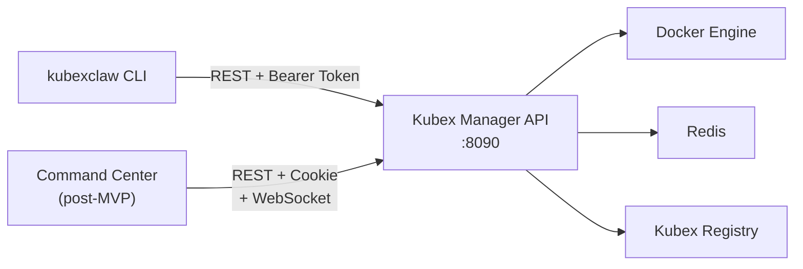
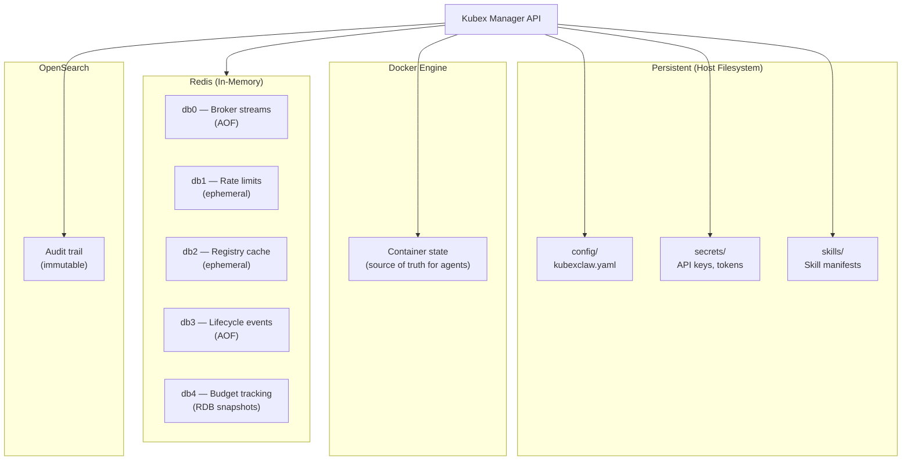

# Management API Design

The KubexClaw Management API is the single backend that serves both the `kubexclaw` CLI (MVP) and the Command Center web UI (post-MVP). Every CLI command translates to one or more REST calls against this API. The API is hosted by the Kubex Manager service.

---

## 1. Core Principle

One API, two clients. The CLI and Command Center web UI share the same endpoints, authentication model, and response formats. The web UI adds WebSocket subscriptions for real-time updates, but all state-changing operations use the same REST endpoints.



---

## 2. API Domains

All endpoints are prefixed with `/api/v1/`. Request and response bodies use JSON. Errors use a consistent format (see Section 7).

### 2.1 Lifecycle (MVP)

| Method | Endpoint | Purpose | CLI Command |
|--------|----------|---------|-------------|
| `POST` | `/api/v1/agents` | Deploy a new agent | `kubexclaw deploy` |
| `GET` | `/api/v1/agents` | List all agents | `kubexclaw agents list` |
| `GET` | `/api/v1/agents/{name}` | Agent detail (status, resources, activity) | `kubexclaw agents info` |
| `POST` | `/api/v1/agents/{name}/stop` | Graceful stop | `kubexclaw agents stop` |
| `POST` | `/api/v1/agents/{name}/start` | Start stopped agent | `kubexclaw agents start` |
| `POST` | `/api/v1/agents/{name}/restart` | Stop + start | `kubexclaw agents restart` |
| `DELETE` | `/api/v1/agents/{name}` | Remove agent permanently | `kubexclaw agents remove` |

**Deploy request body:**
```json
{
  "skill": "web-scraping",
  "name": "price-checker",
  "model": "claude-sonnet-4-6",
  "configuration": {
    "rate_limit": 15,
    "respect_robots_txt": true
  }
}
```

**Deploy response (201 Created):**
```json
{
  "name": "price-checker",
  "skill": "web-scraping",
  "status": "running",
  "model": "claude-sonnet-4-6",
  "created_at": "2026-03-07T14:32:00Z",
  "resources": {
    "memory": "512Mi",
    "cpu": "0.5"
  }
}
```

**List response (200 OK):**
```json
{
  "agents": [
    {
      "name": "price-checker",
      "skill": "web-scraping",
      "status": "running",
      "model": "claude-sonnet-4-6",
      "uptime_seconds": 180240,
      "cost_mtd_usd": 3.42
    }
  ],
  "total": 1
}
```

### 2.2 Skills (MVP)

| Method | Endpoint | Purpose | CLI Command |
|--------|----------|---------|-------------|
| `GET` | `/api/v1/skills` | List all skills (grouped by category) | `kubexclaw skills list` |
| `GET` | `/api/v1/skills/{name}` | Skill detail card | `kubexclaw skills info` |
| `GET` | `/api/v1/skills?q={query}` | Fuzzy search skills | `kubexclaw skills search` |

**List response (200 OK):**
```json
{
  "skills": [
    {
      "name": "web-scraping",
      "display_name": "Web Scraping",
      "description": "Fetch and parse web pages",
      "category": "data-collection",
      "version": "1.0.0"
    }
  ],
  "total": 8
}
```

**Detail response (200 OK):**
```json
{
  "name": "web-scraping",
  "version": "1.0.0",
  "display_name": "Web Scraping",
  "description": "Fetch and parse web pages",
  "long_description": "...",
  "category": "data-collection",
  "tags": ["http", "html", "parsing"],
  "capabilities": {
    "actions": ["http_get", "http_post", "parse_html", "store_knowledge"],
    "tools": [
      {"name": "scrape_page", "description": "Fetch and parse a web page"},
      {"name": "extract_data", "description": "Extract structured data from HTML"}
    ]
  },
  "requirements": {
    "providers": [{"provider": "anthropic", "required": true}],
    "infrastructure": {"internet_access": true, "knowledge_base": false},
    "resources": {"memory": "512Mi", "cpu": "0.5"}
  },
  "configuration": [
    {"key": "rate_limit", "display_name": "Requests per minute", "type": "integer", "default": 10}
  ]
}
```

### 2.3 Configuration (MVP)

| Method | Endpoint | Purpose | CLI Command |
|--------|----------|---------|-------------|
| `GET` | `/api/v1/config` | Current configuration | `kubexclaw config show` |
| `PATCH` | `/api/v1/config` | Update configuration | `kubexclaw config set` |
| `POST` | `/api/v1/config/init` | Initial setup (first-run wizard) | `kubexclaw setup` |
| `POST` | `/api/v1/config/reset` | Reset to defaults | `kubexclaw config reset` |
| `GET` | `/api/v1/config/providers` | List configured providers | `kubexclaw config providers list` |
| `PUT` | `/api/v1/config/providers/{name}` | Add or update provider | `kubexclaw config providers add` |
| `DELETE` | `/api/v1/config/providers/{name}` | Remove provider | `kubexclaw config providers remove` |

**Config response (200 OK):**
```json
{
  "default_model": "claude-sonnet-4-6",
  "spending_limit_usd": 50,
  "approval_mode": "risky-only",
  "providers": [
    {"name": "anthropic", "status": "configured", "models": ["claude-sonnet-4-6", "claude-haiku-4-5"]},
    {"name": "openai", "status": "configured", "models": ["gpt-4.1", "codex"]}
  ]
}
```

**Update config request (PATCH):**
```json
{
  "spending_limit_usd": 100
}
```

### 2.4 Monitoring (MVP)

| Method | Endpoint | Purpose | CLI Command |
|--------|----------|---------|-------------|
| `GET` | `/api/v1/health` | System health (all services) | `kubexclaw status` |
| `GET` | `/api/v1/agents/{name}/logs` | Agent logs (WebSocket for streaming) | `kubexclaw agents logs` |
| `GET` | `/api/v1/agents/{name}/activity` | Recent actions with outcomes | `kubexclaw agents info` |
| `GET` | `/api/v1/budget` | Cost tracking (MTD, per-agent) | `kubexclaw status` |

**Health response (200 OK):**
```json
{
  "status": "healthy",
  "services": {
    "gateway": {"status": "healthy", "port": 8080, "uptime_seconds": 86400},
    "kubex_manager": {"status": "healthy", "port": 8090, "uptime_seconds": 86400},
    "kubex_broker": {"status": "healthy", "port": 8060, "uptime_seconds": 86400},
    "kubex_registry": {"status": "healthy", "port": 8070, "uptime_seconds": 86400},
    "redis": {"status": "healthy", "port": 6379, "uptime_seconds": 86400},
    "neo4j": {"status": "healthy", "port": 7687, "uptime_seconds": 86400},
    "graphiti": {"status": "healthy", "port": 8100, "uptime_seconds": 86400},
    "opensearch": {"status": "healthy", "port": 9200, "uptime_seconds": 86400}
  },
  "agents": {
    "running": 2,
    "stopped": 1,
    "total": 3
  },
  "budget": {
    "month": "2026-03",
    "spent_usd": 5.83,
    "limit_usd": 50.00,
    "percent_used": 11.66
  },
  "pending_approvals": 1
}
```

**Budget response (200 OK):**
```json
{
  "month": "2026-03",
  "total_spent_usd": 5.83,
  "limit_usd": 50.00,
  "per_agent": [
    {"name": "price-checker", "spent_usd": 3.42, "skill": "web-scraping"},
    {"name": "blog-writer", "spent_usd": 1.87, "skill": "content-writing"},
    {"name": "code-bot", "spent_usd": 0.54, "skill": "code-review"}
  ]
}
```

### 2.5 Approvals (MVP)

| Method | Endpoint | Purpose | CLI Command |
|--------|----------|---------|-------------|
| `GET` | `/api/v1/approvals` | List pending approvals | `kubexclaw approvals` |
| `GET` | `/api/v1/approvals/{id}` | Approval detail | — |
| `POST` | `/api/v1/approvals/{id}/approve` | Approve action | `kubexclaw approve {id}` |
| `POST` | `/api/v1/approvals/{id}/deny` | Deny action | `kubexclaw deny {id}` |

**Approvals list response (200 OK):**
```json
{
  "approvals": [
    {
      "id": 42,
      "agent": "price-checker",
      "action": "access_new_domain",
      "detail": "api.competitor.com",
      "requested_at": "2026-03-07T14:30:00Z",
      "status": "pending"
    }
  ],
  "total": 1
}
```

---

## 3. CLI-to-API Mapping

Complete mapping of every CLI command to its corresponding API call(s).

| CLI Command | HTTP Method | Endpoint | Notes |
|-------------|-------------|----------|-------|
| `kubexclaw setup` | `POST` | `/api/v1/config/init` | Sends full config + provider credentials |
| `kubexclaw deploy` | `POST` | `/api/v1/agents` | Skill, name, model, config in body |
| `kubexclaw skills list` | `GET` | `/api/v1/skills` | |
| `kubexclaw skills info <name>` | `GET` | `/api/v1/skills/{name}` | |
| `kubexclaw skills search <query>` | `GET` | `/api/v1/skills?q={query}` | |
| `kubexclaw agents list` | `GET` | `/api/v1/agents` | |
| `kubexclaw agents info <name>` | `GET` | `/api/v1/agents/{name}` | Includes activity + approvals |
| `kubexclaw agents stop <name>` | `POST` | `/api/v1/agents/{name}/stop` | |
| `kubexclaw agents start <name>` | `POST` | `/api/v1/agents/{name}/start` | |
| `kubexclaw agents restart <name>` | `POST` | `/api/v1/agents/{name}/restart` | |
| `kubexclaw agents remove <name>` | `DELETE` | `/api/v1/agents/{name}` | |
| `kubexclaw agents logs <name>` | `GET` | `/api/v1/agents/{name}/logs` | WebSocket upgrade for streaming |
| `kubexclaw config show` | `GET` | `/api/v1/config` | |
| `kubexclaw config set <k> <v>` | `PATCH` | `/api/v1/config` | |
| `kubexclaw config reset` | `POST` | `/api/v1/config/reset` | |
| `kubexclaw config providers list` | `GET` | `/api/v1/config/providers` | |
| `kubexclaw config providers add` | `PUT` | `/api/v1/config/providers/{name}` | |
| `kubexclaw config providers remove` | `DELETE` | `/api/v1/config/providers/{name}` | |
| `kubexclaw status` | `GET` | `/api/v1/health` | Combines health + budget + approvals |
| `kubexclaw approve <id>` | `POST` | `/api/v1/approvals/{id}/approve` | |
| `kubexclaw deny <id>` | `POST` | `/api/v1/approvals/{id}/deny` | |

---

## 4. Command Center Compatibility

The Command Center (post-MVP) uses the same REST API with two enhancements: cookie-based authentication and WebSocket subscriptions for real-time updates.

### Authentication

| Client | Auth Method | Details |
|--------|-------------|---------|
| CLI | Bearer token | Stored in `config/kubexclaw.yaml`, sent as `Authorization: Bearer <token>` |
| Web UI | HTTP-only cookie | Same token, set via `Set-Cookie` on login, `HttpOnly` + `Secure` + `SameSite=Strict` |

Both clients authenticate against the same token. The Kubex Manager validates the token identically regardless of delivery mechanism.

### WebSocket Subscriptions (Post-MVP)

The Command Center adds real-time event streams via WebSocket. The CLI can poll the same data via REST.

| WebSocket Endpoint | Purpose | REST Equivalent |
|-------------------|---------|-----------------|
| `WS /api/v1/dashboard/live` | System-wide events (agent state changes, budget alerts) | `GET /api/v1/health` (poll) |
| `WS /api/v1/agents/{name}/live` | Per-agent events (actions, log lines, state changes) | `GET /api/v1/agents/{name}/activity` (poll) |
| `WS /api/v1/approvals/live` | Real-time approval notifications | `GET /api/v1/approvals` (poll) |

WebSocket messages use JSON with a consistent envelope:

```json
{
  "event": "agent_state_changed",
  "timestamp": "2026-03-07T14:32:00Z",
  "data": {
    "name": "price-checker",
    "old_status": "running",
    "new_status": "stopped"
  }
}
```

---

## 5. State Management

| State | Storage | Persistence | Notes |
|-------|---------|-------------|-------|
| Agent registry | Redis db2 (cache) + Docker (source of truth) | Ephemeral cache, Docker is persistent | Kubex Manager syncs Docker state to Redis on startup |
| Configuration | Host filesystem (`config/`) | Persistent | Git-versioned optional |
| Credentials | Host filesystem (`secrets/`) | Persistent | Never exposed via API, never committed |
| Lifecycle events | Redis db3 (AOF) | Durable | Stream-based, consumed by CLI and web UI |
| Budget / costs | Redis db4 (RDB) | Periodic snapshots | Aggregated per agent, per month |
| Audit trail | OpenSearch | Immutable | All API calls logged with caller, action, outcome |
| Skill catalog | Host filesystem (`skills/`) | Persistent | Read by Kubex Manager at deploy time |



---

## 6. Relationship to Existing Kubex Manager API

The Kubex Manager already defines a 61-endpoint REST API across 11 categories (see [docs/kubex-manager.md](kubex-manager.md)). The Management API documented here is the **CLI-facing subset** of that full API, reorganized with user-friendly paths and simplified request/response shapes.

| Management API Domain | Kubex Manager Category | Endpoint Count (Management API) |
|----------------------|----------------------|-------------------------------|
| Lifecycle | Domain 1: Agent Lifecycle | 7 |
| Skills | (New — skill catalog) | 3 |
| Configuration | Domain 2: Configuration | 7 |
| Monitoring | Domain 10: Observability | 4 |
| Approvals | Domain 8: Approval Queue | 4 |
| **Total** | | **25** |

The remaining 36 Kubex Manager endpoints (policy management, egress rules, boundary management, secrets, OpenClaw instance management, registry view, broker health) are available for internal services and the Command Center but are not exposed through the CLI in the MVP.

---

## 7. Error Response Format

All API errors use a consistent JSON format:

```json
{
  "error": "agent_not_found",
  "message": "No agent named 'price-checker' exists.",
  "detail": "Available agents: blog-writer, code-bot",
  "status": 404
}
```

| Field | Type | Description |
|-------|------|-------------|
| `error` | string | Machine-readable error code (snake_case) |
| `message` | string | Human-readable error message (plain English) |
| `detail` | string | Additional context or suggestions (optional) |
| `status` | integer | HTTP status code |

### Standard Error Codes

| Code | Status | Meaning |
|------|--------|---------|
| `agent_not_found` | 404 | Agent name does not exist |
| `skill_not_found` | 404 | Skill name does not exist |
| `agent_already_exists` | 409 | Agent name is already taken |
| `provider_not_configured` | 422 | Required LLM provider not set up |
| `budget_exceeded` | 429 | Monthly spending limit reached |
| `validation_error` | 422 | Request body validation failed |
| `service_unavailable` | 503 | Backend service (Redis, Registry) is down |
| `unauthorized` | 401 | Missing or invalid authentication token |

---

## 8. Action Items

- [ ] Define OpenAPI spec for Kubex Manager API
- [ ] Implement lifecycle endpoints (deploy, list, stop, start, restart, remove)
- [ ] Implement skills catalog endpoints
- [ ] Implement configuration endpoints
- [ ] Implement health/monitoring endpoints
- [ ] Implement approval queue endpoints
- [ ] Add WebSocket support for real-time feeds (post-MVP)
- [ ] Add bearer token authentication
- [ ] API versioning (v1 prefix)
- [ ] Consistent error response format
