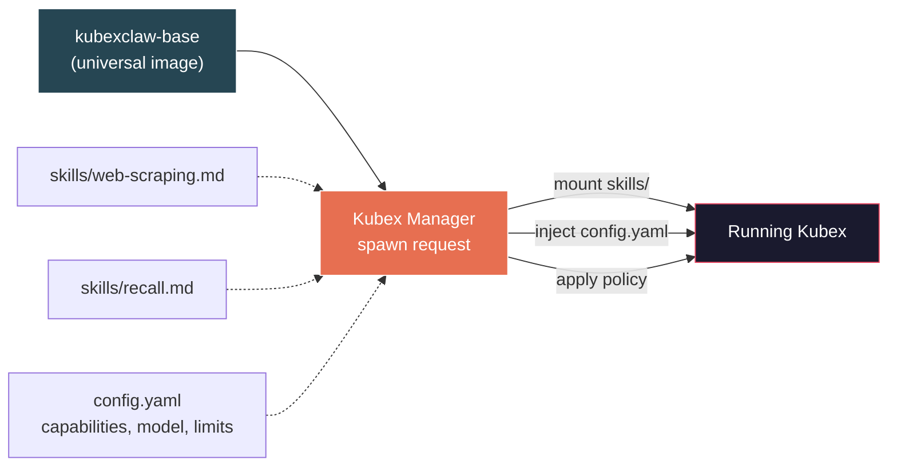
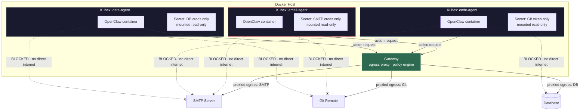
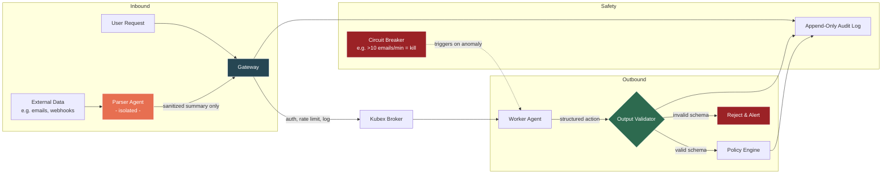
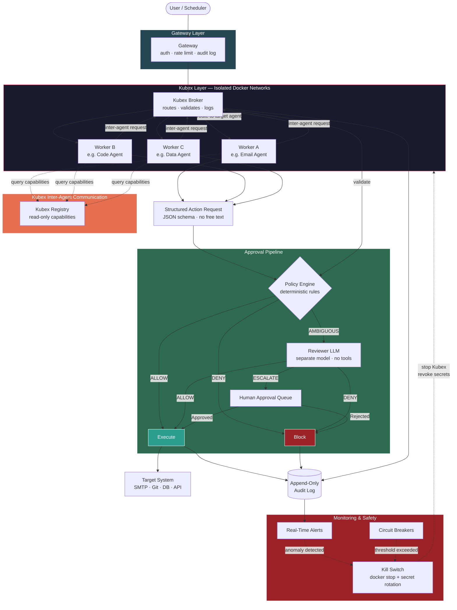
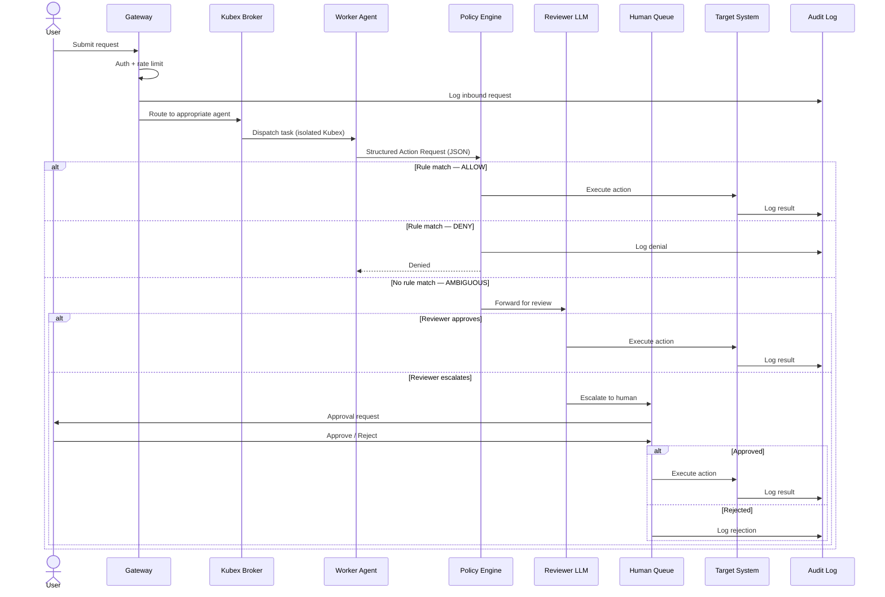
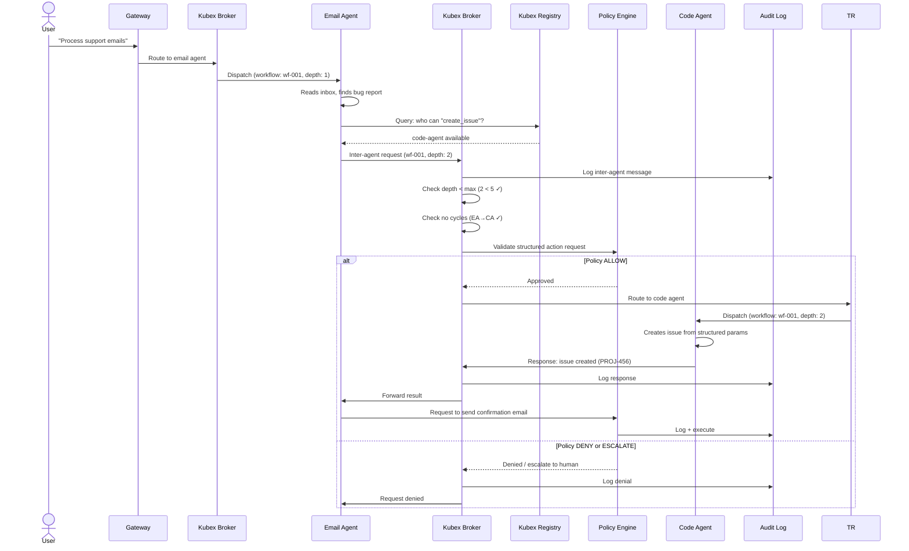
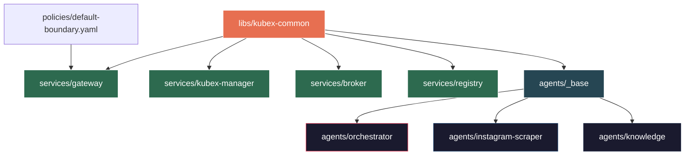

# Architecture — Core System Design

> Extracted from BRAINSTORM.md. See [KubexClaw.md](../KubexClaw.md) for the full index.

---

### Naming Convention

| Term | Meaning |
|------|---------|
| **KubexClaw** | The overall orchestration system |
| **Kubex** | A single managed agent unit — the Docker container wrapping an OpenClaw instance, its isolated network, secrets, and resource limits. "Deploy a Kubex" = spin up a new agent. |
| **Kubex Manager** | The custom Docker lifecycle service (create, start, stop, kill Kubexes) |
| **Kubex Registry** | The agent discovery service (capabilities, status, accepts_from) |
| **Kubex Broker** | The inter-agent message broker |
| **Gateway** | The unified service handling inbound requests, policy evaluation, egress proxying, and scheduling (`services/gateway/`) |
| **Policy Engine** | The rule evaluation component within the Gateway — deterministic, no AI |

---

## Core Design Principles

### Security-First

Every agent is treated as an untrusted workload. No agent gets more access than its task requires (least privilege). Prompt injection defense is a first-class architectural concern. Human-in-the-loop is mandatory for high-risk actions. These constraints are enforced throughout every layer — see Sections 1, 3, and 5.

### Stem Cell Architecture

Every Kubex is a universal, undifferentiated agent container. Specialization happens at spawn time through skill injection and configuration, not at build time through custom Docker images.

- **One base image** (`kubexclaw-base`) for all agents — no per-agent Dockerfiles
- **Skills** (markdown files) are mounted by Kubex Manager at container launch
- **Config** (capabilities, policies, model preferences) is injected at spawn time via `config.yaml`
- **Capable by default, constrained by policy** — agents aren't limited by hardcoded dependencies but by policy rules
- **Runtime needs** (pip packages, tools) are requested through the action pipeline and gated by policy + escalation
- **New agent types = new skill files**, not new Docker builds



This means deploying a new agent type is an operations task (write a skill file, define a config), not an engineering task (write code, build an image, update CI). The base image changes only when the platform itself changes.

---

## 1. Isolation Architecture

**Decision:** Each agent runs as a **Kubex** — an isolated Docker container wrapping an OpenClaw instance, with its own dedicated network, scoped secrets, and resource limits.

**Rationale:**
- Blast radius containment — a compromised Kubex can only affect its own scope.
- Least privilege enforced via per-Kubex Docker networks, scoped secrets, read-only mounts, and **model allowlists**.
- Much simpler to operate than Kubernetes — no cluster management overhead.
- Each Kubex is started fresh per task (ephemeral) and stopped when done.
- Kill switch is a simple `docker stop` — no cluster API required.

### Model Allowlist Policy

Each Kubex's policy specifies which LLM models it is permitted to use. This is enforced at the Gateway level — the Kubex never holds API keys directly; all LLM calls are proxied or gated.

**Why this matters:**
- Prevents a compromised worker from escalating to a more capable model (e.g. jumping from GPT-4o-mini to Claude Opus)
- Enforces worker/reviewer model separation — workers and reviewers must use different models (Section 2 anti-collusion)
- Controls cost — cheap agents use cheap models, expensive models require explicit policy
- Limits capability surface — a data-extraction agent doesn't need a code-generation model

**Per-Kubex model config (in agent's `config.yaml`):**

```yaml
models:
  allowed:
    - id: "gpt-4o-mini"
      tier: "light"
      cost_per_1k_tokens: 0.00015
    - id: "claude-haiku-4-5"
      tier: "light"
      cost_per_1k_tokens: 0.0008
    - id: "gpt-4o"
      tier: "standard"
      cost_per_1k_tokens: 0.005
    - id: "claude-sonnet-4-6"
      tier: "heavy"
      cost_per_1k_tokens: 0.012
  default: "gpt-4o-mini"
  max_tokens_per_request: 4096
  max_tokens_per_task: 50000

  auto_select:
    enabled: true
    strategy: "cost_effective"   # cost_effective | quality_first | balanced
    escalation_triggers:
      - condition: "task_complexity > 0.7"
        escalate_to_tier: "standard"
      - condition: "previous_attempt_failed"
        escalate_to_tier: "heavy"
      - condition: "output_quality_score < 0.5"
        escalate_to_tier: "heavy"
```

### Automatic Model Selection Skill

Each Kubex ships with a built-in **model selector skill** (part of `kubex-common`) that automatically picks the most effective model from its allowlist based on the task. The agent starts cheap and escalates only when needed — all governed by policy.

**How it works:**
1. Agent starts every task on the `default` model (cheapest/lightest)
2. The model selector skill evaluates task complexity, prior failures, and output quality
3. If an escalation trigger fires, the skill switches to the next tier up from the allowlist
4. All model switches are logged and visible to the Gateway
5. The agent **cannot** select a model outside its allowlist — the skill only picks from what policy permits

**Escalation triggers (configurable per Kubex):**

| Trigger | Example | Escalates to |
|---------|---------|-------------|
| High task complexity | Multi-step reasoning, large codebase analysis | `standard` tier |
| Previous attempt failed | Model produced invalid output, action was denied | `heavy` tier |
| Low output quality score | Structured output failed validation, incomplete results | `heavy` tier |
| Explicit skill request | Agent's task definition requires a specific tier | That tier |

**Constraints:**
- Model escalation is **one-directional within a task** — once escalated, the agent stays at that tier for the remainder of the task (no bouncing)
- Escalation is **logged as an auditable event** — Gateway sees which model was selected and why
- Policy can set a **max tier per Kubex** — e.g., email agent can never go above `standard` even if `heavy` models are in its allowlist for edge cases
- Budget limits (per-task token cap) still apply regardless of which model is selected

**Gateway enforces:**
- Rejects any LLM call requesting a model not in the Kubex's allowlist
- Rejects calls exceeding per-request or per-task token limits
- Validates that model escalation follows the configured triggers (no jumping to heavy without cause)
- Logs all model usage for cost tracking and anomaly detection
- Reviewer Kubex model allowlist must have **zero overlap** with any worker Kubex's allowlist



### Action Items
- [ ] Define the list of Kubex roles the company needs (email, code, data, etc.)
- [ ] Design one Kubex per agent with its own isolated Docker network
- [ ] Configure per-Kubex secret mounts (no environment variables for secrets)
- [ ] Configure Gateway egress proxy rules to allowlist each Kubex's permitted outbound endpoints
- [ ] Set resource limits per Kubex (`--cpus`, `--memory`) to prevent runaway agents
- [ ] Set up secret management (see Section 8 — Secrets Management Strategy)
- [ ] Define model allowlists per Kubex role in agent config (with tiers and cost metadata)
- [ ] Build model selector skill in `kubex-common` (auto-select from allowlist based on task complexity)
- [ ] Define escalation triggers per Kubex role (complexity, failure, quality score thresholds)
- [ ] Implement model allowlist enforcement in Gateway (reject disallowed model calls)
- [ ] Implement model escalation validation in Gateway (verify trigger conditions before allowing tier jump)
- [ ] Ensure zero model overlap between worker and reviewer Kubex allowlists
- [ ] Add per-request and per-task token limits to Kubex policy

---

## 3. Input/Output Gating

**Decision:** All agent I/O passes through a gateway service that validates, logs, and filters.



> **Update (Section 13.9, Section 18):** The Task Router concept has been absorbed by the Gateway (for policy routing) and the Kubex Broker (for inter-agent message routing). There is no separate Task Router component.

### Action Items
- [ ] Design Gateway service (auth, rate limiting, structured logging)
- [ ] Define output validation schemas per agent type
- [ ] Set up immutable append-only audit log storage
- [ ] Implement circuit breakers (e.g., agent tries to send 500 emails = auto-kill via `docker stop`)
- [ ] Build the two-agent pattern for untrusted content: parser agent -> sanitized summary -> actor agent

---

## 5. Architecture Overview — End-to-End



### Sequence — Single Agent Request



### Sequence — Inter-Agent Workflow Chain



---

## 12. Repository Structure

> **Note:** This section shows the full repo layout including post-MVP components. For the MVP-focused layout and `kubex-common` API surface details, see [tech-stack.md](tech-stack.md) Sections 7 and 8.

**Decision:** Monorepo with a shared library (`kubex-common`). Every service and every agent depends on the shared library for schema contracts, base service infrastructure, and shared utilities.

**Rationale:**
- The Structured Action Request schema, audit log format, and auth primitives are shared across every component. If these drift between components, the system breaks.
- A monorepo keeps the shared contract in one place — change once, all components pick it up.
- Single `docker-compose.yml` at root for full-stack local dev.
- Each service/agent has its own Dockerfile and can build/deploy independently.
- Adding a new agent is just adding a folder with a `config.yaml` — no touching infrastructure code.
- uv workspaces manage the monorepo — single `uv.lock` at root, local path dependencies between packages.

### MVP Layout

The MVP repo structure (what gets built first). See [tech-stack.md](tech-stack.md) Section 8 for details on each directory's purpose.

```
kubexclaw/
├── pyproject.toml            # Root — uv workspace definition
├── libs/
│   └── kubex-common/         # Shared package (API surface in tech-stack.md Section 7)
│       ├── pyproject.toml
│       └── kubex_common/
│           ├── schemas/      # ActionRequest, ActionResponse, GatekeeperEnvelope, config, events
│           ├── service/      # KubexService base class, health endpoint, middleware
│           ├── clients/      # Async Redis helper, httpx client wrapper
│           ├── logging.py    # structlog JSON configuration
│           ├── constants.py  # Ports, Redis DB numbers, network names
│           └── errors.py     # Shared error types
├── services/
│   ├── gateway/              # Gateway service
│   │   ├── pyproject.toml    # depends on kubex-common
│   │   ├── gateway/
│   │   └── tests/
│   ├── kubex-manager/
│   │   ├── pyproject.toml
│   │   ├── kubex_manager/
│   │   └── tests/
│   ├── broker/
│   │   ├── pyproject.toml
│   │   ├── broker/
│   │   └── tests/
│   └── registry/
│       ├── pyproject.toml
│       ├── registry/
│       └── tests/
├── agents/                   # Config only — no agent-specific code
│   ├── _base/
│   │   └── Dockerfile
│   ├── orchestrator/
│   │   └── config.yaml
│   ├── instagram-scraper/
│   │   └── config.yaml
│   └── knowledge/
│       └── config.yaml
├── skills/                   # Skill catalog (YAML manifests)
│   ├── data-collection/
│   │   └── web-scraping/
│   │       └── skill.yaml
│   └── knowledge/
│       └── recall/
│           └── skill.yaml
├── policies/
│   └── default-boundary.yaml
├── tests/                    # Cross-service integration + E2E tests
│   ├── integration/
│   ├── e2e/
│   └── chaos/
├── docker-compose.yml        # Production/MVP
├── docker-compose.dev.yml    # Dev environment
├── docker-compose.test.yml   # Test environment
└── docs/
```

### Full Layout (Post-MVP)

Post-MVP additions layered on top of the MVP structure:

```
kubexclaw/
├── ...                              # (MVP layout above)
│
├── services/
│   ├── ...                          # (MVP services)
│   └── command-center/              # KubexClaw Command Center (Section 10) — post-MVP
│       ├── Dockerfile
│       ├── pyproject.toml
│       ├── src/command_center/
│       ├── frontend/                # Next.js frontend
│       └── tests/
│
├── agents/
│   ├── ...                          # (MVP agents)
│   ├── email-agent/                 # Post-MVP agents
│   │   └── config.yaml
│   ├── code-agent/
│   │   └── config.yaml
│   └── data-agent/
│       └── config.yaml
│
├── boundaries/                      # Kubex Boundary definitions (Section 11) — post-MVP
│   ├── engineering.yaml
│   ├── customer-support.yaml
│   └── finance.yaml
│
├── logging/                         # Central logging stack — post-MVP
│   ├── opensearch/
│   │   ├── opensearch.yml
│   │   ├── dashboards.yml
│   │   └── index-templates/
│   └── fluent-bit/
│       ├── fluent-bit.conf
│       └── parsers.conf
│
├── monitoring/                      # Metrics + dashboards — post-MVP
│   ├── prometheus/
│   │   └── prometheus.yml
│   ├── grafana/
│   │   ├── datasources.yml
│   │   └── dashboards/
│   └── alerting/
│       └── alert-rules.yml
│
└── deploy/                          # Production deployment — post-MVP
    ├── swarm/
    └── scripts/
```

### Key Design Decisions

**`libs/kubex-common` is the linchpin.** Every service and agent depends on it via local path dependency:

```toml
[project]
dependencies = [
    "kubex-common @ file://../../libs/kubex-common",
]
```

**`services/` vs `agents/` separation.** Services are infrastructure (they run the platform). Agents are workloads (they do business tasks). Different security posture, different lifecycle, different teams can own them independently.

**`agents/` is config-only (MVP decision).** Each agent is a `config.yaml` + system prompt, built from the `_base/` image. No agent-specific Python code — behavior comes from OpenClaw skills and configuration. This was simplified from the earlier layout that had per-agent Dockerfiles, skills directories, and policy overrides. Those can be added post-MVP when agents need more customization.

**`skills/` is the skill catalog.** Skills are defined as YAML manifests organized by domain. Agents reference skills by name in their `config.yaml`. The catalog is separate from agent definitions — multiple agents can share the same skills.

**`policies/` at root, separate from service code.** Policy files are testable independently — CLAUDE.md requires test fixtures that assert expected approve/deny/escalate outcomes for every policy change. MVP uses a single `default-boundary.yaml`; post-MVP adds per-boundary and per-agent overrides.

**`tests/` at root for cross-service tests.** Each service has its own `tests/` for unit tests. Root `tests/` contains integration tests (run against `docker-compose.test.yml`), E2E tests, and chaos tests per CLAUDE.md testing standards.

### Dependency Graph



### Action Items
- [x] Decide on monorepo vs polyrepo (monorepo with shared lib)
- [x] Define kubex-common API surface and module layout (see [tech-stack.md](tech-stack.md) Section 7)
- [x] Define MVP repo structure with config-only agents (see [tech-stack.md](tech-stack.md) Section 8)
- [ ] Scaffold the repo directory structure (MVP layout)
- [ ] Initialize `libs/kubex-common` with `pyproject.toml` and module skeleton
- [ ] Set up root `pyproject.toml` with uv workspace definition
- [ ] Set up root `docker-compose.yml` skeleton (services + Redis + shared network)
- [ ] Create `agents/_base/Dockerfile` with OpenClaw + kubex-common
- [ ] Define the local dependency pattern and verify it works across services with `uv sync`
- [ ] Set up a root-level test runner that can run all service tests
- [ ] Scaffold `skills/` directory with initial skill manifests
- [ ] Create `policies/default-boundary.yaml` with MVP policy rules

---

### 13.7 Integration Points

**Question:** Integration points with existing company systems?

**Decision:** **Not for MVP.** No external system integrations (email, Slack, Git, databases) in the first deployment. The MVP is self-contained: orchestrator dispatches tasks to the Instagram scraper, results are written to local output. External integrations will be added as new Kubexes and boundaries are introduced.
