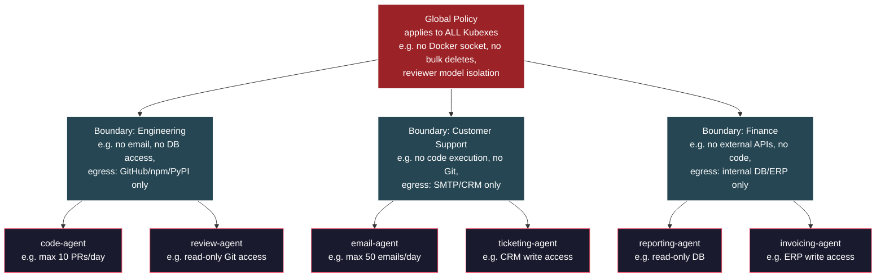
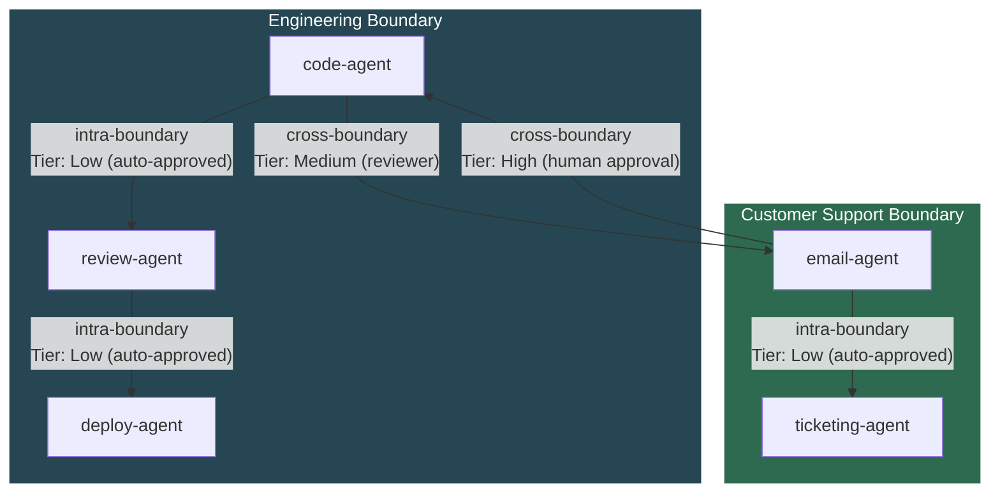
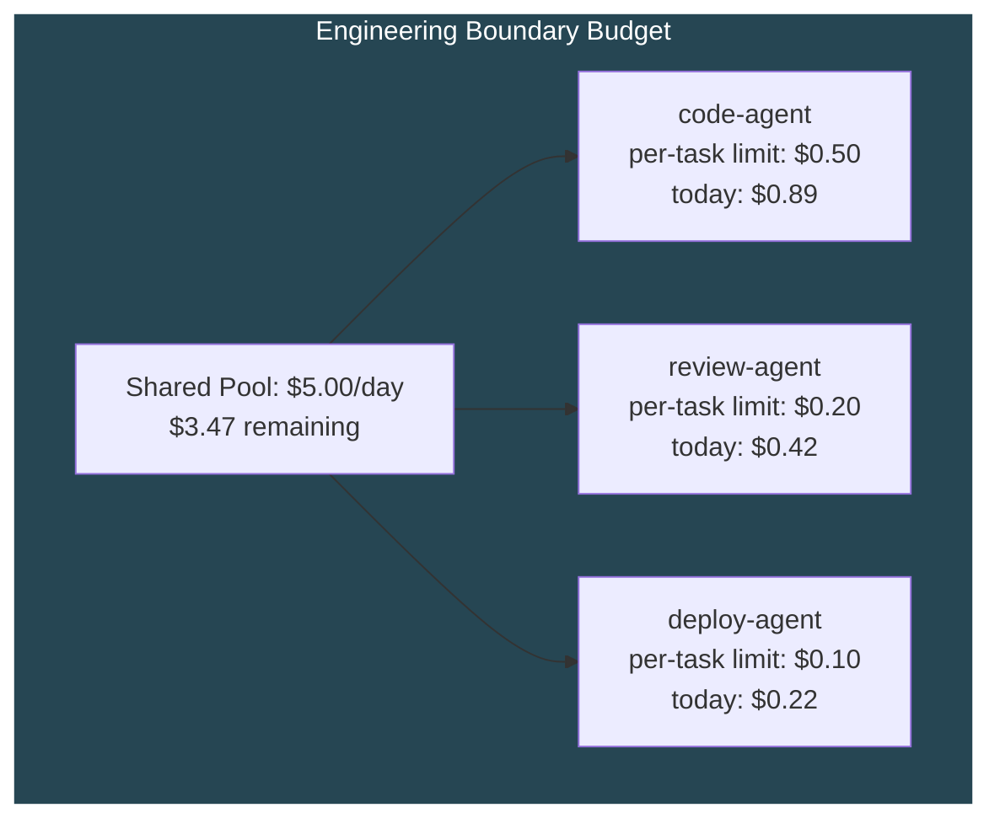
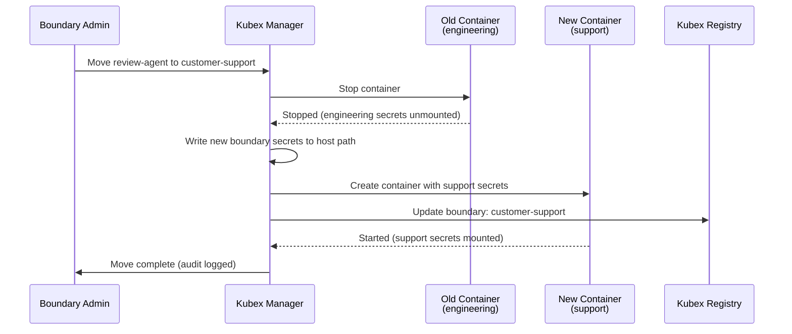
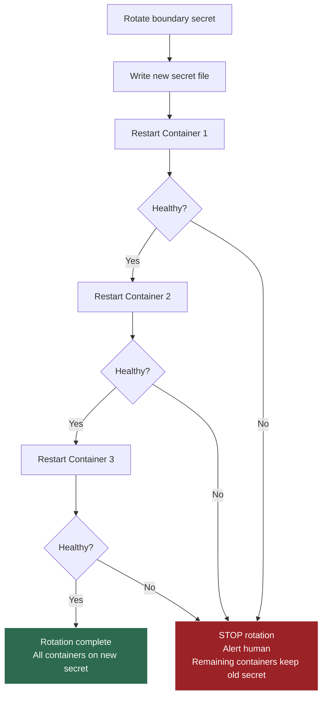
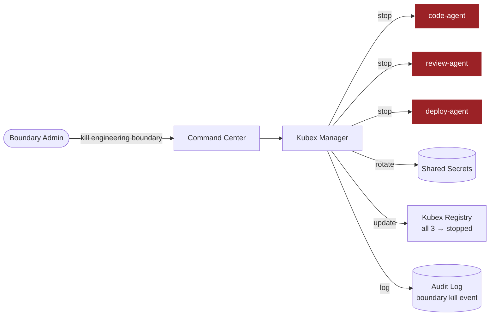
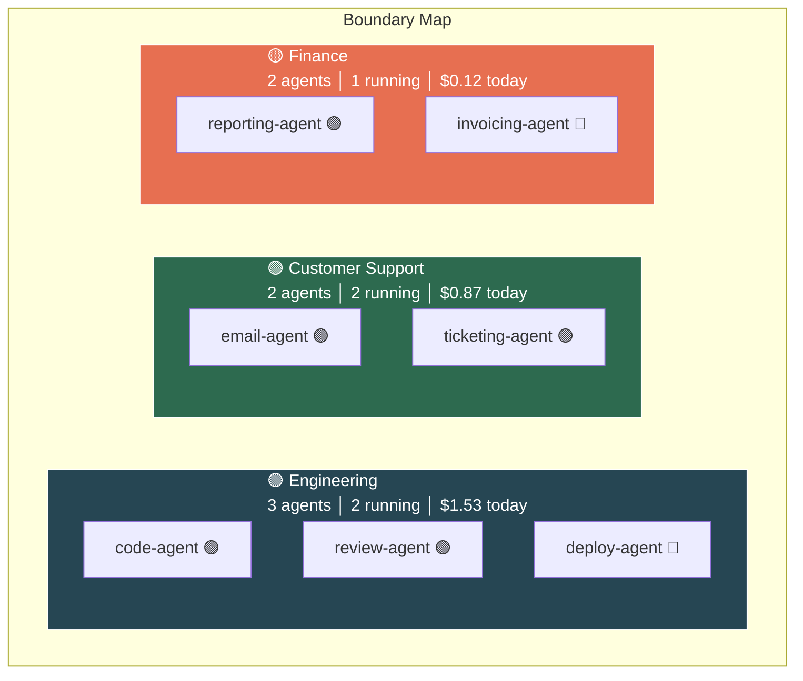

# Kubex Boundaries — Group Policy & Trust Zones

> Extracted from BRAINSTORM.md. See [KubexClaw.md](../KubexClaw.md) for the full index.

---

## 11. Kubex Boundaries — Group Policy & Trust Zones

**Problem:** Every Kubex is currently treated as an isolated individual. In practice, agents naturally cluster into functional groups — a customer support pod (email + ticketing + knowledge base), an engineering pod (code + review + deploy), a finance pod (reporting + invoicing + reconciliation). These groups share common policies, budgets, secrets, and communication patterns. Configuring each Kubex individually creates duplication, inconsistency, and operational overhead.

**Decision:** Introduce **Kubex Boundaries** — named trust zones that group related Kubexes under shared policies, budgets, secrets, and communication rules. Every Kubex belongs to exactly one boundary. A `default` boundary exists for ungrouped Kubexes.

### Core Concepts

| Term | Definition |
|------|-----------|
| **Boundary** | A named group of related Kubexes that share policies, budgets, and trust level |
| **Boundary Policy** | Policy rules that apply to all Kubexes within the boundary |
| **Intra-boundary** | Communication between Kubexes in the same boundary |
| **Cross-boundary** | Communication between Kubexes in different boundaries |
| **Boundary Admin** | Human operator with management rights over a specific boundary |

### Default Boundary (MVP)

The MVP uses a single `default` boundary. All agents belong to this boundary. No cross-boundary rules are needed.

```yaml
# boundaries/default.yaml
boundary:
  id: "default"
  display_name: "Default Boundary"
  description: "Single trust zone for all MVP agents"

agents:
  - orchestrator
  - instagram-scraper
  - reviewer

policy:
  # Inherits from agent-level policies
  # Boundary-level overrides (none for MVP):
  max_agents: 10
  shared_knowledge: true    # All agents in this boundary share knowledge graph
  cross_agent_comms: true   # Agents can dispatch tasks to each other

# Post-MVP: Per-boundary secrets, cross-boundary rules, nested boundaries
```

For the MVP, the Gateway loads this boundary definition and runs boundary logic inline (no separate Boundary Gateway container). All inter-agent communication is intra-boundary, auto-approved at Tier: Low by the Policy Engine.

### Multi-Boundary Configuration (Post-MVP)

Post-MVP deployments define multiple boundaries with distinct policies, budgets, and communication rules. Each boundary gets its own Boundary Gateway container.

```yaml
# boundaries/engineering.yaml
boundary:
  id: "engineering"
  display_name: "Engineering Pod"
  description: "Code, review, and deployment agents"

  members:
    - code-agent
    - review-agent
    - deploy-agent

  policy:
    # Boundary-level rules — apply to all members
    allowed_actions:
      - "read_file"
      - "write_file"
      - "create_pr"
      - "create_issue"
      - "run_tests"
    blocked_actions:
      - "send_email"         # Engineering agents don't send emails
      - "access_database"    # No direct DB access
    max_chain_depth: 4
    allowed_egress:
      - "github.com"
      - "registry.npmjs.org"
      - "pypi.org"

  models:
    allowed:
      - id: "claude-haiku-4-5"
        tier: "light"
      - id: "claude-sonnet-4-6"
        tier: "standard"
      - id: "gpt-4o"
        tier: "heavy"
    default: "claude-haiku-4-5"
    max_tier: "heavy"

  budget:
    daily_token_limit: 500000
    daily_cost_limit_usd: 5.00
    per_task_token_limit: 50000
    hard_cap_behavior: "pause_and_escalate"  # pause | escalate | kill

  secrets:
    shared:                  # Available to all members
      - "github-org-token"
      - "npm-registry-token"
    # Per-Kubex secrets are still defined in each agent's config

  communication:
    intra_boundary_tier: "low"       # Agents within this boundary can talk freely
    cross_boundary_default_tier: "high"  # Talking to agents outside requires human approval
    cross_boundary_overrides:
      - target_boundary: "customer-support"
        tier: "medium"               # Engineering → Support is reviewer-approved, not human
```

### Policy Format — MVP vs Full Architecture

> **Note:** The full policy cascade format below is the target architecture. For MVP, a simplified format is used (see MVP.md Section 7). The MVP format supports: `allowed_actions`, `allowed_egress`, `rate_limits`, `budget`, and `approval_required_for`. The full format adds: `blocked_actions`, `default_deny` semantics, escalation chains, data classification rules, cross-boundary overrides, and time windows. These are post-MVP.

### Policy Cascade Model

Policies cascade from global → boundary → individual Kubex. **Each level can only restrict, never relax.**



**Cascade rules:**
- Global blocks `send_email` → no boundary or Kubex can allow it
- Boundary allows `create_pr` → individual Kubex can still block it for itself
- Individual Kubex adds `max 10 PRs/day` → tighter than boundary, so it's valid
- Individual Kubex tries to allow `send_email` (blocked by boundary) → **rejected, invalid config**

**Gateway enforcement:** When evaluating an action, the Policy Engine checks all three levels in order: global → boundary → kubex. First deny wins. All three must allow for the action to proceed.

### Intra-Boundary vs Cross-Boundary Communication

This is the biggest operational impact of boundaries. Agents within the same boundary are on the same "team" — they trust each other more.



**Tier defaults:**

| Communication Path | Default Tier | Approved By |
|--------------------|-------------|-------------|
| Intra-boundary (same group) | Low | Policy engine auto-approve |
| Cross-boundary (different groups) | High | Human approval |
| Cross-boundary with override | Medium | Reviewer LLM |
| Any → outside KubexClaw | Critical | Human + 2nd human |

Cross-boundary overrides allow specific boundary-to-boundary paths to be relaxed (e.g., engineering → support at Medium instead of High). These overrides are defined in boundary config and **must be mutual** — both boundaries must agree to the override.

### Group Budgets

Boundary budgets work as a shared pool with individual sub-limits.



- **Group daily limit** — total spend across all members. When exhausted, entire boundary pauses.
- **Per-Kubex task limit** — individual agent can't blow the whole group budget on one task.
- **Budget alerts cascade** — 80% of group budget → warn boundary admin. 80% of Kubex task budget → warn Kubex.
- **Overspend isolation** — if one Kubex hits its task limit, only that Kubex is throttled, not the whole boundary (unless group budget is also hit).

### Group Secrets

Boundaries support shared secrets available to all members, in addition to per-Kubex secrets.

```
Secret resolution order:
  1. Per-Kubex secret (highest priority — overrides group)
  2. Boundary shared secret
  3. (Global secrets — future, if needed)
```

- Boundary shared secrets are mounted at `/run/secrets/<name>` just like per-Kubex secrets
- If a Kubex has a per-Kubex secret with the same name as a boundary secret, the per-Kubex secret wins
- Boundary admin can manage shared secrets from the Command Center
- Rotating a boundary secret affects all members — Kubex Manager restarts all members in sequence

### Group Secrets — Edge Cases

The shared secret model (above) covers the common case. The following edge cases require explicit handling:

#### Kubex Moved Between Boundaries

When a Kubex is moved from one boundary to another (e.g., `review-agent` moved from `engineering` to `customer-support`), old boundary secrets must be revoked cleanly:

1. Kubex Manager stops the container in the old boundary
2. Old boundary secrets are **unmounted** (not available in the new container)
3. New boundary secrets are mounted into the recreated container
4. Container starts in the new boundary with only new boundary secrets
5. **No overlap period** — the old container is fully stopped before the new one starts



The Kubex never has access to both boundary secret sets simultaneously. This is enforced by container recreation (not live remounting).

#### Secret Name Collision

Per-Kubex secrets **always override** boundary secrets when names collide. This is the documented resolution order (repeated here for clarity):

```
Secret resolution order:
  1. Per-Kubex secret (highest priority — overrides boundary)
  2. Boundary shared secret
  3. (Global secrets — future, if needed)
```

If boundary `engineering` defines a shared secret `github-token` and `code-agent` has a per-Kubex secret also named `github-token`, the per-Kubex value is mounted. The boundary secret is NOT mounted for that agent (no dual-mount ambiguity). This is enforced by Kubex Manager at container creation time — it resolves the final secret set before mounting.

#### Rotation Cascade

When a boundary shared secret is rotated, all member containers must pick up the new value. Kubex Manager handles this as a rolling restart:

1. **Write new secret file** to host path (e.g., `/run/secrets/engineering/github-token.new`)
2. **Rename** new file to replace old file (`github-token.new` -> `github-token`)
3. **Restart affected containers one-by-one** (rolling) — each container restarts with the updated bind mount
4. **Verify** each container starts healthy before proceeding to the next
5. **On partial failure** (a container fails to start after restart):
   - **Stop the rotation** — do not restart remaining containers
   - **Alert human** via Command Center notification (WARN level)
   - **Leave remaining containers on old secret** — they still work because the old secret value was valid at their last start
   - The human decides: fix the failing container and resume, or rollback the secret



This rolling strategy ensures that a bad secret value does not take down the entire boundary. At worst, one container is down and the rest continue operating with the previous (still valid) secret.

#### Cross-Boundary Secrets

Cross-boundary secrets (a single secret shared across multiple boundaries) are **NOT supported in MVP**. Each boundary has its own secret namespace. A secret named `github-token` in the `engineering` boundary and a secret named `github-token` in the `customer-support` boundary are completely independent — different values, different access control, different rotation schedules.

**Post-MVP:** Shared secret groups with explicit cross-boundary grants. A secret group would be defined at the global level and explicitly granted to specific boundaries. Rotation of a shared secret group triggers rolling restarts across all granted boundaries.

- [ ] Implement boundary move secret revocation in Kubex Manager (stop old, mount new, start new)
- [ ] Implement rolling restart for boundary secret rotation in Kubex Manager
- [ ] Add partial rotation failure alerting (WARN to Command Center)
- [ ] Post-MVP: Design cross-boundary shared secret groups

### Boundary Networking (Optional)

By default, Kubexes within a boundary still have **separate Docker networks** (maximum isolation). But boundaries can optionally enable a **shared network segment** for performance-sensitive intra-boundary communication:

| Mode | Network Setup | Use Case |
|------|---------------|----------|
| `isolated` (default) | Each Kubex on its own network, all traffic through Broker | Maximum security, standard for most boundaries |
| `shared-network` | Boundary members share a Docker network, still route through Broker | Lower latency for high-frequency intra-boundary workflows |

Even in `shared-network` mode, **all messages still flow through the Kubex Broker and Gateway** — the shared network only affects transport latency, not security enforcement.

### Boundary Lifecycle & Kill Switch

- **Create boundary** — define config, assign members
- **Add/remove Kubex** — move a Kubex between boundaries (requires restart, policy re-evaluation)
- **Kill boundary** — stops ALL Kubexes in the boundary, rotates all shared secrets, logs event
- **Pause boundary** — pauses all members, preserves state
- **Disable boundary** — all members set to `disabled` in Registry, no activation requests accepted



### Kubex Registry — Updated for Boundaries

| Field | Example | Notes |
|-------|---------|-------|
| `agent_id` | `code-agent-01` | Unique identifier |
| `boundary` | `engineering` | **Which boundary this Kubex belongs to** |
| `capabilities` | `["create_pr", "run_tests"]` | What this agent can do |
| `status` | `available` / `busy` / `stopped` / `disabled` | Current state |
| `accepts_from` | `["review-agent", "deploy-agent"]` | Allowlist (defaults to same-boundary members) |
| `activatable` | `true` / `false` | Whether this Kubex can be activated via request |
| `max_queue_depth` | `10` | Backpressure |

The `accepts_from` field now defaults to **all members of the same boundary** unless explicitly overridden. Cross-boundary requests must be explicitly allowed.

### Command Center — Boundary Views

The Command Center gets new boundary-aware views:

**Boundary Overview (new top-level view):**



- Click any boundary → drill into boundary detail (member list, shared policy, budget status, communication map)
- Boundary health indicator (green/yellow/red) based on aggregate member health
- Cross-boundary message flow visualized as edges between boundary boxes

**Boundary Detail View:**
- Member list with individual status
- Shared policy viewer/editor (same policy editor from Section 10, scoped to boundary)
- Budget burn-down chart (group pool + per-member breakdown)
- Intra-boundary message feed
- Cross-boundary communication log
- Boundary-level kill/pause/disable buttons

### Security Implications

| Threat | Mitigation |
|--------|------------|
| Compromised Kubex exploits intra-boundary low-tier approval to manipulate peers | Intra-boundary is low tier, not no-tier — actions still go through Gateway and are schema-validated. Anomaly detection flags unusual intra-boundary patterns. |
| Attacker compromises one boundary and pivots cross-boundary | Cross-boundary is High tier by default (human approval). Boundary kill switch isolates the compromised group. |
| Boundary policy misconfigured to be more permissive than global | Cascade enforcement — Gateway checks global first, boundary second. Invalid configs rejected at save time. |
| Shared secrets exposed if one boundary member is compromised | Shared secrets are the trade-off of grouping. Mitigation: minimize shared secrets, prefer per-Kubex secrets where possible. Boundary kill rotates all shared secrets. |
| Kubex moved between boundaries to gain access to different secrets/policies | Boundary changes require admin approval, trigger Kubex restart, and are logged as audit events. Old boundary secrets are revoked on move. |

### Action Items
- [ ] Define boundary config schema (`boundaries/<name>.yaml`)
- [ ] Implement policy cascade in Gateway (global → boundary → kubex, first-deny-wins)
- [ ] Update Kubex Registry schema to include `boundary` field
- [ ] Implement intra-boundary vs cross-boundary tier logic in Gateway
- [ ] Implement mutual cross-boundary override validation (both boundaries must agree)
- [ ] Add boundary-level budget tracking in Gateway (shared pool + per-member sub-limits)
- [ ] Implement boundary shared secrets in Kubex Manager (mount to all members)
- [ ] Implement boundary lifecycle in Kubex Manager (kill/pause/disable all members)
- [ ] Build Boundary Overview and Boundary Detail views in Command Center
- [ ] Add `boundaries/` directory to repo structure
- [ ] Update `accepts_from` defaults — same-boundary members auto-allowed
- [ ] Add boundary membership to Kubex provisioning flow (assign boundary on create)
- [ ] Validate boundary configs at save time — reject any rule that relaxes a parent level
