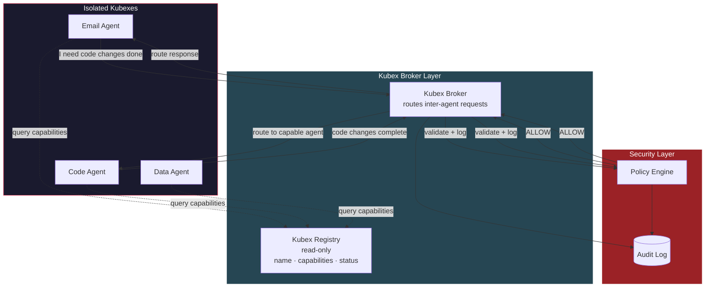
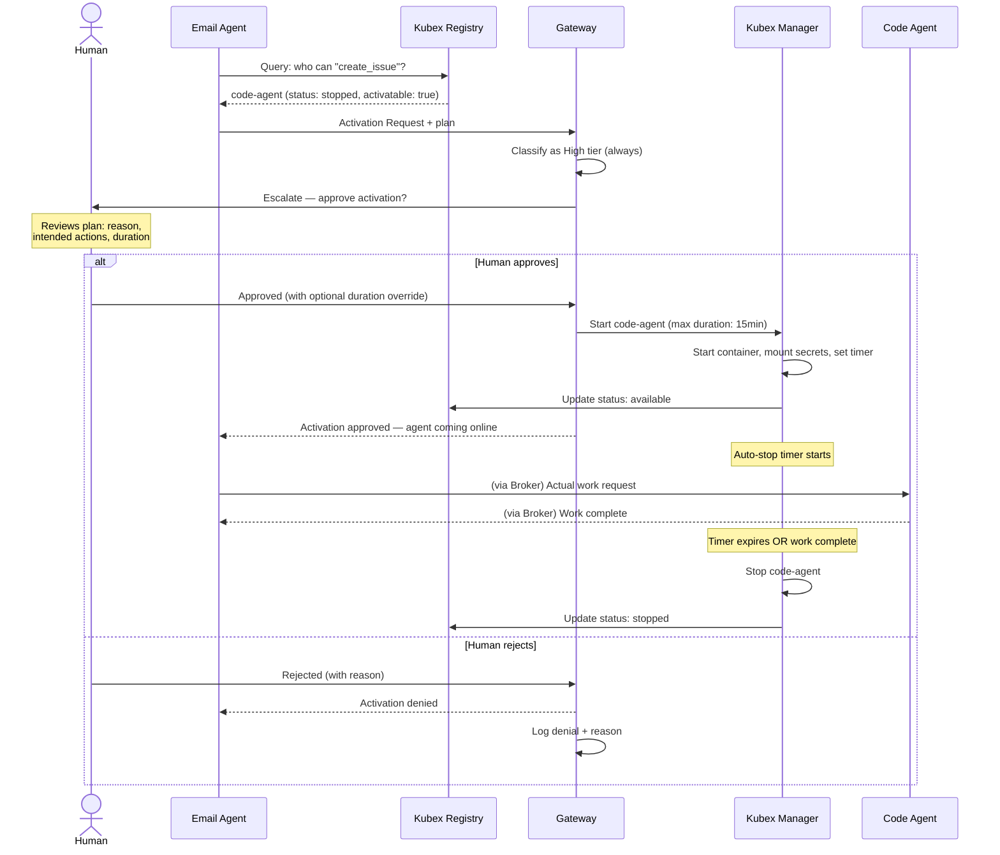
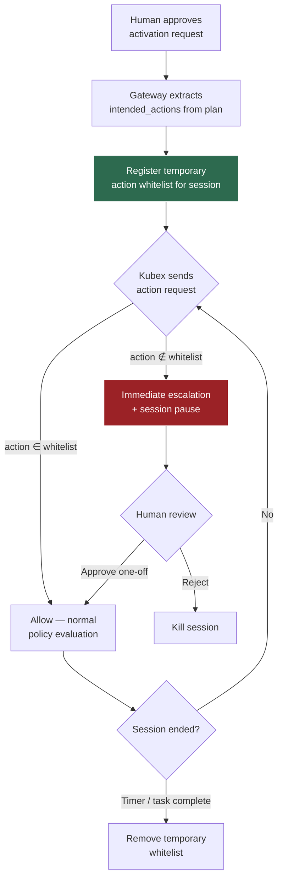
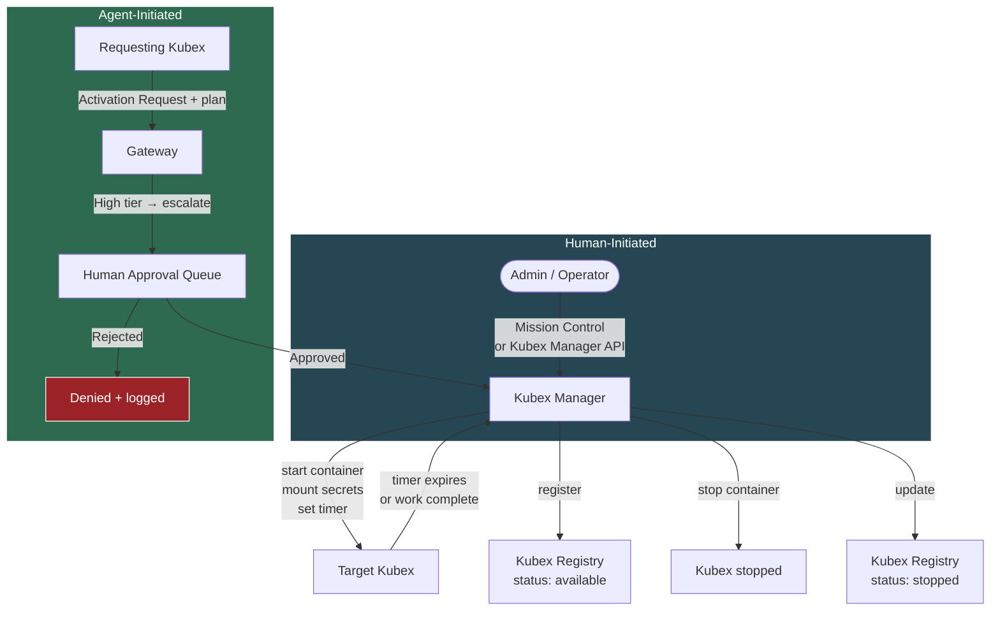
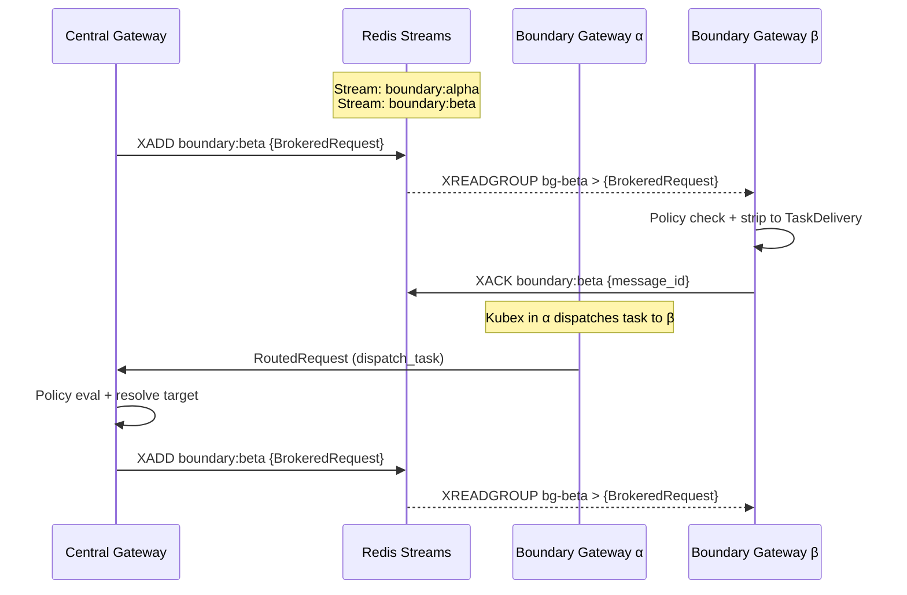
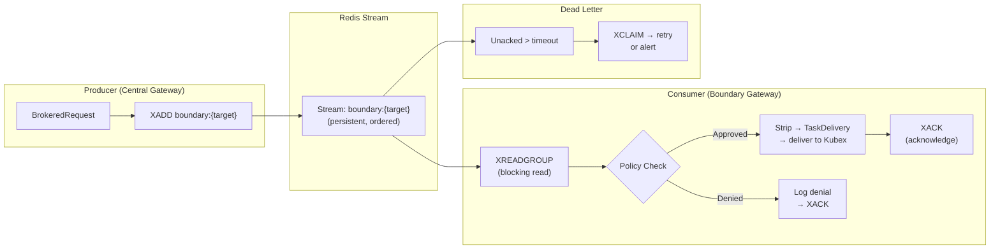

# Inter-Agent Communication & Broker

> Extracted from BRAINSTORM.md. See [KubexClaw.md](../KubexClaw.md) for the full index.

## 6. Inter-Agent Communication & Service Discovery

**Problem:** The current architecture assumes all workflows are linear: user → gateway → single agent → done. In reality, workflows will chain across agents. An email agent reads a support request, determines code needs to change, and hands off to the code agent. A data agent pulls a report and asks the email agent to send it. These handoffs need to be designed as a first-class concern — not bolted on later.

**Decision:** Kubexes never communicate directly. All inter-agent messages flow through the **Kubex Broker** which routes through the Policy Engine. Kubexes discover each other via the read-only **Kubex Registry**, which exposes capabilities — not addresses.

### Why Not Direct Agent-to-Agent?

- A compromised agent sending crafted messages to another agent is **internal prompt injection via a trusted channel** — one of the highest-risk attack vectors.
- Direct connections between Kubex networks would break the isolation model (Section 1).
- No audit trail if agents talk directly.
- No place to enforce approval tiers on inter-agent requests.

### Architecture



### Kubex Registry

A read-only service that Kubexes can query to discover **all registered Kubexes** — including stopped ones — and what they can do. Kubexes **never** learn each other's network addresses or Gateway ports. The Registry is a **full fleet catalog**, not just a list of running agents.

| Field | Example | Notes |
|-------|---------|-------|
| `agent_id` | `email-agent-01` | Unique identifier |
| `capabilities` | `["send_email", "read_inbox", "parse_attachments"]` | What this agent can do |
| `status` | `available` / `busy` / `stopped` / `disabled` | Current state (includes stopped Kubexes) |
| `accepts_from` | `["code-agent", "data-agent"]` | Allowlist of who can request work from this agent |
| `max_queue_depth` | `10` | Backpressure — reject if queue is full |
| `activatable` | `true` / `false` | Whether this Kubex can be activated by another Kubex via activation request |

**Status definitions:**
- `available` — running and ready to accept work
- `busy` — running but at capacity (queue full)
- `stopped` — not running, but registered and can be activated
- `disabled` — administratively disabled, cannot be activated (maintenance, compromised, etc.)

Agents request work by capability, not by name: _"I need an agent that can `send_email`"_ — the broker resolves this to the appropriate agent. If the only capable agent is `stopped`, the requesting agent can submit a **Kubex Activation Request** (see below).

### Kubex Activation Requests

**Problem:** A Kubex discovers via the Registry that the capability it needs exists, but the target Kubex is stopped. The requesting Kubex should be able to ask for that Kubex to be started — but **never autonomously**. A human must approve every activation.

**Decision:** Kubex activation is treated as a **High tier action minimum** that always requires human approval. The requesting Kubex must submit a plan justifying why it needs the target, what it intends to ask, and for how long.

#### Activation Request Schema

```json
{
  "request_id": "ar-20260228-a1b2c3d4",
  "agent_id": "email-agent-01",
  "action": "activate_kubex",
  "target": null,
  "parameters": {
    "target_capability": "create_issue",
    "plan": {
      "reason": "Received bug report in support inbox, need issue created in project tracker",
      "intended_actions": [
        { "action": "create_issue", "description": "Create bug issue in backend repo" }
      ],
      "estimated_duration_minutes": 5,
      "max_duration_minutes": 15
    }
  },
  "context": {
    "workflow_id": "wf-20260228-001",
    "task_id": "task-0038",
    "originating_request_id": "req-7712",
    "chain_depth": 1
  },
  "timestamp": "2026-02-28T09:30:00Z"
}
```

#### Activation Flow



#### Activation Rules

- **Always High tier minimum** — no activation request is ever auto-approved by the policy engine
- **Plan is mandatory** — requests without `reason`, `intended_actions`, and `estimated_duration_minutes` are rejected by schema validation
- **Duration enforced** — Kubex Manager sets an auto-stop timer based on the approved duration. Human can override the duration at approval time.
- **One activation per request** — a Kubex cannot request activation of multiple Kubexes in a single request
- **No self-activation** — a stopped Kubex cannot request its own activation (obviously, but enforced in schema)
- **Activation is logged** — who requested, why, what was planned, who approved, actual duration
- **`intended_actions` are binding** — see below

#### Activation Plan Enforcement — Binding `intended_actions`

When a human approves an activation request, the `intended_actions` from the plan become a **temporary action whitelist** for the activated Kubex's session. This implements the "frozen execution plan" pattern referenced in Section 17.5.

**Enforcement rules:**

1. **Whitelist creation:** Upon approval, the Gateway extracts the `intended_actions` list from the activation plan and registers it as a temporary policy constraint for the activated Kubex's session.
2. **Gateway enforcement:** Every action request from the activated Kubex is checked against the `intended_actions` whitelist. Any action NOT in the whitelist triggers **immediate escalation and session pause** — the Kubex is frozen (`docker pause`) until a human reviews the out-of-scope action.
3. **Whitelist expiry:** The temporary whitelist expires when:
   - The activated Kubex's auto-stop timer fires (duration limit reached), OR
   - The task completes and the Kubex reports its result, OR
   - A human manually terminates the session
4. **No silent expansion:** The activated Kubex cannot modify its own whitelist. If it needs additional actions beyond the approved plan, the requesting Kubex must submit a **new activation request** with an updated plan through the full approval flow.



#### Kubex Lifecycle — Updated

A Kubex can now be started from two entry points:



### Message Format

Inter-agent messages use the same **Structured Action Request** format as user-initiated requests (Section 2). No free-text. No passing raw content from external sources between agents.

```json
{
  "request_id": "ar-20260222-a1b2c3d4",
  "agent_id": "code-agent-01",
  "action": "send_email",
  "target": "team-lead@company.com",
  "parameters": {
    "to": "team-lead@company.com",
    "subject": "PR #142 merged in backend",
    "body": "Pull request #142 has been merged into the backend repository."
  },
  "context": {
    "workflow_id": "wf-20260222-001",
    "task_id": "task-0001",
    "originating_request_id": "req-5543",
    "chain_depth": 1
  },
  "timestamp": "2026-02-22T10:15:00Z"
}
```

Key constraints:
- **No raw content passthrough** — agents cannot forward arbitrary text from external sources (emails, webhooks) to other agents. Only structured, schema-validated payloads.
- **Template-based outputs** — where an agent needs another agent to produce content (e.g., email body), it references a pre-approved template with typed variables.

> **Update (Section 16.2):** The template system has been retired. Inter-agent content now uses `dispatch_task` with NL `context_message`. See gap 15.7 resolution.
- **Workflow traceability** — every inter-agent message carries the originating user request ID, so the full chain is auditable.

### Workflow Chains & Depth Limits

A user request can spawn a chain: User → Agent A → Agent B → Agent C. This needs guardrails:

- **Max chain depth** — configurable limit (e.g., 5). If Agent C tries to call Agent D and we're at depth 5, the request is rejected and escalated to human.
- **No cycles** — the Kubex Broker rejects any message that would create a circular dependency (A → B → A).
- **Timeout per chain** — entire workflow has a wall-clock timeout. If the chain hasn't completed in N minutes, all participating Kubexes are paused and the workflow is escalated.
- **Budget per chain** — total LLM token spend across all agents in a workflow is capped.

### Timed / Scheduled Workflows

Not all workflows start from a user request. Some are scheduled:

- Cron-triggered: _"Every morning at 9am, check inbox and process support emails"_
- Event-triggered: _"When a new PR is opened, run code review agent"_

These are treated as **system-initiated requests** that enter through the Gateway (Section 3) with a `source: "scheduler"` tag. They follow the same approval pipeline — the Policy Engine evaluates them identically to user requests.

### Security Implications

| Threat | Mitigation |
|--------|------------|
| Compromised Kubex sends crafted messages to manipulate other Kubexes | All inter-Kubex messages go through Policy Engine; structured schema only; no free-text |
| Kubex impersonates another Kubex | Kubex identity is resolved from Docker container labels (`kubex.agent_id`, `kubex.boundary`) set by Kubex Manager at creation time. The Gateway resolves identity by looking up the source IP on the internal Docker network via the Docker API — the Kubex-supplied `agent_id` is overwritten with the resolved container identity. A compromised Kubex cannot forge its identity because labels are set externally by Kubex Manager and are immutable to the container itself. |
| Infinite loop / resource exhaustion via circular chains | Cycle detection + max depth + chain timeout + budget cap |
| Kubex discovers and targets high-privilege Kubexes | Kubex Registry only exposes capabilities, not addresses; `accepts_from` allowlist |
| Cascading compromise — one Kubex compromises another via chained requests | Each Kubex independently validates incoming requests against its own policy; anomaly detection flags unusual inter-Kubex patterns |
| Kubex tricks human into approving activation of high-privilege Kubex | Gateway analyses the requesting Kubex's recent traffic history and includes a risk summary in the approval payload — human sees not just the plan but the agent's behavioral context (request patterns, denial history, anomaly flags) to make an informed decision |
| Activated Kubex outlives its approved scope | **Graduated response:** (1) Warning message to admin at 80% duration; (2) Rate limit ramp-up — Gateway throttles the Kubex's action throughput as it approaches limit; (3) Hard cutoff at max duration — Kubex Manager kills container; (4) If the Kubex needs more time, it must submit a **new activation plan** through the full approval flow again — no silent extensions |
| Kubex submits many activation requests to overwhelm human approval queue | **Rate limit ramp-up** — Gateway enforces escalating cooldowns per agent: 1st request normal, 2nd within window gets delayed, 3rd+ gets progressively throttled. Sustained flooding triggers circuit breaker — agent's activation privileges are suspended and admin is alerted |

### Action Items
- [ ] Design Kubex Broker service (likely a lightweight queue — Redis Streams, NATS, or custom)
- [ ] Define Kubex Registry schema and API (read-only for Kubexes, read-write for Kubex Manager)
- [ ] Extend Structured Action Request schema to support inter-Kubex routing fields
- [ ] Define inter-Kubex approval tier rules in Policy Engine (which Kubex-to-Kubex calls are auto-approved vs need review)
- [ ] Implement chain depth limits, cycle detection, and workflow timeout logic
- [ ] Design template system for content that agents pass between each other
- [ ] Define scheduled workflow entry point (cron integration through Gateway)
- [ ] Add inter-agent message patterns to the threat model
- [ ] Define Kubex Activation Request schema in kubex-common
- [ ] Implement activation request handling in Gateway (always High tier, always human escalation)
- [ ] Add auto-stop timer logic to Kubex Manager (enforce approved duration)
- [ ] Add activation rate limiting per agent in Gateway anomaly detection
- [ ] Update Kubex Registry to include stopped Kubexes and `activatable` field
- [ ] Implement activation plan enforcement as temporary action whitelist in Gateway

---

## 18. Kubex Broker Technology Decision

> **Closes gap:** 15.6 — Kubex Broker technology not selected

### 18.1 Decision: Redis Streams

**Choice:** Redis Streams for the Kubex Broker message transport.

**Rationale:**

| Factor | Redis Streams | NATS (JetStream) | Custom |
|---|---|---|---|
| Latency | Sub-ms (in-memory) | Sub-ms (in-memory) | Depends on impl |
| Persistence | Yes (RDB/AOF + Stream trimming) | Yes (JetStream) | Must build |
| Consumer groups | Built-in | Built-in (JetStream) | Must build |
| Operational cost | **Zero — Redis already in MVP stack** | New service to deploy + monitor | New service to build + deploy |
| Message routing | Manual (per-boundary streams) | Built-in subject routing | Must build |
| Scalability ceiling | Single-node (fine for MVP) | Clustering built-in | Depends |
| Replay/audit | `XRANGE` history | JetStream replay | Must build |
| Learning curve | Minimal (Redis is well-known) | Moderate (new protocol) | N/A |

**Why not NATS:** NATS is the better long-term technology for message routing, but it introduces a new service with its own configuration, monitoring, and failure modes. For MVP, Redis is already in the stack (used by Registry and caching). Adding NATS increases operational surface for zero functional gain at MVP scale.

**Redis database assignment:** Broker message streams use **db0** (see Redis Database Assignment Table in Section 13.9).

**Upgrade path:** If KubexClaw outgrows single-node Redis (hundreds of Kubexes, high message throughput), NATS JetStream is the natural successor. The Broker service abstracts the transport — swapping Redis Streams for NATS requires changing the Broker internals only, not any upstream or downstream contracts.

### 18.2 Routing Model

Each Boundary gets its own Redis Stream. The Central Gateway publishes to the target boundary's stream. Each Boundary Gateway consumes from its own stream.

**Stream naming convention:** `boundary:{boundary_name}`

Examples:
- `boundary:engineering` — Engineering boundary stream
- `boundary:customer-support` — Customer Support boundary stream
- `boundary:finance` — Finance boundary stream

**Consumer groups:** Each Boundary Gateway creates a consumer group named after itself (e.g., `bg-engineering`). This ensures:
- If the Boundary Gateway restarts, it resumes from the last acknowledged message (no message loss)
- Multiple instances of a Boundary Gateway (if scaled) share the workload via the consumer group



### 18.3 Message Lifecycle



**Message lifecycle stages:**

1. **Publish:** Central Gateway calls `XADD boundary:{target_boundary}` with the serialized `BrokeredRequest`
2. **Consume:** Target Boundary Gateway calls `XREADGROUP` (blocking) on its stream
3. **Process:** Boundary Gateway runs policy check, strips to `TaskDelivery`, delivers to target Kubex
4. **Acknowledge:** Boundary Gateway calls `XACK` after successful delivery
5. **Dead letter:** Messages unacknowledged after configurable timeout (default: 60s) are reclaimed via `XCLAIM` for retry. After 3 retries, flagged for alert.

### 18.4 Stream Management

**Trimming:** Streams are trimmed to a max length (default: 10,000 messages) using `MAXLEN ~10000` on `XADD`. This prevents unbounded memory growth while keeping recent history for audit replay.

**Audit integration:** The Broker service (or a dedicated audit consumer in the same consumer group) copies messages to the audit log before trimming. This preserves the full history even after stream trimming.

**Monitoring:** Redis `XINFO STREAM` and `XINFO GROUPS` provide built-in observability:
- Stream length (pending message backlog)
- Consumer group lag (how far behind each Boundary Gateway is)
- Pending message count per consumer (unacked messages)

These metrics feed into the Prometheus `/metrics` endpoint via `kubex-common/metrics/prometheus.py`.

### 18.5 Kubex Broker Service Role

The Kubex Broker service is **thin** — it does NOT make routing decisions. Its responsibilities:

| Responsibility | Description |
|---|---|
| Stream management | Create/trim boundary streams, manage consumer groups |
| Health monitoring | Track consumer group lag, pending counts, dead letters |
| Dead letter handling | Reclaim unacked messages, retry or escalate |
| Audit forwarding | Copy messages to audit log before trimming |

**What the Broker does NOT do:**
- Routing decisions (Central Gateway resolves target boundary)
- Policy evaluation (Boundary Gateways handle this)
- Message transformation (data shapes are defined by Gateway and Boundary Gateway)

The Broker is an operational service, not a decision-making service.

### 18.6 Action Items

- [ ] Implement Kubex Broker service with Redis Streams transport
- [ ] Define stream naming convention and max length configuration
- [ ] Implement consumer group management (auto-create per Boundary Gateway)
- [ ] Implement dead letter handling (XCLAIM + retry + alert)
- [ ] Add Redis Stream metrics to Prometheus exporter
- [ ] Document NATS migration path for post-MVP scaling

---
