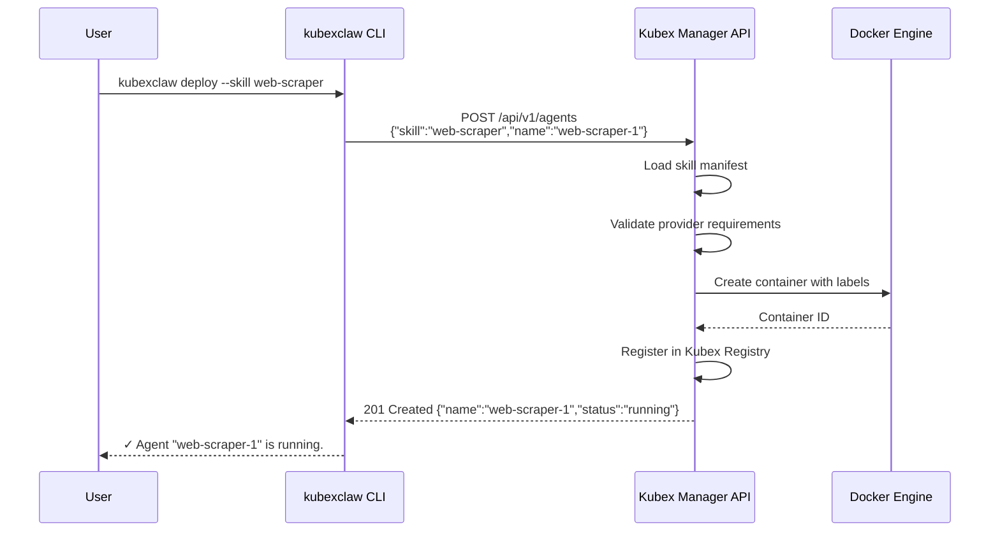

# KubexClaw CLI Design

The `kubexclaw` CLI is the primary interface for operators to set up infrastructure, deploy agents, manage the agent fleet, and monitor system health. It is designed for non-technical users with sensible defaults, wizard-driven flows, and plain English error messages. Every CLI command maps to one or more REST API calls against the Kubex Manager API (see [docs/api-layer.md](api-layer.md)).

---

## 1. Command Tree

```
kubexclaw
├── setup                    # First-run wizard (providers, defaults, launch infra)
├── deploy                   # Deploy new agent (interactive skill picker)
├── skills
│   ├── list                 # Browse catalog by category
│   ├── info <skill>         # Detailed skill card
│   └── search <query>       # Fuzzy search
├── agents
│   ├── list                 # Running/stopped agents with cost
│   ├── info <name>          # Status, activity, pending approvals
│   ├── stop <name>          # Graceful stop
│   ├── start <name>         # Start stopped agent
│   ├── restart <name>       # Stop + start
│   ├── remove <name>        # Destructive (type name to confirm)
│   └── logs <name>          # Stream logs
├── config
│   ├── show                 # Current settings
│   ├── set <key> <value>    # Change settings
│   ├── reset                # Reset to defaults (type 'reset' to confirm)
│   └── providers
│       ├── list             # List configured providers
│       ├── add <provider>   # Add LLM credentials
│       └── remove <provider># Remove provider
└── status                   # System health dashboard
```

### Global Flags

| Flag | Description |
|------|-------------|
| `--json` | Output raw JSON (for scripting and piping) |
| `--quiet` | Suppress non-essential output |
| `--verbose` | Include debug information |
| `--no-color` | Disable colored output |
| `--yes` | Skip all confirmation prompts (non-interactive mode) |

---

## 2. First-Run Setup Wizard

The setup wizard runs on first invocation or via `kubexclaw setup`. It walks the operator through four steps to bootstrap the entire KubexClaw infrastructure.

### Step 1: AI Provider

```
$ kubexclaw setup

  ╭─────────────────────────────────────╮
  │   KubexClaw — First-Time Setup      │
  │   Step 1 of 4: AI Provider          │
  ╰─────────────────────────────────────╯

  Which AI provider would you like to use?

  > [1] Anthropic (Claude)        ← recommended
    [2] OpenAI (GPT / Codex)
    [3] Google (Gemini)
    [4] xAI (Grok)
    [5] Add multiple providers

  Choice [1]: 1

  Paste your Anthropic API key:
  sk-ant-api03-****************************

  Validating key... ✓ Valid (claude-sonnet-4-6 accessible)

  ✓ Anthropic configured
```

For OAuth providers, the wizard opens a browser consent flow or displays a device code:

```
  Starting OAuth flow for Google...
  Opening browser: https://accounts.google.com/o/oauth2/auth?...

  Waiting for authorization... ✓ Authorized

  ✓ Google (Gemini) configured
```

### Step 2: Agent Defaults

```
  ╭─────────────────────────────────────╮
  │   Step 2 of 4: Agent Defaults       │
  ╰─────────────────────────────────────╯

  Default model for new agents?

  > [1] claude-sonnet-4-6         ← recommended (fast + capable)
    [2] claude-haiku-4-5          (fastest, cheapest)
    [3] claude-opus-4-6           (most capable, expensive)

  Choice [1]: 1

  Monthly spending limit (USD)?
  This caps total LLM costs across all agents.
  Enter amount [$50]: $50

  ✓ Defaults set: claude-sonnet-4-6, $50/month limit
```

### Step 3: Safety Settings

```
  ╭─────────────────────────────────────╮
  │   Step 3 of 4: Safety Settings      │
  ╰─────────────────────────────────────╯

  When should agents ask for your approval?

  > [1] Risky actions only        ← recommended
    [2] Always (every action)
    [3] Never (full autonomy)

  Choice [1]: 1

  ✓ Approval mode: risky-only
```

### Step 4: Launch Infrastructure

```
  ╭─────────────────────────────────────╮
  │   Step 4 of 4: Launch Infrastructure│
  ╰─────────────────────────────────────╯

  Starting KubexClaw services...

  [▓▓▓▓▓▓▓▓▓▓▓▓▓▓▓▓░░░░] 80%

  ✓ Redis           healthy (port 6379)
  ✓ Neo4j           healthy (port 7687)
  ✓ OpenSearch      healthy (port 9200)
  ✓ Graphiti        healthy (port 8100)
  ✓ Gateway         healthy (port 8080)
  ✓ Kubex Manager   healthy (port 8090)
  ✓ Kubex Broker    healthy (port 8060)
  ✓ Kubex Registry  healthy (port 8070)

  ╭─────────────────────────────────────╮
  │   Setup Complete!                   │
  │                                     │
  │   Deploy your first agent:          │
  │   $ kubexclaw deploy                │
  │                                     │
  │   Or browse available skills:       │
  │   $ kubexclaw skills list           │
  ╰─────────────────────────────────────╯
```

The wizard writes configuration to `config/kubexclaw.yaml` and secrets to `secrets/` (never committed to git). It then runs `docker compose up -d` and waits for all health checks to pass.

---

## 3. Deploy New Agent Flow

The `kubexclaw deploy` command walks the operator through deploying a new agent with an interactive skill picker.

### Interactive Mode

```
$ kubexclaw deploy

  Choose a skill for your new agent:

  Data Collection
    [1] web-scraping       — Fetch and parse web pages
    [2] web-monitoring     — Watch pages for changes

  Analysis
    [3] data-analysis      — Analyze structured data

  Content
    [4] content-writing    — Write articles, reports, copy
    [5] summarization      — Summarize documents and data

  Development
    [6] code-review        — Review code for quality and security

  Communication
    [7] email-drafting     — Draft professional emails

  Automation
    [8] research           — Multi-step research with citations

  Choice: 1

  ╭─ web-scraping ──────────────────────────╮
  │ Web Scraping                            │
  │                                         │
  │ Fetch and parse web pages, extract      │
  │ structured data from HTML, and monitor  │
  │ content across multiple domains.        │
  │                                         │
  │ Capabilities: http_get, http_post,      │
  │   parse_html, store_knowledge           │
  │ Resources: 512Mi RAM, 0.5 CPU           │
  │ Est. cost: ~$0.02/task (Sonnet)         │
  │                                         │
  │ Requires: internet access               │
  ╰─────────────────────────────────────────╯

  Deploy this agent? [Y/n]: Y

  Agent name [web-scraping-1]: price-checker

  Model?
  > [1] claude-sonnet-4-6    ← default
    [2] claude-haiku-4-5
    [3] claude-opus-4-6

  Choice [1]: 1

  ╭─ Review ────────────────────────────────╮
  │ Name:    price-checker                  │
  │ Skill:   web-scraping                   │
  │ Model:   claude-sonnet-4-6              │
  │ Memory:  512Mi                          │
  │ CPU:     0.5                            │
  ╰─────────────────────────────────────────╯

  Confirm deploy? [Y/n]: Y

  Deploying price-checker... ✓

  Agent "price-checker" is running.
  View status: kubexclaw agents info price-checker
```

### Non-Interactive Mode

```bash
kubexclaw deploy --skill web-scraper --name price-checker --model claude-sonnet-4-6 --yes
```

All interactive prompts are skippable with flags for scripting and CI/CD use.

---

## 4. Skill Catalog Browsing

### `kubexclaw skills list`

```
$ kubexclaw skills list

  Data Collection
    web-scraping        Fetch and parse web pages
    web-monitoring      Watch pages for changes

  Analysis
    data-analysis       Analyze structured data

  Content
    content-writing     Write articles, reports, copy
    summarization       Summarize documents and data

  Development
    code-review         Review code for quality and security

  Communication
    email-drafting      Draft professional emails

  Automation
    research            Multi-step research with citations

  8 skills available
```

### `kubexclaw skills info <name>`

```
$ kubexclaw skills info web-scraping

  ╭─ web-scraping v1.0.0 ──────────────────╮
  │ Web Scraping                            │
  │ by kubexclaw                            │
  │                                         │
  │ Fetch and parse web pages, extract      │
  │ structured data from HTML, and monitor  │
  │ content across multiple domains.        │
  │                                         │
  │ Category:     data-collection           │
  │ Tags:         http, html, parsing       │
  │                                         │
  │ Capabilities:                           │
  │   • http_get — Fetch web pages          │
  │   • http_post — Submit forms            │
  │   • parse_html — Parse HTML content     │
  │   • store_knowledge — Save findings     │
  │                                         │
  │ Tools:                                  │
  │   • scrape_page — Fetch and parse a     │
  │     web page                            │
  │   • extract_data — Extract structured   │
  │     data from HTML                      │
  │                                         │
  │ Resources: 512Mi RAM, 0.5 CPU           │
  │ Requires:  internet access              │
  │ Est. cost: ~$0.02/task (Sonnet)         │
  │                                         │
  │ Configuration:                          │
  │   rate_limit       10 req/min (1-60)    │
  │   respect_robots   true                 │
  ╰─────────────────────────────────────────╯
```

### `kubexclaw skills search <query>`

```
$ kubexclaw skills search "web page"

  Search results for "web page":

    web-scraping     Fetch and parse web pages                 ★★★ best match
    web-monitoring   Watch pages for changes                   ★★  partial
    research         Multi-step research with citations        ★   related

  3 results found
```

Fuzzy search matches against skill names, descriptions, tags, and capability names.

---

## 5. Agent Management

### `kubexclaw agents list`

```
$ kubexclaw agents list

  NAME             SKILL            STATUS     MODEL              UPTIME    COST MTD
  price-checker    web-scraping     running    claude-sonnet-4-6  2d 4h     $3.42
  blog-writer      content-writing  running    claude-sonnet-4-6  1d 12h    $1.87
  code-bot         code-review      stopped    claude-sonnet-4-6  —         $0.54

  3 agents (2 running, 1 stopped)
  Budget: $5.83 / $50.00 this month
```

### `kubexclaw agents info <name>`

```
$ kubexclaw agents info price-checker

  ╭─ price-checker ─────────────────────────╮
  │ Status:    running                      │
  │ Skill:     web-scraping                 │
  │ Model:     claude-sonnet-4-6            │
  │ Uptime:    2 days, 4 hours              │
  │ Cost MTD:  $3.42                        │
  │ Memory:    312Mi / 512Mi                │
  │ CPU:       0.3 / 0.5                    │
  ╰─────────────────────────────────────────╯

  Recent Activity (last 24h):
    • 14:32  http_get example.com/products    ALLOWED
    • 14:31  parse_html (product listing)     ALLOWED
    • 14:30  store_knowledge (price data)     ALLOWED
    • 09:15  http_post api.stripe.com         DENIED (not in egress allowlist)

  Pending Approvals: 1
    • #42 — access_new_domain: api.competitor.com
      Approve: kubexclaw approve 42
```

### `kubexclaw agents stop <name>`

```
$ kubexclaw agents stop price-checker

  ⚠ price-checker has 1 in-progress task.
  Stopping will cancel the task. Continue? [y/N]: y

  Stopping price-checker... ✓
  Agent stopped. Start again: kubexclaw agents start price-checker
```

### `kubexclaw agents remove <name>`

```
$ kubexclaw agents remove price-checker

  ⚠ This will permanently remove the agent "price-checker" and all its data.
  This action cannot be undone.

  Type the agent name to confirm: price-checker

  Removing price-checker... ✓
  Agent removed.
```

### `kubexclaw agents logs <name>`

```
$ kubexclaw agents logs price-checker --tail 20 --since 1h

  [14:32:01] Fetching https://example.com/products
  [14:32:03] Parsed 47 product listings
  [14:32:04] Storing price data to knowledge base
  [14:31:58] Task completed: scrape_product_prices
  ...
```

Supports `--tail N` for last N lines and `--since <duration>` for time-based filtering. Without flags, streams live logs until Ctrl+C.

---

## 6. Configuration Management

### `kubexclaw config show`

```
$ kubexclaw config show

  default-model:     claude-sonnet-4-6
  spending-limit:    $50/month
  approval-mode:     risky-only

  Providers:
    anthropic        ✓ configured (sk-ant-...****)
    openai           ✓ configured (sk-...****)

  Infrastructure:
    config file:     config/kubexclaw.yaml
    secrets dir:     secrets/
```

### `kubexclaw config set <key> <value>`

```
$ kubexclaw config set spending-limit 100

  ✓ Monthly spending limit updated: $50 → $100
```

Available keys: `default-model`, `spending-limit`, `approval-mode`.

### `kubexclaw config providers list`

```
$ kubexclaw config providers list

  PROVIDER     STATUS        MODEL ACCESS
  anthropic    ✓ configured  claude-sonnet-4-6, claude-haiku-4-5, claude-opus-4-6
  openai       ✓ configured  gpt-4.1, codex
  google       not configured
  xai          not configured
```

### `kubexclaw config providers add <provider>`

```
$ kubexclaw config providers add openai

  Paste your OpenAI API key:
  sk-****************************

  Validating key... ✓ Valid (gpt-4.1 accessible)

  ✓ OpenAI configured
```

### `kubexclaw config providers remove <provider>`

```
$ kubexclaw config providers remove openai

  ⚠ Removing OpenAI will affect 0 running agents.
  Continue? [y/N]: y

  ✓ OpenAI provider removed
```

### `kubexclaw config reset`

```
$ kubexclaw config reset

  ⚠ This will reset all settings to defaults and remove all provider credentials.
  Running agents will not be affected until restart.

  Type 'reset' to confirm: reset

  ✓ Configuration reset to defaults
  Run 'kubexclaw setup' to reconfigure.
```

---

## 7. System Status Dashboard

```
$ kubexclaw status

  ╭─ KubexClaw System Status ──────────────╮
  │                                        │
  │ Infrastructure                         │
  │   Gateway          ✓ healthy           │
  │   Kubex Manager    ✓ healthy           │
  │   Kubex Broker     ✓ healthy           │
  │   Kubex Registry   ✓ healthy           │
  │   Redis            ✓ healthy           │
  │   Neo4j            ✓ healthy           │
  │   Graphiti         ✓ healthy           │
  │   OpenSearch       ✓ healthy           │
  │                                        │
  │ Agents                                 │
  │   Running:  2                          │
  │   Stopped:  1                          │
  │   Total:    3                          │
  │                                        │
  │ Budget                                 │
  │   This month:  $5.83 / $50.00 (12%)   │
  │   ▓▓░░░░░░░░░░░░░░░░░░ 12%           │
  │                                        │
  │ Pending Approvals: 1                   │
  │   Run: kubexclaw approvals             │
  ╰────────────────────────────────────────╯
```

---

## 8. Error Handling

All errors are displayed in plain English with actionable next steps. Stack traces are never shown unless `--verbose` is passed.

### Common Error Examples

```
$ kubexclaw deploy --skill web-scraper

  ✗ No AI provider configured.

  Run 'kubexclaw setup' to configure your first provider,
  or 'kubexclaw config providers add anthropic' to add one now.
```

```
$ kubexclaw agents start price-checker

  ✗ Cannot start "price-checker": monthly spending limit reached ($50.00/$50.00).

  Increase your limit: kubexclaw config set spending-limit 100
  Or stop unused agents to free budget.
```

```
$ kubexclaw status

  ✗ Cannot connect to KubexClaw services.

  Make sure Docker is running and services are started:
    docker compose up -d

  If this is your first time, run:
    kubexclaw setup
```

### Verbose Mode

```
$ kubexclaw deploy --skill web-scraper --verbose

  [DEBUG] POST http://localhost:8090/api/v1/agents
  [DEBUG] Request: {"skill": "web-scraper", "name": "web-scraper-1", "model": "claude-sonnet-4-6"}
  [DEBUG] Response: 503 Service Unavailable
  [DEBUG] Body: {"error": "registry_unavailable", "detail": "Kubex Registry health check failed"}

  ✗ Cannot deploy agent: Kubex Registry is not responding.

  Check service health: kubexclaw status
  Or restart the registry: docker compose restart kubex-registry
```

---

## 9. Design Principles

1. **Wizard-first, flags available** — Every command has an interactive mode by default. Power users can skip with flags (`--skill`, `--name`, `--model`, `--yes`).

2. **Every command maps to a REST API call** — The CLI is a thin client over the Kubex Manager API (see [docs/api-layer.md](api-layer.md)). No business logic in the CLI.

3. **Non-technical language** — "agents" not "containers", "skills" not "capabilities", "spending limit" not "budget threshold". Plain English throughout.

4. **Sensible defaults** — Press Enter through every prompt and get a working system. The recommended option is always pre-selected.

5. **Typed name confirmation for destructive actions** — `agents remove` and `config reset` require typing the name/keyword. No accidental deletions.

6. **JSON output for scripting** — Every command supports `--json` for machine-readable output. Enables piping to `jq`, integration with CI/CD, and building automation on top of the CLI.

7. **Progressive disclosure** — `agents list` shows a summary table. `agents info` shows details. `agents logs --verbose` shows debug output. Information is layered by need.

---

## 10. CLI-to-API Flow



---

## 11. Action Items

- [ ] Build kubexclaw CLI framework (Python, click or typer)
- [ ] Implement setup wizard (4-step interactive flow)
- [ ] Implement deploy wizard (skill picker, naming, model selection)
- [ ] Implement skills list/info/search commands
- [ ] Implement agents list/info/stop/start/restart/remove/logs commands
- [ ] Implement config show/set/reset/providers commands
- [ ] Implement status dashboard
- [ ] Add --json output mode for all commands
- [ ] Add --yes flag for non-interactive scripting
- [ ] Error handling with plain English messages
