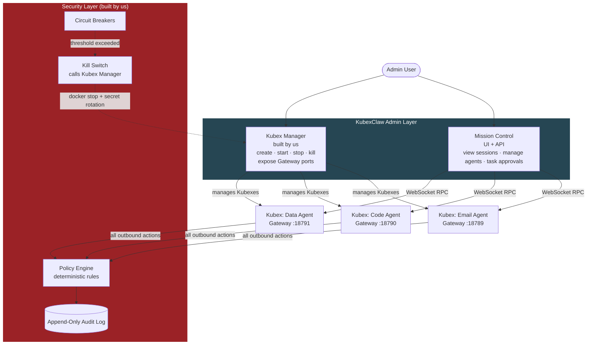
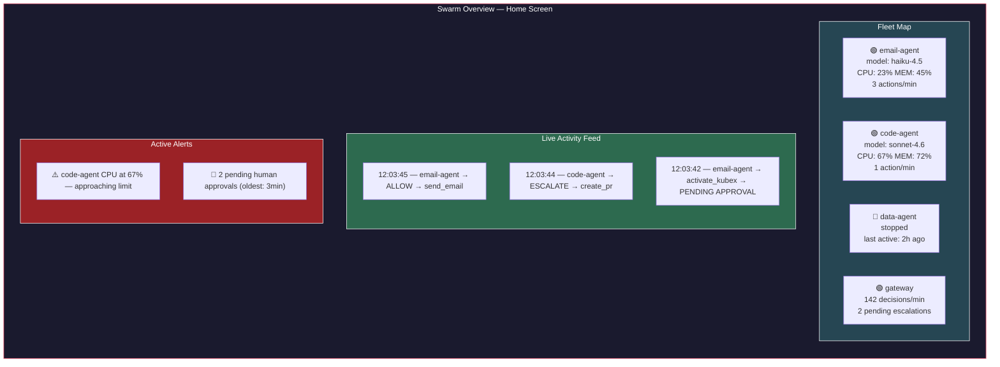
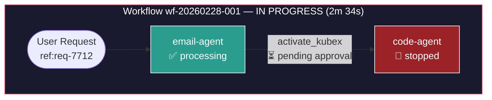
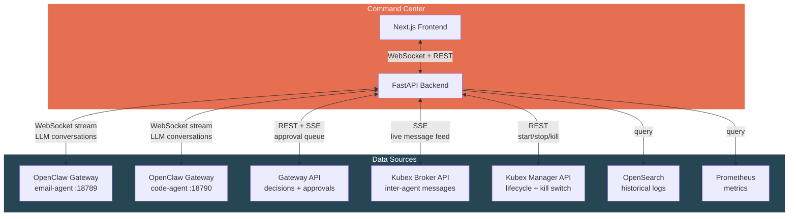
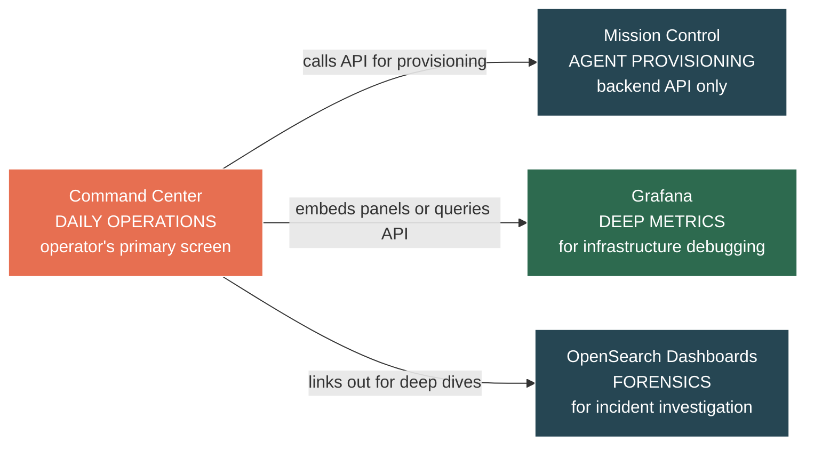

# Command Center & Admin Layer

> Extracted from BRAINSTORM.md. See [KubexClaw.md](../KubexClaw.md) for the full index.

## 7. Admin Layer — Mission Control (Under Investigation)

> **Status: SUPERSEDED** — This section's evaluation is resolved. The admin layer is defined in Section 10 (Command Center) and Section 26 (Human-to-Swarm Interface). Mission Control was not selected.

**Candidate:** [openclaw-mission-control](https://github.com/abhi1693/openclaw-mission-control) by `abhi1693`

**What it is:** A full-stack centralized admin platform (Next.js + FastAPI + PostgreSQL) that connects to multiple OpenClaw Gateway instances via WebSocket. Docker Compose native — no Kubernetes dependency.

**Stack:** Next.js frontend (port 3000), Python/FastAPI backend (port 8000), PostgreSQL. Auth via bearer token or Clerk JWT. *(Note: Mission Control is evaluated and rejected — see Section 14. Ports listed are Mission Control's defaults, not KubexClaw assignments.)*

### What It Covers

- **Multi-tenant hierarchy** — org → board group → board → agents — maps well to managing Kubexes
- **Session visibility** — list sessions, view session history, send messages into active sessions via Gateway API
- **Task-level approval workflows** — pending → approved/rejected lifecycle with SSE real-time streaming and agent notification
- **Agent provisioning & lifecycle** — CRUD agents, heartbeat tracking, SSE state streaming
- **Activity feed** — real-time event streaming filtered by board permissions
- **Metrics** — active agents, tasks in progress, error rate, cycle time with configurable time windows
- **Skills marketplace & agent templates** — centralized skill and identity management
- **Actively maintained** — daily commits, 540+ stars, 826 commits, 5 contributors (as of 2026-02-22)

### Gaps for Our Security-First Architecture

| Gap | Severity | Mitigation Strategy |
|-----|----------|---------------------|
| No kill switch — only delete, no pause/stop | 🔴 Critical | Build externally: `docker stop` + secret rotation via our own control script |
| No operation-level policy gating — approvals are task-scoped, not action-scoped | 🔴 Critical | Our Policy Engine (Section 2) remains a separate service; Mission Control is UI only |
| No comprehensive audit logging — activity feed tracks task comments, not full agent I/O | 🟡 High | Route all agent output through our I/O Gateway (Section 3) which logs to append-only store |
| Coarse auth model — org-admin or bearer token, no fine-grained RBAC | 🟡 High | Acceptable initially; extend or front with a reverse proxy for RBAC later |
| No cost / token tracking | 🟠 Medium | Add separately via LLM API usage monitoring |
| Gateway integration still stabilizing — open bugs on connectivity (issues #139, #150, #158, #159) | 🟠 Medium | Monitor project; pin to stable release |

### Claworc — Evaluated and Rejected

[Claworc](https://github.com/gluk-w/claworc) was evaluated as a Docker container lifecycle manager to complement Mission Control. **It is architecturally incompatible.**

- Claworc tunnels all instance ports (including Gateway 18789) through internal SSH tunnels
- These tunnels are consumed only by Claworc's own dashboard — no external WebSocket access
- Mission Control requires direct WebSocket connections to each Gateway for orchestration
- No way to combine them without forking Claworc and breaking its security model
- Additionally: project is only 2.5 weeks old (created 2026-02-06), 71 stars, requires Docker socket mount (`/var/run/docker.sock`)

### Proposed Architecture — Kubex Manager + Mission Control

The admin layer is split into three components:

1. **Kubex Manager (built by us)** — thin service using Docker SDK for Kubex lifecycle (create, start, stop, kill, restart). Exposes Gateway ports so Mission Control can connect. Handles secret mounts, network isolation, resource limits. ~200 lines of Python.
2. **Mission Control** — connects to exposed Gateways for agent orchestration, session visibility, task management, and approval workflows.
3. **Security Layer (built by us)** — Policy Engine, audit logging, circuit breakers, kill switch (calls Kubex Manager to stop Kubexes + rotate secrets).



### Kubex Manager — Requirements

The Kubex Manager service needs to:
- Create Kubexes from pinned OpenClaw images with per-agent config
- Assign each Kubex to its own isolated Docker network
- Mount secrets read-only (no env vars)
- Set resource limits (CPU, memory)
- Expose each Kubex's Gateway port (18789) on a unique host port
- Provide REST API for lifecycle operations (start, stop, kill, restart, status)
- Register new Kubexes with Mission Control and Kubex Registry (or provide a discovery endpoint)
- Support emergency kill: stop Kubex + rotate secrets + log the event

### Alternatives Still on Radar

- ~~[**ClawControl**](https://github.com/jakeledwards/ClawControl) — Advertises kill switches and cryptographic execution envelopes. Licensing/open-source status unclear. Worth revisiting if it turns out to be open source.~~ **Evaluated — see Section 14.**
- [**crshdn/mission-control**](https://github.com/crshdn/mission-control) — Lighter alternative (Next.js + SQLite), Kanban task board, AI-assisted planning. Fallback if abhi1693 version proves too unstable.

### Action Items
- [ ] Deploy Mission Control locally via Docker Compose and evaluate hands-on
- [ ] Test Gateway connectivity with a single Kubex
- [ ] Verify session history API returns sufficient detail for monitoring Kubex communications
- [ ] Assess whether approval workflow can be extended or if our Policy Engine fully replaces it
- [ ] Evaluate open bugs (#139, #150, #158, #159) — are they blockers for our use case?
- [ ] Design Kubex Manager REST API schema (endpoints, auth, error handling)
- [ ] Prototype Kubex Manager — Python + Docker SDK, Kubex lifecycle + port mapping
- [ ] Define Kubex discovery mechanism (how Mission Control and Kubex Registry find new Gateways)

---

## 10. KubexClaw Command Center

**Problem:** The current tooling is fragmented — Mission Control for agent sessions, Grafana for metrics, OpenSearch Dashboards for logs, and nothing for watching live LLM conversations or inter-agent message flow. An operator needs **one screen** to understand what the swarm is doing, watch any agent think in real-time, and intervene when needed.

**Decision:** Build a custom **KubexClaw Command Center** — a web UI that is the single operational interface for the entire swarm. Mission Control is repurposed as the agent provisioning backend, but the day-to-day operating screen is the Command Center.

### What It Replaces vs What It Wraps

| Current Tool | Command Center Relationship |
|--------------|----------------------------|
| Mission Control | Backend only — Command Center calls its API for agent provisioning, but operators don't use the MC UI directly |
| Grafana dashboards | Embedded panels — Grafana iframes or API-driven charts within Command Center |
| OpenSearch Dashboards | Replaced for daily ops — Command Center queries OpenSearch directly; OS Dashboards kept for deep forensic investigation |
| Kubex Manager API | Called directly — Command Center is the UI for lifecycle operations |

### Core Views

#### 1. Swarm Overview (Home Screen)

The landing page — live map of the entire fleet.



- Click any Kubex tile → opens the **Agent Detail View**
- Click any feed item → opens the **action detail** with full context
- Click any alert → opens the relevant view with pre-filtered context

#### 2. Agent Detail View (Click into a Kubex)

Deep dive into a single Kubex — **the key view**. This is where you watch an agent work.

**Tab: LLM Conversation (Live)**

Real-time stream of the agent's conversation with its LLM. Every prompt sent and every response received, as it happens.

```
┌─────────────────────────────────────────────────────┐
│  email-agent-01 — LLM Conversation (LIVE)           │
│  Model: claude-haiku-4.5 │ Tokens: 2,847 │ $0.0023  │
├─────────────────────────────────────────────────────┤
│                                                     │
│  [SYSTEM] You are an email processing agent...      │
│                                                     │
│  [USER/TASK] Process inbox, workflow wf-20260228-01 │
│                                                     │
│  [ASSISTANT] I'll check the inbox for new emails.   │
│  → Action: read_inbox                               │
│  → Status: ✅ ALLOWED by policy engine              │
│                                                     │
│  [TOOL RESULT] 3 new emails found...                │
│                                                     │
│  [ASSISTANT] Email #1 is a bug report. I need to    │
│  create an issue. Let me check who can do that.     │
│  → Action: query_registry(create_issue)             │
│  → Status: ✅ ALLOWED                               │
│                                                     │
│  [ASSISTANT] code-agent is stopped. Submitting      │
│  activation request with plan...                    │
│  → Action: activate_kubex(code-agent)               │
│  → Status: ⏳ PENDING HUMAN APPROVAL                │
│                                                     │
│  ● streaming...                                     │
└─────────────────────────────────────────────────────┘
```

- **Source:** OpenClaw Gateway WebSocket — streams session messages in real-time
- Each action request is annotated inline with its Gateway decision (allow/deny/escalate)
- Token counter and cost ticker update live
- Model escalation events highlighted when the agent switches models
- Operator can **pause** the agent from this view (sends pause signal via Kubex Manager)

**Tab: Actions & Decisions**

Table of every action this Kubex has submitted, with Gateway verdicts:

| Time | Action | Tier | Decision | Latency | Details |
|------|--------|------|----------|---------|---------|
| 12:03:45 | `send_email` | Medium | ✅ Allow | 12ms | to: team@company.com |
| 12:03:44 | `activate_kubex` | High | ⏳ Pending | — | target: code-agent |
| 12:03:40 | `read_inbox` | Low | ✅ Allow | 3ms | — |

**Tab: Resources**

Embedded Grafana panels for this Kubex: CPU, memory, network I/O, uptime.

**Tab: Config**

Read-only view of the Kubex's config: model allowlist, capabilities, policy rules, secrets (names only, never values).

#### 3. Inter-Agent Message View

Live stream of all messages flowing through the Kubex Broker. The operator sees the full picture of agent collaboration.

```
┌──────────────────────────────────────────────────────────┐
│  Inter-Agent Messages (LIVE)                              │
│  Filter: [All Agents ▼] [All Workflows ▼] [All Types ▼]  │
├──────────────────────────────────────────────────────────┤
│                                                          │
│  12:04:01  email-agent → code-agent                      │
│  workflow: wf-20260228-001 │ depth: 2/5                  │
│  action: create_issue                                    │
│  params: { repo: "backend", type: "bug" }                │
│  status: ✅ DELIVERED                                    │
│  ─ ─ ─ ─ ─ ─ ─ ─ ─ ─ ─ ─ ─ ─ ─ ─ ─ ─ ─               │
│  12:04:15  code-agent → email-agent                      │
│  workflow: wf-20260228-001 │ depth: 2/5 (response)       │
│  result: { issue_key: "PROJ-456", status: "created" }    │
│  status: ✅ DELIVERED                                    │
│  ─ ─ ─ ─ ─ ─ ─ ─ ─ ─ ─ ─ ─ ─ ─ ─ ─ ─ ─               │
│  12:04:16  email-agent → gateway                          │
│  action: send_email (confirmation to reporter)           │
│  status: ✅ ALLOWED                                      │
│                                                          │
└──────────────────────────────────────────────────────────┘
```

- Filter by agent, workflow, message type
- Click any message → expands full structured payload
- Workflow chain visualized as a graph (which agents participated, message flow direction)
- **Blocked/denied messages highlighted in red** with the Gateway's reason

#### 4. Approval Queue

Inline approval interface — no need to switch to a separate tool.

```
┌──────────────────────────────────────────────────────────┐
│  Pending Approvals (2)                                    │
├──────────────────────────────────────────────────────────┤
│                                                          │
│  ⏳ Activation Request — waiting 3m 12s                  │
│  From: email-agent-01 │ Workflow: wf-20260228-001        │
│  Target: code-agent (capability: create_issue)           │
│  Plan:                                                   │
│    Reason: Bug report in inbox, need issue created       │
│    Actions: create_issue(repo:backend, type:bug)         │
│    Duration: 5min (max: 15min)                           │
│  Agent Context:                                          │
│    Denial rate: 2% (normal) │ Last 1h: 14 actions        │
│    Anomaly flags: none                                   │
│                                                          │
│  [ ✅ Approve ] [ ✅ Approve (custom duration) ] [ ❌ Reject ] │
│  ─ ─ ─ ─ ─ ─ ─ ─ ─ ─ ─ ─ ─ ─ ─ ─ ─ ─ ─ ─ ─ ─        │
│  ⏳ Action Escalation — waiting 1m 45s                   │
│  From: code-agent-01 │ Workflow: wf-20260228-001         │
│  Action: create_pr (repo: backend, branch: fix/bug-123) │
│  Tier: High │ Reviewer verdict: ESCALATE                 │
│  Reviewer note: "PR targets main branch — needs human"   │
│                                                          │
│  [ ✅ Approve ] [ ❌ Reject ] [ 👁️ View Agent Chat ]      │
│                                                          │
└──────────────────────────────────────────────────────────┘
```

- "View Agent Chat" opens the LLM Conversation tab for that agent — so the operator can see **what the agent was thinking** before deciding
- Agent behavioral context (from Gateway analysis) shown inline
- Approval/rejection logged immediately to OpenSearch

#### 5. Control Panel (Top Nav — Always Accessible)

Emergency and operational controls — persistent in the top navigation bar.

**Emergency Controls:**
- **Kill single Kubex** — dropdown to select, confirms, calls Kubex Manager (stop + rotate secrets)
- **Kill workflow** — stops all Kubexes participating in a specific workflow chain
- **Kill all** — emergency stop for entire swarm
- Every kill action requires confirmation dialog and is logged with operator identity

**Operational Controls:**
- **Pause / Resume Kubex** — freeze a Kubex without killing it (suspend container, preserve state). Paused Kubexes show as `paused` in fleet map. Resume picks up where it left off.
- **Inject Task** — send a manual task to a specific running Kubex from the UI. Uses the same Structured Action Request format. Goes through the Gateway like any other request.
- **Restart Kubex** — stop and re-start a Kubex with the same config (clears ephemeral state, keeps secrets and policy)
- **Adjust Rate Limits (Live)** — slider to throttle a Kubex's action throughput without restart. Takes effect immediately via Gateway hot-reload.

#### 6. Kubex Configuration Manager

Manage Kubex configs from the UI — no SSH, no file edits, no redeployment required for policy changes.

**Policy Editor:**
- View and edit YAML policy rules per Kubex and global policies
- Syntax validation before save
- Diff view showing what changed
- **Policy versioning** — every save creates a version; rollback to any previous version
- Changes are staged → reviewed → applied (no direct edit to live policy)

**Model Allowlist Manager:**
- View/edit which models each Kubex can use
- Set tier assignments (light/standard/heavy) and cost metadata
- Enforce the zero-overlap rule between worker and reviewer Kubexes (UI warns if violated)
- Adjust auto-select strategy and escalation triggers

**Template Manager:**
- Create/edit/version inter-agent content templates (Section 6)
- Preview template rendering with sample variables
- Assign templates to Kubex roles

**Kubex Provisioning:**
- Create new Kubex from a role template (select role → auto-configure network, secrets, policies, models)
- Clone existing Kubex config to create a variant
- Edit Kubex config: capabilities, `accepts_from` allowlist, resource limits, egress allowlist
- Decommission Kubex: stop → disable in Registry → archive config

#### 7. Workflow Manager

Full visibility and control over workflow chains — not just individual messages.

**Active Workflows:**



- Visual graph of each active workflow chain — which agents are involved, what state they're in, where the chain is blocked
- Click any node → opens that agent's Detail View
- Click any edge → shows the message payload
- **Cancel workflow** — stops all participating Kubexes, logs cancellation reason

**Workflow History:**
- Searchable table of completed workflows
- **Workflow replay** — step through a completed workflow event-by-event in chronological order, showing LLM conversations, actions, decisions, and inter-agent messages as they happened
- Filter by outcome (success/failure/cancelled), duration, agents involved, cost

**Scheduled Workflows:**
- View all cron-triggered and event-triggered workflows (Section 6)
- Create / edit / disable schedules from the UI
- View execution history per schedule
- Next-run countdown timer
- Manual trigger button ("run this scheduled workflow now")

#### 8. Audit & Investigation

Dedicated views for security investigation and compliance — beyond what the live feeds show.

**Audit Trail Browser:**
- Searchable, filterable timeline of every event across the swarm
- Filter by: agent, action type, decision, tier, workflow, time range, operator
- Full-text search across action parameters and context
- Export to CSV/JSON for compliance reporting
- Bookmark events for incident investigation

**Operator Activity Log:**
- Every action taken by a human operator through the Command Center is logged:
  - Approvals / rejections (with response time)
  - Kill switch activations (with reason)
  - Policy changes (with diff)
  - Config modifications
  - Manual task injections
- Operator identity tied to auth (JWT claims)
- Cannot be edited or deleted — append-only like all audit logs

**Security Posture View:**

Per-Kubex security health at a glance:

| Kubex | Risk Score | Denial Rate | Anomaly Flags | Open Alerts | Last Incident |
|-------|-----------|-------------|---------------|-------------|---------------|
| email-agent | 🟢 Low (12) | 2.1% | None | 0 | Never |
| code-agent | 🟡 Medium (45) | 8.7% | High CPU pattern | 1 | 2d ago |
| data-agent | 🟢 Low (8) | 0.4% | None | 0 | Never |

- Risk score calculated from: denial rate, anomaly frequency, escalation rate, resource usage patterns
- Click any agent → opens a security-focused timeline (denials, anomalies, escalations only)

**Incident Investigation Mode:**
- Select a time range and set of agents
- Command Center builds a unified timeline: LLM conversations + actions + decisions + inter-agent messages + resource metrics — all interleaved chronologically
- Annotate events with investigation notes
- Export full incident report (PDF/markdown)

#### 9. Cost & Budget Management

Not just tracking — active budget control.

**Budget Configuration:**
- Set budgets at three levels: **per-task**, **per-Kubex** (daily/weekly/monthly), **global** (daily/weekly/monthly)
- Budget alerts at configurable thresholds (e.g., 50%, 80%, 95%)
- **Hard cap behavior**: when budget is exceeded → pause Kubex, escalate to human, or kill (configurable per Kubex)

**Cost Dashboard:**
- Real-time burn rate ($/hour) per Kubex and total
- Cost breakdown by: agent, model, workflow, action type
- Historical spend charts (daily/weekly/monthly)
- **Forecast** — projected monthly spend based on trailing 7-day average
- Compare actual vs budgeted spend

**Cost Allocation:**
- Tag workflows and tasks with cost centers / project codes
- Generate per-project cost reports
- Identify most expensive workflows and agents

#### 10. Infrastructure Health

Visibility into the platform itself — not just the agents.

**System Status Panel:**

| Component | Status | Details |
|-----------|--------|---------|
| Docker Host | 🟢 Healthy | CPU: 34%, Memory: 58%, Disk: 42% |
| Redis (Broker backend) | 🟢 Healthy | Connected, 23 keys, 0 pending |
| OpenSearch | 🟢 Healthy | 3 indices, 142MB, 0 pending tasks |
| Prometheus | 🟢 Healthy | 847 active targets, 0 scrape failures |
| Kubex Registry | 🟢 Healthy | 6 agents registered, 3 running |
| Kubex Broker | 🟢 Healthy | Queue depth: 2, 0 dead letters |

- Auto-refreshing health checks for every infrastructure component
- **Dependency graph** — shows which services depend on which, highlights impact if a component goes down
- Docker host resources: CPU, memory, disk, network — with historical charts
- **Broker queue depth** — backpressure monitoring; alert if queues are growing faster than draining

**Secret Lifecycle View:**
- Which secrets are mounted to which Kubexes (names only, never values)
- Secret creation date and age
- **Rotation status**: never rotated, last rotated N days ago, overdue for rotation
- Rotation action button → triggers secret rotation via Kubex Manager (stop Kubex → rotate → restart)
- Does NOT display secret values — only metadata

#### 11. Agent Performance & Analytics

Understand which agents are effective and which are problematic.

**Agent Scorecard:**

| Kubex | Task Success Rate | Avg Task Duration | Model Escalation Rate | Cost per Task | Denial Rate |
|-------|------------------|-------------------|-----------------------|---------------|-------------|
| email-agent | 94% | 1m 23s | 12% (light → standard) | $0.004 | 2.1% |
| code-agent | 87% | 4m 56s | 31% (light → heavy) | $0.023 | 8.7% |
| data-agent | 98% | 0m 45s | 3% | $0.001 | 0.4% |

- Track per-agent: success rate, average task duration, model escalation rate, cost efficiency, denial rate
- Historical trends — is an agent getting better or worse over time?
- **Compare agents** — side-by-side performance comparison
- Identify agents that frequently escalate models (may need policy tuning or a better default model)
- Flag agents with declining success rates for investigation

**Reporting:**
- **Daily digest** — auto-generated summary: tasks completed, decisions made, cost, anomalies, pending approvals
- **Weekly report** — trends, top workflows, cost analysis, agent performance changes
- **Compliance export** — full audit trail export for a date range, formatted for compliance review (SOC2, GDPR)
- Reports delivered via email or available as downloads from the Command Center

### Tech Stack

| Component | Technology | Rationale |
|-----------|-----------|-----------|
| Frontend | Next.js (React) | Real-time UI with SSR, same stack as Mission Control — can share components |
| Backend | FastAPI (Python) | Consistent with Kubex Manager and other services; async WebSocket support |
| Real-time transport | WebSocket + SSE | WebSocket for LLM conversation streams (from OpenClaw Gateway); SSE for activity feeds |
| Data queries | OpenSearch client + Prometheus API | Pull logs and metrics for display |
| Auth | Same as Mission Control (bearer token / Clerk JWT) | Single auth system across all admin tools |

### Data Flow



### Relationship to Existing Tools



- **Command Center** = daily operations, live monitoring, approvals, kill switches
- **Mission Control** = agent provisioning backend (create/configure agents, manage skills)
- **Grafana** = deep infrastructure debugging (when you need to investigate a performance issue)
- **OpenSearch Dashboards** = forensic investigation (when you need to trace exactly what happened during an incident)

### Command Center Security Requirements

The Command Center is the single point of operational control for the swarm. Compromise of the Command Center grants an attacker full swarm control. The following security requirements are mandatory:

**Multi-Factor Authentication (MFA):**
- MFA is REQUIRED for all destructive operations: kill agent, policy change, secret rotation, boundary deletion, force-stop workflow.
- Non-destructive read-only operations (viewing dashboards, reading logs) do not require MFA but do require a valid session.
- MFA method: TOTP (time-based one-time password) via authenticator app. WebAuthn/passkey support is post-MVP.

**Session Token Policy:**
- **Idle timeout:** 15 minutes of inactivity invalidates the session.
- **Maximum session duration:** 4 hours absolute. After 4 hours, the user must re-authenticate regardless of activity.
- **Token storage:** HTTP-only, Secure, SameSite=Strict cookies. No localStorage token storage.
- **Concurrent sessions:** Limited to 2 per user account. New session invalidates oldest.

**Network Access Control:**
- IP allowlisting is RECOMMENDED for production deployments. Operators define a list of trusted CIDR ranges; connections from outside these ranges are rejected at the reverse proxy layer.
- Post-MVP: VPN-only access with Cloudflare Access or similar zero-trust gateway.

**Audit Logging:**
- Every Command Center action is logged to the audit trail (OpenSearch `logs-audit-*` index):
  - **Who:** authenticated user identity (email, account ID)
  - **What:** action performed (e.g., `kill_kubex`, `update_policy`, `rotate_secret`, `approve_activation`)
  - **When:** timestamp (ISO 8601, UTC)
  - **Target:** affected resource (Kubex ID, boundary name, policy version)
  - **Result:** success/failure, error details if applicable
- Audit logs are append-only and protected by the tamper-evident guarantees from Section 9.

### Action Items

**Core Infrastructure:**
- [ ] Design Command Center API schema (FastAPI endpoints for all 11 views)
- [ ] Implement WebSocket proxy in backend (aggregate multiple OpenClaw Gateway streams)
- [ ] Implement auth (shared with Mission Control — bearer token / Clerk JWT)
- [ ] Implement MFA for destructive Command Center operations
- [ ] Design the action annotation layer (inline Gateway decisions on LLM conversation stream)
- [ ] Add Command Center to root `docker-compose.yml`
- [ ] Add Command Center to repo structure (`services/command-center/`)

**Monitoring Views (1-4):**
- [ ] Build Swarm Overview home screen (fleet map, live feed, alerts)
- [ ] Build Agent Detail view with LLM Conversation live streaming
- [ ] Build Inter-Agent Message view (live stream from Kubex Broker)
- [ ] Build inline Approval Queue (integrated with Gateway escalation API)

**Control Views (5-6):**
- [ ] Build Control Panel — kill switch, pause/resume, inject task, restart, live rate limit adjustment
- [ ] Build Kubex Configuration Manager — policy editor with versioning, model allowlist manager, template manager, provisioning
- [ ] Implement pause/resume support in Kubex Manager API (`docker pause` / `docker unpause`)
- [ ] Implement Gateway hot-reload for live rate limit changes

**Workflow & Audit Views (7-8):**
- [ ] Build Workflow Manager — active workflow graph visualization, workflow replay, scheduled workflow CRUD
- [ ] Build Audit & Investigation views — audit trail browser, operator activity log, security posture scoring
- [ ] Build Incident Investigation mode — unified cross-agent timeline with annotation and export
- [ ] Define risk score calculation formula (denial rate, anomaly frequency, escalation rate, resource patterns)

**Cost & Infrastructure Views (9-10):**
- [ ] Build Cost & Budget Management — budget configuration at three levels, cost dashboard, forecasting, cost allocation tagging
- [ ] Build Infrastructure Health panel — component health checks, dependency graph, Docker host metrics, Broker queue depth
- [ ] Build Secret Lifecycle view — mount mapping, rotation status, rotation trigger

**Analytics & Reporting (11):**
- [ ] Build Agent Performance Scorecard — success rate, duration, model escalation, cost efficiency, denial rate
- [ ] Implement auto-generated daily digest and weekly report
- [ ] Build compliance export (full audit trail for date range, SOC2/GDPR formatted)

---
