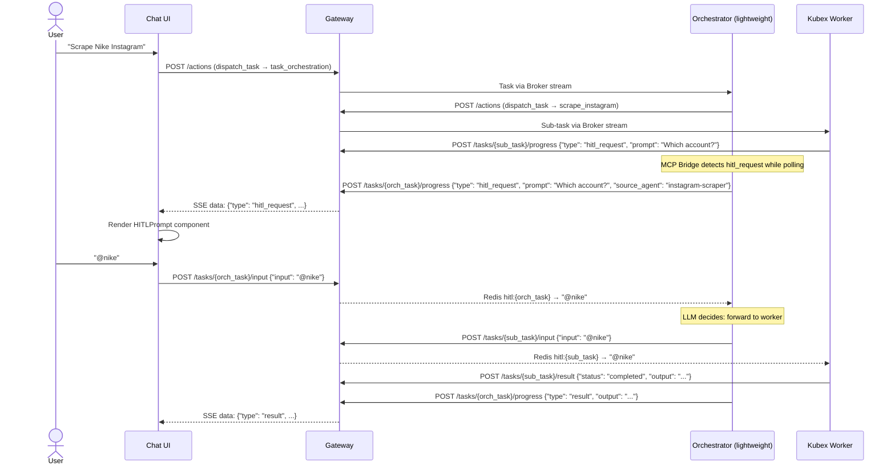
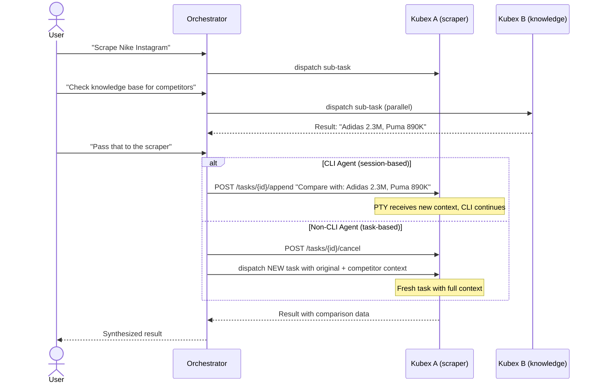

# Design: HITL + Context Routing

> **Status:** Proposed
> **Date:** 2026-03-26
> **Scope:** How the orchestrator mediates human-worker communication, handles mid-task context injection, and routes HITL exchanges.

---

## Core Principle

**The user never talks directly to a worker.** The orchestrator is always the mediator. From the user's perspective, they are having a conversation with the orchestrator in the Command Center chat. The orchestrator dispatches work to kubex agents, routes human responses, and synthesizes results.

The orchestrator uses a **lightweight model** (Haiku-class) — fast and cheap. It doesn't do heavy reasoning; it routes and manages context. The workers (GPT-5.2, o3-mini, Claude Code, etc.) do the heavy lifting.

---

## User Story 1: Worker Asks the Human a Question (HITL)

```
User → "Scrape Nike's Instagram for engagement metrics"
  ↓
Orchestrator (lightweight LLM) → dispatches to instagram-scraper
  ↓
Instagram-scraper: "Nike has @nike, @nikerunning, @nikefootball. Which one?"
  ↓
Question surfaces back to orchestrator
  ↓
Orchestrator forwards question to UI via its own progress channel
  ↓
User sees it in chat, responds: "@nike"
  ↓
Orchestrator LLM sees response, decides: "this answers the worker's question"
  → Forwards "@nike" to instagram-scraper
  ↓
Instagram-scraper resumes, completes, returns result
```

If the user instead says "cancel" or "actually do Adidas":
- Orchestrator LLM recognizes this is directed at itself
- Cancels the worker task
- Handles the new instruction directly

### HITL Data Flow



---

## User Story 2: User Injects Context into a Running Task

```
1. User → Orchestrator: "Scrape Nike's Instagram engagement"
   → Dispatches to kubex A (instagram-scraper) — RUNNING

2. User → Orchestrator: "Check our knowledge base for Nike competitor data"
   → Dispatches to kubex B (knowledge) — RUNNING in parallel

3. Kubex B returns: "We have Adidas and Puma Q1 data"

4. User: "Pass that to the scraper so it can compare"
```

### Routing Rule: Session vs Task

The orchestrator checks the worker's harness mode and routes accordingly:

| Worker type | Harness mode | Action |
|-------------|-------------|--------|
| CLI agent (Claude Code, Gemini CLI, Codex CLI) | `cli-runtime` | **Append** — pipe new context into the running PTY session |
| Standalone / MCP Bridge agent | `standalone`, `mcp-bridge` | **Cancel + re-dispatch** — no persistent session, must restart with enriched context |

#### CLI Agents — Append to Session

CLI agents have a live PTY with conversation memory. New context is written to stdin:

```
Orchestrator → POST /tasks/{task_id}/append
  → Redis append:{task_id} channel
  → CLI Runtime writes to PTY stdin
  → CLI sees it as a new message in its conversation
```

The CLI naturally incorporates the new context without losing progress.

#### Non-CLI Agents — Cancel + Re-dispatch

Non-CLI agents are stateless per-task. The only way to inject context:

```
Orchestrator → POST /tasks/{task_id}/cancel
Orchestrator → POST /actions (dispatch_task)
  with context_message = original_instruction + new_context
```

The orchestrator reconstructs the full context and re-dispatches. The worker starts fresh with everything it needs.

### Context Injection Data Flow



---

## Backend Changes Required

### New Gateway Endpoints

| Endpoint | Purpose |
|----------|---------|
| `POST /tasks/{task_id}/input` | Deliver HITL response — publishes to `hitl:{task_id}` Redis channel |
| `POST /tasks/{task_id}/append` | Deliver additional context to a running CLI task — publishes to `append:{task_id}` Redis channel |

### Gateway Changes

| Change | File | Detail |
|--------|------|--------|
| `request_user_input` action handler | `gateway/main.py` | On receipt, publish `{"type": "hitl_request", ...}` to `progress:{task_id}` so SSE delivers it |
| `POST /tasks/{task_id}/input` | `gateway/main.py` | New endpoint — publishes human response to Redis `hitl:{task_id}` channel (DB 1) |
| `POST /tasks/{task_id}/append` | `gateway/main.py` | New endpoint — publishes context to Redis `append:{task_id}` channel (DB 1) |
| Task status `awaiting_input` | `gateway/main.py` | Recognized in SSE stream — does not close the connection |

### Agent Harness Changes

| Change | File | Detail |
|--------|------|--------|
| Worker HITL emit | `standalone.py`, `mcp_bridge.py` | When tool-use loop encounters `request_user_input`, emit `{"type": "hitl_request"}` via progress channel |
| Worker HITL wait | `standalone.py`, `mcp_bridge.py` | Subscribe to `hitl:{task_id}` Redis channel, block until response (with configurable timeout, default 5 min) |
| MCP Bridge HITL detection | `mcp_bridge.py` | While polling for worker result, also monitor `progress:{sub_task_id}` for `hitl_request` events |
| MCP Bridge HITL forwarding | `mcp_bridge.py` | Forward worker question to orchestrator's own `progress:{orch_task_id}` channel |
| MCP Bridge HITL delivery | `mcp_bridge.py` | When orchestrator receives human response, forward to worker's `hitl:{sub_task_id}` |
| CLI Runtime append listener | `cli_runtime.py` | Subscribe to `append:{task_id}` channel, write received content to PTY stdin |

### Redis Channels (New)

| Channel | DB | Purpose |
|---------|-----|---------|
| `hitl:{task_id}` | 1 | Human response delivery to waiting agent |
| `append:{task_id}` | 1 | Additional context delivery to running CLI session |

### Task Status (New)

| Status | Meaning |
|--------|---------|
| `awaiting_input` | Agent paused, waiting for human response via HITL |

---

## Orchestrator LLM Routing Logic

The orchestrator's tool-use loop handles HITL responses as follows:

When a HITL response arrives from the human, it is presented to the orchestrator LLM as a tool result:

```
System: The worker "instagram-scraper" asked: "Nike has @nike, @nikerunning,
@nikefootball. Which account?"

Human responded: "@nike"

Decide: should this response be forwarded to the worker, or is the human
talking to you (the orchestrator)?
```

The lightweight LLM classifies and acts:
- **Forward to worker** → calls `forward_hitl_response(sub_task_id, "@nike")`
- **Cancel worker** → calls `cancel_task(sub_task_id)`, responds to user
- **New instruction** → calls a different tool, dispatches new work

This classification is trivial for even a small model — it's pattern matching on intent, not complex reasoning.

---

## Out of Scope

- Multi-turn conversation history persistence across tasks (future — requires conversation store)
- Direct user-to-worker communication (violates security model)
- Real-time stdout streaming from CLI agents to UI (deferred per PROJECT.md)
- Concurrent HITL from multiple workers (handle sequentially for v1)

---

*Design: HITL + Context Routing*
*Author: Architecture session 2026-03-26*
