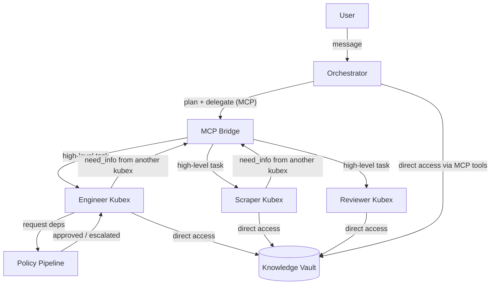
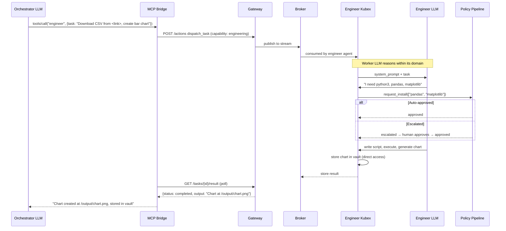
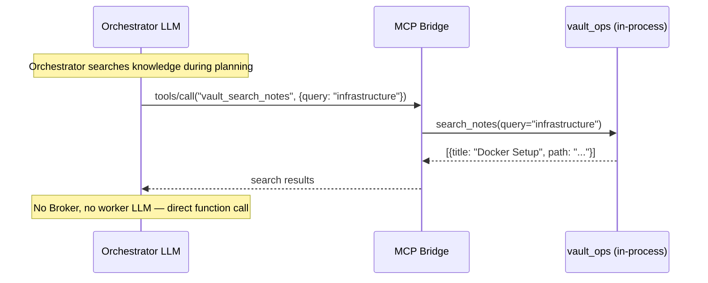
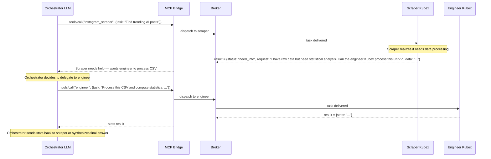
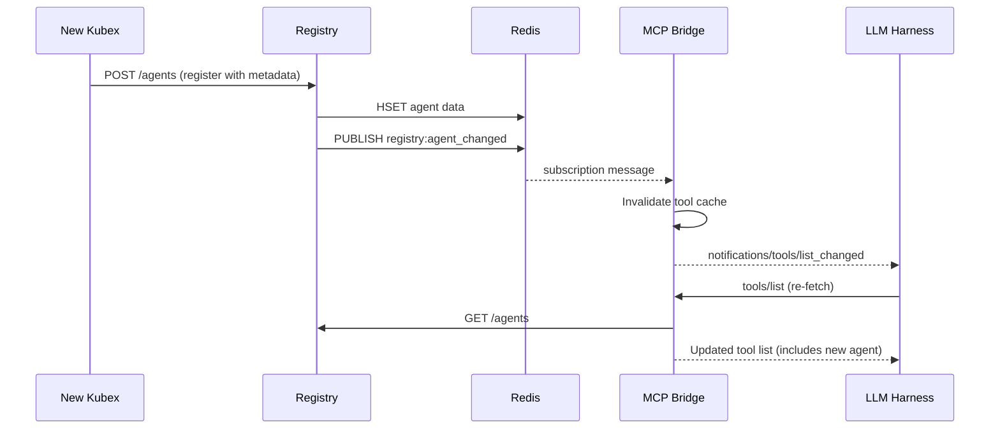
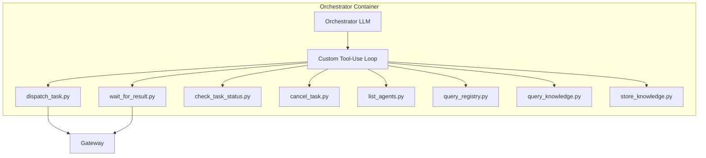
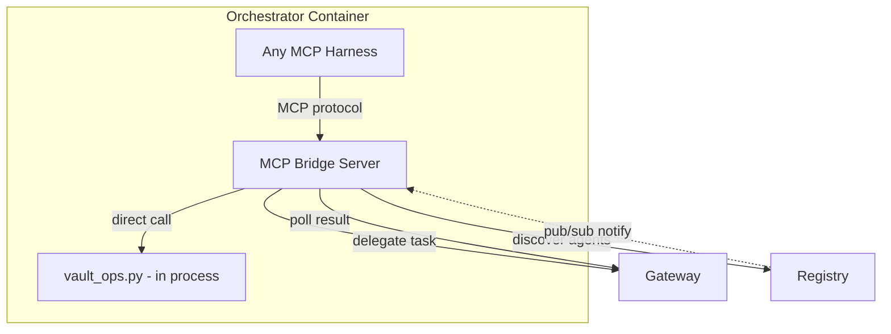
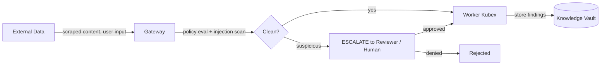

# MCP Bridge — Orchestrator Agent Design

## Overview

The MCP Bridge replaces the orchestrator's custom tool-use loop with a standard MCP (Model Context Protocol) server. Worker Kubex agents are exposed as MCP tools, allowing any MCP-compatible LLM harness (Claude Code, Codex CLI, Gemini CLI) to orchestrate agents without custom dispatch code.

---

## Agent Roles

### Orchestrator = Project Manager

The orchestrator receives tasks from users, **plans** how to solve them, and **delegates** to the right worker Kubex. It decides **WHO** does the work and **WHAT** the work is. It never performs domain work directly.

### Workers = Domain Specialists

Each worker Kubex is an autonomous specialist within its domain. It receives a high-level task (natural language), **reasons about HOW** to accomplish it, determines what tools and dependencies it needs, requests resources through the policy pipeline, executes using its own tools, and returns results. Workers have their own LLM and full autonomy within their domain.

### Knowledge Vault = Shared Infrastructure

The Obsidian-style knowledge vault is **shared memory** — not a delegated agent. Every Kubex can read/write the vault directly via local tools. This is like a shared filesystem, not a capability that gets dispatched.



---

## Two Types of MCP Tools

The MCP bridge exposes two categories of tools to the orchestrator's LLM:

### 1. Worker Delegation Tools (One Per Agent)

Each worker Kubex becomes **one MCP tool** with a natural language task input. The orchestrator describes WHAT to do; the worker figures out HOW.

| MCP Tool | Description |
|----------|-------------|
| `engineer` | Delegate a software engineering task |
| `instagram_scraper` | Delegate a social media data collection task |
| `reviewer` | Delegate a security/policy review task |

Schema (same for all workers):
```json
{
  "name": "engineer",
  "description": "Software engineering specialist. Can write code, create scripts, install dependencies, build tools. Delegate coding and technical tasks here.",
  "parameters": {
    "type": "object",
    "properties": {
      "task": {
        "type": "string",
        "description": "Natural language description of what you need the engineer to do"
      }
    },
    "required": ["task"]
  }
}
```

The worker receives this as `context_message`, and its own LLM + tools take over.

### 2. Knowledge Vault Tools (Direct Access)

The knowledge vault tools are exposed **individually** because the orchestrator uses them directly during planning and synthesis — no delegation, no worker LLM involved.

| MCP Tool | Description |
|----------|-------------|
| `vault_create_note` | Create a new note in the vault |
| `vault_update_note` | Update an existing note |
| `vault_search_notes` | Search notes by query/tag/folder |
| `vault_get_note` | Read a specific note |
| `vault_list_notes` | List notes in a folder |
| `vault_find_backlinks` | Find notes linking to a given note |

These execute directly (no Broker dispatch, no worker LLM) — the MCP bridge calls the vault_ops functions in-process.

---

## Data Flow

### Worker Delegation Flow



### Knowledge Direct Access Flow



### Worker Requests Help From Another Kubex



---

## Agent Discovery

### Registration with Description

Each agent's `config.yaml` includes a `description` field that explains what the agent does. This becomes the MCP tool description.

```yaml
# agents/knowledge/config.yaml
agent:
  id: "knowledge"
  description: >
    Knowledge management agent. Maintains an Obsidian-style markdown vault
    as organizational memory. Can create, update, search, and link notes.
    Use for storing insights, facts, events, or any information that
    should be remembered long-term.
```

Workers register with their description + tool metadata:

```python
json={
    "agent_id": self.config.agent_id,
    "capabilities": self.config.capabilities,
    "status": "running",
    "boundary": self.config.boundary,
    "metadata": {
        "description": self.config.description,
        "tools": self.tool_definitions,
    },
}
```

### Live Discovery via Pub/Sub

When a new Kubex registers, the MCP bridge is notified immediately.



---

## Why Workers Keep Their Own LLM

The original Gap 1 analysis identified "two LLM calls" as wasteful. With the corrected architecture, the two LLM calls serve **different purposes**:

| | Orchestrator LLM | Worker LLM |
|---|---|---|
| **Decides** | WHO does the work, WHAT the work is | HOW to accomplish it within the domain |
| **Scope** | Cross-agent planning and synthesis | Single-domain execution |
| **Example** | "The engineer should build a chart from this CSV" | "I'll use pandas to read CSV, matplotlib for the chart, need to pip install both first" |

The worker LLM is **not redundant** — it provides domain-specific reasoning that the orchestrator shouldn't need to know about. The orchestrator doesn't need to know that pandas is the right library for CSV processing or that matplotlib generates charts.

### When Direct Execution Still Makes Sense

Knowledge vault tools bypass the worker LLM because they are **simple CRUD operations** with well-defined inputs/outputs. There's no domain reasoning needed to call `create_note(title, content)`. The orchestrator knows exactly what it wants to store.

If other Kubex tools are similarly mechanical (no reasoning needed), they could also be exposed as direct MCP tools. But the default for domain workers is delegation with LLM reasoning.

---

## MCP Bridge Meta-Tools

In addition to worker and vault tools, the bridge exposes utility tools:

| MCP Tool | Description |
|----------|-------------|
| `kubex__list_agents` | List all registered agents, their capabilities, and descriptions |
| `kubex__agent_status` | Check if a specific agent is running |
| `kubex__cancel_task` | Cancel a previously dispatched task |

---

## Architecture Comparison

### Before (Custom Tool Loop)



### After (MCP Bridge)



The 8 custom Python tool handlers, the custom tool-use loop, and the OpenAI API integration are all replaced by the standard MCP protocol. Any MCP-compatible harness works — no custom code needed.

---

## Config Changes

### `AgentConfig` Model

```python
class AgentConfig(BaseModel):
    agent_id: str = ""
    description: str = ""        # NEW — becomes MCP tool description
    boundary: str = "default"    # NEW — was only in registration payload
    model: str = "gpt-5.2"
    skills: list[str] = Field(default_factory=list)
    capabilities: list[str] = Field(default_factory=list)
    harness_mode: str = "standalone"  # standalone | mcp-bridge
    gateway_url: str = "http://gateway:8080"
    broker_url: str = "http://kubex-broker:8060"
```

### Orchestrator `config.yaml`

```yaml
agent:
  id: "orchestrator"
  description: >
    Central orchestrator. Receives user tasks, plans execution strategy,
    and delegates to specialist Kubex agents. Synthesizes results.
  model: "gpt-5.2"
  harness_mode: "mcp-bridge"    # NEW — runs MCP server instead of standalone loop
  boundary: "default"
  gateway_url: "http://gateway:8080"
  broker_url: "http://kubex-broker:8060"

  # skills no longer needed — MCP bridge replaces task-management skill
  skills: []

  capabilities:
    - "task_orchestration"
    - "task_management"
```

---

## File Changes

| File | Action | Description |
|------|--------|-------------|
| `agents/_base/kubex_harness/mcp_bridge.py` | **New** | MCP server: worker delegation tools, vault direct tools, meta-tools, pub/sub, caching |
| `agents/_base/kubex_harness/standalone.py` | Modify | Include `metadata.tools` + `metadata.description` in registration payload |
| `agents/_base/kubex_harness/config_loader.py` | Modify | Add `description`, `boundary` to `AgentConfig`; parse from YAML |
| `agents/_base/kubex_harness/main.py` | Modify | Add `mcp-bridge` harness_mode routing |
| `agents/_base/pyproject.toml` | Modify | Add `mcp` SDK dependency |
| `agents/orchestrator/config.yaml` | Modify | Add `description`, change `harness_mode` to `mcp-bridge`, remove skills |
| `agents/knowledge/config.yaml` | Modify | Add `description` |
| `agents/instagram-scraper/config.yaml` | Modify | Add `description` |
| `agents/reviewer/config.yaml` | Modify | Add `description` |
| `services/registry/registry/store.py` | Modify | Add `PUBLISH` on register/deregister for pub/sub notification |
| `tests/unit/test_mcp_bridge.py` | **New** | Unit tests for MCP bridge |
| `tests/integration/test_mcp_bridge_integration.py` | **New** | Integration tests |

---

## What Stays Untouched

- **Broker**: Same Redis streams, same API
- **Gateway**: Same `/actions` endpoint, same policy engine
- **Registry API**: No endpoint changes — `metadata` field already exists
- **Redis**: No schema changes
- **Worker agents**: No changes — they keep `harness_mode: standalone` and their own LLM + tools
- **Policy engine**: Orchestrator still dispatches via Gateway, policy still applies
- **task-management skill**: Kept in repo as fallback for `standalone` mode

---

## Security Architecture

### Defense Model: Gateway Ingress Scanning

All external data enters the system through the Gateway, which runs the policy engine. Injection detection happens **at the boundary**, not at the storage layer. Content that passes the Gateway is considered safe to store and share.



**Why not scan at the vault layer?**
- The vault is shared institutional memory — all Kubex read/write freely. Adding a scanner here would use an LLM to detect prompts designed to fool LLMs. The defender and attacker use the same technology.
- The Gateway already inspects every action. Strengthening its ingress scanning (deterministic pattern matching + reviewer Kubex escalation for ambiguous cases) is the right investment.
- The reviewer Kubex uses a different model (o3-mini) specifically for anti-collusion — harder to fool with the same payload that targets GPT-5.2 workers.

### Git Attribution: Full Traceability

Every vault commit carries two identities:

| Git Field | Value | Purpose |
|-----------|-------|---------|
| **Author** | The Kubex agent that performed the write | Trace which agent created/modified content |
| **Committer** | The human user whose session triggered the chain | Trace which user's request led to this change |

```
Author: knowledge <knowledge@kubex.local>
Committer: user-123 <user-123@kubex.local>

[knowledge] Create note: events/first-boot-2026-03-21.md
```

Forensic queries:
- `git log --author=knowledge` — everything the knowledge agent wrote
- `git log --committer=user-123` — everything triggered by user 123's sessions
- `git log --author=instagram-scraper --since="2026-03-20"` — recent scraper activity (first place to look if poisoning suspected)

**Implementation:** The `user_id` is threaded through the dispatch chain:
1. User sends request to orchestrator (via Command Center or API) with `user_id`
2. Orchestrator includes `user_id` in dispatch payload to workers
3. Workers pass `user_id` to `vault_ops` on every write
4. `_auto_commit_and_push()` sets `GIT_AUTHOR_NAME` / `GIT_COMMITTER_NAME` from agent_id / user_id

### Multi-User Isolation (Future Design)

Multiple human users will share the same KubexClaw deployment. The isolation model:

| Layer | Shared or Isolated | Rationale |
|-------|-------------------|-----------|
| **Knowledge vault** | Shared | Institutional memory — the whole point is that everyone benefits from accumulated knowledge |
| **Orchestrator conversations** | Isolated per user | User A must not see User B's chat history, in-progress queries, or task results |
| **Worker execution** | Shared pool | Workers are stateless between tasks — any worker can handle any user's task |
| **Task results** | Isolated per user | Results are tied to the originating user's session |

Key design considerations for future implementation:
- **Session isolation**: Each user gets a unique session ID. The orchestrator maintains separate conversation histories per session. Task results are scoped to the session that created them.
- **Vault visibility**: All users see all vault content (shared knowledge). A user can see WHO wrote a note (git attribution) but cannot restrict others from reading it.
- **Audit trail**: Every action is traceable to a human user via git committer + Gateway request logs. Compliance and incident response can reconstruct the full chain: user → orchestrator → worker → vault write.
- **Future RBAC**: Role-based access control could scope which Kubex agents a user can invoke (e.g., interns can't trigger the engineer Kubex) and which vault folders a user can write to. Not needed for v1.2 but the attribution plumbing enables it.

---

## Identified Gaps

| # | Gap | Severity | Fix |
|---|-----|----------|-----|
| 1 | Capability-to-agent routing ambiguity (multiple agents, multiple capabilities) | Medium | Dispatch by primary capability (first in list); agent-id consumer group as future enhancement |
| 2 | Concurrent tool calls from LLM | Medium | `asyncio.gather()` for parallel dispatch+poll |
| 3 | MCP transport — stdio only, no external access | Medium | Support both stdio and SSE, config-driven |
| 4 | New agent discovery is pull-based (stale cache) | Medium | Redis pub/sub on register + MCP `notifications/tools/list_changed` |
| 5 | Timeout cascade — orphaned tasks on bridge timeout | Medium | Cancel task on timeout, configurable alignment |
| 6 | Worker "need_info" protocol not yet defined | Medium | Define structured response format for workers requesting cross-Kubex help |
| 7 | Knowledge vault tools need to be available to ALL Kubex locally | Medium | Mount vault_ops as a shared skill or include in base image |
| 8 | Old `query_knowledge`/`store_knowledge` tools redundant | Low | Not loaded in `mcp-bridge` mode |
| 9 | Tool schema format mismatch (manifest vs MCP) | Low | OpenAI function params are already JSON Schema — trivial mapping |
