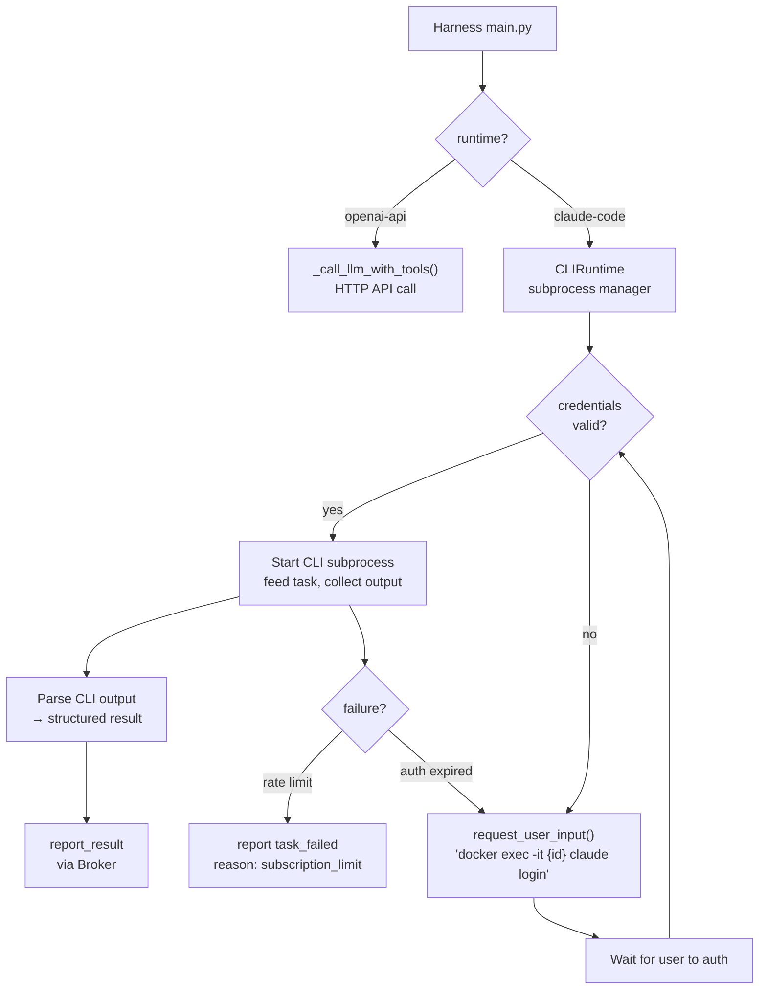

# Design: Generic OAuth CLI Runtime Mode

> v1.2 design direction — extend the harness to support any OAuth-authenticated CLI as an LLM runtime.

---

## Problem

Currently every Kubex calls LLM APIs directly (OpenAI, Anthropic) using API keys. This means every token is billed at API rates. Most developers already have subscription plans (Claude Pro/Max, ChatGPT Plus, Gemini Advanced) that include generous usage — but those plans authenticate via OAuth, not API keys.

We want Kubexes to be able to run subscription-authenticated CLI tools (Claude Code, Codex CLI, Gemini CLI) as their LLM runtime, so operators can use their existing subscriptions instead of paying API rates.

---

## Design Principle

**The Kubex is a universal shell that can run any LLM runtime** — API-based or CLI-based, subscription or pay-per-token. This is the stem cell philosophy extended to the LLM layer.

The harness doesn't care which CLI it is. The `config.yaml` declares the runtime:

```yaml
agent:
  id: "orchestrator"
  runtime: "claude-code"    # or "codex-cli" or "gemini-cli" or "openai-api"
  model: "claude-sonnet-4-6"
  # ...
```

---

## Supported Runtimes

| Runtime | Auth Method | CLI Command | Credential Location |
|---------|------------|-------------|-------------------|
| `openai-api` | API key (env var) | Direct HTTP calls | `OPENAI_API_KEY` |
| `anthropic-api` | API key (env var) | Direct HTTP calls | `ANTHROPIC_API_KEY` |
| `claude-code` | OAuth (browser login) | `claude` CLI | `~/.claude/` |
| `codex-cli` | OAuth (browser login) | `codex` CLI | `~/.codex/` |
| `gemini-cli` | OAuth (browser login) | `gemini` CLI | `~/.gemini/` or `~/.config/` |

API-key runtimes work as today. OAuth runtimes follow the new provisioning flow below.

---

## Architecture

### Harness Routing

`main.py` already routes by `harness_mode`. The new `runtime` field adds a second axis:

```
config.yaml runtime field
  → "openai-api" / "anthropic-api"  →  existing _call_llm_with_tools() (HTTP)
  → "claude-code" / "codex-cli" / "gemini-cli"  →  new CLIRuntime subprocess manager
```

### CLIRuntime Subprocess Manager

A new module in the harness that:

1. **Starts the CLI as a subprocess** inside the container
2. **Feeds it the task** via stdin/prompt argument
3. **Streams output** and parses structured results
4. **Detects failures**: subscription limit hit, auth expired, crash
5. **Reports results** back through the existing Broker pipeline



---

## OAuth Provisioning Flow

When a Kubex with an OAuth runtime starts:

```
1. Container starts, harness reads config.yaml
2. runtime = "claude-code" → CLIRuntime activates
3. CLIRuntime checks ~/.claude/ for valid credentials
4. If missing or expired:
   a. Harness sends request_user_input to orchestrator:
      "Authenticate Claude Code for agent {id}:
       docker exec -it kubexclaw-{id} claude login"
   b. User execs into container, completes OAuth in browser
   c. CLIRuntime detects credentials appear (file watch or poll)
   d. Boot continues
5. If valid: start accepting tasks immediately
```

### Re-authentication

When credentials expire mid-session:

1. CLI subprocess exits with auth error
2. CLIRuntime detects the failure pattern
3. Sends `request_user_input` asking user to re-auth
4. Waits for user to `docker exec` in and re-login
5. Resumes processing tasks

This uses the existing HITL mechanism — no new infrastructure needed.

---

## Failure Handling

| Failure | Detection | Response |
|---------|-----------|----------|
| Subscription limit reached | CLI exits with rate limit error | `task_failed` with `reason: subscription_limit_reached` |
| Auth expired | CLI exits with auth error | HITL re-auth flow |
| CLI crash | Subprocess exits non-zero | Retry once, then `task_failed` |
| CLI not installed | Subprocess start fails | `task_failed` with `reason: runtime_not_available` |

All failures report back through the existing Broker pipeline. The orchestrator handles them like any other task failure.

---

## Security Considerations

- **OAuth tokens inside containers**: Accepted risk. The Gateway policy engine still controls what actions the agent can take. The token only authenticates the LLM — it doesn't bypass policy.
- **Token isolation**: Each Kubex gets its own OAuth session. No token sharing between containers.
- **Exfiltration risk**: Same as API keys today. Gateway egress controls prevent the agent from sending credentials to external services.
- **Not headless**: The container is an interactive environment. The user can `docker exec -it` into it at any time. This is no different from running the CLI on a workstation.

---

## What Stays The Same

Everything outside the harness LLM call is unchanged:

- Gateway still enforces policy on all actions
- Broker still queues and routes tasks
- Registry still tracks agent capabilities
- Kill switch still works (stop container = stop CLI)
- Skills are still markdown files injected into the prompt
- Config.yaml is still the sole source of truth
- Stem cell architecture is preserved

---

## Implementation Scope

### New
- [ ] `CLIRuntime` subprocess manager in harness
- [ ] `runtime` field in config.yaml schema
- [ ] Credential detection + file watcher for OAuth tokens
- [ ] HITL auth flow integration (uses existing `request_user_input`)
- [ ] CLI output parser (stdout → structured result)
- [ ] Failure pattern detection per CLI type

### Unchanged
- Gateway, Broker, Registry, Manager — no changes
- Policy engine — no changes
- Skill injection — no changes
- Kill switch — no changes

---

*Design captured: 2026-03-20*
*Status: Proposed for v1.2*
