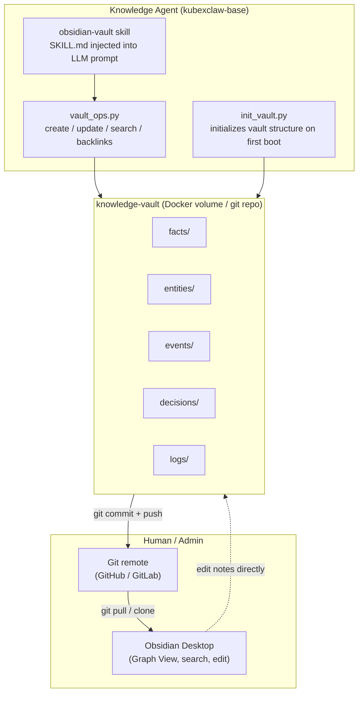
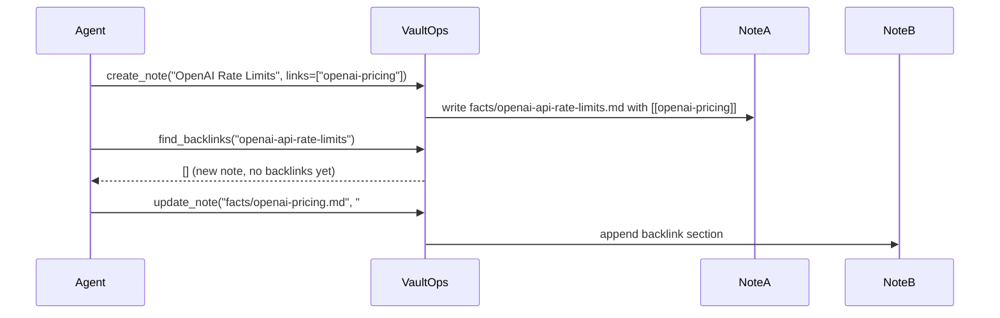
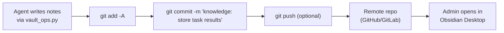

# Design: Obsidian Markdown Knowledge Vault

## Overview

The KubexClaw knowledge layer has been redesigned from a heavyweight
Neo4j + Graphiti + OpenSearch stack to an **Obsidian-style markdown vault**
hosted in a git repository.

The key insight: **`[[wiki-links]]` in plain markdown files create a
knowledge graph that is both machine-readable and human-readable.**
Any team member can open the vault in Obsidian and browse it visually.
Any agent can search it with simple string matching — no database required.

## Architecture



## Vault Directory Structure

```
knowledge-vault/
├── .obsidian/
│   ├── app.json          ← wiki-link mode enabled
│   └── workspace.json    ← minimal valid workspace
├── .git/                 ← git history of all knowledge changes
├── README.md             ← human-readable vault guide
├── facts/                ← discrete facts and measurements
├── entities/             ← named entities (companies, people, products)
├── events/               ← timestamped occurrences
├── decisions/            ← architectural decisions with rationale
├── logs/                 ← workflow run logs and task summaries
└── templates/
    ├── fact.md
    ├── entity.md
    └── event.md
```

## Note Format Specification

Every note is a plain markdown file with YAML frontmatter:

```markdown
---
title: "OpenAI API Rate Limits"
type: fact
tags: [api, openai, rate-limits]
created: 2026-03-20
modified: 2026-03-20
source: "task-abc123"
---

# OpenAI API Rate Limits

The OpenAI API enforces rate limits per organization:
- GPT-4: 10,000 TPM (tokens per minute)
- GPT-3.5-turbo: 90,000 TPM

## Related
- [[openai-pricing]] — cost implications of rate limits
- [[api-retry-strategy]] — how we handle 429 responses
- [[llm-provider-comparison]] — rate limits across providers
```

### Frontmatter Schema

| Field      | Type          | Required | Description                                      |
|------------|---------------|----------|--------------------------------------------------|
| `title`    | string        | yes      | Human-readable title                             |
| `type`     | enum          | yes      | `fact`, `entity`, `event`, `decision`, `log`     |
| `tags`     | string list   | yes      | Lowercase kebab-case tags                        |
| `created`  | date          | yes      | `YYYY-MM-DD` when note was first created         |
| `modified` | date          | yes      | `YYYY-MM-DD` when note was last updated          |
| `source`   | string        | no       | Task ID, workflow ID, or URL of origin           |

### Filename Convention

Files use lowercase kebab-case derived from the title concept:
- `openai-api-rate-limits.md`
- `nike-instagram-follower-count.md`
- `api-retry-strategy.md`

## Wiki-Link Conventions

Links use standard Obsidian syntax:

```markdown
[[note-name]]                     ← basic link
[[note-name|display text]]        ← link with custom display text
#tag                              ← inline tag
```

Obsidian resolves links by filename (without `.md`), not by path.
This means `[[openai-pricing]]` resolves to `facts/openai-pricing.md`
regardless of where the referencing note lives.

## How Backlinks Create the Knowledge Graph

When agent creates note A that links to note B:



This bidirectional linking builds the graph. Obsidian renders it in **Graph View**
as an interactive node diagram where you can see knowledge clusters.

## Git Flow



Git operations are **optional** — the vault works without git for development
and testing. `commit_and_push` degrades gracefully if no git repo is present.

## Admin Usage: Browsing with Obsidian

1. Clone the knowledge vault repository:
   ```
   git clone <vault-remote-url> knowledge-vault
   ```
2. Open Obsidian → "Open folder as vault" → select `knowledge-vault/`
3. Use **Graph View** (Ctrl+G) to see the full knowledge graph
4. Use **Quick Switcher** (Ctrl+O) to jump to any note by title
5. Click any `[[wiki-link]]` to navigate between related notes
6. Use **Backlinks panel** to see what else references the current note

Admins can also edit notes directly in Obsidian. Changes committed via git
will be seen by the agent on the next vault operation.

## Skill Injection

The `obsidian-vault` skill is injected into the knowledge agent's LLM system
prompt at container spawn time (same pattern as all skills in KubexClaw):

```yaml
# agents/knowledge/config.yaml
skills:
  - "obsidian-vault"
```

The skill file at `skills/knowledge/obsidian-vault/SKILL.md` teaches the LLM:
- Vault folder conventions and note types
- Frontmatter schema and filename slugging rules
- When to search before creating (avoid duplicates)
- How to build backlinks for bidirectional linking
- How to call `create_note`, `update_note`, `search_notes`, etc.

## Migration Path from Neo4j / Graphiti

For existing deployments using Neo4j + Graphiti + OpenSearch:

1. **Export existing knowledge** — query Graphiti for all episodes, export to JSON.
2. **Convert to markdown** — for each episode, run a migration script that:
   - Creates a note in `facts/` or `entities/` based on entity type
   - Adds frontmatter with `created` = `ingested_at`, `source` = original task ID
   - Adds `[[wiki-links]]` based on the episode's entity relationships
3. **Initialize the vault** — run `init_vault.py` on the target directory.
4. **Copy converted notes** into the vault folders.
5. **Remove old services** — neo4j, graphiti, opensearch containers can be stopped.
6. **Update docker-compose.yml** — already done (see current `docker-compose.yml`).

The temporal query capability (`as_of` parameter from Graphiti) is replaced by
the `created` and `modified` frontmatter fields. For time-series queries,
search notes by tag + date range using `search_notes`.

## Comparison: Old vs New

| Dimension          | Neo4j + Graphiti + OpenSearch | Obsidian Vault           |
|--------------------|-------------------------------|--------------------------|
| Storage            | 3 external services (~5GB RAM)| Plain files (~1MB RAM)   |
| Human-readable     | No (Cypher/HTTP API only)     | Yes (open in Obsidian)   |
| Version history    | Database transactions         | Git commits              |
| Search             | Cypher + OpenSearch queries   | Substring + tag matching |
| Backup             | DB dump (complex)             | `git push`               |
| Offline access     | No                            | Yes (clone repo)         |
| Dependencies       | neo4j, zepai/graphiti,        | Python stdlib + PyYAML   |
|                    | opensearch, chromadb          |                          |
| Setup complexity   | High (Neo4j plugins, Java)    | None                     |
| Temporal queries   | Native bi-temporal model      | Frontmatter date fields  |
| Graph visualization| Bloom (paid) or raw Cypher    | Obsidian Graph View (free)|
