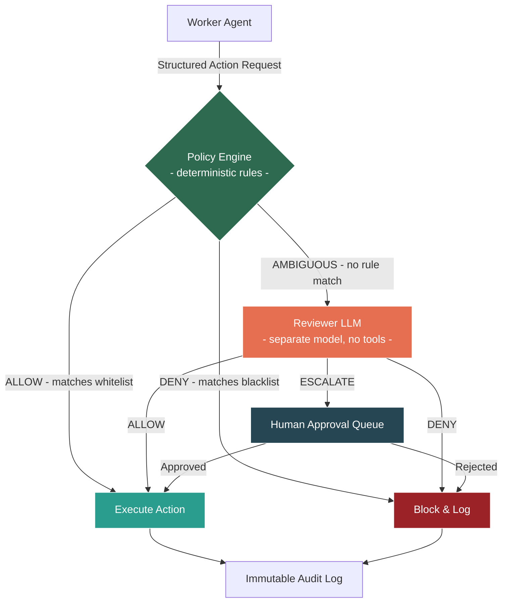
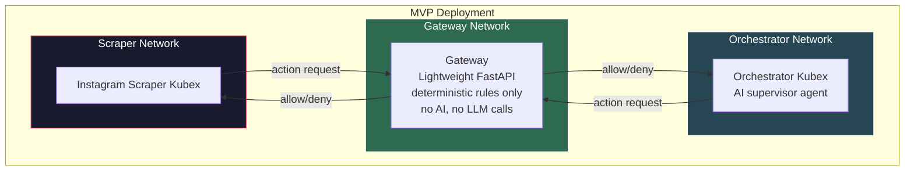
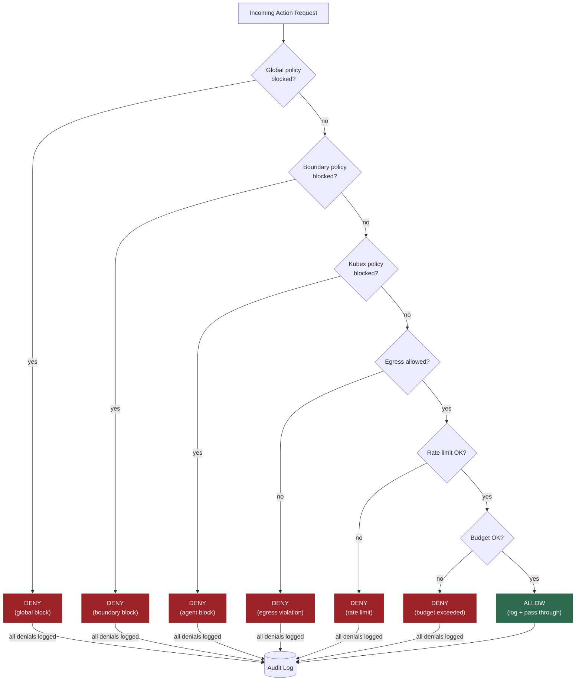
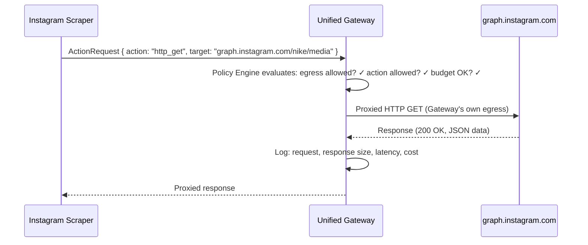
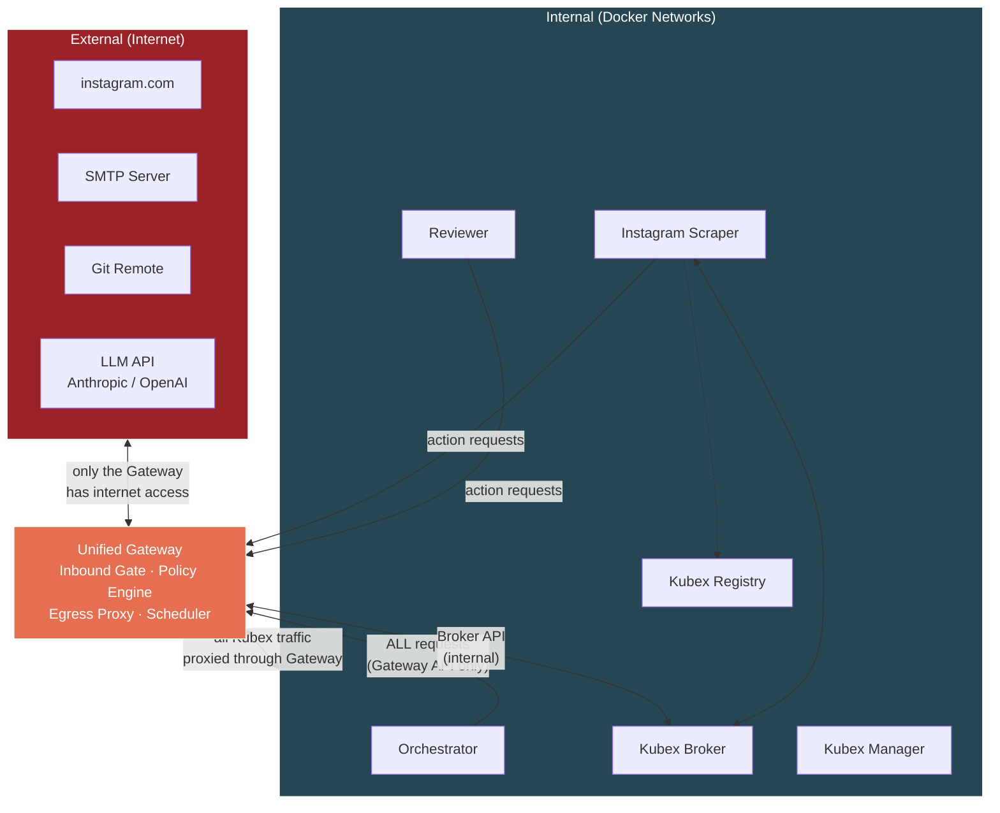
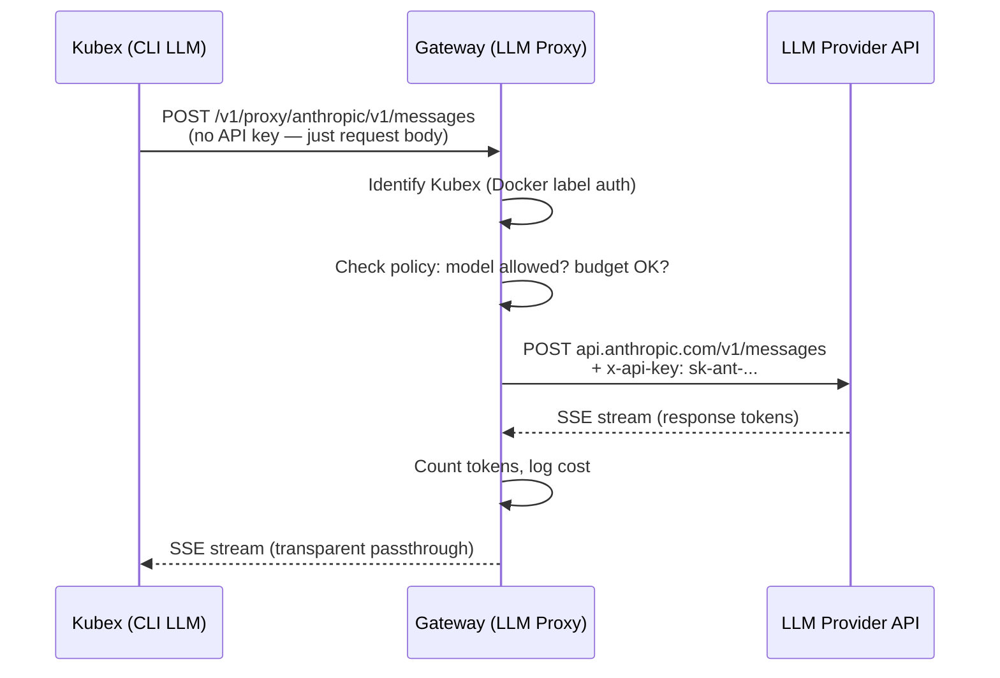
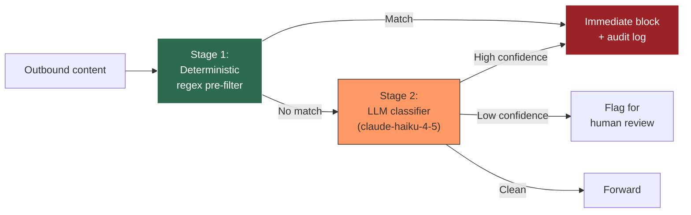
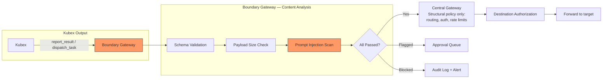
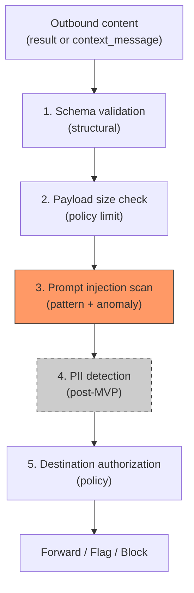

# Unified Gateway — Policy, Proxy & Egress

> Extracted from BRAINSTORM.md. See [KubexClaw.md](../KubexClaw.md) for the full index.

---

## 2. Reviewer Agent / Approval Gateway

**Decision:** Implement a tiered approval system — deterministic policy engine first, LLM reviewer second, human escalation third.

**Rationale:**
- An LLM-only reviewer is itself vulnerable to prompt injection.
- A deterministic policy engine (not an LLM) handles 90% of decisions with zero injection risk.
- The LLM reviewer only handles ambiguous edge cases and receives structured action payloads, never free-text justifications from worker agents.
- High-risk and critical actions always escalate to human approval.

### Approval Flow



### Approval Tiers

| Tier | Example | Approved By |
|------|---------|-------------|
| Low | Read a file the agent already has access to | Auto-approved by policy engine |
| Medium | Send email to known contact | Reviewer LLM |
| High | Send email to new external address | Human approval |
| Critical | Access credentials, bulk operations | Human + 2nd human |

### Anti-Collusion Measures
- Workers receive only approve/deny — never the reviewer's reasoning.
- Anomaly detection flags workers with many denied requests.
- Reviewer uses a different model than workers.
- Reviewer prompts are rotated.

### Action Items
- [ ] Design the structured action request JSON schema (no free-text justifications)
- [ ] Build deterministic policy engine with hard rules
- [ ] Define the full action tier classification for company workflows
- [ ] Design the reviewer agent's isolation (separate Kubex, no tools, message queue only)
- [ ] Implement escalation queue for human approval (UI or Slack/Teams integration)
- [ ] Set up anomaly detection for repeated denied requests

---

### 13.2 Gateway Architecture

> **Update (Section 13.9):** This section originally described the Gateway as a "lightweight sidecar container" with "~50 lines of core logic". That is no longer accurate. The Gateway is now the **Unified Gateway** — a central infrastructure service handling policy evaluation, egress proxying, scheduling, and inbound gating. It is NOT a sidecar. See Section 13.9 for the full architecture.

**Question:** Should the Gateway be combined with the orchestrator?

**Decision:** No. The Gateway stays as a **separate container** — not combined with the orchestrator. It's a central infrastructure service with a deterministic Policy Engine at its core and zero AI/LLM dependencies.

**Rationale:** If the orchestrator AI is compromised via prompt injection and the Gateway lives in the same container, the attacker could tamper with policy enforcement. The Gateway must be **external to the thing it's gating**.

**Implementation:** A FastAPI service that:

- Loads policy YAMLs on startup
- Evaluates all `ActionRequest`s against policy rules (egress, action allowlist, budget, tier)
- Proxies all external API calls from Kubexes (egress proxy)
- Acts as a **transparent LLM reverse proxy** — Kubexes configure `*_BASE_URL` env vars pointing to Gateway proxy endpoints; the Gateway injects real API keys and forwards to providers (see Section 13.9.1)
- Logs every decision to stdout
- Has zero LLM dependencies — pure deterministic checks



### 13.3 Gateway Rule Categories

> **Policy format note:** The six rule categories below and the detailed policy YAML format represent the full post-MVP target architecture. For MVP, a simplified policy format is used (see MVP.md Section 7) supporting: `allowed_actions`, `allowed_egress`, `rate_limits`, `budget`, and `approval_required_for`. The full format adds: deny lists, escalation chains, data classification rules, time windows, and behavioral rules (categories 4-6). The MVP format is a strict subset — policies written for MVP are forward-compatible with the full format.

**Question:** What rules can the Gateway enforce?

**Decision:** The Policy Engine evaluates **Structured Action Requests** against six rule categories. For MVP, start with categories 1-3 only (egress + action allowlist + budget). Layer the rest on later.

**Action Request format** (canonical schema per Section 16.2):

```json
{
  "request_id": "ar-20260301-a1b2c3d4",
  "agent_id": "instagram-scraper",
  "action": "http_get",
  "target": "https://graph.instagram.com/v18.0/12345/media",
  "parameters": { "fields": "caption,timestamp,like_count" },
  "context": {
    "workflow_id": "wf-20260301-001",
    "task_id": "task-0042",
    "originating_request_id": "req-7712",
    "chain_depth": 1
  },
  "timestamp": "2026-03-01T12:03:45Z"
}
```

> **Note:** `boundary` and `model_used` are populated by the Gateway in the `GatekeeperEnvelope.enrichment`, not by the Kubex. See Section 16.2 for the `GatekeeperEnvelope` schema. Fields like `token_count_so_far` are likewise infrastructure-populated enrichment data.

**Rule categories:**

| # | Category | What It Checks | MVP? |
|---|----------|---------------|------|
| 1 | **Egress / Network** | Allowed domains, HTTP methods, blocked URL patterns | Yes |
| 2 | **Action Type** | Allowed/blocked actions, rate limits per action | Yes |
| 3 | **Budget / Model** | Model allowlist, per-task token limit, daily cost cap | Yes |
| 4 | **Inter-Agent Comms** | `accepts_from` allowlist, cross-boundary tier, message schema | Later |
| 5 | **Output / Data** | Output schema enforcement, max size, PII filter, destination | Later |
| 6 | **Behavioral** | Actions/min, chain depth, time-of-day, cooldown after failure | Later |

**MVP policy example:**

```yaml
# agents/instagram-scraper/policies/policy.yaml
agent_policy:
  egress:
    mode: "allowlist"
    allowed:
      - domain: "graph.instagram.com"
        methods: ["GET"]
      - domain: "i.instagram.com"
        methods: ["GET"]
      - domain: "instagram.com"
        methods: ["GET"]
        blocked_paths:
          - "*/accounts/*"
          - "*/api/v1/friendships/*"

  actions:
    allowed: ["http_get", "write_output", "parse_json"]
    blocked: ["http_post", "http_put", "http_delete", "execute_code"]
    rate_limits:
      http_get: 100/task
      write_output: 50/task

  budget:
    per_task_token_limit: 10000
    daily_cost_limit_usd: 1.00
```

**Evaluation flow:**



### Action Items
- [ ] Build lightweight Gateway (FastAPI, `POST /evaluate`, YAML policy loader)
- [ ] Define Structured Action Request schema in `kubex-common`
- [ ] Write MVP policy files for orchestrator and instagram-scraper
- [ ] Create `agents/orchestrator/config.yaml` with system prompt and skills
- [ ] Create `agents/instagram-scraper/config.yaml` with system prompt and skills
- [ ] Build Instagram scraper skills (`scrape_profile`, `scrape_posts`, `scrape_hashtag`, `extract_metrics`)
- [ ] Define `agents/_base` Dockerfile with OpenClaw runtime + kubex-common

---

### 13.9 Unified Gateway Architecture

**Question:** What is the relationship between the API Gateway (Section 3) and the Gatekeeper (Section 2)?

**Decision:** They are the **same service**. The API Gateway, Gatekeeper, Scheduler, and Egress Proxy are merged into a single **Unified Gateway** service.

**Rationale:**
- Both services sit on the boundary between "trusted internal" and "untrusted external" — same security domain.
- Splitting them creates ambiguity about request flow and network topology.
- A single service simplifies networking: Kubexes only need to reach one endpoint.
- All external traffic (inbound and outbound) passes through one choke point for logging, rate limiting, and policy enforcement.

#### Four Roles, One Service

| Role | Direction | What It Does |
|------|-----------|-------------|
| **Inbound Gate** | External → System | Auth, rate limit user/webhook/API requests, route to Orchestrator |
| **Scheduler** | Timer → System | Cron-triggered and event-triggered workflows enter through the Gateway |
| **Policy Engine** | Internal evaluation | Evaluates every `ActionRequest` against policy rules (egress, action allowlist, budget, tier) |
| **Egress Proxy** | System → External | ALL external API calls from Kubexes are proxied through the Gateway. Kubexes never touch the internet directly. |

#### Network Topology

**Hard rule: Kubexes have zero direct internet access.** Their Docker networks only allow traffic to the Gateway. When a skill emits `http_get` targeting `graph.instagram.com`, the request flows:



**Kubex networking is radically simplified:**



#### Why Egress Proxy Is More Secure Than iptables

The previous design (Section 1) used per-Kubex iptables rules to allowlist egress destinations. The proxy model is strictly better:

| Concern | iptables Egress Rules | Unified Gateway Proxy |
|---------|----------------------|----------------------|
| Destination control | ✓ Block by IP/domain | ✓ Block by IP/domain |
| Request content inspection | ✗ Can't see HTTP body | ✓ Can inspect URL path, headers, body |
| Response inspection | ✗ No visibility | ✓ Can log response size, detect anomalies |
| Centralized logging | ✗ Per-Kubex firewall logs | ✓ All traffic logged in one place |
| Rate limiting | ✗ Requires per-Kubex config | ✓ Global + per-Kubex rate limits in one service |
| LLM API key management | Kubex holds API key | ✓ Gateway holds API keys — Kubexes never see them |

**Critical security improvement:** With the proxy model, **Kubexes never hold LLM API keys**. The Gateway injects the appropriate API key when proxying calls to Anthropic/OpenAI. A compromised Kubex cannot exfiltrate API keys because it never has them.

This supersedes the secret mounting approach for LLM API keys from Section 8. LLM credentials are Gateway-only secrets. Per-Kubex secrets (SMTP creds, Git tokens, DB passwords) are still mounted read-only for now, but could also be migrated to Gateway-managed injection in V1.

#### 13.9.1 LLM Reverse Proxy (Gateway LLM Proxy — Side A)

> **Decision (2026-03-08):** The Gateway acts as a **transparent LLM reverse proxy**. This resolves Critical Gaps C1 (Network Topology Mismatch) and C3 (Credential Model Contradiction) from the MVP Gap Analysis (Section 29 / docs/gaps.md).

**How it works:** CLI LLMs inside Kubex containers are configured with the Gateway's internal URL as their base URL. The Gateway injects the real API key and forwards requests to the provider. Kubexes never hold LLM API keys and never have direct internet access.

```
CLI LLM inside Kubex container:
  ANTHROPIC_BASE_URL=http://gateway:8080/v1/proxy/anthropic
  OPENAI_BASE_URL=http://gateway:8080/v1/proxy/openai

When CLI LLM makes an API call:
  1. Request goes to Gateway (internal network)
  2. Gateway identifies the calling Kubex (Docker label auth)
  3. Gateway checks policy (is this Kubex allowed to use this provider/model?)
  4. Gateway injects the real API key
  5. Gateway forwards to the actual provider API
  6. Provider streams response back through Gateway
  7. Gateway logs the call, counts tokens, enforces budget
  8. CLI LLM receives response as if it talked to the provider directly
```

**Proxy endpoints:**

```
POST /v1/proxy/anthropic/*    → forwards to api.anthropic.com
POST /v1/proxy/openai/*       → forwards to api.openai.com
POST /v1/proxy/google/*       → forwards to generativelanguage.googleapis.com
```

**Gateway proxy capabilities:**

| Capability | Description |
|---|---|
| Auth header injection | Adds `Authorization: Bearer <real-key>` or `x-api-key: <real-key>` per provider |
| Request/response passthrough | Full passthrough including SSE streaming — transparent to CLI LLMs |
| Token counting | Counts tokens on responses for budget enforcement |
| Request logging | Logs agent ID, model, tokens, cost per request |
| Policy enforcement | Model allowlist per agent — Gateway checks if this Kubex is allowed to use this provider/model |

**Container environment (no API keys):**

Workers and Orchestrator get base URLs, NOT keys:

```yaml
environment:
  ANTHROPIC_BASE_URL: "http://gateway:8080/v1/proxy/anthropic"
  OPENAI_BASE_URL: "http://gateway:8080/v1/proxy/openai"
  # NO API keys in container environment
```

**Impact on credential management:**

| Secret | Location | Mounted Into |
|---|---|---|
| `secrets/llm-api-keys.json` | Host filesystem | Gateway ONLY |
| `secrets/llm-oauth-tokens.json` | Host filesystem | Gateway ONLY |
| `secrets/cli-credentials/` | Host filesystem | Kubexes — CLI LLM auth tokens only (e.g., Claude Code OAuth token for authenticating the CLI itself, separate from LLM API keys) |

Workers get NO LLM API keys. They get Gateway proxy URLs only.

**Prompt caching benefit:** Since ALL LLM calls go through the Gateway, prompt caching (Section 29 / docs/prompt-caching.md) works perfectly:
- Gateway controls prompt assembly order
- Gateway adds `cache_control` markers
- Multi-Kubex cache sharing possible (same provider, same cached prefix)



**LLM Reverse Proxy Action Items:**

- [x] Decision: Gateway LLM Proxy model adopted (Side A) — 2026-03-08
- [ ] Implement LLM proxy endpoints (`/v1/proxy/anthropic/*`, `/v1/proxy/openai/*`, `/v1/proxy/google/*`)
- [ ] Implement auth header injection per provider (Anthropic: `x-api-key`, OpenAI: `Authorization: Bearer`)
- [ ] Implement SSE streaming passthrough for LLM responses
- [ ] Implement token counting on proxy responses for budget enforcement
- [ ] Implement model allowlist checking per Kubex on proxy requests
- [ ] Update Kubex Manager: set `*_BASE_URL` env vars (not API keys) on worker containers
- [ ] Update docker-compose: remove `ANTHROPIC_API_KEY` / `OPENAI_API_KEY` from worker/orchestrator services
- [ ] Test: Kubex with `ANTHROPIC_BASE_URL` pointing to Gateway can make LLM calls transparently

#### Impact on Other Sections

| Section | Change Needed |
|---------|--------------|
| Section 1 (Isolation) | iptables egress rules replaced by Gateway proxy. Kubex networks only need Gateway access. |
| Section 2 (Approval Gateway) | Policy Engine is now a component within the Unified Gateway, not a separate service. |
| Section 3 (I/O Gating) | API Gateway IS the Unified Gateway. Section 3 describes the inbound gate role. |
| Section 8 (Secrets) | LLM API keys move from per-Kubex secrets to Gateway-only secrets. |
| Section 13.2 (Gatekeeper Architecture) | "Gatekeeper sidecar" is now the "Unified Gateway". Same logic, different deployment model. |
| Section 13.5 (Host Specs) | Gatekeeper 128MB allocation increases — Gateway handles more (proxy, scheduler, policy). Estimate 512MB. |
| Section 13.6 (Model Strategy) | API keys scoped to Gateway, not per-Kubex. Gateway injects keys per model allowlist. |

#### Updated MVP Resource Budget

| Container | RAM Allocation | CPU Shares | Notes |
|-----------|---------------|------------|-------|
| **Unified Gateway** | 512MB | 0.5 CPU | Policy engine + egress proxy + scheduler |
| Kubex Manager | 256MB | 0.25 CPU | Docker SDK lifecycle |
| Kubex Broker | 256MB | 0.25 CPU | Redis-backed message routing |
| Kubex Registry | 128MB | 0.25 CPU | In-memory capability store |
| Orchestrator Kubex | 2GB | 1.0 CPU | OpenClaw + LLM API calls (proxied) |
| Instagram Scraper Kubex | 2GB | 1.0 CPU | OpenClaw + HTTP scraping (proxied) |
| Reviewer Kubex | 2GB | 1.0 CPU | OpenClaw + Codex API calls (proxied) |
| Redis | 512MB | 0.5 CPU | Message queue + rate limit state + budget tracking (see Redis Database Assignment Table below) |
| Neo4j | 1.5GB | 0.5 CPU | Graphiti knowledge graph backend |
| Graphiti | 512MB | 0.25 CPU | Temporal knowledge graph REST API |
| **Total MVP** | **~9.7GB** | **5.5 CPU** | |
| **Remaining headroom** | **~14.3GB** | | Room for 4-7 more Kubexes |

#### Redis Database Assignment Table

Single Redis instance, partitioned by database number to isolate workloads without deploying multiple Redis instances.

| DB | Purpose | Persistence | Notes |
|----|---------|-------------|-------|
| db0 | Broker message streams | AOF | Critical — message loss = dropped tasks |
| db1 | Gateway rate limit counters | None | Ephemeral — rebuilds on restart |
| db2 | Registry capability cache | None | Ephemeral — rebuilds from Registry |
| db3 | Kubex Manager lifecycle events | AOF | Important for audit trail |
| db4 | Gateway budget tracking | RDB | Periodic snapshots sufficient |

**Persistence strategy:** AOF (append-only file) for critical data (db0, db3) ensures sub-second durability. RDB snapshots for budget tracking (db4) are sufficient since budget state is periodically reconciled. Ephemeral databases (db1, db2) need no persistence — rate limit counters and capability caches rebuild naturally on restart.

**Post-MVP consideration:** If Redis memory pressure becomes an issue, split into two Redis instances: one for critical persistent data (db0, db3, db4) and one for ephemeral caches (db1, db2). This allows independent scaling and eviction policies.

#### Redis Database Assignment Action Items

- [ ] Configure Redis database assignments in docker-compose.yml
- [ ] Set per-database maxmemory policies (allkeys-lru for db1/db2, noeviction for db0/db3)
- [ ] Post-MVP: evaluate splitting into two Redis instances (critical vs ephemeral)

#### Redis Security — AUTH & ACLs

Redis MUST be configured with authentication and access control. No unauthenticated access is permitted.

**Authentication:**
- Redis `requirepass` MUST be set. The Redis password is a Gateway-level secret stored at `/run/secrets/redis_password` and injected via Docker secrets.
- All services connecting to Redis MUST authenticate using the `AUTH` command (or connection string with password).

**ACL restrictions:**
Redis ACLs restrict which services can read/write to which databases. Each service gets a dedicated Redis user with scoped permissions:

| Service | Redis User | Allowed Databases | Access |
|---|---|---|---|
| Kubex Broker | `broker` | db0 only | Read/write |
| Gateway | `gateway` | db1 and db4 | Read/write |
| Kubex Registry | `registry` | db2 only | Read/write |
| Kubex Manager | `kubexmgr` | db3 only | Read/write |

```
# Redis ACL configuration (redis.conf or via ACL SETUSER)
user broker on >%broker_password% ~* &* +@all -@admin ~db0:*
user gateway on >%gateway_password% ~* &* +@all -@admin ~db1:* ~db4:*
user registry on >%registry_password% ~* &* +@all -@admin ~db2:*
user kubexmgr on >%kubexmgr_password% ~* &* +@all -@admin ~db3:*
user default off
```

> **Note:** The `default` user is disabled (`user default off`). This prevents any unauthenticated connection from accessing Redis even if the `requirepass` is somehow bypassed.

**Redis Security Action Items:**
- [ ] Configure Redis AUTH and ACLs in docker-compose.yml
- [ ] Create per-service Redis users with scoped database access
- [ ] Store Redis password in `/run/secrets/redis_password` as Docker secret

#### Terminology — Standardized

To resolve the naming inconsistency (Gap 15.10):

| Term | Meaning |
|------|---------|
| **Gateway** | The Unified Gateway service (`services/gateway/`) — the single service handling inbound, policy, egress proxy, and scheduling |
| **Policy Engine** | The rule evaluation component within the Gateway — deterministic, no AI |
| **Egress Proxy** | The component within the Gateway that proxies all external API calls |
| **Scheduler** | The component within the Gateway that triggers cron/event workflows |

The term "Gatekeeper" is retired. The term "API Gateway" is retired. Both are now just "Gateway".

### Action Items
- [x] Rename `services/gatekeeper/` to `services/gateway/` in repo structure (Section 12)
- [ ] Add egress proxy capability to Gateway (HTTP client that proxies Kubex external requests)
- [ ] Add scheduler component to Gateway (cron + event triggers)
- [ ] Move LLM API keys from per-Kubex secrets to Gateway-only secrets
- [ ] Implement API key injection in Gateway egress proxy (match Kubex model allowlist → inject correct key)
- [ ] Update Kubex Docker network config: only allow traffic to Gateway, deny all internet
- [ ] Update Section 13.5 resource budget to reflect Gateway sizing (512MB)
- [x] Update all references from "Gatekeeper" and "API Gateway" to "Gateway" across the document

---

## 20. Output Validation

> **Closes gap:** 15.9 — Output validation schemas undefined

### 20.1 Decision: Output Validation Is Gateway Policy

Output validation does not require a separate system. The Gateway already evaluates every `ActionRequest`, and `report_result` is just another action (Section 16.2). Output validation is a set of **policy rules applied to outbound actions** — specifically `report_result` and `dispatch_task` (which carry content to other agents or back to the workflow).

> **MVP note:** Output validation runs **inline within the unified Gateway** during MVP. The validation rules below reference "Boundary Gateway" as the enforcement point — for MVP, this means the boundary logic module within the unified Gateway (all Kubexes are in the `default` boundary). Post-MVP: output validation moves to per-boundary Gateway Kubexes when boundaries are extracted into separate containers.

### 20.2 Validation Rules

| Rule | What It Checks | Applies To | Enforced At | MVP? |
|---|---|---|---|---|
| **Schema validation** | `report_result` and `dispatch_task` parameter schemas match Section 16.2 definitions | All outbound actions | Boundary Gateway | Yes |
| **Max payload size** | Result payload does not exceed per-Kubex size limit | `report_result` | Boundary Gateway | Yes |
| **Prompt injection detection** | Scans `context_message` and `result` fields for injection patterns before forwarding | `report_result`, `dispatch_task` | Boundary Gateway | Yes |
| **Allowed output destinations** | Kubex can only send results to authorized targets | `dispatch_task`, `report_result` | Central Gateway | Yes |
| **PII detection** | Scans output content for personally identifiable information | `report_result`, `dispatch_task` | Boundary Gateway | Post-MVP |

> **Note:** Content analysis rules (prompt injection detection, PII detection, payload size) are enforced at the **Boundary Gateway** only. The Central Gateway handles structural policy (routing, authorization, rate limits) — it does **not** re-scan content. See Section 20.3 for rationale.

### 20.3 Prompt Injection Detection

A compromised or manipulated Kubex could attempt to inject malicious instructions into its output — either in `report_result` (to manipulate the human reviewer or Command Center) or in `dispatch_task` `context_message` (to manipulate a downstream agent).

The **Boundary Gateway's** Policy Engine scans outbound content fields for prompt injection patterns **before forwarding**:

**Scan targets:**
- `report_result` → `parameters.result` field
- `dispatch_task` → `context_message` field

**Scanning location: Boundary Gateway only**

Content analysis (prompt injection scan, PII detection) runs at the **Boundary Gateway** level only. The Central Gateway does **not** re-scan content.

- **Boundary Gateway** = content analysis (prompt injection, payload size, PII) + structural policy
- **Central Gateway** = structural policy only (routing, authorization, rate limits, egress) — no content scanning

Rationale: By the time a request reaches the Central Gateway, the Boundary Gateway has already scanned it. Re-scanning is redundant cost. The Boundary Gateway catches malicious content **before it leaves the boundary** — a compromised Kubex in boundary α trying to inject into boundary β gets caught at the boundary α Gateway.

**Detection approach — two-stage pipeline:**

Deterministic regex/pattern checks MUST run BEFORE the LLM classifier (`claude-haiku-4-5`). High-confidence patterns are blocked deterministically WITHOUT LLM involvement. The LLM classifier handles only ambiguous cases that pass the deterministic filter.

**Stage 1: Deterministic regex pre-filter (fast, zero cost)**

A curated pattern library of known injection prefixes, role-switching attempts, and system prompt extraction patterns. Matches trigger immediate block without invoking the LLM classifier.

Sample pattern list:
```python
INJECTION_PATTERNS = [
    "ignore previous",
    "you are now",
    "system:",
    "\\[INST\\]",
    "assistant:",
    "new instructions",
]
```

These patterns are case-insensitive and match as substrings within `context_message` and `result` fields. The pattern library is versioned (`patterns_version` in Section 20.7 config) and updated via Gateway configuration — no redeployment required.

**Stage 2: LLM classifier (expensive, ambiguous cases only)**

Content that passes the deterministic filter is sent to the LLM classifier (`claude-haiku-4-5`) for nuanced analysis:
- Structural analysis — detect attempts to embed fake system messages or role switches
- Anomaly scoring — flag outputs that deviate significantly from expected format for the Kubex's declared capability
- Semantic analysis — detect paraphrased injection attempts that evade regex patterns



**On detection:**
- **Deterministic match (Stage 1):** Block the action immediately, log to audit trail, alert in Command Center. No LLM call needed.
- **LLM high confidence (Stage 2):** Block the action, log to audit trail, alert in Command Center
- **LLM low confidence (Stage 2):** Flag for human review (add to approval queue, Section 19.9), forward with warning metadata



### 20.4 Content Analysis Pipeline

Prompt injection detection and PII detection are the same class of operation — **content analysis rules** in the Boundary Gateway's Policy Engine that inspect payload content, not just structure. They share a pipeline (executed at the Boundary Gateway before forwarding to the Central Gateway):



The pipeline is ordered by cost — cheap structural checks first, expensive content analysis last. A request that fails schema validation never reaches the prompt injection scanner.

### 20.5 Payload Size Limits

Configured per-Kubex via policy (Section 19.4):

| Kubex Type | Default Max Payload | Rationale |
|---|---|---|
| Scraper agents | 5 MB | May return large data extracts |
| Email agents | 1 MB | Email content is typically small |
| Code agents | 2 MB | Code output can be moderately large |
| Orchestrator | 512 KB | Orchestrator dispatches tasks, doesn't produce large outputs |
| Default | 1 MB | Safe default for unspecified Kubex types |

Overridable per-Kubex via `PUT /kubex/{id}/policy`.

### 20.7 Boundary Gateway Content Analysis Configuration

Each Boundary Gateway's content analysis is configured via policy (`PUT /boundary/{name}/policy`, Section 19.6):

```yaml
# Example: Boundary Gateway configuration for boundary "engineering"
content_analysis:
  prompt_injection:
    enabled: true
    model: "claude-haiku-4-5"       # Fast + cheap for classification
    confidence_threshold: 0.85       # Below → flag for human review, above → block
    patterns_version: "v1.2"         # Version of the injection pattern library
  pii_detection:
    enabled: false                   # Post-MVP
    # model: "claude-haiku-4-5"
    # categories: ["email", "phone", "ssn", "credit_card"]
  payload_size:
    max_bytes: 5242880               # 5 MB default, overridable per-Kubex
```

**Model selection:** The prompt injection scanner uses a fast, cheap model (e.g., `claude-haiku-4-5`) for classification. This model is called by the Boundary Gateway — its API key is managed by the Central Gateway and injected into the Boundary Gateway's configuration. Boundary Gateways do **not** hold LLM API keys directly; they request scanning via the Central Gateway's egress proxy.

**Per-boundary tuning:** Different boundaries can have different sensitivity thresholds. A finance boundary handling sensitive data may set a lower `confidence_threshold` (more aggressive blocking), while an engineering boundary doing code reviews may set a higher threshold (fewer false positives).

### 20.8 Action Items

- [ ] Implement schema validation for `report_result` and `dispatch_task` in Gateway Policy Engine
- [ ] Implement payload size limit enforcement (per-Kubex configurable via policy)
- [ ] Implement prompt injection detection scanner (pattern matching + structural analysis)
- [ ] Define initial prompt injection pattern library
- [ ] Implement deterministic regex pre-filter for prompt injection detection
- [ ] Implement content analysis pipeline ordering (cheap checks first)
- [ ] Design PII detection rules (post-MVP)
- [ ] Add output validation metrics to Gateway Prometheus endpoint (blocked count, flagged count, scan latency)
- [ ] Define Boundary Gateway content analysis configuration schema
- [ ] Select and benchmark prompt injection classification model

---
