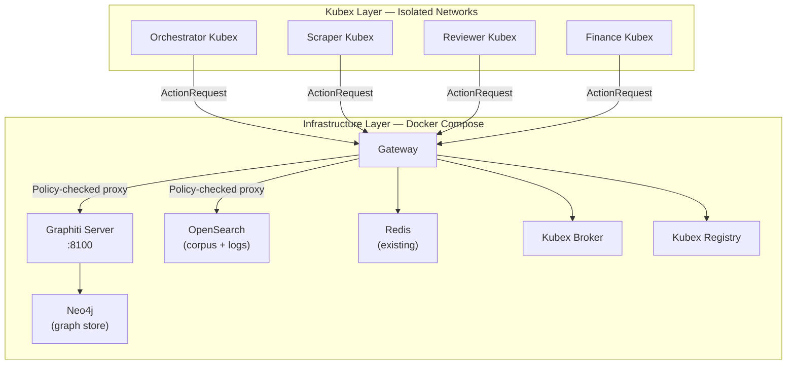
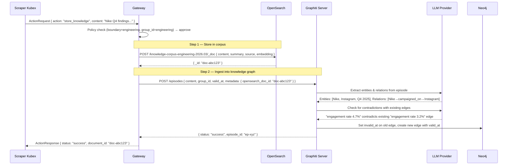
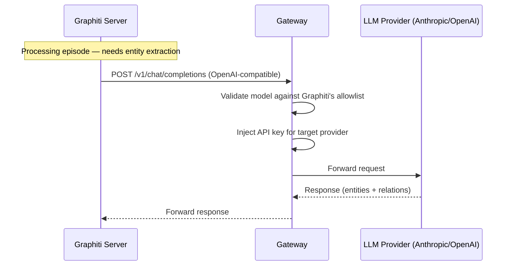
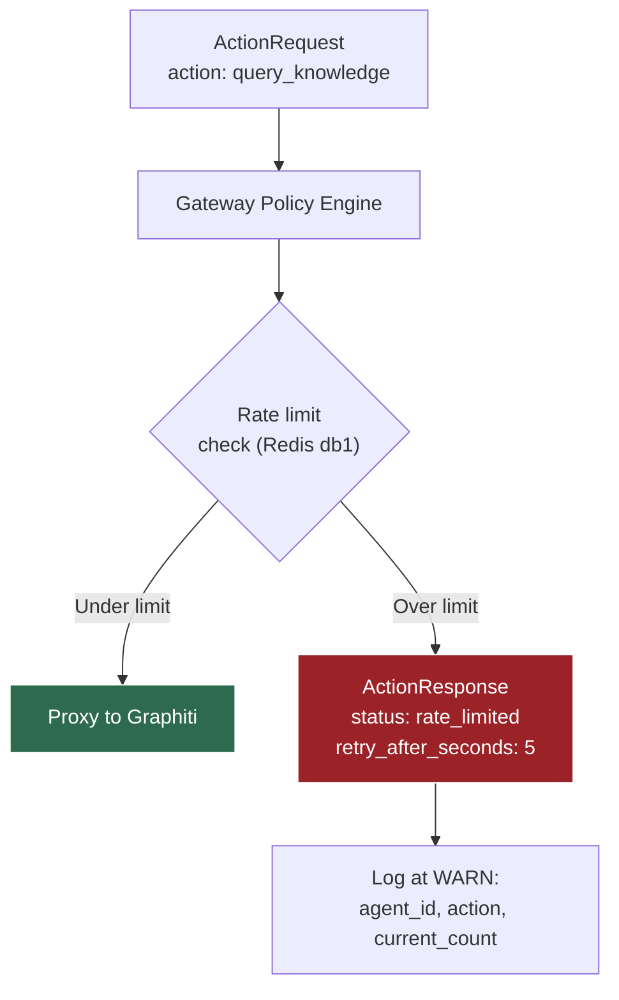
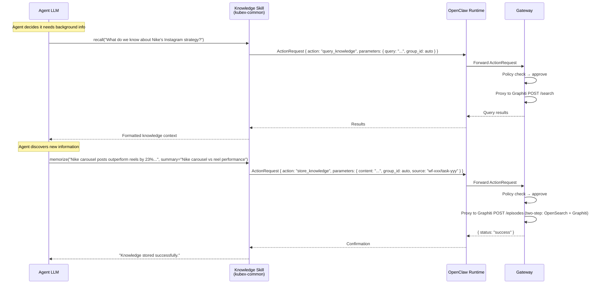

# Swarm Knowledge Base — Graphiti + OpenSearch

> Extracted from BRAINSTORM.md. See [KubexClaw.md](../KubexClaw.md) for the full index.

## 27. Swarm Knowledge Base — Graphiti + OpenSearch

### 27.1 Problem Statement

Gap 15.19 identified that Kubexes have no shared knowledge store. Each agent operates in isolation — it only knows what's in its prompt and what arrives via `dispatch_task` context messages. There is no way for agents to:
- Store and retrieve learned knowledge across tasks
- Share domain knowledge across boundaries
- Build up institutional memory over time
- Query structured relationships between entities (not just text similarity)
- Track how facts change over time (temporal knowledge)

Two distinct problems require two distinct solutions:

1. **Corpus storage** — documents, reports, raw data, reference material. Needs full-text search, vector embeddings, and bulk document management. → **OpenSearch** (already in the architecture for logging/observability).

2. **Temporal knowledge graph** — entities, relationships, facts that change over time. Needs bi-temporal timestamps, contradiction resolution, and point-in-time queries. → **Graphiti** (by Zep AI, purpose-built for agent memory).

The two systems link together: **entities in Graphiti reference documents in OpenSearch**. The graph knows *what* and *when*; the corpus holds the *source material*.

### 27.2 Why Graphiti + OpenSearch (Not LightRAG)

**LightRAG was evaluated first** (EMNLP 2025, HKU Data Science Lab) — excellent document-oriented RAG with knowledge graph extraction. However, LightRAG has **no temporal support**: no timestamps on entities/relations, no contradiction resolution, no point-in-time queries. Entity updates are destructive (merge/overwrite). For an agent swarm where facts change constantly — engagement rates shift, project statuses update, team assignments rotate — this is a critical gap.

**Graphiti** (Zep AI, Apache 2.0, 23k+ GitHub stars) is purpose-built for **temporal agent memory**:

| Requirement | Graphiti | LightRAG |
|---|---|---|
| Temporal timestamps on facts | Bi-temporal: `valid_at`, `invalid_at`, `created_at`, `expired_at` | **None** |
| Contradiction resolution | LLM detects conflicts → old fact invalidated, both preserved | Merge/overwrite — lossy |
| Point-in-time queries | Yes — `SearchFilters` with date operators | **No** |
| Entity types (ontology) | Pydantic models — developer-defined, schema-enforced | Prompt instruction only |
| Multi-tenant isolation | `group_id` on all nodes and edges | Workspace-based |
| REST API | FastAPI server (port 8100) + MCP server | FastAPI (port 9621) + WebUI |
| Graph backends | Neo4j, FalkorDB, Kuzu, Neptune | Neo4j, NetworkX, PostgreSQL+AGE |
| Vector search | Embedded in graph (name/fact embeddings) + BM25 + graph traversal | Dedicated vector stores (more options) |
| Document parsing | **None** — text/JSON episodes only | 40+ file formats built-in |

**What Graphiti lacks:** bulk document storage and full-text corpus search. That's exactly what OpenSearch provides — and OpenSearch is already in the architecture for logging/observability (Section 9).

**The hybrid:**

| Layer | Technology | Stores | Queries |
|---|---|---|---|
| **Knowledge Graph** | Graphiti + Neo4j | Entities, relationships, temporal facts, episode references | "What do we know about Nike?", "What changed since last week?", "Who works on Project X?" |
| **Document Corpus** | OpenSearch | Raw documents, report text, data exports, reference material | "Find all reports mentioning engagement rates", "Search scraper output for Q4 data" |
| **Link** | Entity edges carry `source_id` → OpenSearch document ID | — | Graph query returns entities → follow links to full documents in OpenSearch |

### 27.3 Graphiti Core Concepts

Graphiti's graph has three node types and one edge type:

**Entity Nodes** — Real-world entities (people, organizations, products). Each has:
- `name`, `summary`, `attributes` (typed dict from Pydantic model)
- `name_embedding` for vector search
- `group_id` for boundary isolation

**Episodic Nodes** — Discrete units of ingested information. Each has:
- `content` — the raw text that was ingested
- `valid_at` — when the event/observation occurred
- `source` — provenance (workflow_id, task_id, document reference)

**Community Nodes** — Cluster summaries that emerge from related entities (auto-generated).

**Entity Edges** — The critical element. Relationships/facts between entities with **full temporal support**:

| Field | Type | Description |
|---|---|---|
| `fact` | string | Natural language description of the relationship |
| `fact_embedding` | vector | Embedding for semantic search |
| `valid_at` | datetime | When this fact became true in the real world |
| `invalid_at` | datetime \| null | When this fact stopped being true (null = still current) |
| `created_at` | datetime | When this fact was recorded in the graph |
| `expired_at` | datetime \| null | When the system marked this edge as superseded |
| `episodes` | list[str] | Which episodes sourced this edge |
| `source_id` | string | Link to OpenSearch document (our extension) |

**Example — temporal fact lifecycle:**

```
March 1: Scraper ingests "Nike's engagement rate is 4.7%"
  → EntityEdge(fact="Nike engagement rate is 4.7%", valid_at=March 1, invalid_at=null)

March 15: Scraper ingests "Nike's engagement rate has risen to 5.1%"
  → Graphiti's contradiction pipeline detects conflict with existing edge
  → Old edge updated: invalid_at=March 15, expired_at=now()
  → New edge created: EntityEdge(fact="Nike engagement rate is 5.1%", valid_at=March 15, invalid_at=null)

Both facts preserved. Query "as of March 5" returns 4.7%. Query "current" returns 5.1%.
```

### 27.4 Architecture — Graphiti + OpenSearch as Infrastructure



**Key design decisions:**

1. **Graphiti as a shared service** — single Graphiti server instance (FastAPI, port 8100), all agents access via Gateway proxy. Neo4j as the graph backend provides concurrent read/write support.

2. **OpenSearch dual-purpose** — already deployed for logging/observability (Section 9). Now also serves as the document corpus store. Separate indices for knowledge documents vs operational logs.

3. **Gateway-proxied access** — Kubexes never talk to Graphiti or OpenSearch directly. All knowledge requests flow through the Gateway as action primitives. The Gateway enforces policy (which boundaries can access which `group_id` partitions).

4. **`group_id` = Boundary** — Graphiti's built-in `group_id` field on all nodes and edges maps directly to KubexClaw Boundaries. No custom workspace logic needed — it's native.

5. **LLM routing** — Graphiti needs LLM calls for entity extraction and contradiction resolution. The Graphiti server's LLM configuration points at the Gateway's LLM proxy endpoint, keeping the "Gateway holds all keys" principle intact.

6. **Entity-to-document linking** — when an agent stores knowledge, the `memorize` skill:
   - Stores the raw text in OpenSearch (corpus) → gets back a `document_id`
   - Calls Graphiti `add_episode()` with the text + `document_id` as metadata
   - Graphiti extracts entities/relations, creates temporal edges with `source_id` pointing to the OpenSearch document

### 27.5 OpenSearch Knowledge Indices

OpenSearch serves two roles: operational logging (existing, Section 9) and knowledge corpus (new). Separate index patterns keep them independent:

| Index Pattern | Purpose | Retention |
|---|---|---|
| `logs-*` | Operational logs (Section 9) — Gateway decisions, audit, cost | 30 days - 1 year |
| `knowledge-corpus-*` | Agent-stored documents, reports, findings | Indefinite |
| `knowledge-corpus-engineering-*` | Engineering boundary corpus | Indefinite |
| `knowledge-corpus-support-*` | Support boundary corpus | Indefinite |
| `knowledge-corpus-shared-*` | Cross-boundary shared corpus | Indefinite |

**Document schema in OpenSearch:**

```json
{
  "_index": "knowledge-corpus-engineering-2026.03",
  "_id": "doc-abc123",
  "_source": {
    "content": "Nike's Q4 2025 Instagram campaign achieved 2.3M impressions...",
    "summary": "Nike Q4 2025 Instagram campaign results",
    "source_workflow": "wf-20260228-001",
    "source_task": "scrape-nike-ig",
    "source_kubex": "instagram-scraper",
    "boundary": "engineering",
    "ingested_at": "2026-03-01T14:23:00Z",
    "content_embedding": [0.123, -0.456, ...],
    "tags": ["nike", "instagram", "engagement", "q4-2025"]
  }
}
```

Agents can search the corpus via `search_corpus` action (full-text + vector similarity via OpenSearch), and the returned documents link back to Graphiti entities that reference them.

#### OpenSearch Dual-Use Risk

OpenSearch serves both **operational logging** (`logs-*` indices, Section 9) and **knowledge corpus** (`knowledge-corpus-*` indices). Running both workloads on a single OpenSearch instance introduces resource contention risk.

| Risk | Impact | Likelihood (MVP) |
|---|---|---|
| Heavy knowledge ingestion degrades log search latency | Operators cannot search logs quickly during incidents | Low — MVP ingestion volume is small |
| Log ingestion spikes degrade knowledge queries | Agents get slow `search_corpus` responses | Low — log volume is predictable |
| Index count growth | Too many shards on single node (shard-per-index pattern) | Medium — manageable with ISM policies |

**MVP mitigation:**
- **Separate index templates** with independent shard counts: `logs-*` indices use 1 primary shard, `knowledge-corpus-*` indices use 1 primary shard. Different refresh intervals (logs: 5s, knowledge: 30s) to reduce indexing overhead.
- **Index State Management (ISM)** policies differ: logs rotate daily and go read-only after 24h; knowledge corpus indices are long-lived and never auto-rotated.
- **Monitoring:** Track per-index search latency and indexing rate in Grafana. Alert if either workload degrades.

**Post-MVP:**
- Consider separate OpenSearch node pools (hot/warm architecture) — logs on hot nodes, knowledge on warm nodes
- Or dedicated resource limits per index via OpenSearch's workload management features
- If volume justifies it, split into two separate OpenSearch clusters

- [ ] Configure separate index templates for logs vs knowledge corpus (different shard counts, refresh intervals)
- [ ] Add per-index latency monitoring to Grafana dashboard

### 27.6 Knowledge Group Isolation — Boundary Alignment

Graphiti's `group_id` maps directly to Boundaries:

| `group_id` | Accessible By | Contains |
|---|---|---|
| `engineering` | Engineering Boundary Kubexes | Code patterns, review findings, scraper results |
| `customer-support` | Support Boundary Kubexes | Ticket resolutions, FAQ knowledge, customer context |
| `finance` | Finance Boundary Kubexes | Invoice patterns, reconciliation rules, vendor info |
| `shared` | All Kubexes (read; write requires escalation) | Company-wide policies, org structure, cross-domain facts |

**Cross-boundary access** is policy-controlled at the Gateway:

```yaml
# policies/knowledge-access.yaml
rules:
  - name: engineering-own-group
    match:
      boundary: engineering
      action: query_knowledge
      parameters:
        group_id: engineering
    decision: approve

  - name: engineering-reads-shared
    match:
      boundary: engineering
      action: query_knowledge
      parameters:
        group_id: shared
    decision: approve

  - name: engineering-blocked-from-finance
    match:
      boundary: engineering
      action: query_knowledge
      parameters:
        group_id: finance
    decision: deny
    reason: "Cross-boundary knowledge access denied"

  - name: any-boundary-write-shared-escalate
    match:
      action: store_knowledge
      parameters:
        group_id: shared
    decision: escalate
    reason: "Writing to shared knowledge requires human approval"
```

### 27.7 New Action Types

Three new global action primitives in `kubex-common`:

#### `query_knowledge` — Search the Knowledge Graph

```json
{
  "action": "query_knowledge",
  "parameters": {
    "query": "What Instagram engagement patterns did we find for Nike?",
    "group_id": "engineering",
    "center_node": null,
    "num_results": 10
  }
}
```

| Field | Type | Required | Default | Description |
|---|---|---|---|---|
| `query` | string | yes | — | Natural language query |
| `group_id` | string | yes | — | Target knowledge group (boundary-aligned) |
| `center_node` | string | no | null | Optional entity UUID to center search around |
| `num_results` | int | no | 10 | Max results |
| `as_of` | datetime | no | now | Point-in-time query — "what was true at this date?" |

**Gateway behavior:** Validates group access against boundary policy. Proxies to Graphiti `POST /search` with `SearchFilters` for temporal constraints. If `as_of` is set, adds temporal filters: `valid_at <= as_of AND (invalid_at > as_of OR invalid_at IS NULL)`.

#### `store_knowledge` — Ingest Knowledge (Graph + Corpus)

```json
{
  "action": "store_knowledge",
  "parameters": {
    "content": "Nike's Q4 2025 Instagram campaign achieved 2.3M impressions with 4.7% engagement rate.",
    "summary": "Nike Q4 2025 Instagram campaign results",
    "group_id": "engineering",
    "valid_at": "2026-03-01T14:00:00Z",
    "source": "workflow:wf-20260228-001/task:scrape-nike-ig"
  }
}
```

| Field | Type | Required | Default | Description |
|---|---|---|---|---|
| `content` | string | yes | — | Knowledge text to ingest |
| `summary` | string | yes | — | One-line summary for the corpus document |
| `group_id` | string | yes | — | Target knowledge group |
| `valid_at` | datetime | no | now | When this fact became true (event time) |
| `source` | string | yes | — | Provenance (`workflow_id/task_id`) |

**Gateway behavior:** Two-step process:
1. Store raw text in OpenSearch (`knowledge-corpus-{group_id}-*`) → get `document_id`
2. Call Graphiti `POST /episodes` with the text, `group_id`, `valid_at`, and `document_id` as metadata
3. Graphiti extracts entities/relations, runs contradiction resolution, creates temporal edges

#### `search_corpus` — Full-Text / Vector Search on Documents

```json
{
  "action": "search_corpus",
  "parameters": {
    "query": "Instagram engagement rates Q4 2025",
    "group_id": "engineering",
    "max_results": 20,
    "search_type": "hybrid"
  }
}
```

| Field | Type | Required | Default | Description |
|---|---|---|---|---|
| `query` | string | yes | — | Search query |
| `group_id` | string | yes | — | Target corpus partition |
| `max_results` | int | no | 20 | Max documents to return |
| `search_type` | enum | no | `hybrid` | `text` (BM25), `vector` (embedding similarity), `hybrid` (both) |

**Gateway behavior:** Validates group access, then proxies to OpenSearch `_search` API with the appropriate index pattern (`knowledge-corpus-{group_id}-*`).

#### `manage_knowledge` — Graph CRUD Operations (Admin)

Same as before — entity/relation CRUD, entity merging. Reserved for admin-level Kubexes or human-in-the-loop workflows. Proxied to Graphiti's REST API.

### 27.8 Knowledge Ingestion Pipeline

How agent outputs become knowledge — the two-store flow:



### 27.9 Docker Compose Addition

```yaml
# docker-compose.yml — additions to existing infrastructure block
services:
  graphiti:
    image: zepai/graphiti:v0.5.0  # Pin to exact version — no :latest in production
    container_name: kubexclaw-graphiti
    ports:
      - "8100:8100"
    environment:
      - OPENAI_API_KEY=placeholder  # Overridden — Graphiti calls Gateway's LLM proxy
      - OPENAI_BASE_URL=http://gateway:8080/v1  # Gateway proxies LLM calls
      - MODEL_NAME=${DEFAULT_LLM_MODEL}
      - NEO4J_URI=bolt://neo4j:7687
      - NEO4J_USER=neo4j
      - NEO4J_PASSWORD=${NEO4J_PASSWORD}
    networks:
      - kubex-data
    depends_on:
      neo4j:
        condition: service_healthy
      gateway:
        condition: service_healthy
    healthcheck:
      test: ["CMD", "curl", "-f", "http://localhost:8100/health"]
      interval: 10s
      timeout: 5s
      retries: 5
    restart: unless-stopped

  neo4j:
    image: neo4j:5.26-community  # Pin to minor version
    container_name: kubexclaw-neo4j
    ports:
      - "7474:7474"   # Browser UI (dev only)
      - "7687:7687"   # Bolt protocol
    volumes:
      - neo4j-data:/data
    environment:
      - NEO4J_AUTH=neo4j/${NEO4J_PASSWORD}
      - NEO4J_PLUGINS=["apoc"]
    networks:
      - kubex-data
    healthcheck:
      test: ["CMD", "cypher-shell", "-u", "neo4j", "-p", "${NEO4J_PASSWORD}", "RETURN 1"]
      interval: 10s
      timeout: 5s
      retries: 5
    restart: unless-stopped

  # OpenSearch already defined in Section 9 for logging.
  # Knowledge corpus uses the SAME OpenSearch instance with separate indices.
  # No additional container needed — just new index patterns (knowledge-corpus-*).

volumes:
  neo4j-data:
```

**Note:** OpenSearch is already deployed for operational logging (Section 9). The knowledge corpus reuses the same cluster — just separate index patterns (`knowledge-corpus-*` vs `logs-*`). No additional infrastructure cost.

**Startup ordering:** Services must start in dependency order. Graphiti requires both Neo4j (graph storage) and Gateway (LLM proxy for entity extraction).

| Order | Service | Depends On | Health Check |
|---|---|---|---|
| 1 | Redis | — | `redis-cli PING` |
| 2 | OpenSearch | — | `curl /_cluster/health` |
| 3 | Neo4j | — | `cypher-shell "RETURN 1"` |
| 4 | Gateway | Redis | `HTTP GET /health` on port 8080 |
| 5 | Graphiti | Neo4j, Gateway | `HTTP GET /health` on port 8100 |
| 6 | Kubex Manager | Redis, Gateway | `HTTP GET /health` on port 8090 |
| 7 | Kubex Broker | Redis | `HTTP GET /health` |
| 8 | Kubex Registry | Redis | `HTTP GET /health` on port 8070 |

Use `depends_on` with `condition: service_healthy` in `docker-compose.yml` where possible. Example for Graphiti:

```yaml
graphiti:
  depends_on:
    neo4j:
      condition: service_healthy
    gateway:
      condition: service_healthy
```

**Degraded startup:** If Graphiti is unhealthy at system startup, the system is still operational in degraded mode:
- `store_knowledge` actions queue in the Gateway retry queue (same as runtime Neo4j failure — Section 21.9)
- `query_knowledge` returns empty results with `warning: "knowledge_unavailable"`
- All other agent actions (non-knowledge) work normally
- Kubex Manager monitors Graphiti health and alerts Command Center if it remains unhealthy

### 27.10 Gateway Integration — Proxy Routes

The Gateway maps knowledge action types to backend services:

| Action | Gateway Route | Backend | Endpoint |
|---|---|---|---|
| `query_knowledge` | `POST /internal/graphiti/search` | Graphiti | `POST /search` |
| `query_knowledge` (as_of) | `POST /internal/graphiti/search` | Graphiti | `POST /search` (with SearchFilters) |
| `store_knowledge` | `POST /internal/knowledge/ingest` | OpenSearch + Graphiti | Two-step: OS index → Graphiti episode |
| `search_corpus` | `POST /internal/opensearch/search` | OpenSearch | `POST /knowledge-corpus-*/_search` |
| `manage_knowledge` | `POST /internal/graphiti/graph/*` | Graphiti | Various graph CRUD endpoints |

### 27.11 LLM Routing for Entity Extraction

Graphiti needs LLMs for entity extraction, deduplication, and contradiction resolution. The routing follows the existing Gateway pattern:



Graphiti's `OPENAI_BASE_URL` points at `http://gateway:8080/v1`, making the Gateway the LLM proxy for Graphiti — same as for all Kubexes. **Gateway holds all keys.**

### 27.12 Security Considerations

| Concern | Mitigation |
|---|---|
| **Prompt injection via knowledge** | Graphiti extracts structured entities/relations, not raw prompts. Injection payloads get decomposed into graph nodes. Gateway runs output validation (Section 20) on query results before returning to Kubex. |
| **Knowledge poisoning** | `store_knowledge` writes to boundary-scoped `group_id`. Writing to `shared` requires human approval (escalation policy). Full provenance tracking via episode → workflow → task chain. |
| **Cross-boundary data leakage** | `group_id` isolation enforced at Gateway policy level. Graphiti's native `group_id` filtering prevents data bleed at the storage layer. OpenSearch index-per-boundary prevents corpus cross-contamination. |
| **Temporal manipulation** | `valid_at` is agent-supplied but `created_at` is system-generated. Auditors can detect backdated facts by comparing `valid_at` vs `created_at`. Gateway can enforce `valid_at` within a reasonable window. |
| **LLM key exposure** | Graphiti's LLM calls go through the Gateway. Graphiti never holds API keys directly. |
| **DoS via large ingestion** | Gateway rate-limits all knowledge actions per agent (see Section 27.12.1). Graphiti's `SEMAPHORE_LIMIT` caps concurrent LLM calls. |
| **DoS via query flooding** | Gateway rate-limits `query_knowledge` and `search_corpus` reads per agent. Prevents Graphiti/Neo4j and OpenSearch exhaustion from tight agent loops. |

#### 27.12.1 Knowledge Action Rate Limiting

All knowledge actions are rate-limited at the Gateway via the Policy Engine. This prevents individual agents from exhausting Graphiti (Neo4j backend), OpenSearch, or the LLM budget consumed by entity extraction.

**Default rate limits (per agent):**

| Action | Rate Limit | Rationale |
|---|---|---|
| `query_knowledge` | 30 queries/minute | Prevents Graphiti/Neo4j exhaustion from tight recall loops |
| `store_knowledge` | 10 writes/minute | Each write triggers LLM entity extraction + OpenSearch indexing — expensive |
| `search_corpus` | 20 queries/minute | OpenSearch is more resilient than Graphiti but still needs protection |
| `manage_knowledge` | 5 operations/minute | Admin CRUD operations — rare, high-impact |

**Enforcement:** The Gateway Policy Engine enforces these limits using Redis db1 (rate limit counters, already designated in the Redis partitioning scheme — Section 13.9). Rate limit checks happen BEFORE the request is proxied to the backend service.

**Per-agent overrides:** Default limits can be overridden in an agent's `config.yaml` for agents with legitimate high-throughput needs:

```yaml
# agents/batch-ingestion-agent/config.yaml
rate_limits:
  store_knowledge: 60/minute   # Batch ingestion agent needs higher write throughput
  query_knowledge: 100/minute  # Heavy recall workload
  search_corpus: 50/minute     # Frequent corpus searches
```

Override values are validated at config load time — they cannot exceed a global maximum defined in the Gateway's own configuration (prevents misconfiguration from removing protection entirely).

**Global maximums (Gateway config):**

```yaml
# gateway/config.yaml
knowledge_rate_limits:
  global_max:
    query_knowledge: 200/minute
    store_knowledge: 100/minute
    search_corpus: 100/minute
    manage_knowledge: 20/minute
```

**Rate limit response:** When an agent exceeds its rate limit, the Gateway returns an `ActionResponse` with `status: "rate_limited"`, `retry_after_seconds: <N>`, and logs the event at WARN level.



- [ ] Implement knowledge action rate limiting in Gateway Policy Engine (Redis db1 counters)
- [ ] Add per-agent rate limit override support in agent config.yaml
- [ ] Add global maximum rate limit configuration in Gateway config
- [ ] Add rate limit WARN logging for knowledge actions

#### 27.12.2 `valid_at` Window Enforcement

The `valid_at` field on `store_knowledge` is agent-supplied — it indicates when a fact became true in the real world. Without enforcement, a compromised or buggy agent could:
- **Backdate facts** — insert a `valid_at` of 6 months ago, causing Graphiti's contradiction resolution to invalidate legitimate recent facts
- **Claim future knowledge** — set `valid_at` far in the future, making the fact appear "current" indefinitely

**Enforcement rule (MVP):** The Gateway rejects `store_knowledge` requests where `valid_at` falls outside a configurable window around the current time. The default window is **+/- 24 hours**.

| Scenario | `valid_at` Value | Current Time | Window | Decision |
|---|---|---|---|---|
| Normal ingestion | 2026-03-08T10:00:00Z | 2026-03-08T14:00:00Z | +/- 24h | APPROVE (4h ago, within window) |
| Backdating attempt | 2026-02-01T00:00:00Z | 2026-03-08T14:00:00Z | +/- 24h | REJECT (35 days ago, outside window) |
| Future claim | 2026-04-01T00:00:00Z | 2026-03-08T14:00:00Z | +/- 24h | REJECT (24 days ahead, outside window) |
| No `valid_at` supplied | (defaults to `now`) | — | — | APPROVE (always valid) |

**Configuration:** The window is configurable per-boundary in the boundary config:

```yaml
# boundaries/engineering.yaml
boundary:
  id: "engineering"
  knowledge:
    valid_at_window_hours: 24   # Default — agents can claim facts within +/- 24 hours
```

**Rejection behavior:** Requests with `valid_at` outside the window are **rejected with an error**, not silently adjusted. Silent adjustment would hide bugs and make debugging harder. The rejection response includes the allowed window so the agent (or its operator) can understand the constraint.

```json
{
  "status": "error",
  "error_code": "VALID_AT_OUTSIDE_WINDOW",
  "message": "valid_at 2026-02-01T00:00:00Z is outside the allowed window of +/- 24 hours from current time",
  "allowed_range": {
    "earliest": "2026-03-07T14:00:00Z",
    "latest": "2026-03-09T14:00:00Z"
  }
}
```

**Rationale:** The system-generated `created_at` field (set by Graphiti at ingestion time) provides an immutable audit trail regardless of `valid_at`. Even if `valid_at` is within the window but inaccurate, auditors can detect suspicious patterns by comparing `valid_at` vs `created_at` across many records. The window enforcement is a coarse safety net, not a precision tool.

**Post-MVP — per-agent windows:** Some agents legitimately process historical data (e.g., a batch ingestion agent importing last quarter's reports). Post-MVP, the window can be configured per-agent:

```yaml
# agents/batch-ingestion-agent/config.yaml
knowledge:
  valid_at_window_hours: 2160   # 90 days — this agent imports historical quarterly data
```

Per-agent windows are validated against a global maximum (e.g., 365 days) to prevent misconfiguration.

- [ ] Implement `valid_at` window enforcement in Gateway for `store_knowledge` actions
- [ ] Add `knowledge.valid_at_window_hours` to boundary config schema (default: 24)
- [ ] Return structured error response for out-of-window rejections
- [ ] Post-MVP: Add per-agent `valid_at` window override support

#### Knowledge Quality Gate — Semantic Poisoning Defense

The ontology validation layer (Section 27.14) catches **type violations** (e.g., an entity with an invalid type or a relationship with an unknown label) but does NOT catch **semantic poisoning** — an agent inserting factually incorrect but structurally valid knowledge (e.g., "Company X is bankrupt" when it is not, or "Person Y is the CEO" when they are not).

The knowledge quality gate catches semantic issues through human review and anomaly detection:

**MVP — Human review queue:**
- All newly created entities and edges are logged to a **knowledge review queue** (stored in Redis db3 or OpenSearch `knowledge-review-*` index).
- The Command Center (Section 10) surfaces the review queue as a dedicated panel showing recent knowledge additions with provenance (which Kubex, which workflow, which source document).
- Human reviewers can approve, reject (triggers entity/edge deletion), or flag for investigation.
- High-volume ingestion (e.g., batch document processing) is tagged for sampling review — not every entity requires individual review, but a statistically meaningful sample must be checked.

**Post-MVP — Automated anomaly scoring:**
- **Rate anomaly:** Flag entities created at unusual rates (e.g., a Kubex that normally creates 5 entities/hour suddenly creates 500).
- **Relationship anomaly:** Flag entities with unexpected relationship patterns (e.g., a single entity suddenly connected to hundreds of other entities, or relationship types that rarely appear for that entity type).
- **Contradiction anomaly:** Flag new facts that contradict a high-confidence existing fact (Graphiti's LLM-driven contradiction resolution handles this partially, but the quality gate adds a human checkpoint for high-stakes contradictions).
- **Source anomaly:** Flag knowledge ingested from untrusted or new sources that haven't been validated before.

Anomaly scores are surfaced in the Command Center review queue, sorted by severity.

### 27.13 MVP vs Post-MVP

**MVP scope:**
- Graphiti server + Neo4j in Docker Compose
- OpenSearch knowledge indices (`knowledge-corpus-*`) alongside existing log indices
- `query_knowledge`, `store_knowledge`, and `search_corpus` action types in `kubex-common`
- Gateway proxy routes for Graphiti and OpenSearch knowledge queries
- Single `shared` group (all MVP agents use one knowledge partition)
- Manual knowledge ingestion only (agents explicitly call `memorize`)

**Post-MVP:**
- Boundary-scoped `group_id` partitions with per-boundary policy
- `manage_knowledge` action type for graph CRUD
- Automatic ingestion triggers (workflow completion → store summary)
- Point-in-time queries (`as_of` parameter)
- Knowledge graph visualization in Command Center (Neo4j browser or custom)
- Knowledge retention policies (archive old temporal edges, corpus TTL)
- Cross-group federated queries (search multiple boundaries in one call)
- OpenSearch k-NN plugin for vector similarity on corpus documents

### 27.14 Knowledge Ontology — Fixed Entity & Relationship Types

**Problem:** Graphiti's default behavior extracts arbitrary entity types and relationship labels from text using LLM judgment. Without constraints, the swarm would produce an inconsistent, sprawling graph — one agent creates `Company`, another `Organization`, another `Brand`, all meaning the same thing. Relationships would fragment similarly (`works_with`, `collaborates_with`, `partners_with` — all synonyms).

**Solution:** Define a **closed ontology** — a fixed set of entity types and relationship types enforced via Graphiti's Pydantic entity type definitions. Any extracted entity MUST map to one of these types. Any relationship MUST use one of these labels. Entities or relationships that don't fit get dropped or flagged for human review.

#### Entity Types

The ontology is intentionally small. Every entity in the knowledge graph must be one of these types:

| Entity Type | Description | Examples |
|---|---|---|
| `Person` | A named individual | "Elon Musk", "Jane Smith (VP Marketing)" |
| `Organization` | A company, team, department, or institution | "Nike", "Engineering Team", "Anthropic" |
| `Product` | A product, service, or offering | "Air Jordan 1", "Claude API", "Instagram Reels" |
| `Platform` | A software platform, tool, or channel | "Instagram", "Slack", "Shopify", "GitHub" |
| `Concept` | A domain concept, methodology, or standard | "Engagement Rate", "GDPR", "Prompt Injection" |
| `Event` | A dated occurrence, campaign, or milestone | "Q4 2025 Campaign", "Product Launch March 2026" |
| `Location` | A geographic entity | "San Francisco", "EU", "APAC Region" |
| `Document` | A report, policy, file, or specification | "Brand Guidelines v2", "Q4 Earnings Report" |
| `Metric` | A measurable KPI or data point with value | "CTR 4.7%", "Revenue $2.3M", "NPS Score 72" |
| `Workflow` | A KubexClaw workflow or task reference | "wf-20260228-001", "daily-scrape-pipeline" |

**10 types, no more.** If something doesn't fit, it maps to the closest type. A "campaign" is an `Event`. A "hashtag strategy" is a `Concept`. A "quarterly budget" is a `Document`. This constraint forces consistency.

#### Relationship Types

Every edge in the knowledge graph must use one of these relationship labels:

| Relationship | Direction | Description | Example |
|---|---|---|---|
| `OWNS` | Org → Product/Platform/Document | Ownership or authorship | Nike → OWNS → Air Jordan |
| `WORKS_FOR` | Person → Organization | Employment or membership | "Jane Smith" → WORKS_FOR → "Nike" |
| `USES` | Org/Person/Workflow → Platform/Product | Active usage or dependency | "Scraper Kubex" → USES → "Instagram" |
| `PRODUCES` | Workflow/Person/Org → Document/Metric/Product | Creates or generates output | "wf-001" → PRODUCES → "Q4 Report" |
| `REFERENCES` | Document/Workflow/Concept → any | Cites, mentions, or links to | "Brand Guidelines" → REFERENCES → "GDPR" |
| `RELATES_TO` | any → any | General semantic association (fallback) | "Engagement Rate" → RELATES_TO → "Carousel Posts" |
| `PART_OF` | any → any (hierarchical) | Containment or membership | "Air Jordan" → PART_OF → "Nike" |
| `OCCURRED_AT` | Event → Location/Platform | Where something happened | "Q4 Campaign" → OCCURRED_AT → "Instagram" |
| `MEASURED_BY` | Product/Event/Org → Metric | Quantified by a data point | "Q4 Campaign" → MEASURED_BY → "CTR 4.7%" |
| `PRECEDED_BY` | Event → Event | Temporal ordering | "Launch March" → PRECEDED_BY → "Q4 Campaign" |
| `COMPETES_WITH` | Org/Product → Org/Product | Competitive relationship | "Nike" → COMPETES_WITH → "Adidas" |
| `DEPENDS_ON` | Workflow/Product → Product/Platform/Concept | Functional dependency | "daily-scrape" → DEPENDS_ON → "Instagram API" |

**12 relationships, no more.** `RELATES_TO` is the escape hatch — any relationship that doesn't fit a specific type falls here. If `RELATES_TO` edges dominate the graph (>30%), the ontology needs expansion (human review trigger).

#### Enforcement via Graphiti Pydantic Entity Types

Graphiti natively supports developer-defined entity types via **Pydantic models**. This is strictly superior to prompt-only enforcement — the schema is programmatic, validated, and type-checked.

```python
# kubex-common/src/schemas/ontology.py
from pydantic import BaseModel
from datetime import datetime
from enum import Enum

class EntityType(str, Enum):
    PERSON = "Person"
    ORGANIZATION = "Organization"
    PRODUCT = "Product"
    PLATFORM = "Platform"
    CONCEPT = "Concept"
    EVENT = "Event"
    LOCATION = "Location"
    DOCUMENT = "Document"
    METRIC = "Metric"
    WORKFLOW = "Workflow"

class RelationshipType(str, Enum):
    OWNS = "OWNS"
    WORKS_FOR = "WORKS_FOR"
    USES = "USES"
    PRODUCES = "PRODUCES"
    REFERENCES = "REFERENCES"
    RELATES_TO = "RELATES_TO"
    PART_OF = "PART_OF"
    OCCURRED_AT = "OCCURRED_AT"
    MEASURED_BY = "MEASURED_BY"
    PRECEDED_BY = "PRECEDED_BY"
    COMPETES_WITH = "COMPETES_WITH"
    DEPENDS_ON = "DEPENDS_ON"

# Pydantic models passed to Graphiti's add_episode() for typed extraction
class PersonEntity(BaseModel):
    name: str
    role: str | None = None
    organization: str | None = None

class OrganizationEntity(BaseModel):
    name: str
    industry: str | None = None

class ProductEntity(BaseModel):
    name: str
    owner: str | None = None

class MetricEntity(BaseModel):
    name: str
    value: str
    unit: str | None = None
    period: str | None = None

# ... similar models for each entity type
```

These Pydantic models are passed to Graphiti's `add_episode()` call. Graphiti's LLM-driven extraction uses them as structured output schemas — the LLM is constrained to produce entities matching these types. This gives much stronger enforcement than prompt instructions alone.

#### Ontology Validation Layer

Even with prompt enforcement, LLMs occasionally hallucinate new types. A lightweight validation layer in the Gateway catches violations:

```python
VALID_ENTITY_TYPES = {
    "Person", "Organization", "Product", "Platform", "Concept",
    "Event", "Location", "Document", "Metric", "Workflow"
}

VALID_RELATIONSHIP_TYPES = {
    "OWNS", "WORKS_FOR", "USES", "PRODUCES", "REFERENCES",
    "RELATES_TO", "PART_OF", "OCCURRED_AT", "MEASURED_BY",
    "PRECEDED_BY", "COMPETES_WITH", "DEPENDS_ON"
}
```

When `manage_knowledge` (graph CRUD) is used, the Gateway validates entity types and relationship labels against these sets before proxying to Graphiti. Invalid types are rejected with an error.

For Graphiti's autonomous extraction pipeline (triggered by `store_knowledge`), a **post-extraction hook** queries the graph for entities with unrecognized types and either remaps them to the closest valid type or quarantines them for human review.

#### Ontology Evolution

The ontology is **versioned in `kubex-common`** alongside action schemas. Adding a new entity type or relationship type is a deliberate `kubex-common` change — the same process as adding a new action primitive. This prevents organic sprawl.

**Expansion triggers (human decision required):**
- `RELATES_TO` edges exceed 30% of total edges → ontology may be too narrow
- Agents frequently store knowledge that maps poorly to existing types
- New business domain added (e.g., "Legal" boundary) that needs domain-specific types

**Expansion process:**
1. Propose new type in `kubex-common` PR
2. Update extraction prompt
3. Update validation sets
4. Backfill existing graph (optional — run re-extraction on affected documents)

### 27.15 Built-in Knowledge Skill (`kubex-common`)

Every Kubex needs to read and write knowledge. Rather than each agent reimplementing Graphiti interaction, a **built-in `knowledge` skill** ships in `kubex-common` — the same pattern as the `model_selector` skill (Section 1). It's automatically available to every Kubex without being declared in `config.yaml`.

#### Skill Design

The `knowledge` skill exposes two tools to the agent's LLM:

**Tool 1: `recall` — Query the Knowledge Base**

```python
# kubex-common/src/skills/knowledge.py

class RecallTool:
    """Query the swarm knowledge base for information."""

    name = "recall"
    description = (
        "Search the knowledge base for information. Use this before starting work "
        "to check what the swarm already knows about a topic. Returns relevant "
        "entities, relationships, and source documents."
    )

    parameters = {
        "query": {
            "type": "string",
            "description": "Natural language question or topic to search for",
            "required": True,
        },
        "mode": {
            "type": "string",
            "enum": ["local", "global", "hybrid", "mix"],
            "default": "mix",
            "description": (
                "Search strategy: 'local' for specific entity facts, "
                "'global' for broad patterns/trends, 'mix' for best quality (default)"
            ),
        },
    }
```

**Tool 2: `memorize` — Store Knowledge**

```python
class MemorizeTool:
    """Store new knowledge or findings in the swarm knowledge base."""

    name = "memorize"
    description = (
        "Save important findings, conclusions, or learned information to the "
        "knowledge base so other agents can access it in future tasks. Only "
        "store confirmed facts and meaningful findings — not raw data or "
        "intermediate thoughts."
    )

    parameters = {
        "content": {
            "type": "string",
            "description": "The knowledge to store — findings, conclusions, or facts",
            "required": True,
        },
        "summary": {
            "type": "string",
            "description": "One-line summary of what this knowledge is about",
            "required": True,
        },
    }
```

#### How It Works Under the Hood

The skill is a thin wrapper that emits `ActionRequest` primitives. The agent calls `recall` or `memorize` → the skill translates to the appropriate action → the action flows through the Gateway like everything else.



#### Automatic Group Resolution

The agent never specifies a `group_id`. The skill resolves it automatically:

1. Read the Kubex's `boundary` from `config.yaml`
2. Map boundary → `group_id` (direct mapping — `engineering` boundary → `engineering` group)
3. Inject `group_id` into the `ActionRequest`

For `recall`, the skill queries **both** the boundary group AND the `shared` group, merging results. For `memorize`, the skill writes only to the boundary group (writing to `shared` requires escalation — handled by Gateway policy).

```python
def _resolve_groups(self, action: str) -> list[str]:
    """Determine which group_id(s) to target."""
    boundary = self.config.agent.boundary
    if action == "query_knowledge":
        return [boundary, "shared"]  # Read from own + shared
    elif action == "store_knowledge":
        return [boundary]  # Write to own only
```

#### Why `recall` and `memorize` — Not `query_knowledge`, `store_knowledge`, `search_corpus`

The action primitives (`query_knowledge`, `store_knowledge`) are infrastructure-level names designed for the Gateway policy engine. But the agent's LLM doesn't think in infrastructure terms — it thinks in natural language.

`recall` and `memorize` are **agent-facing tool names** that match how an LLM naturally reasons:
- "I should **recall** what we know about Nike before starting this task"
- "This finding is important — I should **memorize** it for the team"

The skill translates between the agent's mental model and the infrastructure's action vocabulary. This separation is the same as how `model_selector` abstracts the model allowlist — the agent never sees policy details.

#### Implicit vs Explicit Skill Loading

The `knowledge` skill is **implicit** — it's always available, never declared in `config.yaml`. This matches `model_selector`:

| Skill | Loading | Why |
|---|---|---|
| `model_selector` | Implicit (always loaded) | Every Kubex needs to select models |
| `knowledge` | Implicit (always loaded) | Every Kubex needs to read/write knowledge |
| `dispatch_task` | Explicit (per-agent) | Only orchestrator-type agents dispatch tasks |
| `scrape_profile` | Explicit (per-agent) | Only scraper agents need this |

**Policy still controls access.** Even though the skill is loaded, the Gateway can deny `query_knowledge` or `store_knowledge` actions for specific agents via policy rules. Loading the skill ≠ having permission to use it.

#### Agent System Prompt Guidance

Every Kubex's system prompt gets a standard knowledge section appended by `kubex-common`:

```
## Knowledge Base
You have access to the swarm knowledge base via two tools:
- `recall`: Search for existing knowledge before starting work. Always check what
  the swarm already knows about your topic to avoid duplicate effort.
- `memorize`: Store important findings, confirmed facts, and conclusions. Only
  memorize information that would be valuable to other agents or future tasks.
  Do NOT memorize raw data, intermediate calculations, or speculative analysis.

Guidelines:
- ALWAYS recall before starting a new task to build on existing knowledge.
- ONLY memorize confirmed, valuable findings — not everything you process.
- Keep memorized content factual and concise. Other agents will retrieve it.
```

This prompt guidance is injected automatically — individual agent system prompts don't need to mention the knowledge base.

### 27.16 Action Items

**Infrastructure:**
- [ ] Add Graphiti server + Neo4j to `docker-compose.yml`
- [ ] Create OpenSearch knowledge corpus index templates (`knowledge-corpus-*`)
- [ ] Configure Graphiti LLM binding to use Gateway's LLM proxy (`OPENAI_BASE_URL=http://gateway:8080/v1`)
- [ ] Test entity extraction and contradiction resolution quality with target LLM model

**Action Types (`kubex-common`):**
- [ ] Implement `query_knowledge` action type and parameter schema (with `as_of` temporal field)
- [ ] Implement `store_knowledge` action type and parameter schema (two-step: OpenSearch + Graphiti)
- [ ] Implement `search_corpus` action type and parameter schema (OpenSearch full-text + vector)
- [ ] Post-MVP: Implement `manage_knowledge` action type for graph CRUD

**Gateway:**
- [ ] Add Gateway proxy routes for Graphiti (`/internal/graphiti/*`)
- [ ] Add Gateway proxy routes for OpenSearch knowledge queries (`/internal/opensearch/search`)
- [ ] Implement two-step ingestion handler (OpenSearch index → Graphiti episode)
- [ ] Add Gateway policy rules for knowledge group access (`group_id` isolation)
- [ ] Write policy test fixtures for knowledge access (approve/deny/escalate)

**Ontology:**
- [ ] Define Pydantic entity type models in `kubex-common/src/schemas/ontology.py`
- [ ] Define relationship type enum in `kubex-common/src/schemas/ontology.py`
- [ ] Implement Gateway-side ontology validation for `manage_knowledge` actions
- [ ] Build post-extraction ontology compliance check (quarantine invalid types)
- [ ] Add `RELATES_TO` ratio monitoring alert (trigger at >30%)

**Knowledge Skill:**
- [ ] Implement `knowledge` skill in `kubex-common/src/skills/knowledge.py`
- [ ] Implement `RecallTool` (recall) — Graphiti search wrapper with automatic group resolution
- [ ] Implement `MemorizeTool` (memorize) — two-step store wrapper with provenance injection
- [ ] Add implicit skill loading for `knowledge` in kubex-common skill loader
- [ ] Write standard knowledge base system prompt section for auto-injection
- [ ] Add group resolution logic (boundary → group_id mapping)

**Quality Gate:**
- [ ] Implement knowledge entity review queue for human quality gate
- [ ] Surface knowledge review queue in Command Center
- [ ] Post-MVP: Implement automated anomaly scoring for knowledge ingestion

**Post-MVP:**
- [ ] Implement boundary-scoped `group_id` partitions
- [ ] Build automatic ingestion triggers (workflow completion → store summary)
- [ ] Add knowledge graph visualization to Command Center
- [ ] Implement `as_of` temporal queries in Gateway
- [ ] Add OpenSearch k-NN plugin for vector similarity on corpus documents
- [ ] Seed initial shared knowledge base with company domain documents

---
