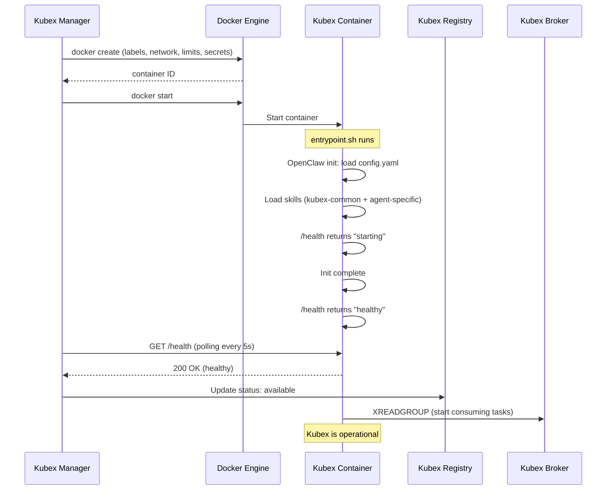
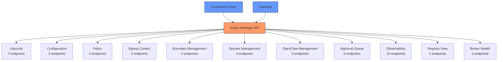

# Kubex Manager — Lifecycle & REST API

> Extracted from BRAINSTORM.md. See [KubexClaw.md](../KubexClaw.md) for the full index.

---

## 19. Kubex Manager REST API

> **Closes gap:** 15.8 — Kubex Manager REST API schema not designed

### MVP Endpoint Scope

> **Closes gap:** M5 (Section 29) — 61 endpoints not scoped for MVP

The full Kubex Manager API defines ~61 endpoints across 11 categories (Section 19.11). **For MVP, only ~20 endpoints are required.** The remaining ~41 endpoints are deferred to post-MVP. This subset aligns with the Management API surface defined in [docs/api-layer.md](api-layer.md).

#### MVP Required Endpoints (~20)

**Lifecycle (7):**

| Method | Endpoint | Purpose |
|--------|----------|---------|
| `POST` | `/api/v1/agents` | Deploy a new agent |
| `GET` | `/api/v1/agents` | List all agents |
| `GET` | `/api/v1/agents/{name}` | Agent detail (status, resources, activity) |
| `POST` | `/api/v1/agents/{name}/stop` | Graceful stop |
| `POST` | `/api/v1/agents/{name}/start` | Start stopped agent |
| `POST` | `/api/v1/agents/{name}/restart` | Stop + start (config reload) |
| `DELETE` | `/api/v1/agents/{name}` | Remove agent permanently |

**Skills (3):**

| Method | Endpoint | Purpose |
|--------|----------|---------|
| `GET` | `/api/v1/skills` | List all available skills |
| `GET` | `/api/v1/skills/{name}` | Get skill details |
| `GET` | `/api/v1/skills?q={query}` | Search skills |

**Configuration (4):**

| Method | Endpoint | Purpose |
|--------|----------|---------|
| `GET` | `/api/v1/config` | Get system configuration |
| `PATCH` | `/api/v1/config` | Update system configuration |
| `PUT` | `/api/v1/config/providers/{name}` | Add/update LLM provider |
| `DELETE` | `/api/v1/config/providers/{name}` | Remove LLM provider |

**Monitoring (3):**

| Method | Endpoint | Purpose |
|--------|----------|---------|
| `GET` | `/api/v1/health` | System health check |
| `GET` | `/api/v1/agents/{name}/logs` | Stream/fetch agent logs |
| `GET` | `/api/v1/budget` | Budget usage summary |

**Approvals (3):**

| Method | Endpoint | Purpose |
|--------|----------|---------|
| `GET` | `/api/v1/approvals` | List pending approval requests |
| `POST` | `/api/v1/approvals/{id}/approve` | Approve an action |
| `POST` | `/api/v1/approvals/{id}/deny` | Deny an action |

#### Post-MVP Endpoints (~41)

The following endpoint categories are deferred to post-MVP:

- **Per-Kubex configuration** (`/kubex/{id}/config`, `/kubex/{id}/skills`) — MVP uses file-based config
- **Policy management** (`/kubex/{id}/policy`, `/policy/global`, `/boundary/{name}/policy`) — MVP uses YAML files
- **Egress control** (`/kubex/{id}/egress`, `/egress/global`) — MVP uses policy YAML
- **Boundary management** (`/boundary`, `/boundary/{name}`) — MVP uses single `default` boundary
- **Secrets management** (`/kubex/{id}/secrets`, `/secrets/audit`) — MVP uses file-based secrets
- **OpenClaw instance management** (`/kubex/{id}/openclaw/*`) — direct container access for MVP
- **Advanced observability** (`/kubex/{id}/metrics`, `/kubex/{id}/tasks`, `/kubex/{id}/actions`, `/kubex/{id}/connections`, `/kubex/{id}/usage`, `/kubex/{id}/rate-limits`, WebSocket feeds) — MVP uses log-based monitoring
- **Dashboard aggregation** (`/dashboard/*`) — deferred to Command Center
- **Registry view** (`/registry/capabilities/*`) — direct Registry access for MVP
- **Broker health** (`/broker/*`) — direct Redis CLI for MVP

---

### 19.1 Design Principle

**Command Center talks to Kubex Manager. Kubex Manager talks to everything else.** The Kubex Manager API is the single backend for the Command Center. Command Center never talks directly to individual Kubexes, the Gateway, Broker, or Registry for configuration or monitoring. One API surface for all configuration, monitoring, and control.

**MVP scope:** Kubex Manager manages **worker Kubexes only** (Scraper, Reviewer) — not the Orchestrator. The Orchestrator is docker-compose managed (long-lived, always running) because it is the user's entry point (`docker exec -it`) and does not need dynamic lifecycle management. Kubex Manager creates, starts, stops, and kills worker Kubexes dynamically based on workload. Post-MVP, the Orchestrator may be migrated to Kubex Manager management if dynamic scaling is needed.

**Auth model:** Internal network only + Bearer token. Kubex Manager is never exposed externally. Only the Gateway (for `activate_kubex` actions) and Command Center have the token.

### 19.2 Kubex Lifecycle

| Method | Path | Purpose | Called By |
|---|---|---|---|
| `POST /kubex` | Create + start a new Kubex container | Gateway (`activate_kubex`), Command Center |
| `GET /kubex` | List all Kubexes with status | Command Center |
| `GET /kubex/{id}` | Get single Kubex details + health | Command Center, Gateway |
| `POST /kubex/{id}/stop` | Graceful stop | Gateway, Command Center |
| `POST /kubex/{id}/kill` | Emergency kill + secret rotation | Gateway, Command Center |
| `POST /kubex/{id}/restart` | Stop + start (config reload) | Command Center |
| `DELETE /kubex/{id}` | Remove container entirely | Command Center |

**Lifecycle events:** Kubex Manager publishes state changes to a Redis Stream (`kubex:lifecycle`) on **db3** (see Redis Database Assignment Table in Section 13.9). Events: `created`, `started`, `stopped`, `killed`, `crashed`, `health_degraded`. Command Center and Gateway consume this stream for real-time updates. AOF persistence is enabled on db3 to preserve lifecycle events for audit trail.

**Authentication labels:** On every container creation, Kubex Manager MUST set the following Docker labels for identity resolution by the Gateway:
- `kubex.agent_id` — the unique agent identifier (e.g., `email-agent-01`)
- `kubex.boundary` — the boundary this Kubex belongs to (e.g., `data-collection`)

These labels are the source of truth for Kubex identity. The Gateway resolves them via Docker API source IP lookup (see Section 16.2, Section 16.3). Kubexes cannot modify their own labels.

#### Kubex Boot Sequence

When Kubex Manager creates and starts a Kubex container, the following sequence occurs:

1. **Kubex Manager creates container** with Docker labels (`kubex.agent_id`, `kubex.boundary`), network attachments, resource limits, and secret mounts
2. **Container starts** — Docker entrypoint runs `entrypoint.sh`
3. **OpenClaw framework initializes** — loads `config.yaml`, loads skill definitions, initializes tool registry
4. **Skills load** — `kubex-common` built-in skills (including `knowledge`) and agent-specific skills registered
5. **Health endpoint becomes available** at `/health` (returns `starting` during init, `healthy` when ready)
6. **Kubex Manager detects healthy status** via health check — updates Registry to `available`
7. **Kubex starts consuming from Broker queue** — begins accepting `dispatch_task` messages

#### Kubex Shutdown Drain

Graceful shutdown ensures in-flight tasks complete and no work is silently lost:

1. **Kubex Manager sends SIGTERM** to the container
2. **Kubex stops consuming new tasks** from Broker queue (stops `XREADGROUP` calls)
3. **Kubex completes current in-flight task** (30s grace period for task completion)
4. **Kubex emits `report_result`** for current task — status is `"success"` if completed, `"interrupted"` if grace period expired
5. **Health endpoint returns `draining`** status
6. **Kubex Manager updates Registry** to `stopped`
7. **Container exits** cleanly (SIGKILL sent after 60s if still running)

| Phase | Duration | What Happens |
|---|---|---|
| **SIGTERM received** | t=0 | Stop consuming, start draining |
| **Task completion** | t=0 to t=30s | Complete in-flight task or mark interrupted |
| **Result emission** | t=30s | `report_result` sent for all pending tasks |
| **Clean shutdown** | t=30s to t=35s | Close connections, flush buffers |
| **SIGKILL** | t=60s | Force kill if container has not exited |

- [ ] Implement boot sequence health check polling in Kubex Manager (poll `/health` every 5s, timeout after 120s)
- [ ] Implement SIGTERM handler in `kubex-common` for graceful drain (stop consuming, complete task, emit result)
- [ ] Configure Docker `stop_timeout: 60` on all Kubex containers
- [ ] Implement `draining` health status in `kubex-common` health endpoint

### 19.3 Configuration

| Method | Path | Purpose | Called By |
|---|---|---|---|
| `GET /kubex/{id}/config` | Get Kubex configuration (skills, model allowlist, etc.) | Command Center |
| `PUT /kubex/{id}/config` | Update Kubex configuration (triggers restart) | Command Center |
| `GET /kubex/{id}/skills` | List skills loaded on this Kubex | Command Center |
| `PUT /kubex/{id}/skills` | Update skill allocation (triggers restart) | Command Center |
| `GET /skills` | List all available skills (kubex-common built-ins + custom) | Command Center |

Skill loading ties to Section 16.4 — `kubex_common.skills.*` for built-ins, `skills.*` for agent-specific. `PUT /kubex/{id}/skills` updates the Kubex's `config.yaml` skills list and triggers a restart to load the new set.

### 19.4 Policy

All policy configuration — including model allowlists, rate limits, action permissions, tier assignments — is managed through policy endpoints. Policy is the single source of truth for "what is this Kubex allowed to do."

| Method | Path | Purpose | Called By |
|---|---|---|---|
| `GET /kubex/{id}/policy` | Get Kubex-specific policy rules | Command Center, Gateway |
| `PUT /kubex/{id}/policy` | Update Kubex-specific policy rules | Command Center |
| `GET /policy/global` | Get global policy rules (apply to all Kubexes) | Command Center |
| `PUT /policy/global` | Update global policy rules | Command Center |
| `GET /boundary/{name}/policy` | Get boundary-specific policy rules | Command Center, Gateway |
| `PUT /boundary/{name}/policy` | Update boundary policy rules | Command Center |

Policy covers: action permissions, model allowlists, rate limit thresholds, tier assignments, inter-agent communication rules, egress allowlists/blocklists.

### 19.5 Egress Control

| Method | Path | Purpose | Called By |
|---|---|---|---|
| `GET /kubex/{id}/egress` | Get egress rules (allowed/blocked external APIs) | Command Center, Gateway |
| `PUT /kubex/{id}/egress` | Update egress allowlist/blocklist | Command Center |
| `GET /egress/global` | Get global egress defaults | Command Center |
| `PUT /egress/global` | Update global egress defaults | Command Center |

Maps to the Gateway's Egress Proxy (Section 13.9). Each Kubex has an allowlist of external APIs it can call. Global defaults apply unless overridden per-Kubex.

### 19.6 Boundary Management

| Method | Path | Purpose | Called By |
|---|---|---|---|
| `GET /boundary` | List all boundaries | Command Center |
| `GET /boundary/{name}` | Get boundary details (member Kubexes, gateway Kubex) | Command Center |
| `GET /boundary/{name}/policy` | Get boundary-specific policy rules | Command Center, Gateway |
| `PUT /boundary/{name}/policy` | Update boundary policy rules | Command Center |

### 19.7 Secrets Management

| Method | Path | Purpose | Called By |
|---|---|---|---|
| `GET /kubex/{id}/secrets` | List secret keys (names only — never values) | Command Center |
| `PUT /kubex/{id}/secrets` | Set/rotate secrets for a Kubex | Command Center |
| `POST /kubex/{id}/secrets/rotate` | Force rotation of all secrets | Command Center |
| `GET /secrets/audit` | Audit log of secret access/changes | Command Center |

Secret values are **never returned** via the API. Only key names and metadata (last rotated, created by). Ties into Section 17.5 — evaluate `openclaw secrets` integration for per-Kubex secrets management.

### 19.8 OpenClaw Instance Management

Each Kubex runs an OpenClaw instance. These endpoints manage the OpenClaw runtime inside each container.

| Method | Path | Purpose | Called By |
|---|---|---|---|
| `GET /kubex/{id}/openclaw/config` | Get OpenClaw configuration for this Kubex | Command Center |
| `PUT /kubex/{id}/openclaw/config` | Update OpenClaw configuration | Command Center |
| `GET /kubex/{id}/openclaw/status` | OpenClaw runtime status (version, health, loaded skills) | Command Center |
| `POST /kubex/{id}/openclaw/security-audit` | Trigger `openclaw security audit` (Section 17.5) | Command Center |
| `GET /kubex/{id}/openclaw/security-audit` | Get latest security audit results | Command Center |

### 19.9 Approval Queue (Human-in-the-Loop)

High-tier actions require human approval (Section 3). Command Center is where approvals happen.

| Method | Path | Purpose | Called By |
|---|---|---|---|
| `GET /approvals` | List pending approval requests | Command Center |
| `GET /approvals/{id}` | Get approval details (frozen execution plan) | Command Center |
| `POST /approvals/{id}/approve` | Approve an action | Command Center |
| `POST /approvals/{id}/reject` | Reject with reason | Command Center |
| `WS /approvals/live` | Real-time approval request feed | Command Center |

Approval requests include the frozen execution plan (Section 17 — adopt `system.run.prepare` pattern). What was approved is exactly what executes — no changes between approval and execution.

### 19.10 Mission Control & Observability

Real-time monitoring and activity feeds for each Kubex and the swarm as a whole.

**Per-Kubex observability:**

| Method | Path | Purpose | Called By |
|---|---|---|---|
| `GET /kubex/{id}/logs` | Stream/fetch Kubex logs | Command Center |
| `GET /kubex/{id}/metrics` | Get Kubex metrics (CPU, memory, request count) | Command Center |
| `GET /kubex/{id}/tasks` | Get active/recent tasks for this Kubex | Command Center |
| `GET /kubex/{id}/actions` | Get action history (recent ActionRequests) | Command Center |
| `GET /kubex/{id}/connections` | Get inter-agent connections (who it talks to) | Command Center |
| `GET /kubex/{id}/usage` | Model usage + spend tracking | Command Center |
| `GET /kubex/{id}/rate-limits` | Current usage vs configured limits per action/API | Command Center |
| `WS /kubex/{id}/live` | WebSocket for real-time Kubex activity feed | Command Center |

**Swarm-wide observability:**

| Method | Path | Purpose | Called By |
|---|---|---|---|
| `GET /dashboard/overview` | Swarm summary (counts, health, alerts) | Command Center |
| `GET /dashboard/activity` | Recent activity across all Kubexes | Command Center |
| `GET /dashboard/usage` | Swarm-wide model spend summary | Command Center |
| `GET /rate-limits` | Swarm-wide rate limit status and hotspots | Command Center |
| `WS /dashboard/live` | WebSocket for real-time swarm activity feed | Command Center |

**Registry view:**

| Method | Path | Purpose | Called By |
|---|---|---|---|
| `GET /registry/capabilities` | List all advertised capabilities across all Kubexes | Command Center |
| `GET /registry/capabilities/{capability}` | Which Kubexes can handle this capability | Command Center |

**Broker health:**

| Method | Path | Purpose | Called By |
|---|---|---|---|
| `GET /broker/status` | Stream lengths, consumer lag, dead letters | Command Center |
| `GET /broker/dead-letters` | List failed/undeliverable messages | Command Center |
| `POST /broker/dead-letters/{id}/retry` | Retry a dead letter message | Command Center |

### 19.11 API Summary

**Total: ~61 endpoints** across 11 categories. The Gateway only calls lifecycle endpoints (`POST /kubex` for `activate_kubex` actions) and reads policy/egress for enforcement. Command Center has full access to everything.

### 19.12 Action Items

- [ ] Generate OpenAPI 3.0 spec for all endpoints
- [ ] Implement Kubex lifecycle endpoints (MVP priority)
- [ ] Implement policy and egress endpoints (MVP priority)
- [ ] Implement skills management endpoints
- [ ] Implement approval queue with WebSocket feed
- [ ] Implement secrets management endpoints
- [ ] Implement observability endpoints (logs, metrics, tasks, actions)
- [ ] Implement dashboard aggregation endpoints
- [ ] Implement OpenClaw instance management endpoints
- [ ] Implement Registry and Broker health proxy endpoints
- [ ] Define error response schema (consistent error codes across all endpoints)
- [ ] Implement Bearer token auth middleware
- [ ] Kubex Manager must set `kubex.agent_id` and `kubex.boundary` labels on container creation
