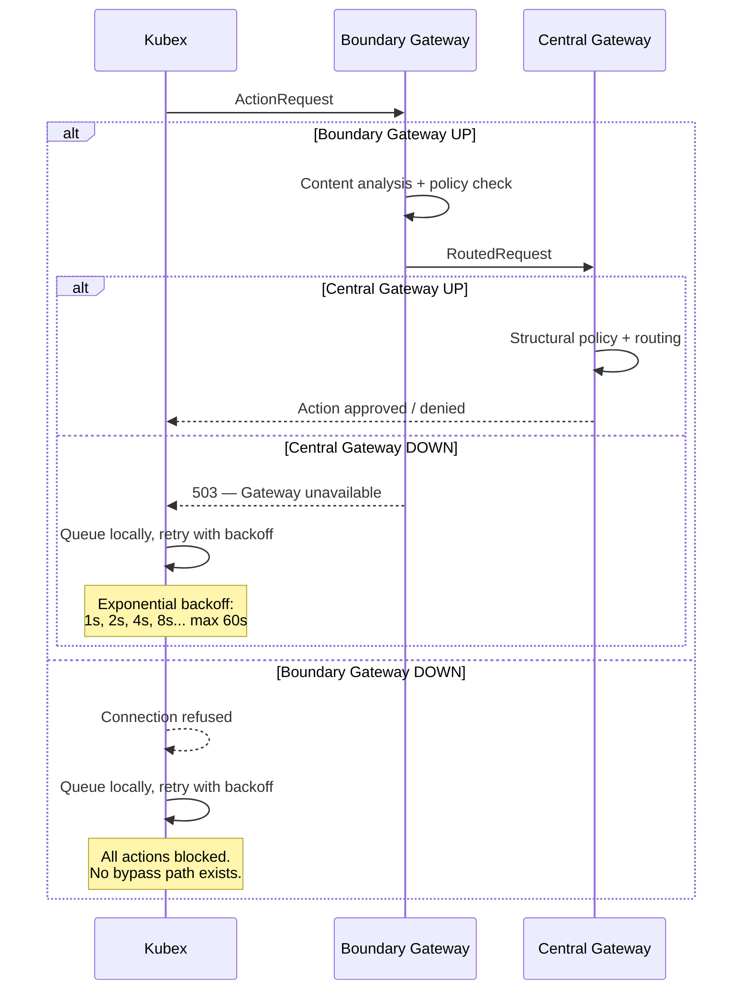
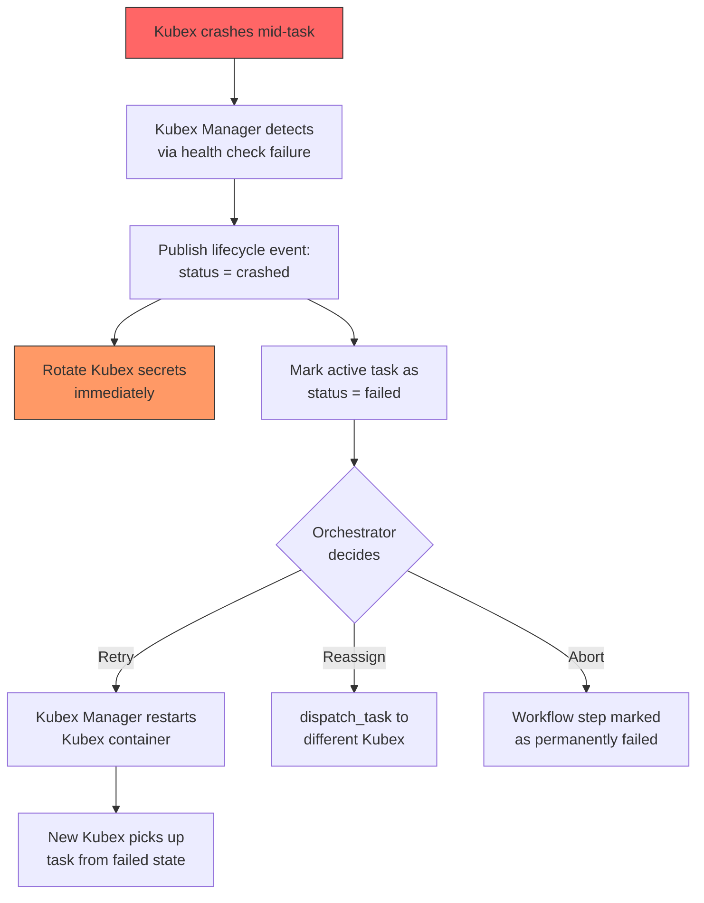
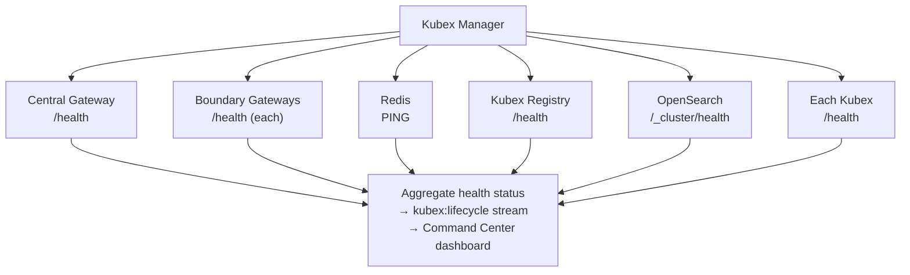
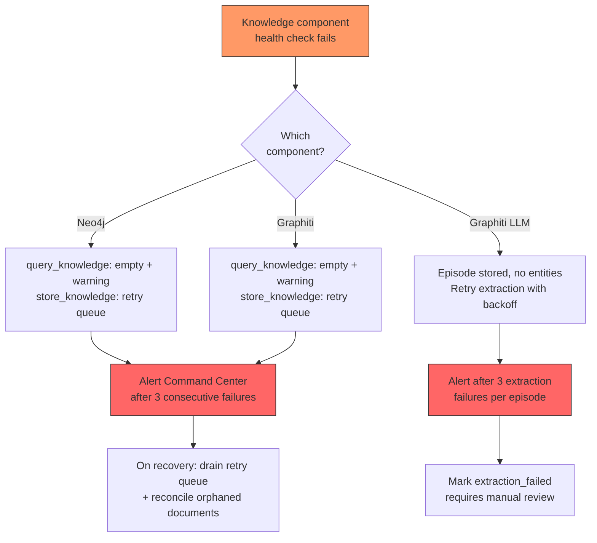
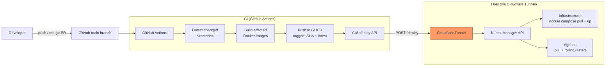
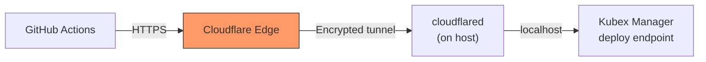
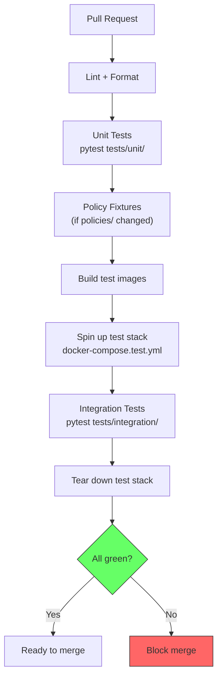
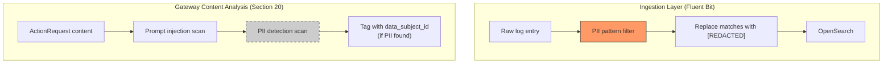
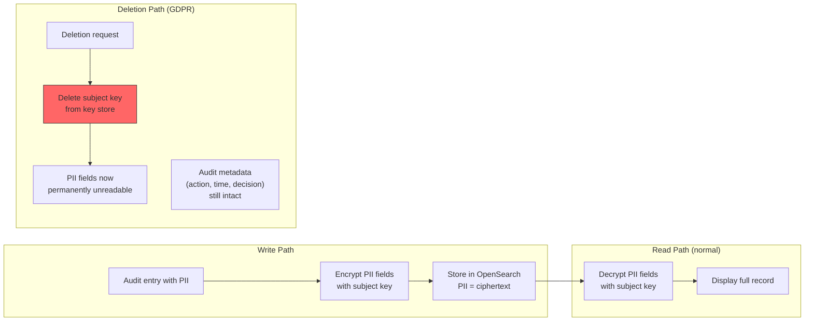
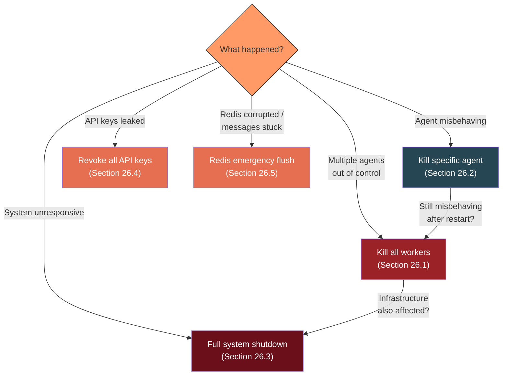

# Operations — Error Handling, CI/CD, Testing, Compliance & DR

> Extracted from BRAINSTORM.md. See [KubexClaw.md](../KubexClaw.md) for the full index.

---

## 21. Error Handling & Failure Modes

> **Closes gap:** 15.11 — No error handling / failure mode design

### 21.1 Core Principle

**Security components fail-closed. Observability components degrade gracefully.**

If a security-critical component (Gateway, Boundary Gateway) is unreachable, no actions proceed — Kubexes queue and wait. If an observability component (OpenSearch, Grafana) is unreachable, agent work continues and logs/metrics buffer locally until recovery.

### 21.2 Failure Behavior Per Component

| Component Down | Behavior | Category | Rationale |
|---|---|---|---|
| **Central Gateway** | **Fail-closed** — Kubex actions queue locally with exponential backoff. No action proceeds without policy evaluation. | Security | An unvalidated action is worse than a delayed action. Core trust model requirement. |
| **Boundary Gateway** | **Fail-closed** — All Kubexes in that boundary stall. Central Gateway alerts Command Center. Other boundaries unaffected. | Security | No boundary bypass. Isolation is maintained. |
| **Broker (Redis Streams)** | **Fail-closed for `dispatch_task`** — inter-agent messages queue at Central Gateway. Local actions (`http_get`, `write_output`, etc.) still proceed if Gateway is up. | Partial | Dispatch depends on Broker. Local actions don't. |
| **Redis crashes** | Broker messages lost if not persisted. **AOF persistence enabled** for message durability. On recovery, consumer groups resume from last acknowledged message. | Security | Redis Streams with AOF gives crash recovery. Unacked messages are replayed. |
| **Kubex crashes mid-task** | Kubex Manager detects via health check → marks Kubex as `crashed` → publishes `crashed` lifecycle event → secrets rotated automatically → task marked as `failed` (not the whole workflow). Orchestrator can retry or reassign the task. | Operational | Crash ≠ workflow death. Just that task failed. |
| **Command Center down** | Approval requests queue in Gateway. Kubexes awaiting approval **stall** (they wait). Non-approval actions continue normally. | Partial | Command Center is UI, not control plane. Only the human-in-the-loop approval flow is affected. |
| **OpenSearch unreachable** | Fluent Bit buffers logs locally (configurable max: 512 MB). Logs resume flowing when OpenSearch recovers. If buffer fills, oldest logs are dropped with a warning. **Alert on buffer growth.** | Observability | Logging failure should never block agent work. |
| **Kubex Registry unreachable** | `query_registry` actions fail. `dispatch_task` uses cached capability data (stale but functional). Alert on cache staleness exceeding threshold. | Observability | Registry is read-heavy. Stale cache is acceptable short-term. |

### 21.3 Fail-Closed Flow



### 21.4 Kubex Crash Recovery



### 21.5 Graceful Degradation Tiers

Not all failures are equal. The system degrades in tiers:

| Tier | Components Lost | System State | Agent Impact |
|---|---|---|---|
| **Tier 0 — Fully operational** | None | All systems green | Full capability |
| **Tier 1 — Observability degraded** | OpenSearch, Grafana | Logs buffer locally, dashboards unavailable | Agents work normally. Operators lose visibility. |
| **Tier 2 — Discovery degraded** | Kubex Registry | Cached capabilities used, new Kubex registration fails | Agents work with stale routing. New agents can't advertise. |
| **Tier 3 — Messaging degraded** | Broker (Redis Streams) | Inter-agent dispatch queues at Gateway | Local actions work. Cross-agent workflows stall. |
| **Tier 4 — Approval degraded** | Command Center | Approval queue grows, high-tier actions stall | Low-tier actions work. High-tier actions wait for approval. |
| **Tier 5 — Boundary isolated** | One Boundary Gateway | That boundary's Kubexes stall completely | Other boundaries unaffected. Isolated boundary is frozen. |
| **Tier 6 — System down** | Central Gateway | All Kubex actions blocked across all boundaries | Complete stall. Emergency: direct Docker CLI intervention required. |

### 21.6 Local Queue Behavior

When a Kubex cannot reach its Boundary Gateway, it queues actions locally:

- **Queue location:** In-memory within the Kubex container (via `kubex-common`)
- **Max queue size:** 100 actions (configurable via policy)
- **Backoff strategy:** Exponential — 1s, 2s, 4s, 8s, 16s, 32s, max 60s
- **Queue overflow:** If queue is full, oldest non-critical actions are dropped. `report_result` actions are never dropped (results must not be lost).
- **On reconnect:** Queue drains in FIFO order. Boundary Gateway processes normally.

### 21.7 Health Check Cascade

Kubex Manager monitors all components and publishes health status:



Health check interval: 10s for infrastructure components, 30s for individual Kubexes. Configurable via Kubex Manager settings.

### 21.8 Kubex Manager Failure

The failure table in 21.2 covers Gateway, Broker, Redis, OpenSearch, Registry, and individual Kubex crashes — but does not address **Kubex Manager itself** going down.

| Aspect | Detail |
|--------|--------|
| **Impact** | No new containers can be started, no health checks on Kubexes, no lifecycle events published, auto-stop timers halt. Existing running Kubexes continue executing but are effectively unmanaged. |
| **Detection** | Health check endpoint on Kubex Manager itself (`/health`). Docker restart policy or external watchdog detects process exit. |
| **Recovery** | Restart Kubex Manager process/container. On restart, it re-scans running containers via Docker API to rebuild internal state. Existing Kubexes were never stopped — they just lacked management during the outage. |
| **Mitigation** | Configure Docker `restart: unless-stopped` policy on the Kubex Manager container. Consider a lightweight watchdog process (systemd, Docker healthcheck with restart) as defense-in-depth. |

> **Key distinction:** Kubex Manager failure is **not** fail-closed (unlike Gateway failure). Running Kubexes continue operating and can still reach the Gateway. The risk is operational: no new Kubexes, no crash recovery, no lifecycle visibility.

### 21.9 Knowledge Base Failure Modes

The knowledge base (Graphiti + Neo4j + OpenSearch corpus) introduces additional failure scenarios. Knowledge is **not** security-critical — it degrades gracefully.

| Component Down | Behavior | Category | Rationale |
|---|---|---|---|
| **Neo4j unreachable** | `query_knowledge` returns empty results with `warning: "knowledge_unavailable"` flag (fail-open for reads). `store_knowledge` is fail-closed for writes — queued in Gateway retry queue with exponential backoff. | Partial | Missing knowledge is acceptable. Losing a write silently is not. |
| **Graphiti server crash** | Same as Neo4j down for reads. For writes: if crash happens mid-ingestion, OpenSearch may have the document but the graph has no corresponding entities. | Partial | Two-phase ingestion creates a window for partial state. |
| **Graphiti LLM call failure** | Episode ingested into Graphiti but no entities extracted (LLM timeout or error). Episode marked as `needs_extraction`. | Operational | Entity extraction is LLM-dependent — transient failures are expected. |

**Recovery procedures:**

1. **Neo4j unreachable:** Gateway retries `store_knowledge` writes with exponential backoff (1s, 2s, 4s, max 60s). Once Neo4j recovers, queued writes drain. Reads immediately resume returning results. No data loss.

2. **Graphiti crash mid-ingestion:** OpenSearch has the document (step 1 of two-step ingestion) but the graph has no entities (step 2 never completed). Recovery: a periodic reconciliation job queries OpenSearch for documents with no corresponding Graphiti entities (by `source_id`) and re-runs `add_episode()` for each. This job runs on Gateway startup and can be triggered manually via Kubex Manager API.

3. **Graphiti LLM call failure:** Episodes are stored but entity extraction failed. Graphiti's internal retry mechanism handles transient failures. If extraction fails 3 times consecutively, an alert fires to Command Center. A background retry queue with exponential backoff (30s, 60s, 120s, max 600s) re-attempts extraction. After 3 total failures per episode, the episode is marked `extraction_failed` and requires manual review.

**Detection — health checks:**

| Component | Health Check | Port | Interval | Failure Threshold |
|---|---|---|---|---|
| Neo4j | `cypher-shell "RETURN 1"` | 7687 (Bolt) | 10s | 3 consecutive failures |
| Graphiti | `HTTP GET /health` | 8100 (HTTP) | 10s | 3 consecutive failures |

Both checks are added to the Kubex Manager health check cascade (Section 21.7).



### 21.10 Action Items

- [ ] Implement local action queue in `kubex-common` (in-memory, configurable max size, exponential backoff)
- [ ] Enable Redis AOF persistence for Broker message durability
- [ ] Implement automatic secret rotation on Kubex crash in Kubex Manager
- [ ] Implement health check cascade in Kubex Manager
- [ ] Define health check endpoints for all infrastructure components
- [ ] Implement graceful degradation tier detection and alerting
- [ ] Add Fluent Bit buffer monitoring and alerting (warn at 256 MB, critical at 512 MB)
- [ ] Implement Registry capability cache with staleness threshold and alerting
- [ ] Implement knowledge base retry queue in Gateway for `store_knowledge` failures
- [ ] Build reconciliation job for orphaned OpenSearch documents (no matching Graphiti entities)
- [ ] Add Neo4j and Graphiti health checks to Kubex Manager health check cascade
- [ ] Implement Graphiti extraction failure alerting (alert after 3 failures per episode)

---

## 22. CI/CD Pipeline

> **Closes gap:** 15.12 — No CI/CD pipeline design

### 22.1 Overview

GitHub Actions builds changed images, pushes to GitHub Container Registry (GHCR), then triggers deployment on the host via Kubex Manager API through a Cloudflare Tunnel.



### 22.2 Container Registry

**GitHub Container Registry (GHCR)** — free for private repos, natively integrated with GitHub Actions.

**Image naming convention:**
- `ghcr.io/{org}/kubexclaw/gateway:latest`
- `ghcr.io/{org}/kubexclaw/gateway:{git-sha}`
- `ghcr.io/{org}/kubexclaw/kubex-broker:latest`
- `ghcr.io/{org}/kubexclaw/kubex-base:{openclaw-version}`
- `ghcr.io/{org}/kubexclaw/agent-{name}:latest`
- `ghcr.io/{org}/kubexclaw/agent-{name}:{git-sha}`

**Tagging strategy:**
- Every build pushes two tags: `{git-sha}` (immutable) and `latest` (mutable pointer)
- Production deployments reference `{git-sha}` for reproducibility
- `latest` is for dev convenience only

### 22.3 Build Strategy — Monorepo-Aware

GitHub Actions detects which directories changed and only builds affected images:

```yaml
# .github/workflows/build-deploy.yml (simplified)
on:
  push:
    branches: [main]

jobs:
  detect-changes:
    runs-on: ubuntu-latest
    outputs:
      kubex-common: ${{ steps.changes.outputs.kubex-common }}
      gateway: ${{ steps.changes.outputs.gateway }}
      broker: ${{ steps.changes.outputs.broker }}
      agents: ${{ steps.changes.outputs.agents }}
    steps:
      - uses: dorny/paths-filter@v3
        id: changes
        with:
          filters: |
            kubex-common:
              - 'libs/kubex-common/**'
            gateway:
              - 'services/gateway/**'
              - 'libs/kubex-common/**'
            broker:
              - 'services/kubex-broker/**'
              - 'libs/kubex-common/**'
            base:
              - 'agents/_base/**'
              - 'libs/kubex-common/**'
            agents:
              - 'agents/**'
              - 'libs/kubex-common/**'

  build-gateway:
    needs: detect-changes
    if: needs.detect-changes.outputs.gateway == 'true'
    # ... build and push gateway image

  build-agents:
    needs: detect-changes
    if: needs.detect-changes.outputs.agents == 'true'
    # ... build and push affected agent images

  deploy:
    needs: [build-gateway, build-agents]  # runs after all builds
    if: always() && !failure()
    steps:
      - name: Trigger deployment
        run: |
          curl -X POST https://deploy.kubexclaw.internal/deploy \
            -H "Authorization: Bearer ${{ secrets.DEPLOY_TOKEN }}" \
            -H "Content-Type: application/json" \
            -d '{"commit": "${{ github.sha }}", "changed": "${{ needs.detect-changes.outputs }}"}'
```

**Key rule:** Any change to `libs/kubex-common/` triggers rebuild of ALL services and agents that depend on it. This ensures the shared contract stays in sync.

### 22.4 Deployment Trigger — Cloudflare Tunnel

The host is not directly reachable from the internet. A **Cloudflare Tunnel** provides a secure, zero-open-ports connection from GitHub Actions to the Kubex Manager API.

**Setup:**
- `cloudflared` daemon runs on the host alongside the KubexClaw stack
- Tunnel exposes only the Kubex Manager deploy endpoints (not the full API)
- Tunnel hostname: e.g., `deploy.kubexclaw.internal` (Cloudflare Access can add additional auth layer)

**Security:**
- Zero inbound ports open on the host
- Encrypted tunnel (TLS via Cloudflare)
- Deploy endpoint requires Bearer token authentication (CI secret)
- Cloudflare Access can restrict to GitHub Actions IP ranges as additional layer
- Deploy token is rotated on a schedule and stored in GitHub Secrets



### 22.5 Deploy Endpoints (Added to Kubex Manager API — Section 19)

| Method | Path | Purpose | Called By |
|---|---|---|---|
| `POST /deploy` | Full deployment — pull all changed images, restart affected services and agents | CI pipeline |
| `POST /deploy/infrastructure` | Pull + restart infrastructure services only (docker compose) | CI pipeline, Command Center |
| `POST /deploy/agents` | Pull + rolling restart of all agent Kubexes | CI pipeline, Command Center |
| `POST /deploy/agent/{id}` | Pull + restart a specific agent Kubex | CI pipeline, Command Center |
| `GET /deploy/status` | Current deployment status (in-progress, last deploy info) | Command Center |
| `GET /deploy/history` | Deployment history (who, when, what changed, commit SHA) | Command Center |

**Request body for `POST /deploy`:**
```json
{
  "commit": "abc123def",
  "changed": {
    "infrastructure": ["gateway", "kubex-broker"],
    "agents": ["instagram-scraper", "email-agent"],
    "kubex-common": true
  },
  "strategy": "rolling"
}
```

**Deployment strategy:**
- **Infrastructure:** `docker compose pull && docker compose up -d` — sequential restart to maintain availability
- **Agents:** Rolling restart — one Kubex at a time, health check passes before proceeding to the next
- **Rollback:** If health check fails after restart, auto-rollback to previous image tag

### 22.6 `kubex-common` Versioning

**Semver** — `kubex-common` follows semantic versioning for changelog and communication:
- **Major** (2.0.0): Breaking schema changes (e.g., ActionRequest field removed/renamed)
- **Minor** (1.1.0): New modules, new action types, additive changes
- **Patch** (1.0.1): Bug fixes, documentation

**In practice:** All services and agents depend on `kubex-common` via local path in the monorepo (`kubex-common @ file://../../libs/kubex-common`). Version is implicit — same commit = same version. Semver is for:
- Changelog entries in `libs/kubex-common/CHANGELOG.md`
- CI validation: major version bump requires explicit confirmation
- Communication between team members about breaking changes

### 22.7 Policy Testing in CI

Policy changes (`policies/*.yaml`) get automated validation before deployment:

**Pipeline steps:**
1. **Lint** — YAML syntax validation + schema validation against policy schema
2. **Dry-run** — Replay a set of test `ActionRequest` fixtures against the policy rules. Assert expected outcomes (approve / deny / escalate).
3. **Diff report** — Show which actions would change behavior (newly denied, newly approved) compared to current production policies.

```yaml
# Example: Policy test fixture
- name: "Scraper agent can http_get"
  action_request:
    agent_id: "instagram-scraper"
    action: "http_get"
    parameters:
      url: "https://instagram.com/api/v1/feed"
  expected: "approve"

- name: "Scraper agent cannot send_email"
  action_request:
    agent_id: "instagram-scraper"
    action: "send_email"
    parameters:
      to: "someone@example.com"
  expected: "deny"

- name: "Unknown action is denied"
  action_request:
    agent_id: "instagram-scraper"
    action: "drop_database"
  expected: "deny"
```

### 22.8 OpenClaw Base Version Management

OpenClaw version is pinned in `agents/_base/Dockerfile.base`:

```dockerfile
FROM openclaw/openclaw:v2026.2.26
```

**Update process:**
1. Dependabot or manual PR bumps the OpenClaw version
2. PR description includes OpenClaw changelog diff (security fixes, breaking changes)
3. CI rebuilds ALL agent images (base change = full rebuild)
4. Security audit: `openclaw security audit` runs in CI against the new version
5. Deploy after review

### 22.9 Knowledge Base CI/CD

**Image version pinning:** Neo4j and Graphiti images must be pinned to specific versions in `docker-compose.yml` — no `:latest` tags in production.

| Service | Image | Pin Strategy |
|---|---|---|
| Neo4j | `neo4j:5.26-community` | Pin to minor version. Update via PR with changelog review. |
| Graphiti | `zepai/graphiti:v0.x.y` | Pin to exact tag. `:latest` is not reproducible. |

If custom Graphiti configuration overlays are needed (e.g., custom ontology config, environment tuning), build a thin overlay image: `ghcr.io/{org}/kubexclaw/graphiti-config:vX.Y.Z` that extends the upstream Graphiti image with custom config files.

**Change detection:** Add Graphiti and Neo4j config paths to the monorepo-aware CI build matrix (Section 22.3):

```yaml
# Add to dorny/paths-filter in .github/workflows/build-deploy.yml
knowledge:
  - 'config/graphiti/**'
  - 'config/neo4j/**'
  - 'docker-compose.yml'  # catches image version bumps
```

If `knowledge` paths change, CI triggers:
1. Rebuild `graphiti-config` overlay image (if applicable)
2. Deploy via `POST /deploy/infrastructure` which runs `docker compose pull && docker compose up -d` for Graphiti and Neo4j

### 22.10 Action Items

- [ ] Set up GitHub Container Registry for the monorepo
- [ ] Create GitHub Actions workflow with monorepo-aware change detection
- [ ] Set up Cloudflare Tunnel on the host for deploy endpoint
- [ ] Implement deploy endpoints in Kubex Manager API (`/deploy`, `/deploy/infrastructure`, `/deploy/agents`, `/deploy/agent/{id}`)
- [ ] Implement rolling restart with health check gates
- [ ] Implement auto-rollback on failed health check
- [ ] Create policy test fixture format and CI validation step
- [ ] Set up Dependabot for OpenClaw base version tracking
- [ ] Initialize `kubex-common` semver and CHANGELOG.md
- [ ] Create deploy token rotation schedule and store in GitHub Secrets
- [ ] Pin Neo4j image to specific minor version in `docker-compose.yml` (replace `neo4j:5-community` with `neo4j:5.26-community`)
- [ ] Pin Graphiti image to specific tag in `docker-compose.yml` (replace `zepai/graphiti:latest` with exact version)
- [ ] Add Graphiti/Neo4j config change detection to GitHub Actions workflow
- [ ] Create `graphiti-config` overlay image if custom configuration is needed

---

## 23. Testing Strategy

> **Closes gap:** 15.13 — No testing strategy

### 23.1 Testing Layers

| Layer | What to Test | How | When (CI trigger) |
|---|---|---|---|
| **Unit** | `kubex-common` schemas, action vocabulary, enums, config parsing | pytest with fixtures. Pure data — no mocks needed. | Every PR |
| **Unit** | Gateway Policy Engine rules | Feed mock `ActionRequest` → assert approve/deny/escalate. Reuses policy test fixtures from Section 22.7. | Every PR |
| **Unit** | Model selector skill | Mock tasks of varying complexity. Assert model_selector chooses cheap model for simple tasks, escalates for complex ones. | Every PR touching `kubex-common/skills/` |
| **Integration** | Gateway + Broker + Registry | Docker Compose test stack (`docker-compose.test.yml`). Real services, test Kubexes that emit known ActionRequests. Assert correct routing, policy enforcement, message delivery. | Every PR touching `services/` |
| **Integration** | Boundary policy cascade | Test that global + boundary + kubex policies compose correctly. Feed requests through a multi-boundary test stack. Assert precedence rules. | Every PR touching `policies/` |
| **End-to-end** | Full workflow: Orchestrator → Agent → output | Full stack via `docker-compose.test.yml`. Orchestrator dispatches a task, agent executes, result flows back through Gateway. Assert workflow completes with expected output. | Nightly CI + pre-deploy |
| **Chaos** | Fail-closed behavior, graceful degradation | Kill Gateway mid-request, kill Redis, kill a Kubex mid-task. Assert system degrades per Section 21 tiers. | Manual / scheduled weekly |

### 23.2 Test Infrastructure

**`docker-compose.test.yml`** — a minimal test stack:

```yaml
# docker-compose.test.yml (simplified)
services:
  gateway:
    image: kubexclaw/gateway:test
    environment:
      - POLICY_DIR=/policies/test
  redis:
    image: redis:7-alpine
  kubex-broker:
    image: kubexclaw/kubex-broker:test
  kubex-registry:
    image: kubexclaw/kubex-registry:test

  # Test Kubexes — minimal agents with predictable behavior
  test-agent-alpha:
    image: kubexclaw/agent-test:latest
    environment:
      - BOUNDARY=test-boundary-a
      - SKILLS=kubex_common.skills.model_selector
  test-agent-beta:
    image: kubexclaw/agent-test:latest
    environment:
      - BOUNDARY=test-boundary-b
```

This stack is used by both integration and E2E tests. CI spins it up, runs tests, tears it down.

### 23.3 Policy Test Fixtures

Policy test fixtures (introduced in Section 22.7) serve double duty:
- **CI validation** — lint + dry-run on every PR touching `policies/`
- **Gateway test harness** — the same fixtures validate Gateway behavior in integration tests

```yaml
# tests/fixtures/policy/scraper-permissions.yaml
- name: "Scraper can http_get instagram"
  action_request:
    agent_id: "instagram-scraper"
    action: "http_get"
    parameters:
      url: "https://instagram.com/api/v1/feed"
  expected: "approve"

- name: "Scraper cannot send_email"
  action_request:
    agent_id: "instagram-scraper"
    action: "send_email"
    parameters:
      to: "someone@example.com"
  expected: "deny"

- name: "Cross-boundary dispatch requires approval"
  action_request:
    agent_id: "instagram-scraper"
    boundary: "engineering"
    action: "dispatch_task"
    parameters:
      target_capability: "send-notification"
      context_message: "Notify user about new post"
  expected: "escalate"
```

### 23.4 Test Naming Convention

```
tests/
├── unit/
│   ├── kubex_common/           # Unit tests for shared library
│   │   ├── test_action_request.py
│   │   ├── test_actions.py
│   │   ├── test_enums.py
│   │   ├── test_routing.py
│   │   └── test_model_selector.py
│   └── gateway/
│       └── test_policy_engine.py
├── integration/
│   ├── test_gateway_broker.py      # Gateway → Broker message flow
│   ├── test_boundary_routing.py    # Cross-boundary request routing
│   ├── test_policy_cascade.py      # Global + boundary + kubex policy composition
│   └── test_egress_proxy.py        # Egress allowlist/blocklist enforcement
├── e2e/
│   ├── test_full_workflow.py       # Orchestrator → Agent → result
│   ├── test_approval_flow.py       # Action → approval queue → approve → execute
│   └── test_activate_kubex.py      # Dynamic Kubex creation workflow
├── chaos/
│   ├── test_gateway_down.py        # Fail-closed when Gateway unreachable
│   ├── test_redis_crash.py         # Broker recovery after Redis crash
│   └── test_kubex_crash.py         # Crash recovery + secret rotation
└── fixtures/
    ├── policy/                     # Policy test fixtures (Section 22.7)
    ├── action_requests/            # Sample ActionRequests for all action types
    └── docker-compose.test.yml     # Test stack definition
```

### 23.5 CI Pipeline Integration



**Nightly CI** additionally runs:
- Full E2E tests (`tests/e2e/`)
- Chaos tests (`tests/chaos/`)
- `openclaw security audit` against the current base image

### 23.6 Coverage Requirements

| Component | Minimum Coverage | Rationale |
|---|---|---|
| `kubex-common` | 90% | Shared contract — errors cascade everywhere |
| Gateway Policy Engine | 95% | Security-critical — every rule must be tested |
| Kubex Manager lifecycle | 80% | Operational — most paths are straightforward |
| Broker routing | 80% | Infrastructure — message delivery must be reliable |
| Agent-specific skills | 70% | Business logic — varies by agent |

### 23.7 Knowledge Base Test Coverage

The knowledge base (Section 27) requires dedicated test coverage across all testing layers.

**Unit tests (`tests/unit/kubex_common/`):**

| Test File | What to Test |
|---|---|
| `test_query_knowledge.py` | `query_knowledge` action handler: parameter validation, `group_id` injection, `as_of` temporal filtering, empty result handling with warning flag |
| `test_store_knowledge.py` | `store_knowledge` action handler: two-step ingestion (OpenSearch index then Graphiti episode), parameter validation, provenance field injection |
| `test_search_corpus.py` | `search_corpus` action handler: OpenSearch query construction, full-text and vector search parameter mapping, boundary-scoped index selection |

**Integration tests (`tests/integration/`):**

| Test File | What to Test |
|---|---|
| `test_graphiti_extraction.py` | Graphiti entity extraction quality: given known input text, verify expected entities and relations are extracted. Asserts entity names, types, and relationship types match expectations. |
| `test_ontology_enforcement.py` | Ontology enforcement: submit `store_knowledge` with invalid entity types (not in the Pydantic ontology). Assert rejection or quarantine. Valid entity types are accepted. |
| `test_knowledge_group_isolation.py` | Group isolation: store knowledge in boundary A (`group_id: "boundary-a"`), then query from boundary B (`group_id: "boundary-b"`). Assert zero results. Query from boundary A returns the stored knowledge. |
| `test_temporal_queries.py` | Temporal query correctness: store a fact with `valid_at=March 1`, update the same fact with `valid_at=March 15`. Query with `as_of=March 10` returns the original fact. Query with `as_of=March 20` returns the updated fact. |

**End-to-end tests (`tests/e2e/`):**

| Test File | What to Test |
|---|---|
| `test_knowledge_pipeline.py` | Full ingestion pipeline: Kubex calls `memorize` (store_knowledge) with a document. Assert: document appears in OpenSearch `knowledge-corpus-*` index, Graphiti extracts entities and relations, subsequent `recall` (query_knowledge) returns the stored entities. Validates the complete document-to-graph-to-query round trip. |

**Test infrastructure addition to `docker-compose.test.yml`:**

```yaml
# Add to docker-compose.test.yml for knowledge base tests
services:
  neo4j-test:
    image: neo4j:5-community
    environment:
      - NEO4J_AUTH=neo4j/testpassword
    healthcheck:
      test: ["CMD", "cypher-shell", "-u", "neo4j", "-p", "testpassword", "RETURN 1"]
      interval: 5s
      timeout: 3s
      retries: 10
  graphiti-test:
    image: zepai/graphiti:v0.5.0
    environment:
      - NEO4J_URI=bolt://neo4j-test:7687
      - NEO4J_USER=neo4j
      - NEO4J_PASSWORD=testpassword
      - OPENAI_BASE_URL=http://gateway:8080/v1
      - OPENAI_API_KEY=placeholder
    depends_on:
      neo4j-test:
        condition: service_healthy
```

### 23.8 Action Items

- [ ] Set up pytest project structure with `tests/unit/`, `tests/integration/`, `tests/e2e/`, `tests/chaos/`
- [ ] Create `docker-compose.test.yml` with minimal test stack
- [ ] Create test Kubex image (`agent-test`) with predictable behavior for integration tests
- [ ] Write policy test fixture format and runner
- [ ] Write unit tests for `kubex-common` schemas (ActionRequest, GatekeeperEnvelope, routing)
- [ ] Write Gateway Policy Engine test harness
- [ ] Write E2E workflow test (orchestrator → agent → result)
- [ ] Configure CI pipeline to run unit + integration on every PR, E2E + chaos nightly
- [ ] Set up coverage reporting and minimum thresholds
- [ ] Write unit tests for knowledge action type handlers (`query_knowledge`, `store_knowledge`, `search_corpus`)
- [ ] Write integration tests for Graphiti entity extraction quality
- [ ] Write integration tests for ontology enforcement (invalid entity type rejection)
- [ ] Write integration tests for knowledge group isolation (boundary A cannot read boundary B)
- [ ] Write integration tests for temporal query correctness (`as_of` parameter)
- [ ] Write E2E test for full knowledge ingestion pipeline (document to OpenSearch to Graphiti to query)
- [ ] Add Neo4j and Graphiti to `docker-compose.test.yml`

---

## 24. Data Retention & GDPR Compliance

> **Closes gap:** 15.14 — No data retention / GDPR compliance details

### 24.1 MVP Rule: Don't Log PII

The simplest and most effective PII strategy is to **never store it in the first place**. From day one:

- **Fluent Bit filters** strip PII fields before logs reach OpenSearch. PII patterns (emails, phone numbers, SSNs, credit card numbers) are detected and replaced with `[REDACTED]` at the ingestion layer.
- **ActionRequest logs** store `agent_id`, `action`, `workflow_id`, `task_id` — never the content of `context_message` or `result` payloads in full. Content fields are truncated to first 200 characters with PII redaction applied.
- **Audit logs** store the action metadata (who did what, when, approved/denied) but not the full payload content.

This is the MVP approach. It's not perfect (PII can appear in unexpected fields), but it eliminates 90% of the risk with zero additional infrastructure.

### 24.2 Post-MVP: PII Detection Pipeline

PII detection integrates into the same content analysis pipeline as prompt injection detection (Section 20.4):



**Gateway-level PII detection** (post-MVP): The Gateway's content analysis pipeline (Section 20.4) adds a PII scan after prompt injection detection. If PII is detected in outbound content, it's flagged — not necessarily blocked, but tagged for compliance tracking.

### 24.3 Post-MVP: Data Subject Access Requests (DSAR)

**Problem:** "Find all data about person X across all OpenSearch indices."

**Solution:** Tag all records containing PII with a `data_subject_id` field at ingestion. DSAR query = search by that ID across all indices.

| Step | Action |
|---|---|
| 1. PII detected at ingestion | Fluent Bit or Gateway tags the record with `data_subject_id` (hashed identifier) |
| 2. DSAR received | Query OpenSearch: `data_subject_id: "hash_of_person_X"` across all indices |
| 3. Results compiled | Export all matching records as DSAR response |
| 4. Deletion requested | Trigger crypto-shredding (Section 24.4) |

### 24.4 Post-MVP: Crypto-Shredding for Right to Deletion

**Problem:** GDPR right to deletion conflicts with append-only audit logs. You can't delete audit entries (compliance requires them), but you must be able to "delete" a person's data.

**Solution: Crypto-shredding.**

1. PII fields in audit logs are encrypted with a **per-subject encryption key** before storage.
2. Keys are stored in a separate key management store (e.g., HashiCorp Vault or AWS KMS).
3. To "delete" a person's data: **delete the encryption key**. The audit log entries remain intact, but the PII fields become unreadable ciphertext.
4. Non-PII fields (action, timestamp, agent_id, decision) remain in plaintext — audit trail preserved.



### 24.5 Cross-Border Data Transfer

MVP is single-host deployment. Cross-border considerations:

- If agents process **EU citizen data**, the host must be in an EU region or a country with an EU adequacy decision.
- This is a **deployment decision**, not an architecture decision. The architecture is location-agnostic.
- Post-MVP: if deploying across regions, data residency tagging on boundaries (e.g., "finance boundary processes EU data → must run on EU host") becomes relevant.

### 24.6 Retention Periods (from Section 9)

Section 9 already defines retention periods. Restated here for completeness:

| Data Type | Retention | Rationale |
|---|---|---|
| Agent activity logs | 30 days | Operational troubleshooting |
| Gateway decision logs | 90 days | Security audit trail |
| Audit logs (full) | 1 year | Compliance requirement |
| Workflow execution logs | 60 days | Business process review |
| Metrics (Prometheus) | 30 days | Performance trending |

Retention is enforced via OpenSearch Index State Management (ISM) policies — automatic rollover and deletion.

### 24.7 Action Items

**MVP:**
- [ ] Implement Fluent Bit PII redaction filter (regex patterns for email, phone, SSN, credit card)
- [ ] Configure audit log format to exclude full content payloads (truncate + redact)
- [ ] Document deployment guidance: EU data → EU host

**Post-MVP:**
- [ ] Integrate PII detection into Gateway content analysis pipeline (Section 20.4)
- [ ] Implement `data_subject_id` tagging at ingestion layer
- [ ] Build DSAR query tool (cross-index OpenSearch search by subject ID)
- [ ] Implement crypto-shredding with per-subject encryption keys
- [ ] Integrate with key management store (Vault or KMS)
- [ ] Add data residency tagging to boundary configuration

---

## 25. Disaster Recovery

> **Closes gap:** 15.15 — No disaster recovery runbook

### 25.1 Stateless vs Stateful

The system is designed to be **mostly rebuildable from the Git repo + secrets alone**. Historical data requires backups.

**Stateless (rebuildable from repo + CI):**

| Component | Source | Recovery |
|---|---|---|
| Docker images | Dockerfiles in repo | CI rebuilds from repo |
| Agent configurations | `agents/*/config.yaml` in repo | Redeploy from repo |
| Policy rules | `policies/*.yaml` in repo | Redeploy from repo |
| Boundary definitions | `boundaries/*.yaml` in repo | Redeploy from repo |
| `kubex-common` library | `libs/kubex-common/` in repo | Redeploy from repo |
| Infrastructure services | `services/*/` in repo | CI rebuilds + `docker compose up` |
| Cloudflare Tunnel config | `cloudflared` config in repo | Reinstall + authenticate |

**Stateful (needs backup):**

| Component | Data at Risk | Backup Strategy | Max Data Loss |
|---|---|---|---|
| **Redis** (Broker streams + Registry cache) | In-flight messages, cached capabilities | AOF persistence (Section 21) + hourly RDB snapshots | < 1 second (AOF) to < 1 hour (RDB) |
| **OpenSearch** (logs + audit trail) | All historical logs and audit records | Hourly snapshots to S3/MinIO | < 1 hour |
| **Secrets** (API keys, encryption keys, deploy tokens) | All credentials | External secret store (Vault / cloud KMS). NOT stored on host. | Zero (external store survives host failure) |
| **Kubex Manager state** (running containers) | Which Kubexes are running and their status | Re-discoverable via Docker API on restart. Minimal state. | Zero (reconstructed from Docker) |

### 25.2 Recovery Time Objectives

| Scenario | RTO | RPO (max data loss) | Recovery Steps |
|---|---|---|---|
| **Single Kubex crash** | < 30 seconds | Zero | Kubex Manager auto-restarts container. Secrets rotated. Task retried by Orchestrator. |
| **Single service failure** (Gateway, Broker, Registry) | < 5 minutes | Zero | Docker restart policy (`unless-stopped`) auto-restarts. Health check cascade detects and alerts. |
| **Redis crash** | < 2 minutes | < 1 second (AOF) | Docker restarts Redis. AOF replay recovers streams. Consumer groups resume from last ack. |
| **OpenSearch crash** | < 10 minutes | < 1 hour | Docker restarts OpenSearch. If data corrupt, restore from latest snapshot. Fluent Bit replays buffered logs. |
| **Full host failure** | < 30 minutes | < 1 hour (logs) | Deploy to new host from CI (Section 22). Restore Redis RDB + OpenSearch snapshot from backup. Re-inject secrets. |
| **Full host loss (no recovery)** | < 1 hour | < 1 hour (logs) | Provision new host. Run CI deploy. Restore backups. Full system operational. Historical data restored from snapshots. |

### 25.3 Recovery Runbook

#### Scenario A: Single Kubex Crash

```
1. Kubex Manager detects health check failure (automatic)
2. Kubex Manager publishes "crashed" lifecycle event (automatic)
3. Kubex Manager rotates Kubex secrets (automatic)
4. Kubex Manager restarts container (automatic, Docker restart policy)
5. Orchestrator retries or reassigns the failed task (automatic)
No manual intervention required.
```

#### Scenario B: Infrastructure Service Failure

```
1. Docker restart policy restarts the service (automatic)
2. Kubex Manager health check cascade detects the restart
3. If service doesn't recover after 3 restarts:
   a. Alert sent to Command Center
   b. Check logs: docker logs <service-name>
   c. If config issue: fix config, docker compose up -d <service>
   d. If image issue: trigger CI rebuild + deploy
```

#### Scenario C: Redis Failure

```
1. Docker restarts Redis (automatic)
2. AOF replay recovers stream data (automatic)
3. Consumer groups (Boundary Gateways) resume from last acknowledged message
4. If AOF corrupted:
   a. Stop Redis
   b. Restore latest RDB snapshot: cp /backups/redis/latest.rdb /data/dump.rdb
   c. Start Redis
   d. Accept message loss since last RDB snapshot (< 1 hour)
```

#### Scenario D: Full Host Recovery

```
1. Provision new host (same specs: 24GB RAM, Section 13.5)
2. Install Docker + cloudflared
3. Clone repo: git clone <repo-url>
4. Restore secrets to Vault / inject environment variables
5. Restore backups:
   a. Redis RDB: copy from backup storage to /data/dump.rdb
   b. OpenSearch snapshot: restore from S3/MinIO
   c. Neo4j dump: neo4j-admin database load neo4j --from-path=/backups/neo4j/<latest>
6. Deploy infrastructure: docker compose up -d
7. Trigger agent deployment: POST /deploy (or docker compose manually)
8. Verify health: check Kubex Manager health cascade
9. Verify data: spot-check OpenSearch audit logs
10. Re-establish Cloudflare Tunnel: cloudflared tunnel run
```

### 25.4 Backup Schedule

| Data | Method | Frequency | Retention | Storage |
|---|---|---|---|---|
| Redis RDB snapshot | `BGSAVE` via cron | Hourly | 7 days (168 snapshots) | S3/MinIO or mounted volume |
| OpenSearch snapshot | OpenSearch snapshot API | Hourly | 30 days | S3/MinIO |
| Neo4j database dump | `neo4j-admin database dump` via cron | Daily | 7 days | S3/MinIO or mounted volume |
| Git repo | GitHub (remote origin) | Every push | Permanent | GitHub |
| Secrets | External secret store | On change | Versioned | Vault / cloud KMS |

**Neo4j backup details:**

- **Method:** `neo4j-admin database dump neo4j --to-path=/backups/neo4j/` run via cron inside the Neo4j container (or via `docker exec`).
- **Frequency:** Daily for MVP. Increase to hourly if knowledge ingestion volume is high.
- **Storage:** Alongside Redis and OpenSearch backups in the same S3/MinIO bucket or mounted backup volume.
- **Recovery:** `neo4j-admin database load neo4j --from-path=/backups/neo4j/<latest-dump>` followed by container restart.
- **Key insight:** Graphiti state is entirely derived from Neo4j — the Graphiti server is stateless. Restoring Neo4j fully restores the knowledge graph. No separate Graphiti backup is needed.
- **OpenSearch knowledge corpus** is already covered by the OpenSearch snapshot schedule above. Both `logs-*` and `knowledge-corpus-*` indices are included in the same snapshot.

### 25.5 What We Explicitly Accept Losing

In a worst-case full host loss with no backups:

| Lost | Impact | Acceptable? |
|---|---|---|
| In-flight Broker messages | Active inter-agent tasks fail. Orchestrator retries. | **Yes** — tasks are idempotent by design. |
| Redis rate limit counters | Rate limits reset to zero. Brief burst possible. | **Yes** — counters rebuild within minutes. |
| Registry capability cache | Kubexes re-register on startup. Brief discovery gap. | **Yes** — self-healing on restart. |
| OpenSearch logs and audit | Historical data gone. Compliance gap. | **No** — this is why we backup to S3/MinIO. |
| Neo4j knowledge graph | All entities, relations, temporal facts gone. Agents lose institutional memory. | **No** — this is why we backup daily. Recovery from latest dump loses at most 24h of knowledge. |

### 25.6 Action Items

- [ ] Enable Redis AOF persistence in `docker-compose.yml`
- [ ] Set up hourly Redis RDB snapshots via cron
- [ ] Set up hourly OpenSearch snapshots to S3/MinIO
- [ ] Configure Neo4j daily backup via `neo4j-admin database dump` in docker-compose or cron
- [ ] Configure Docker restart policies (`unless-stopped`) for all infrastructure services
- [ ] Document full host recovery runbook as operational playbook in `docs/`
- [ ] Set up external secret store (Vault or cloud KMS) for credential backup
- [ ] Test full recovery procedure quarterly (spin up fresh host, restore from backups, verify)
- [ ] Add Neo4j restore step to full host recovery runbook (Scenario D)

---

## 26. Emergency Procedures — Consolidated Reference

> **Closes gap:** M6 (Section 29) — Emergency procedures scattered across multiple docs

This section consolidates all emergency procedures from docs/user-interaction.md, docs/infrastructure.md, and docs/kubex-manager.md into a single reference. In an emergency, use this section as the authoritative runbook.

### 26.1 Kill All Worker Agents

Stops all dynamically-managed worker Kubexes. The Orchestrator (docker-compose managed) is unaffected.

**Via CLI (preferred):**
```bash
kubexclaw agents stop --all
```

**Via API:**
```bash
curl -X POST http://localhost:8090/api/v1/agents/stop-all \
  -H "Authorization: Bearer ${KUBEX_MANAGER_TOKEN}"
```

**Via Docker (nuclear — bypasses graceful shutdown):**
```bash
docker stop $(docker ps -q --filter "label=kubex.boundary")
```

**Expected state after:** All worker Kubexes stopped. Orchestrator still running. Registry shows all workers as `stopped`. In-flight tasks marked as `interrupted`.

### 26.2 Kill Specific Agent

Stops a single agent by name with graceful drain (completes in-flight task, emits result).

**Via CLI (preferred):**
```bash
kubexclaw agents stop <name>
```

**Via API:**
```bash
curl -X POST http://localhost:8090/api/v1/agents/<name>/stop \
  -H "Authorization: Bearer ${KUBEX_MANAGER_TOKEN}"
```

**Via Docker (nuclear — immediate kill, no drain):**
```bash
docker kill <container_id>
```

**Expected state after:** Named agent stopped. Registry shows agent as `stopped`. If using Docker kill, in-flight task is lost (Orchestrator will detect failure and retry or reassign).

### 26.3 Full System Shutdown

Stops all infrastructure services and all agents. Complete system halt.

```bash
# Graceful shutdown — preserves all data volumes
docker compose down

# Full teardown — also deletes data volumes (Redis, Neo4j, OpenSearch)
docker compose down -v
```

**Expected state after:** All containers stopped. Data preserved in Docker volumes (unless `-v` flag used). System can be restarted with `docker compose up -d`.

### 26.4 Revoke All LLM API Keys (Compromised Credentials)

Use this if you suspect API keys have been leaked or a Kubex has been compromised.

```bash
# 1. Remove secrets file (immediately stops all LLM calls)
rm secrets/llm-api-keys.json

# 2. Restart Gateway to clear cached keys from memory
docker compose restart gateway

# 3. Rotate keys at each provider's console:
#    - Anthropic: console.anthropic.com → API Keys → Regenerate
#    - OpenAI: platform.openai.com → API Keys → Create new / Revoke old

# 4. Re-run setup with new keys
kubexclaw auth anthropic
kubexclaw auth openai
```

**Expected state after:** Old keys are invalid. Gateway has no cached keys. All LLM calls fail until new keys are configured. Kubexes queue actions locally (fail-closed behavior per Section 21).

### 26.5 Redis Emergency Flush

Use this if Redis is in a corrupted state, consumer groups are stuck, or you need a clean slate. **This destroys all in-flight messages, rate limit counters, and cached registry data.**

```bash
# Flush all Redis databases
docker exec redis redis-cli -a ${REDIS_PASSWORD} FLUSHALL

# Restart all services that depend on Redis
docker compose restart gateway broker registry
```

**Expected state after:** All Redis data cleared (db0-db4). Broker streams recreated on restart. Rate limits reset to zero (brief burst possible). Registry cache rebuilds from live Kubex registrations. In-flight inter-agent tasks are lost (Orchestrator will detect and retry).

### 26.6 Emergency Procedure Decision Tree



### 26.7 Action Items

- [ ] Implement `POST /api/v1/agents/stop-all` endpoint in Kubex Manager
- [ ] Add `kubexclaw agents stop --all` CLI command
- [ ] Test each emergency procedure in staging environment
- [ ] Print and post emergency procedure quick-reference card for operators
