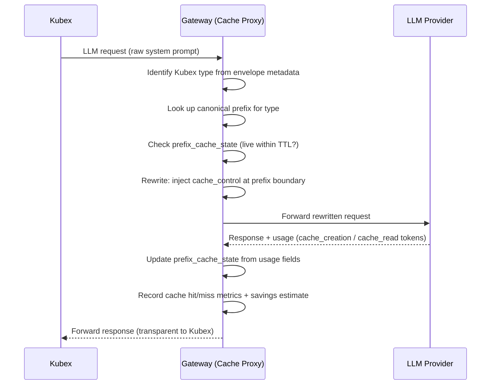
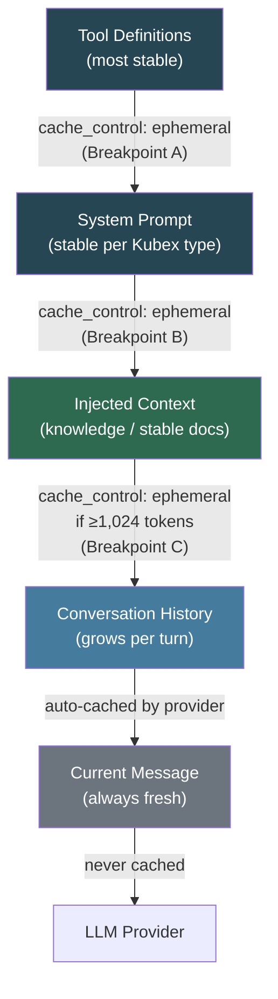
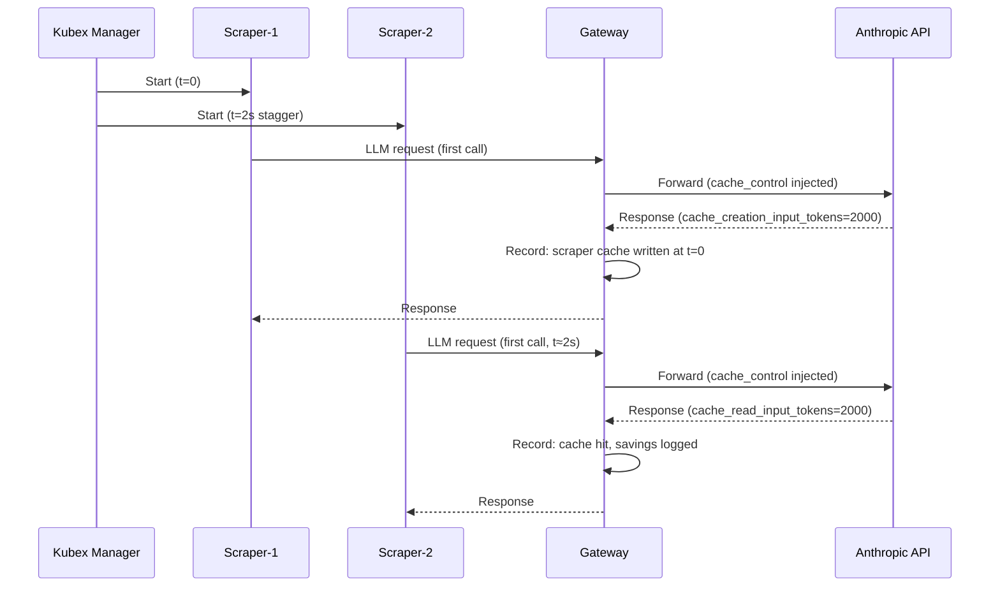
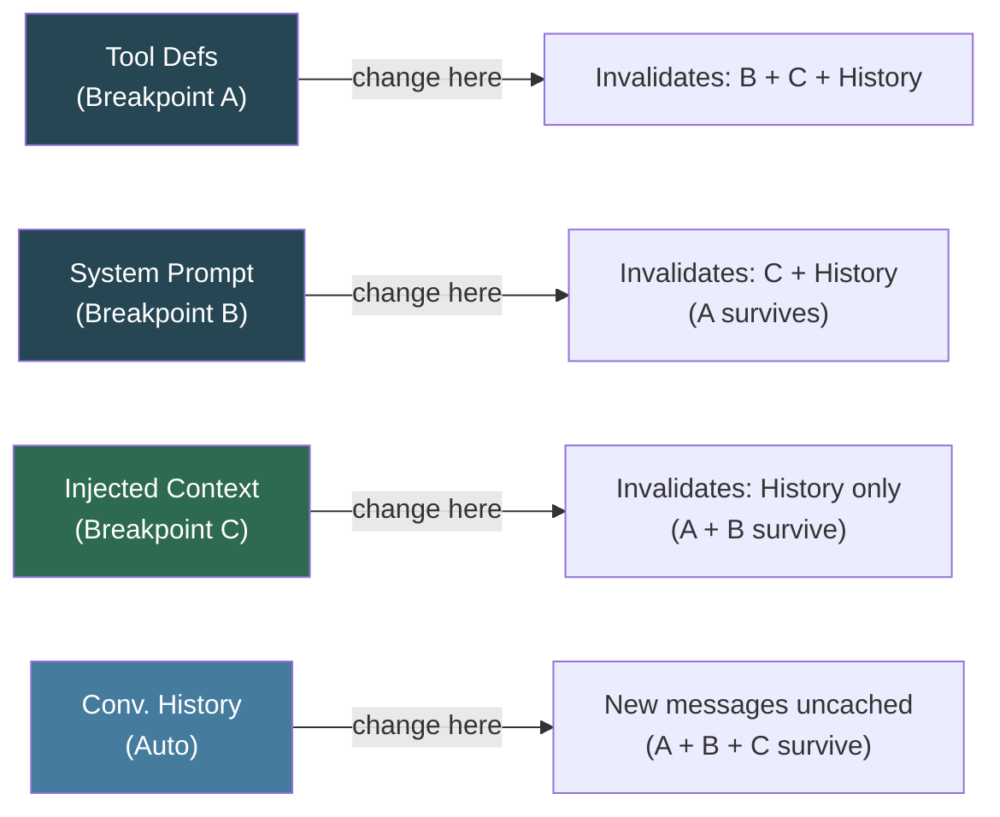

# Prompt Caching — Strategy & Implementation

> Extracted from BRAINSTORM.md. See [KubexClaw.md](../KubexClaw.md) for the full index.

> **Prompt caching is entirely Gateway-managed.** Agents do not need any caching configuration — no per-agent config fields, no skill-level settings, no environment variables. The Gateway automatically applies provider-specific caching strategies (Anthropic `cache_control` markers, OpenAI automatic caching, etc.) based on the prompt assembly order defined in Section 29.1. Caching is transparent to Kubexes: they send normal LLM requests and receive normal responses. This resolves gap M7 (Section 29).

## 28. Gateway Prompt Caching

> **Cross-reference:** For the full implementation strategy including prompt assembly ordering, provider-specific tactics, multi-instance cache sharing, TTL strategy, and invalidation cascade, see **Section 29 — Prompt Caching Implementation Strategy (Post-MVP)**.

### 28.1 Background — Why Caching Matters

Every Kubex LLM API call includes a system prompt. For agents of the same type (e.g., all Scraper Kubexes), this system prompt is largely identical — typically 1500–4000 tokens of role definition, tool schemas, and operational instructions. Without caching, each call pays full input token cost for content the model has already "seen."

The Gateway is the sole proxy for all Kubex LLM API calls, which makes it the optimal and natural place to implement prompt caching. Individual Kubexes need no knowledge of caching; the Gateway handles it transparently.

### 28.2 Anthropic Prompt Caching

#### Activation

Caching is opt-in per request. A `cache_control` block is added to specific content blocks in the API request. The marker instructs Anthropic to cache everything up to and including that block as a prefix.

```json
{
  "model": "claude-opus-4-6",
  "system": [
    {
      "type": "text",
      "text": "You are a scraper agent...[2000+ tokens]",
      "cache_control": {"type": "ephemeral"}
    },
    {
      "type": "text",
      "text": "[agent-instance-specific config, NOT cached]"
    }
  ],
  "messages": [...]
}
```

Up to 4 cache breakpoints per request are supported.

#### Cache TTL

**5 minutes** (`ephemeral` type — the only type available). The cache is evicted if the same prefix is not referenced again within the TTL window.

#### Minimum Token Requirement

- Claude Sonnet 4.6 / Opus 4.6: **1024 tokens minimum** in the cached prefix
- Claude Haiku 4.5: **2048 tokens minimum**

If the prefix is below the minimum, caching is silently skipped (no error).

#### Pricing (verify current rates at docs.anthropic.com)

| Token Type | Cost (relative to normal input) |
|---|---|
| Cache write (first call in window) | ~1.25x normal input price |
| Cache read (subsequent calls, cache hit) | ~0.10x normal input price (90% discount) |
| Uncached normal input | 1.0x baseline |

Break-even: if the same prefix is reused more than ~2 times per 5-minute window, caching saves money. High-traffic agent types see near-linear savings beyond that.

#### Response Usage Fields

```json
{
  "usage": {
    "input_tokens": 100,
    "cache_creation_input_tokens": 2000,
    "cache_read_input_tokens": 0,
    "output_tokens": 500
  }
}
```

On a cache hit: `cache_read_input_tokens > 0` and `cache_creation_input_tokens = 0`.

### 28.3 OpenAI Prompt Caching

#### Activation

Fully automatic — no API changes required. OpenAI silently caches the longest matching prefix seen recently within the same organization. No `cache_control` annotation exists.

#### Cache TTL

Not publicly specified. Empirically behaves as ~5–10 minutes, but is not guaranteed.

#### Minimum Token Requirement

**1024 tokens**. Prefixes are cached in 128-token increments.

#### Pricing (verify current rates at platform.openai.com)

- GPT-5.x models: cached input tokens at **~90% discount** (0.1x normal price). See Section 13.6.1 for per-model cached pricing.
- No extra charge for cache writes (unlike Anthropic's +25%)

#### Response Usage Fields

```json
{
  "usage": {
    "prompt_tokens": 2100,
    "completion_tokens": 300,
    "prompt_tokens_details": {
      "cached_tokens": 2000
    }
  }
}
```

### 28.4 Provider Comparison

| Feature | Anthropic | OpenAI |
|---|---|---|
| Activation | Explicit `cache_control` annotation | Automatic |
| Cache read discount | ~90% off input price | ~90% off input price (GPT-5.x) |
| Cache write surcharge | +25% on first write | None |
| TTL | 5 minutes (guaranteed) | ~5–10 min (not guaranteed) |
| Minimum prefix | 1024 tokens (2048 for Haiku 4.5) | 1024 tokens |
| Cache breakpoints per request | Up to 4 | Automatic (prefix-based) |
| Gateway implementation effort | Medium (inject `cache_control`) | Low (ensure prefix stability) |
| Visibility | Full breakdown in `usage` | `cached_tokens` field |

Both providers now offer ~90% cache read discounts on current-gen models. Anthropic requires explicit `cache_control` annotation but gives guaranteed TTL; OpenAI is fully automatic but TTL is not guaranteed. See Section 13.6.1 for full per-model pricing.

### 28.5 Gateway Prompt Cache Proxy Design

#### Core Concept

The Gateway maintains a **canonical prefix registry** keyed by Kubex type. When a Kubex LLM request arrives, the Gateway:

1. Identifies the Kubex type from the `GatekeeperEnvelope` metadata
2. Looks up the canonical system prompt prefix for that type
3. Strips the common prefix from the raw request
4. Re-assembles the system prompt with the canonical prefix tagged `cache_control: ephemeral` and any agent-specific suffix appended after the breakpoint
5. Forwards the rewritten request to the provider
6. Records the `cache_creation_input_tokens` / `cache_read_input_tokens` from the response to track cache state

Kubexes are unaware this happens. They send normal prompts; the Gateway normalizes and annotates.

#### Cache State Tracking

The Gateway maintains an in-memory (or Redis-backed) map:

```
prefix_cache_state = {
  "scraper":      {last_written: timestamp, cache_live: bool},
  "reviewer":     {last_written: timestamp, cache_live: bool},
  "orchestrator": {last_written: timestamp, cache_live: bool},
}
```

Conservative TTL buffer: treat cache as expired after **280 seconds** (5 min - 20 sec safety margin).

When `cache_read_input_tokens > 0` in a response, the Gateway resets `last_written` to now (confirms cache is still live and extends estimate).

#### Prefix Stability for OpenAI

For OpenAI (automatic caching), the Gateway ensures:
- System prompt content is deterministic across all Kubexes of the same type
- Tool definitions are always appended in the same order
- No request-specific data appears before the stable shared prefix

#### Configuration Schema

```yaml
# gateway config
prompt_cache:
  enabled: true
  ttl_buffer_seconds: 280
  kubex_types:
    scraper:
      canonical_prefix_file: "prompts/scraper_base.txt"
    reviewer:
      canonical_prefix_file: "prompts/reviewer_base.txt"
    orchestrator:
      canonical_prefix_file: "prompts/orchestrator_base.txt"
  metrics:
    track_cache_hit_rate: true
    track_estimated_savings_usd: true
```

#### Sequence Flow



### 28.6 Cost Savings Estimate

Scenario: 1000 LLM calls/day across all Kubexes, 2000-token shared system prompt per call, 85% cache hit rate (realistic for steady agent traffic with Gateway coalescing).

Reference pricing (March 2026): Claude Sonnet 4.6 (~$3.00/MTok input, ~$0.30/MTok cached read, ~$3.75/MTok cache write). See Section 13.6.1 for full pricing tables.

**Without caching:**
- 1,000 calls × 2,000 tokens = 2,000,000 tokens/day
- Cost = 2.0 MTok × $3.00 = **$6.00/day** (~$180/month)

**With Anthropic caching (85% hit rate):**
- Cache writes: 150 calls × 2,000 tokens = 300K tokens @ $3.75/MTok = $1.125/day
- Cache reads: 850 calls × 2,000 tokens = 1,700K tokens @ $0.30/MTok = $0.51/day
- Total = **$1.635/day** (~$49/month)
- Savings: **~73% reduction** on system prompt input costs

**With OpenAI caching (85% hit rate, 50% discount, GPT-5.1 reference ~$1.25/MTok):**
- Cache hits: 850 × 2,000 = 1,700K tokens @ $0.625/MTok = $1.0625/day
- Non-cache: 150 × 2,000 = 300K tokens @ $1.25/MTok = $0.375/day
- Total = **$1.4375/day** (~$43/month)
- Savings: **~43% reduction**

At 10,000 calls/day or with 5,000-token system prompts (full tool schema included), these savings scale proportionally.

| Scenario | Monthly Input Cost | Savings vs Uncached |
|---|---|---|
| Anthropic (Sonnet 4.6), no caching | ~$180 | — |
| Anthropic (Sonnet 4.6), 85% hit rate | ~$49 | ~73% |
| OpenAI (GPT-5.1), no caching | ~$75 | — |
| OpenAI (GPT-5.1), 85% hit rate (auto) | ~$43 | ~43% |

### 28.7 Action Items

**Research & Design:**
- [ ] Confirm current Anthropic prompt caching pricing (docs.anthropic.com/en/docs/build-with-claude/prompt-caching)
- [ ] Confirm current OpenAI prompt caching pricing (platform.openai.com/docs/guides/prompt-caching)
- [ ] Decide: implement Anthropic explicit caching only, or also ensure OpenAI prefix stability for auto-caching
- [ ] Define canonical base prompt for each Kubex type (scraper, reviewer, orchestrator) with token counts

**Gateway Implementation:**
- [ ] Implement `PromptCacheInjector` in `services/gateway/src/cache/prompt_cache.py`
- [ ] Implement `prefix_cache_state` tracker (in-memory dict, or Redis for multi-instance Gateway)
- [ ] Add `cache_control` injection into Anthropic request transformer
- [ ] Add prefix stability normalization into OpenAI request transformer (stable tool ordering)
- [ ] Parse `cache_creation_input_tokens` / `cache_read_input_tokens` from Anthropic responses
- [ ] Parse `prompt_tokens_details.cached_tokens` from OpenAI responses
- [ ] Add `prompt_cache` config block to Gateway YAML schema
- [ ] Load canonical prefix files at Gateway startup, validate minimum token count (≥1024)
- [ ] Post-MVP: Implement Gateway prompt caching (prompt assembly ordering, `cache_control` injection, cache performance monitoring) — see Section 29

**Metrics & Observability:**
- [ ] Expose `gateway_prompt_cache_hit_rate` metric per Kubex type (Prometheus gauge)
- [ ] Expose `gateway_prompt_cache_savings_usd_total` counter (estimated cost saved)
- [ ] Add cache hit/miss to Gateway structured logs per request
- [ ] Post-MVP: Grafana dashboard panel for cache hit rate and savings

**Testing:**
- [ ] Unit tests for `PromptCacheInjector`: prefix detection, cache_control injection, TTL state management
- [ ] Unit tests for request transformer: verify system prompt rewrite is structurally correct
- [ ] Unit tests for response parser: verify cache usage fields are correctly read and state updated
- [ ] Integration test: send 2 sequential requests of same Kubex type, assert second shows `cache_read_input_tokens > 0`
- [ ] Test fixtures for policy engine: caching is transparent, policy evaluation unaffected

---

## 29. Prompt Caching Implementation Strategy (Post-MVP)

> **Post-MVP.** This section details the full implementation strategy for Gateway-managed prompt caching. The concepts and provider mechanics are introduced in Section 28. This section covers the precise prompt assembly ordering the Gateway must enforce, provider-specific tactics, multi-instance cache sharing behavior, TTL strategy, invalidation cascade rules, and estimated savings figures.

The Gateway proxies every LLM call, making it the ideal place to implement prompt caching centrally. Kubexes are completely unaware of caching — they send normal requests and receive normal responses. All caching logic lives in the Gateway.

### 29.1 Gateway Prompt Assembly Order

To maximize cache prefix hits across all Kubex instances of the same type, the Gateway must enforce a strict content ordering for every LLM request it forwards. Content that changes more frequently must come after content that is stable.

The canonical ordering is:

| Position | Content | Stability | Cache Breakpoint |
|---|---|---|---|
| 1 | Tool definitions | Most stable — changes only on deploy | Breakpoint A |
| 2 | System prompt | Stable per Kubex type | Breakpoint B |
| 3 | Injected context (knowledge results, stable docs) | Stable for request batch (if ≥1,024 tokens) | Breakpoint C (conditional) |
| 4 | Conversation history | Grows each turn — automatically cached up to current turn | Automatic |
| 5 | Current message | Always fresh | Never cached |

**Rule:** No request-specific or per-call-variable content may appear before or within a cached block. Doing so breaks the prefix and voids the cache for every subsequent block.



### 29.2 Provider-Specific Implementation Strategy

#### 29.2.1 Anthropic (Worker Kubexes — Orchestrator, Scraper)

- Gateway injects `cache_control: {"type": "ephemeral"}` markers automatically at the assembly-order breakpoints (Section 29.1).
- Up to 4 explicit breakpoints per request: tools, system prompt, injected context, conversation history.
- Pricing: 90% read discount, +25% write surcharge on first call per 5-minute TTL window. Write surcharge is recouped after approximately 2 cache reads.
- Cache isolation is workspace-scoped (as of February 2026) — all Kubexes sharing the same API key share the same cache namespace.
- Minimum token requirement: 1,024 tokens per cached block (2,048 for Haiku 4.5). If a block is below the minimum, `cache_control` is silently ignored.

```json
{
  "model": "claude-sonnet-4-6",
  "system": [
    {
      "type": "text",
      "text": "[Tool definitions — stable, deployed once]",
      "cache_control": {"type": "ephemeral"}
    },
    {
      "type": "text",
      "text": "[System prompt — stable per Kubex type]",
      "cache_control": {"type": "ephemeral"}
    },
    {
      "type": "text",
      "text": "[Injected context — optional breakpoint C if ≥1024 tokens]",
      "cache_control": {"type": "ephemeral"}
    }
  ],
  "messages": [
    {"role": "user", "content": "...conversation history..."},
    {"role": "user", "content": "...current message (never cached)..."}
  ]
}
```

#### 29.2.2 OpenAI (Reviewer Kubex)

- Fully automatic — no Gateway-injected annotations required.
- 50% read discount on cached prefix tokens; no write surcharge.
- Cache isolation is organization-scoped.
- Gateway responsibility: ensure stable prefix ordering (system prompt first, tool definitions in deterministic JSON key order, byte-for-byte identical across all Kubexes of the same type). Any variation in whitespace, key ordering, or content breaks the prefix match.
- Gateway must canonicalize tool definition JSON at request assembly time (enforce stable key ordering via sorted serialization).

#### 29.2.3 Google Gemini (if adopted)

- Gateway pre-creates named `CachedContent` objects at Kubex launch time, storing stable system prompt + tool schema content.
- Stores the returned cache resource name per Kubex type in its prefix registry.
- References the cache resource name in all subsequent calls rather than re-sending the full content.
- Pricing: 90% read discount (Gemini 2.5+), storage fee of approximately $1–4.50 per million tokens per hour.
- Best suited for large stable document context (knowledge base injections) where the content is too large to re-send efficiently.
- Gateway must invalidate and recreate `CachedContent` when the Kubex type's system prompt is updated on deploy.

### 29.3 Multi-Instance Cache Sharing

Because all Kubexes of the same type share one API key through the Gateway, they automatically share the provider's cache namespace.

- The first call from any Kubex instance pays the write surcharge (if applicable — Anthropic only).
- All subsequent calls from any instance of the same type read at the discounted rate.
- This means a fleet of 10 Scraper Kubexes processing tasks in parallel benefits from cache sharing: only one write per 5-minute window, up to ~9 reads at discount per window (assuming steady traffic).

**Gateway requirement — canonicalized tool JSON:** The Gateway must serialize tool definition objects with stable key ordering before injection. If two requests serialize the same tools differently (e.g., different key ordering, extra whitespace), they produce different prefix bytes, resulting in duplicate cache writes and a cache miss for the second request.

**Cold start staggering:** When multiple Kubexes of the same type start simultaneously (e.g., a burst of 5 Scraper Kubexes launched by the Kubex Manager), their first LLM calls may arrive at the Gateway within milliseconds of each other. The Gateway should stagger first calls by approximately 2–3 seconds per instance to avoid duplicate cache write surcharges. The Kubex Manager should expose a configurable `cold_start_stagger_ms` parameter.



### 29.4 Cache TTL Strategy

| Kubex Type | Recommended TTL Approach | Rationale |
|---|---|---|
| Scraper | Default 5-min ephemeral | High call frequency during active crawl tasks; cache stays hot |
| Orchestrator | Default 5-min ephemeral | Active during task decomposition loops; high call rate |
| Reviewer | Consider 1-hour TTL variant (if available) | Infrequent bursts with idle gaps; standard 5-min TTL may expire between reviews |

> **Note:** As of March 2026, Anthropic's `ephemeral` TTL is 5 minutes with no longer-lived option. The Reviewer TTL note is forward-looking — the Gateway configuration should be designed to support alternative TTL types if Anthropic introduces them. For now, Reviewer Kubexes should be designed to trigger LLM calls frequently enough to keep the cache warm (e.g., via lightweight prefetch pings if needed), or accept cache miss costs on infrequent calls.

The Gateway refreshes its TTL estimate on every confirmed cache hit (`cache_read_input_tokens > 0` in response). Conservative TTL buffer: treat cache as expired after 280 seconds (5 minutes minus 20-second safety margin) if no confirmed hit has been seen.

**Monitoring:** The Gateway logs `cache_hit`, `cache_miss`, and `cache_write` events per Kubex type per request to structured logs. Prometheus metrics expose `gateway_prompt_cache_hit_rate` per type and `gateway_prompt_cache_savings_usd_total` as a running counter.

### 29.5 Cache Invalidation Cascade (Anthropic)

Changes to prompt content cascade downstream in the prefix. Because each breakpoint depends on identical byte content in all preceding positions, a change at any breakpoint invalidates the cache for that breakpoint and all subsequent ones.

| Change | Effect |
|---|---|
| Tool definition change | Invalidates tools cache + system prompt cache + messages cache (full invalidation) |
| System prompt change | Invalidates system prompt cache + messages cache; tools cache survives if tools unchanged |
| Injected context change | Invalidates context cache + messages cache; tools and system prompt caches survive |
| Conversation history change | Only new messages are uncached; prior messages up to the last breakpoint remain cached |
| `tool_choice` parameter change | Full invalidation (changes request structure before content is evaluated) |
| Image added to message | Full invalidation (images are not cacheable as of March 2026) |



**Gateway responsibility on deploy:** When a new Kubex image is deployed (system prompt or tool schema updated), the Gateway must clear its `prefix_cache_state` entry for that Kubex type so the next call correctly pays a write (the old cached prefix is now stale on the provider side).

### 29.6 Estimated Savings (Per-Kubex Scenario)

For a Kubex with a ~2,000 token system prompt making 500 calls/day on Anthropic:

| Scenario | Daily Cost (system prompt tokens) | Notes |
|---|---|---|
| Without caching | ~$3.00/day | 500 × 2,000 tokens × $3.00/MTok |
| With caching (~85% hit rate) | ~$0.37/day | 75 writes × $3.75/MTok + 425 reads × $0.30/MTok |
| Savings | **~88% reduction** | Per-Kubex-type, on system prompt token cost |

Additional benefit: reduced first-token latency on cache hits (provider does not re-evaluate the cached prefix).

For a multi-Kubex fleet (e.g., 5 Scrapers + 1 Orchestrator + 1 Reviewer, 1,000 total calls/day at ~85% hit rate), combined savings across all types follow the same pattern. See Section 28.6 for the fleet-level cost model.

### 29.7 Action Items (Post-MVP)

- [ ] Post-MVP: Implement Gateway prompt caching (prompt assembly ordering, `cache_control` injection, cache performance monitoring)
- [ ] Post-MVP: Implement `PromptAssembler` in Gateway that enforces the Section 29.1 content ordering for all LLM requests
- [ ] Post-MVP: Implement canonicalized tool JSON serialization (sorted key ordering) in `PromptAssembler`
- [ ] Post-MVP: Add `cold_start_stagger_ms` parameter to Kubex Manager for same-type concurrent launches
- [ ] Post-MVP: Implement `prefix_cache_state` per Kubex type with 280-second conservative TTL buffer
- [ ] Post-MVP: Clear `prefix_cache_state` entry for Kubex type on deploy (image update event from Kubex Manager)
- [ ] Post-MVP: Add Prometheus metrics: `gateway_prompt_cache_hit_rate` per type, `gateway_prompt_cache_savings_usd_total`
- [ ] Post-MVP: Add Grafana dashboard panel for cache hit rate and per-type savings
- [ ] Post-MVP: If Anthropic introduces TTL types beyond `ephemeral`, evaluate 1-hour TTL for Reviewer Kubex
- [ ] Post-MVP: Evaluate Gemini `CachedContent` pre-creation if Gemini models are adopted

---

### Action Item Tracking Note

> Action items are distributed across all sections as checkbox lists. For implementation prioritization, refer to MVP.md which provides a phased implementation checklist derived from these items. Post-MVP items remain in their respective sections for context.

---
