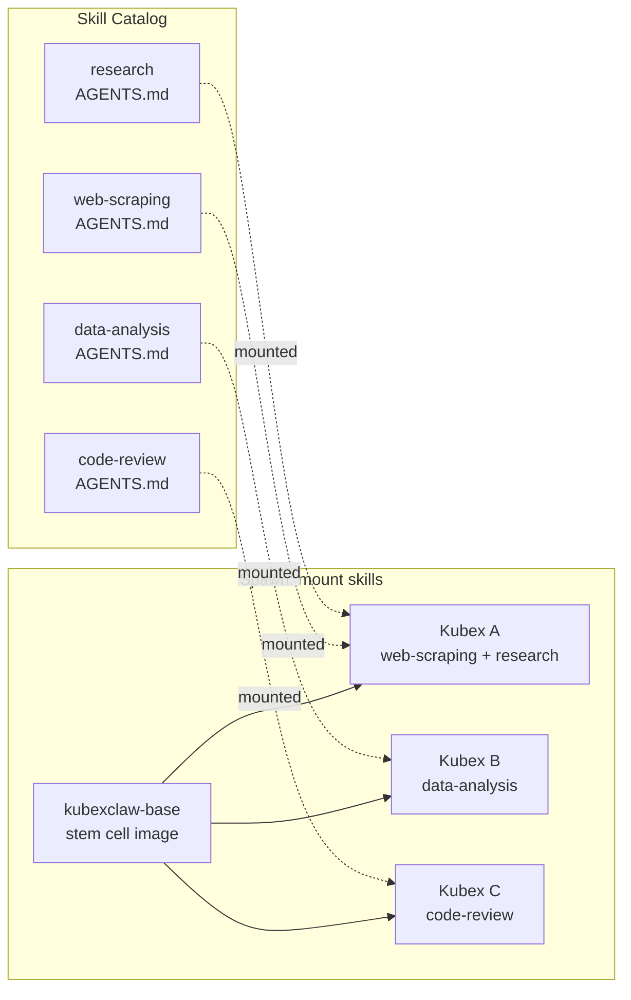
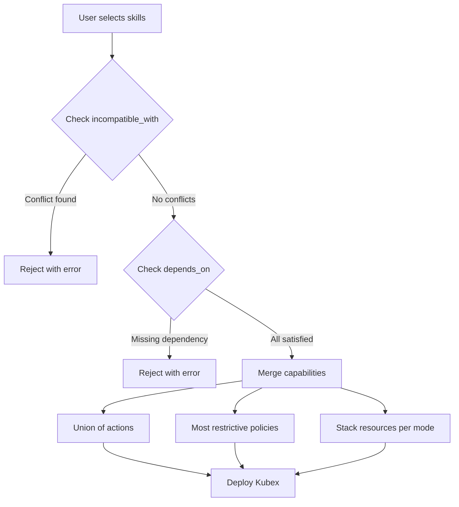
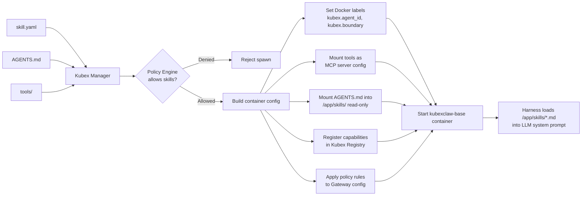

# Skill Catalog Design

Skills are the building blocks of KubexClaw agents. Each skill defines what an agent can do, what resources it needs, and what policies govern its behavior. Skills are packaged as directories containing a manifest (`skill.yaml`), agent instructions (`AGENTS.md`), and optional MCP tool implementations.

---

## The Stem Cell Principle

Skills are the **primary differentiation mechanism** for Kubexes. Every Kubex starts from the same universal `kubexclaw-base` Docker image — a blank stem cell with no specialized behavior. What transforms a generic stem cell into a web scraper, a code reviewer, or a research analyst is the set of skill Markdown files injected into its `/app/skills/` directory at spawn time.

This means:

- **No per-agent Docker images.** Creating a new agent type never requires building a new container image. You write a skill (a Markdown file plus an optional manifest), and any Kubex can pick it up.
- **Portable by design.** Skills are not tied to a specific Kubex instance. The same `web-scraping` skill can run on any Kubex in any boundary. Move a skill from one agent to another by changing the spawn request — no rebuild, no redeploy of images.
- **Policy-gated injection.** The Kubex Manager controls which skills a Kubex is allowed to receive. Boundary-level allowlists and global blocklists ensure that skill assignment respects security policy. See [kubex-manager.md Section 19.3](kubex-manager.md#193-dynamic-skill-injection-stem-cell-model) for the injection flow.
- **System prompt is the differentiator.** At runtime, the agent harness loads all `.md` files from `/app/skills/` and injects them into the LLM's system prompt. This is how the LLM knows what it is, what it can do, and how to behave. The skill file is the agent's identity.



---

## 1. Skill Manifest Schema

Every skill is defined by a `skill.yaml` manifest file. This is the single source of truth for the skill's identity, requirements, capabilities, policies, composition rules, and user-configurable options.

```yaml
skill:
  name: "web-scraping"                    # Machine-readable (kebab-case, unique)
  version: "1.0.0"                        # SemVer
  display_name: "Web Scraping"            # Human-readable
  description: "Short description"
  long_description: |
    Multi-line detailed description explaining what the skill
    does, typical use cases, and any important caveats.
  category: "data-collection"             # One of the defined categories
  tags: ["http", "html", "parsing"]
  icon: "globe"                           # Icon identifier for UI rendering
  author: "kubexclaw"

requirements:
  providers:                              # LLM providers needed
    - provider: "anthropic"
      required: true                      # Skill cannot function without this
    - provider: "openai"
      required: false                     # Optional, used if available
  infrastructure:
    internet_access: true                 # Needs Gateway egress proxy
    knowledge_base: false                 # Needs Graphiti/Neo4j
  resources:
    memory: "512Mi"                       # Container memory limit
    cpu: "0.5"                            # Container CPU limit

capabilities:
  actions:                                # Allowed Gateway actions
    - "http_get"
    - "http_post"
    - "parse_html"
    - "store_knowledge"
  tools:                                  # MCP tools provided by this skill
    - name: "scrape_page"
      description: "Fetch and parse a web page"
    - name: "extract_data"
      description: "Extract structured data from HTML"

policy:
  max_requests_per_minute: 10             # Rate limiting
  max_domains_per_task: 5                 # Domain scope limit
  requires_approval:                      # Actions requiring human approval
    - "access_new_domain"

composition:
  depends_on: []                          # Required companion skills
  incompatible_with: []                   # Cannot combine with these
  resource_mode: "additive"               # How resources stack: additive or max

configuration:                            # User-customizable options
  - key: "rate_limit"
    display_name: "Requests per minute"
    type: "integer"
    default: 10
    min: 1
    max: 60
  - key: "respect_robots_txt"
    display_name: "Respect robots.txt"
    type: "boolean"
    default: true
```

### Categories

| Category | Description |
|----------|-------------|
| `data-collection` | Fetching, scraping, monitoring external data sources |
| `analysis` | Processing, analyzing, and interpreting structured data |
| `content` | Writing, editing, summarizing text content |
| `development` | Code review, generation, testing, documentation |
| `communication` | Email drafting, messaging, notifications |
| `automation` | Multi-step workflows, research, orchestration |

---

## 2. Directory Structure

Skills are organized by category in the `skills/` directory at the repository root.

```
skills/
├── data-collection/
│   ├── web-scraping/
│   │   ├── skill.yaml          # Skill manifest
│   │   ├── AGENTS.md           # Agent instructions/persona
│   │   ├── tools/              # MCP tool definitions
│   │   │   ├── scrape_page.py
│   │   │   └── extract_data.py
│   │   └── README.md           # Contributor docs
│   └── web-monitoring/
│       ├── skill.yaml
│       ├── AGENTS.md
│       └── tools/
│           └── watch_page.py
├── analysis/
│   └── data-analysis/
│       ├── skill.yaml
│       ├── AGENTS.md
│       └── tools/
│           ├── analyze_csv.py
│           └── generate_report.py
├── content/
│   ├── content-writing/
│   │   ├── skill.yaml
│   │   ├── AGENTS.md
│   │   └── tools/
│   │       └── write_document.py
│   └── summarization/
│       ├── skill.yaml
│       ├── AGENTS.md
│       └── tools/
│           └── summarize.py
├── development/
│   └── code-review/
│       ├── skill.yaml
│       ├── AGENTS.md
│       └── tools/
│           ├── review_code.py
│           └── check_security.py
├── communication/
│   └── email-drafting/
│       ├── skill.yaml
│       ├── AGENTS.md
│       └── tools/
│           └── draft_email.py
└── automation/
    └── research/
        ├── skill.yaml
        ├── AGENTS.md
        └── tools/
            ├── search_web.py
            └── compile_findings.py
```

### File Roles

| File | Purpose |
|------|---------|
| `skill.yaml` | Skill manifest (identity, requirements, capabilities, policy, composition) |
| `AGENTS.md` | Agent instructions and persona definition — loaded as the agent's system prompt |
| `tools/` | MCP tool implementations (Python modules) |
| `README.md` | Contributor documentation for developing/extending the skill |

---

## 3. Skill Composition Rules

A single Kubex can be assigned multiple skills. When skills are composed, the following rules apply:

### Actions (Union)
The agent's allowed actions are the union of all assigned skills' `capabilities.actions` lists. If skill A allows `http_get` and skill B allows `store_knowledge`, the agent can perform both.

### Policies (Most Restrictive Wins)
When policies conflict, the most restrictive value is used:
- Rate limits: lowest `max_requests_per_minute` across all skills
- Domain limits: lowest `max_domains_per_task`
- Approval requirements: union of all `requires_approval` lists

### Resources (Configurable Stacking)
Resource allocation depends on the `resource_mode` field:
- `additive` (default): memory and CPU limits are summed across skills
- `max`: the highest value among all skills is used

### Conflict Detection
At deploy time, Kubex Manager checks `incompatible_with` lists across all assigned skills. If any skill declares another as incompatible, deployment is rejected with an error message explaining the conflict.

### Dependency Resolution
If a skill declares `depends_on`, Kubex Manager verifies that all required companion skills are also assigned to the same Kubex. Missing dependencies produce an error at deploy time.



---

## 4. Example Skill Manifests

### 4.1 Web Scraping

```yaml
skill:
  name: "web-scraping"
  version: "1.0.0"
  display_name: "Web Scraping"
  description: "Fetch and parse web pages, extract structured data from HTML"
  long_description: |
    A versatile web scraping skill that can fetch web pages, parse HTML content,
    and extract structured data. Supports rate limiting, robots.txt compliance,
    and multi-domain operation. Extracted data can be stored in the knowledge
    base for later retrieval.
  category: "data-collection"
  tags: ["http", "html", "parsing", "scraping"]
  icon: "globe"
  author: "kubexclaw"

requirements:
  providers:
    - provider: "anthropic"
      required: true
  infrastructure:
    internet_access: true
    knowledge_base: false
  resources:
    memory: "512Mi"
    cpu: "0.5"

capabilities:
  actions:
    - "http_get"
    - "http_post"
    - "parse_html"
    - "store_knowledge"
  tools:
    - name: "scrape_page"
      description: "Fetch and parse a web page, returning cleaned text and metadata"
    - name: "extract_data"
      description: "Extract structured data from HTML using CSS selectors or patterns"

policy:
  max_requests_per_minute: 10
  max_domains_per_task: 5
  requires_approval:
    - "access_new_domain"

composition:
  depends_on: []
  incompatible_with: []
  resource_mode: "additive"

configuration:
  - key: "rate_limit"
    display_name: "Requests per minute"
    type: "integer"
    default: 10
    min: 1
    max: 60
  - key: "respect_robots_txt"
    display_name: "Respect robots.txt"
    type: "boolean"
    default: true
  - key: "max_page_size_kb"
    display_name: "Max page size (KB)"
    type: "integer"
    default: 5120
    min: 512
    max: 51200
```

### 4.2 Data Analysis

```yaml
skill:
  name: "data-analysis"
  version: "1.0.0"
  display_name: "Data Analysis"
  description: "Analyze structured data, generate reports and visualizations"
  long_description: |
    Analyze CSV, JSON, and tabular data to identify trends, anomalies, and
    insights. Generate summary reports with key findings. Can store analysis
    results in the knowledge base and query historical data for comparisons.
  category: "analysis"
  tags: ["csv", "json", "statistics", "reporting"]
  icon: "chart-bar"
  author: "kubexclaw"

requirements:
  providers:
    - provider: "anthropic"
      required: true
  infrastructure:
    internet_access: false
    knowledge_base: true
  resources:
    memory: "1Gi"
    cpu: "1.0"

capabilities:
  actions:
    - "query_knowledge"
    - "store_knowledge"
    - "search_corpus"
  tools:
    - name: "analyze_csv"
      description: "Parse and analyze CSV data, computing statistics and identifying patterns"
    - name: "generate_report"
      description: "Generate a structured report from analysis results"

policy:
  max_requests_per_minute: 30
  requires_approval: []

composition:
  depends_on: []
  incompatible_with: []
  resource_mode: "additive"

configuration:
  - key: "max_rows"
    display_name: "Max rows to analyze"
    type: "integer"
    default: 100000
    min: 1000
    max: 1000000
  - key: "auto_store_results"
    display_name: "Auto-store results in knowledge base"
    type: "boolean"
    default: true
```

### 4.3 Content Writing

```yaml
skill:
  name: "content-writing"
  version: "1.0.0"
  display_name: "Content Writing"
  description: "Write articles, reports, marketing copy, and documentation"
  long_description: |
    A content creation skill for producing written materials including blog
    posts, reports, marketing copy, technical documentation, and social media
    content. Can research topics via the knowledge base and adapt tone and
    style to match requirements.
  category: "content"
  tags: ["writing", "articles", "copywriting", "documentation"]
  icon: "pencil"
  author: "kubexclaw"

requirements:
  providers:
    - provider: "anthropic"
      required: true
  infrastructure:
    internet_access: false
    knowledge_base: true
  resources:
    memory: "512Mi"
    cpu: "0.5"

capabilities:
  actions:
    - "query_knowledge"
    - "store_knowledge"
  tools:
    - name: "write_document"
      description: "Write a document in the specified format and style"

policy:
  max_requests_per_minute: 20
  requires_approval: []

composition:
  depends_on: []
  incompatible_with: []
  resource_mode: "additive"

configuration:
  - key: "default_tone"
    display_name: "Default writing tone"
    type: "string"
    default: "professional"
  - key: "max_word_count"
    display_name: "Max words per document"
    type: "integer"
    default: 5000
    min: 100
    max: 50000
```

### 4.4 Code Review

```yaml
skill:
  name: "code-review"
  version: "1.0.0"
  display_name: "Code Review"
  description: "Review code for quality, security vulnerabilities, and best practices"
  long_description: |
    Automated code review that checks for security vulnerabilities, code quality
    issues, performance problems, and adherence to best practices. Supports
    multiple languages and can provide actionable improvement suggestions.
    Uses a separate LLM provider (OpenAI) for anti-collusion when used as
    a reviewer in the security pipeline.
  category: "development"
  tags: ["code", "security", "quality", "review"]
  icon: "code"
  author: "kubexclaw"

requirements:
  providers:
    - provider: "anthropic"
      required: true
    - provider: "openai"
      required: false
  infrastructure:
    internet_access: false
    knowledge_base: false
  resources:
    memory: "768Mi"
    cpu: "0.5"

capabilities:
  actions:
    - "query_knowledge"
  tools:
    - name: "review_code"
      description: "Review code for quality issues, bugs, and improvements"
    - name: "check_security"
      description: "Scan code for security vulnerabilities and injection risks"

policy:
  max_requests_per_minute: 15
  requires_approval: []

composition:
  depends_on: []
  incompatible_with: []
  resource_mode: "additive"

configuration:
  - key: "severity_threshold"
    display_name: "Minimum severity to report"
    type: "string"
    default: "warning"
  - key: "check_security"
    display_name: "Include security analysis"
    type: "boolean"
    default: true
```

### 4.5 Research

```yaml
skill:
  name: "research"
  version: "1.0.0"
  display_name: "Research"
  description: "Multi-step research with web sources, analysis, and citations"
  long_description: |
    A comprehensive research skill that combines web searching, content
    extraction, analysis, and knowledge base integration. Can conduct
    multi-step research tasks, compile findings with proper citations,
    and store results for future reference. Particularly useful for
    competitive analysis, market research, and literature reviews.
  category: "automation"
  tags: ["research", "search", "citations", "analysis"]
  icon: "magnifying-glass"
  author: "kubexclaw"

requirements:
  providers:
    - provider: "anthropic"
      required: true
  infrastructure:
    internet_access: true
    knowledge_base: true
  resources:
    memory: "1Gi"
    cpu: "1.0"

capabilities:
  actions:
    - "http_get"
    - "parse_html"
    - "query_knowledge"
    - "store_knowledge"
    - "search_corpus"
  tools:
    - name: "search_web"
      description: "Search the web for information on a topic"
    - name: "compile_findings"
      description: "Compile research findings into a structured report with citations"

policy:
  max_requests_per_minute: 15
  max_domains_per_task: 20
  requires_approval:
    - "access_new_domain"

composition:
  depends_on: []
  incompatible_with: []
  resource_mode: "additive"

configuration:
  - key: "max_sources"
    display_name: "Max sources per research task"
    type: "integer"
    default: 20
    min: 5
    max: 100
  - key: "require_citations"
    display_name: "Require citations in output"
    type: "boolean"
    default: true
  - key: "store_findings"
    display_name: "Auto-store findings in knowledge base"
    type: "boolean"
    default: true
```

---

## 5. Custom Skill Creation

Operators can create custom skills using the CLI scaffolding command:

```bash
$ kubexclaw skills create my-custom-skill

  Creating skill scaffold...

  Created:
    skills/automation/my-custom-skill/
    ├── skill.yaml          ← Edit this to define your skill
    ├── AGENTS.md           ← Write your agent's instructions
    ├── tools/              ← Add MCP tool implementations
    │   └── example_tool.py
    └── README.md

  Next steps:
    1. Edit skills/automation/my-custom-skill/skill.yaml
    2. Write agent instructions in AGENTS.md
    3. Implement tools in the tools/ directory
    4. Deploy: kubexclaw deploy --skill my-custom-skill
```

The scaffolded `skill.yaml` contains all fields with placeholder values and comments explaining each section. The `AGENTS.md` includes a template for writing agent instructions.

### Custom Skill Validation

Before deployment, the Kubex Manager validates custom skills:

1. **Schema validation** — `skill.yaml` conforms to the manifest schema
2. **Action validation** — all declared actions exist in the `ActionType` enum (kubex-common)
3. **Provider validation** — required providers are configured
4. **Resource validation** — requested resources are within host capacity
5. **Composition validation** — no conflicts with other assigned skills

---

## 6. Skill Versioning

Skills use [Semantic Versioning](https://semver.org/) (SemVer) in the `version` field of `skill.yaml`:

- **Patch** (1.0.0 -> 1.0.1): Bug fixes, documentation updates. No manifest schema changes.
- **Minor** (1.0.0 -> 1.1.0): New capabilities, new configuration options, new tools. Backward compatible.
- **Major** (1.0.0 -> 2.0.0): Breaking changes to actions, policy, or composition rules. May require agent redeployment.

### Version Compatibility

Kubex Manager checks version compatibility at deploy time:

- Running agents are pinned to the skill version they were deployed with
- `kubexclaw agents restart <name>` picks up the latest compatible version
- Major version upgrades require explicit `kubexclaw agents remove` + `kubexclaw deploy`
- The skill catalog always shows the latest version; `kubexclaw skills info` shows both the latest and any deployed version if different

---

## 7. Skill Loading at Runtime

When Kubex Manager deploys an agent, it creates a container from the universal `kubexclaw-base` image and mounts the requested skill files into it. No custom Docker image is built — the base image is always the same. The skill files are what differentiate the agent.

The Kubex Manager assembles the runtime configuration from the skill manifests:

1. **Policy check** — Kubex Manager asks the Policy Engine whether the requesting boundary is allowed to use the requested skills. Denied skills are rejected before any container is created.
2. **Skill resolution** — For each approved skill, Kubex Manager locates the `AGENTS.md` and `skill.yaml` in the skill catalog directory.
3. **Config assembly** — Capabilities are unioned, policies are merged (most restrictive wins), and resource limits are computed from the skill manifests.
4. **Container creation** — `kubexclaw-base` is started with `/app/skills/` populated via read-only bind mounts of each skill's `AGENTS.md` file.
5. **Harness injection** — On boot, the agent harness (`kubex-common`) reads all `.md` files from `/app/skills/` and concatenates them into the LLM system prompt. This is the moment the generic stem cell becomes a specialized agent.



This approach means creating a new type of agent is as simple as writing a new skill Markdown file and referencing it in a spawn request. No Docker builds, no CI pipelines for agent images, no image registry management.

---

## 8. Action Items

- [ ] Define skill manifest schema (skill.yaml)
- [ ] Create directory structure for built-in skills
- [ ] Build 5 initial skill packages (web-scraping, data-analysis, content-writing, code-review, research)
- [ ] Implement skill composition engine in Kubex Manager
- [ ] Implement skills list/info/search API endpoints
- [ ] Build custom skill scaffolding command
- [ ] Implement skill version compatibility checking
- [ ] Write AGENTS.md templates for each built-in skill
- [ ] Implement `/app/skills/` bind mount assembly in Kubex Manager spawn handler
- [ ] Implement policy-gated skill injection (boundary allowlists, global blocklists)
- [ ] Verify harness loads all `/app/skills/*.md` files into LLM system prompt at boot
- [ ] Document skill authoring guide (how to create a new agent type without a Docker image)
