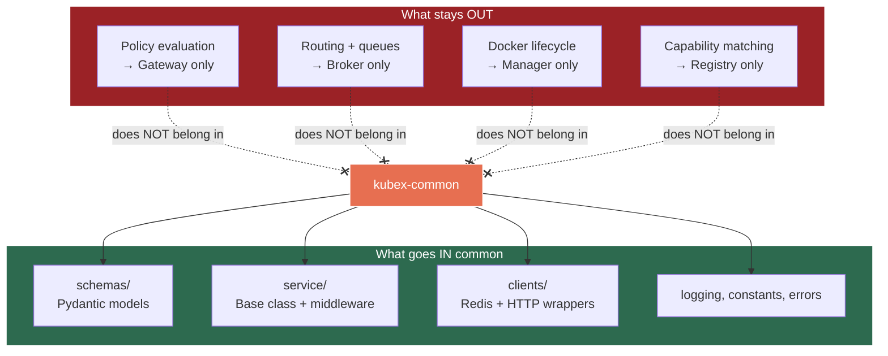

# Technology Stack — Versions, Libraries & Tooling

> Finalized 2026-03-08. This is the authoritative reference for all technology choices.

---

## 1. Core Platform

| Technology | Choice | Version / Constraint | Rationale |
|---|---|---|---|
| Language | Python | 3.12 | Latest stable; best async/typing support; performance improvements over 3.11 |
| Package Manager | uv | latest | Fast, pip-compatible, good monorepo support, modern lockfile |
| Web Framework | FastAPI | latest | All backend services use FastAPI; async-native, OpenAPI generation |
| Data Validation | Pydantic | v2 (>=2.0) | FastAPI native; better performance than v1; schema validation for ActionRequest/Response |
| Test Framework | pytest | latest | Mandated by project rules (CLAUDE.md) |
| Linting | ruff | latest | Mandated by project rules (CLAUDE.md) |
| Formatting | black | latest | Mandated by project rules (CLAUDE.md) |
| CI/CD | GitHub Actions | — | Monorepo-aware change detection; GHCR image publishing |

---

## 2. Core Libraries

| Library | Package | Purpose |
|---|---|---|
| HTTP Client | `httpx` | Async-native; used for inter-service calls, LLM proxy, Graphiti calls |
| Redis Client | `redis[asyncio]` (redis-py 5+) | Built-in async support via `redis.asyncio`; no separate aioredis needed |
| Docker SDK | `docker` (official Python SDK) | Kubex Manager container lifecycle management |
| CLI Framework | `typer` | `kubexclaw` CLI; built on click; type-hint driven; auto-completions |
| Structured Logging | `structlog` | JSON output; async-friendly; fits Docker JSON log driver |
| YAML Parser | `PyYAML` | Config files, policy files, skill manifests |
| JSON Schema Validation | Pydantic v2 | Already in stack via FastAPI; no separate validator needed |
| OpenSearch Client | `opensearch-py` | Gateway writes to document corpus; queries `knowledge-corpus-*` indices |

---

## 3. Infrastructure Services

| Service | Image | Port | Purpose |
|---|---|---|---|
| Redis | `redis:7-alpine` | 6379 | Message broker (db0), rate limits (db1), Registry cache (db2), lifecycle (db3), budget (db4) |
| Neo4j | `neo4j:5-community` | 7687 / 7474 | Graphiti backend (knowledge graph storage) |
| OpenSearch | `opensearchproject/opensearch:2` (single-node) | 9200 | Document corpus + operational logging |
| Graphiti | `zepai/graphiti:latest` | 8100 | Temporal knowledge graph REST API |

> See [infrastructure.md](infrastructure.md) for the full port assignment table, Docker network topology, and resource budget.

---

## 4. LLM Providers & Models

| Provider | Models | Usage |
|---|---|---|
| Anthropic | `claude-haiku-4-5` (light/default), `claude-sonnet-4-6` (standard/escalation) | Worker Kubexes, Orchestrator, Knowledge Kubex |
| OpenAI | `o3-mini` | Reviewer agent (anti-collusion: different provider than workers) |
| Google (optional) | Gemini | Supported via Gateway proxy; not used in MVP |

> All LLM API calls are proxied through the Gateway. Kubexes never hold API keys. See [gateway.md](gateway.md) Section 13.9.1.

---

## 5. Agent Runtime

| Component | Version | Notes |
|---|---|---|
| OpenClaw | >= v2026.2.26 | Base runtime for all Kubexes; upstream (no fork); pinned per policy |
| Node.js | >= 22 (LTS) | Required to run OpenClaw; base Docker image is `node:22-bookworm-slim` |

**Installation method:** `npm install -g openclaw@2026.2.26` inside the `_base/Dockerfile`. No pre-built Docker image; Python 3.12 is layered on top of `node:22-bookworm-slim` for kubex-common and kubex-harness.

**CLI binary:** `openclaw` — harness spawns `openclaw agent --local --message "<task>"`. OpenClaw's WebSocket Gateway runs on port 18789 internally within each agent container.

**Skills:** Markdown files (`SKILL.md`) with YAML frontmatter — prose instructions injected into the agent's system prompt. Stored at `skills/<domain>/<name>/SKILL.md`. OpenClaw discovers skills from the workspace `skills/` directory, `~/.openclaw/skills/`, and bundled defaults.

**MCP support:** Native via `mcp.json` config file placed in `~/.openclaw/`. OpenClaw handles the MCP protocol internally using `@modelcontextprotocol/sdk`. The Orchestrator's MCP Bridge server uses the official `mcp` Python SDK (Anthropic); OpenClaw connects to it via stdio transport.

> See [agents.md](agents.md) for OpenClaw versioning, auto-update flow, and security audit results.

---

## 6. Deferred (Post-MVP)

| Technology | Purpose | Timing |
|---|---|---|
| Fluent Bit | Centralized log aggregation to OpenSearch | Post-MVP |
| Grafana + Prometheus | Monitoring dashboards and metrics | V1+ |
| OpenTelemetry / Jaeger | Distributed tracing | Post-MVP |
| Infisical / Vault | Secrets management with rotation + audit | V1+ |
| OpenSearch Dashboards | Log visualization | Post-MVP |
| Celery / APScheduler | Scheduled task execution | Post-MVP |

---

## 7. kubex-common API Surface

`kubex-common` is the shared library that every service and agent depends on. It provides data contracts, base service infrastructure, pre-configured clients, and shared utilities. The module layout:

```
kubex_common/
├── schemas/          # Pydantic v2 models
│   ├── actions.py    # ActionRequest, ActionResponse, ActionType enum
│   ├── envelope.py   # GatekeeperEnvelope, infrastructure metadata
│   ├── config.py     # Agent config, skill manifest, boundary config models
│   └── events.py     # Progress updates, lifecycle events, control messages
├── service/          # Base service infrastructure
│   ├── base.py       # KubexService base class (FastAPI app factory)
│   ├── health.py     # /health endpoint factory
│   └── middleware.py  # Shared middleware (request ID, structured logging)
├── clients/          # Pre-configured client wrappers
│   ├── redis.py      # Async Redis helper (DB-number aware, connection pool)
│   └── http.py       # httpx client with retry, timeout defaults
├── logging.py        # structlog configuration (JSON format, service context)
├── constants.py      # Ports, Redis DB numbers, network names, rate limit defaults
└── errors.py         # Shared error types, error response format
```

### Design Principles

1. **KubexService base class handles boilerplate.** Config loading, structlog init, Redis connection pool, `/health` endpoint, and graceful shutdown are all handled by the base class. Infrastructure services subclass `KubexService` and add their own routes and logic.

2. **Boundary rule: if only one service uses it, it does not belong in common.** Schemas go in common because multiple services validate the same request/response shapes. Pre-configured clients go in common because every service needs Redis and HTTP with consistent defaults. Policy engine logic stays in Gateway because only Gateway evaluates policies.

3. **What stays OUT of kubex-common:**
   - Gateway policy evaluation logic (Gateway-only)
   - Broker routing and queue management (Broker-only)
   - Kubex Manager Docker lifecycle operations (Manager-only)
   - Registry capability matching algorithms (Registry-only)
   - Per-service API route handlers



### Action Items

- [ ] Implement `KubexService` base class with config loading, structlog init, Redis pool, health endpoint, graceful shutdown
- [ ] Implement `schemas/actions.py` — `ActionRequest`, `ActionResponse`, `ActionType` enum (per Section 16.2)
- [ ] Implement `schemas/envelope.py` — `GatekeeperEnvelope` with infrastructure metadata fields
- [ ] Implement `schemas/config.py` — agent config, skill manifest, boundary config models
- [ ] Implement `schemas/events.py` — progress updates, lifecycle events, control messages
- [ ] Implement `service/health.py` — `/health` endpoint factory returning service name, version, uptime, Redis connectivity
- [ ] Implement `service/middleware.py` — request ID injection, structured logging middleware
- [ ] Implement `clients/redis.py` — async Redis helper with DB-number selection and connection pooling
- [ ] Implement `clients/http.py` — httpx client wrapper with retry policy and timeout defaults
- [ ] Implement `logging.py` — structlog JSON configuration with service context binding
- [ ] Implement `constants.py` — ports, Redis DB numbers (db0-db4), network names, rate limit defaults
- [ ] Implement `errors.py` — shared error types and standardized error response format

---

## 8. Repository Structure (Monorepo)

The project uses a **uv workspace** monorepo. Services depend on `kubex-common` via local path dependencies. Each service has its own `pyproject.toml`.

```
kubexclaw/
├── pyproject.toml            # Root — uv workspace definition
├── libs/
│   └── kubex-common/         # Shared package
│       ├── pyproject.toml
│       └── kubex_common/     # (module layout in Section 7 above)
├── services/
│   ├── gateway/              # Gateway service
│   │   ├── pyproject.toml    # depends on kubex-common
│   │   ├── gateway/
│   │   └── tests/
│   ├── kubex-manager/
│   │   ├── pyproject.toml
│   │   ├── kubex_manager/
│   │   └── tests/
│   ├── broker/
│   │   ├── pyproject.toml
│   │   ├── broker/
│   │   └── tests/
│   └── registry/
│       ├── pyproject.toml
│       ├── registry/
│       └── tests/
├── agents/                   # Config only, not code
│   ├── _base/                # Shared base image (OpenClaw runtime + harness)
│   │   └── Dockerfile
│   ├── orchestrator/
│   │   └── config.yaml
│   ├── instagram-scraper/
│   │   └── config.yaml
│   └── knowledge/
│       └── config.yaml
├── skills/                   # Skill catalog
│   ├── data-collection/
│   │   └── web-scraping/
│   │       └── skill.yaml
│   └── knowledge/
│       └── recall/
│           └── skill.yaml
├── policies/
│   └── default-boundary.yaml
├── tests/                    # Cross-service integration + E2E tests
│   ├── integration/
│   ├── e2e/
│   └── chaos/
├── docker-compose.yml        # Production/MVP
├── docker-compose.dev.yml    # Dev environment
├── docker-compose.test.yml   # Test environment
└── docs/                     # Architecture docs
```

### Key Decisions

- **`libs/` for shared packages, `services/` for deployable services.** Clear separation between library code (consumed as a dependency) and runnable services (each with their own Dockerfile and entry point).
- **`agents/` is config-only.** Each agent is a `config.yaml` + system prompt, built from the `_base/` image. No agent-specific Python code — behavior comes from OpenClaw skills and config. Adding a new agent means adding a folder with a `config.yaml`.
- **`skills/` is the skill catalog.** Skills are defined as YAML manifests and organized by domain. Agents reference skills by name in their `config.yaml`.
- **`tests/` at root for cross-service tests.** Each service also has its own `tests/` directory for unit tests. Root-level `tests/` contains integration, E2E, and chaos tests that span multiple services (run against `docker-compose.test.yml` per CLAUDE.md).
- **`policies/` separate from service code.** Policy files are testable independently — CLAUDE.md requires test fixtures that assert expected approve/deny/escalate outcomes for every policy change.
- **uv workspaces for monorepo dependency management.** Single `uv.lock` at root. Services declare `kubex-common` as a local path dependency. `uv sync` resolves everything in one pass.

> See [architecture.md](architecture.md) Section 12 for the full layout including post-MVP components (monitoring, logging, boundaries, deploy configs).

### Action Items

- [ ] Create root `pyproject.toml` with uv workspace definition listing `libs/*` and `services/*`
- [ ] Create `pyproject.toml` for `kubex-common` with core dependencies (pydantic, httpx, redis, structlog)
- [ ] Create `pyproject.toml` for each service (gateway, kubex-manager, broker, registry) with kubex-common dependency
- [ ] Pin exact versions in `uv.lock` after initial dependency resolution
- [ ] Scaffold `agents/` directory with `_base/Dockerfile` and MVP agent configs (orchestrator, instagram-scraper, knowledge)
- [ ] Scaffold `skills/` directory with initial skill manifests
- [ ] Create `policies/default-boundary.yaml` with MVP policy rules
- [ ] Set up `docker-compose.test.yml` for integration test environment
- [ ] Verify local path dependency resolution works across all services with `uv sync`
