# User Interaction — Human Interface, Streaming & MCP Bridge

> Extracted from BRAINSTORM.md. See [KubexClaw.md](../KubexClaw.md) for the full index.

## 26. Human-to-Swarm Interface

> **Closes gap:** 15.16 — No operator CLI. Answer: the Command Center chat IS the operator interface.

### 26.1 The Phone Operator Model

The human interacts with the swarm through a **chat interface in the Command Center** — like a phone line operator:

- **General chat (dial the switchboard):** Routes to the Orchestrator Kubex. The Orchestrator decomposes the task and dispatches across boundaries as needed. "I need Instagram scraped and the results emailed to marketing" → Orchestrator routes to Engineering boundary (scraper) and Customer Support boundary (email agent).
- **Boundary-specific chat (dial a department):** Routes directly to a specific boundary's lead Kubex. "Engineering: deploy the latest version" goes straight to the Engineering boundary without Orchestrator mediation.

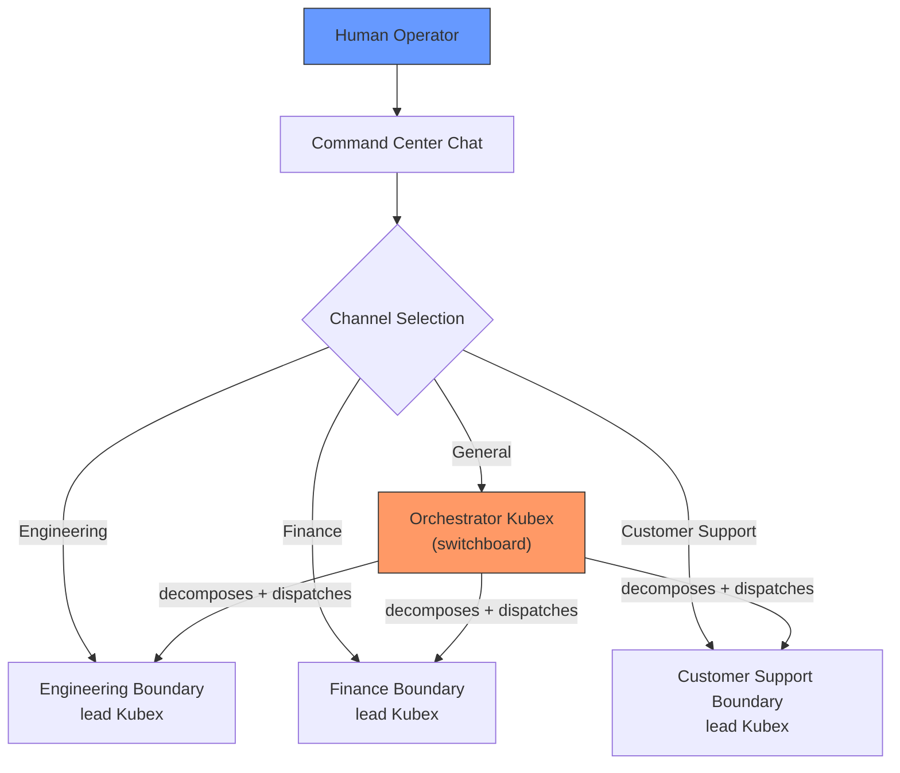

### 26.2 Chat Features

**Rich content rendering — agents respond in plain markdown, the frontend renders it beautifully:**

| Feature | Library | Purpose |
|---|---|---|
| Markdown rendering | `react-markdown` or `markdown-it` | Headings, lists, tables, bold, italic, links |
| Mermaid diagrams | `mermaid.js` | Flowcharts, sequence diagrams, rendered in-browser |
| Code syntax highlighting | `highlight.js` | 190+ languages, auto-detect, color-coded code blocks |
| LaTeX/math (post-MVP) | `KaTeX` | Mathematical notation if needed |

All rendering is **client-side**. Agents return standard markdown with fenced code blocks — the frontend handles presentation. No special formatting required from agents.

**Example agent response rendered in chat:**

````
Here's the scraping result for @example_user:

| Metric | Value |
|--------|-------|
| Followers | 12,450 |
| Posts | 342 |
| Engagement Rate | 3.2% |

The extraction code used:

```python
async def extract_profile(username: str) -> dict:
    response = await http_get(f"/api/v1/users/{username}")
    return parse_profile(response.json())
```

Here's the data flow:

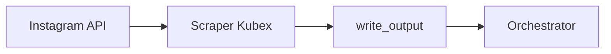
````

### 26.3 Real-Time Streaming

Agent responses stream in real-time as the agent works — not a single response after completion.

- **WebSocket connection** between Command Center frontend and Kubex Manager
- **Per-conversation stream:** Each chat conversation gets a WebSocket channel
- **Progressive rendering:** Markdown renders as tokens arrive (like ChatGPT streaming)
- **Status indicators:** "Orchestrator is thinking...", "Dispatched to Engineering boundary...", "Scraper is working..."

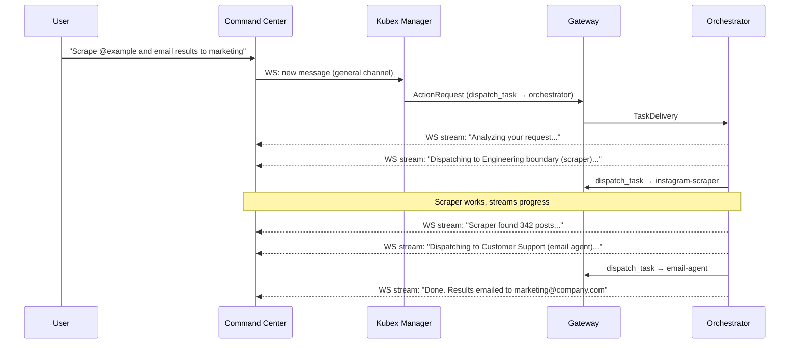

### 26.4 Inline Approvals

When a high-tier action needs human approval (Section 19.9), the approval request appears **inline in the chat conversation** — no context switch to a separate approval queue.

```
Approval Required

The email-agent wants to perform:
  Action: send_email
  To: marketing@company.com
  Subject: "Instagram Scraping Results - @example_user"

  [Approve]  [Reject]  [View Details]
```

The user approves or rejects right in the chat flow. The conversation continues seamlessly.

For bulk operations or when the user is away, the approval queue (Section 19.9) still works as a fallback — approvals queue up and can be processed in batch from the Command Center dashboard.

### 26.5 Conversation Persistence

Chat conversations are persisted for:
- **Audit trail** — every human instruction is logged (who asked what, when)
- **Workflow replay** — Command Center can replay a conversation to show what happened
- **Context continuity** — user can resume a conversation with the Orchestrator, picking up where they left off

Storage: conversations stored in OpenSearch alongside other logs. Tagged with `conversation_id`, `user_id`, `boundary` (if boundary-specific), and `workflow_id` (if a workflow was triggered).

### 26.6 External Integrations (Post-MVP)

The chat interface is the primary human-to-swarm interface, but external systems can also submit tasks:

| Integration | How | When |
|---|---|---|
| **Slack bot** | Slack webhook → Kubex Manager API → Orchestrator | "Hey KubexClaw, scrape @example" in a Slack channel |
| **Email trigger** | Incoming email → email agent → Orchestrator | Forward an email to trigger a workflow |
| **Webhook** | `POST /api/tasks` on Kubex Manager | External systems submit tasks programmatically |
| **Scheduled (cron)** | Gateway scheduler (Section 13.9) | Pre-defined workflows on a schedule |

All external inputs flow through the Gateway for policy evaluation — same security guarantees as the chat interface.

### 26.7 No Separate CLI Needed

The Kubex Manager REST API (Section 19) already covers all operational commands. For scripting and automation, `curl` against the API is sufficient. For emergencies when Command Center is down, direct `docker` commands provide the escape hatch:

**Emergency commands (document in `docs/emergency-ops.md`):**

```bash
# Kill a Kubex immediately
docker kill kubex-<name>

# Restart the Gateway
docker compose restart gateway

# Check health of all services
docker compose ps

# View Gateway logs
docker compose logs gateway --tail 100

# Force restart entire stack
docker compose down && docker compose up -d
```

A dedicated `kubexctl` CLI is a **post-MVP convenience** — a thin Python wrapper around the Kubex Manager API. Not a priority.

### 26.8 Action Items

- [ ] Design Command Center chat UI component (conversation list + message thread + channel selector)
- [ ] Implement WebSocket streaming from Kubex Manager to Command Center frontend
- [ ] Integrate `react-markdown` for markdown rendering
- [ ] Integrate `mermaid.js` for diagram rendering in chat
- [ ] Integrate `highlight.js` for code syntax highlighting in chat
- [ ] Implement inline approval UI within chat flow
- [ ] Implement conversation persistence in OpenSearch
- [ ] Design channel selection UI (General / per-boundary dropdown)
- [ ] Implement progressive streaming with status indicators
- [ ] Document emergency `docker`/`curl` commands in `docs/emergency-ops.md`
- [ ] Post-MVP: Evaluate Slack bot integration
- [ ] Post-MVP: Evaluate `kubexctl` CLI wrapper

---

## 30. User Interaction Model

> **Cross-references:** Section 16.2 (Canonical ActionRequest schema), Section 13.9 (Unified Gateway), Section 18 (Kubex Broker — Redis Streams), Section 19 (Kubex Manager REST API), Section 26 (Human-to-Swarm Interface).

The Orchestrator is the single point of contact between human users and the KubexClaw swarm. This section defines how that interface works at MVP, how clarification chains propagate back to the user, and how the architecture supports framework-agnostic agent implementations via MCP.

### 30.1 Orchestrator as the Human Interface

The Orchestrator is the ONLY Kubex that communicates with the user. Worker Kubexes never interact with users directly — they report back to their dispatcher (the Orchestrator).

#### MVP: Containerized Orchestrator with Docker Exec

For MVP, the Orchestrator runs as a Docker container managed by docker-compose. The CLI LLM and MCP bridge are pre-packaged inside the container image. The user connects via `docker exec`:

- User starts the full stack with `docker compose up -d`
- User connects to the Orchestrator with `docker exec -it orchestrator claude --mcp-server /app/mcp-bridge/config.json`
- The Orchestrator container connects to the Gateway over the internal Docker network (`http://gateway:8080`) — no external port needed for this connection
- All skills and MCP bridge config are pre-installed in the container image — no host-side setup required
- Identity: Docker label auth (`kubex.agent_id=orchestrator`, `kubex.boundary=default`) — same as worker Kubexes. No API token needed.
- The Orchestrator dispatches tasks via `dispatch_task` ActionRequest to the Gateway — the Gateway writes to the Broker (Redis Streams) internally (see Section 18)
- Worker results flow: Worker → Gateway (via Broker internally) → Orchestrator polls Gateway task result API
- The Orchestrator presents results and asks clarifying questions directly in the `docker exec` terminal session

**Why this works:**
- Zero UI development for MVP
- The `docker exec` terminal IS the chat interface
- The MCP bridge (inside the container) handles all infrastructure communication
- Identity via Docker labels — consistent with all other Kubexes, no separate auth path
- Entire system starts with a single `docker compose up -d`

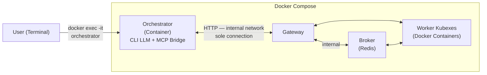

> Key principle: The Orchestrator has ONE connection — HTTP to the Gateway over the internal Docker network. The Gateway is the API surface. `dispatch_task` POSTs to the Gateway; the Gateway writes to the Broker. `check_task_status` GETs from the Gateway; the Gateway reads from the Broker. Worker Kubexes connect to the Broker directly (they are on the internal network), but the Orchestrator never does.

#### Post-MVP Options

**Option A: WebSocket/Chat API (multi-user)**

For production/multi-user deployments, the Orchestrator can expose a WebSocket/HTTP streaming endpoint:

- Container maps port (e.g., `localhost:3000`)
- Thin CLI client or web UI connects to the WebSocket
- Supports multiple concurrent sessions
- Enables Command Center UI integration (see Section 10)

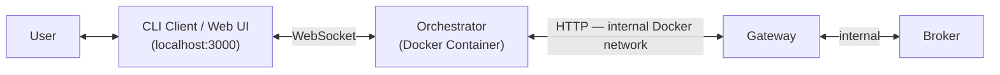

**Option B: Remote Orchestrator (API token auth)**

For cases where the user wants to connect an Orchestrator running outside the Docker network (e.g., from a laptop to a remote stack), the Gateway can be extended post-MVP with an API token authentication path:

- Expose only the Gateway port externally (`8080`)
- Orchestrator on the user's host authenticates with a pre-shared API token (`Authorization: Bearer <token>`)
- Gateway maps the token to identity `orchestrator/default` via a static `host_agents` config section
- The `docker exec` model remains available for local deployments

### 30.2 Clarification Flow

When a worker Kubex needs information it doesn't have, the flow chains back through the Orchestrator to the user.

#### Worker → Orchestrator Resolution

Workers can return `needs_clarification` status in their `report_result` (see Section 16.2 for the canonical ActionRequest schema):

```json
{
  "action": "report_result",
  "parameters": {
    "task_id": "task-7891",
    "status": "needs_clarification",
    "question": "Found 3 accounts matching 'Nike': @nike, @nikerunning, @nikesportswear. Which one?",
    "options": ["@nike", "@nikerunning", "@nikesportswear"],
    "partial_result": { "accounts_found": 3 }
  }
}
```

The Orchestrator receives this and has two options:

1. **Self-resolve** — If the Orchestrator has enough context from the original user request (e.g., user said "Nike's main account"), it re-dispatches with clarified instructions. No user interaction needed.

2. **Escalate to user** — If the Orchestrator can't determine the answer, it asks the user directly in the terminal:
   ```
   Orchestrator: The scraper found 3 Nike accounts. Which one should I scrape?
     1. @nike (main account)
     2. @nikerunning
     3. @nikesportswear
   User: 1
   ```
   Then re-dispatches to the worker with the clarified context.

#### Orchestrator → User Escalation

For the Orchestrator's own decisions (not worker clarifications), it uses a `request_user_input` action routed through the Gateway (see Section 13.9):

```json
{
  "action": "request_user_input",
  "parameters": {
    "question": "The analysis found both positive and negative trends. Should I focus the report on risks, opportunities, or both?",
    "options": ["risks", "opportunities", "both"],
    "timeout_seconds": 300,
    "default_on_timeout": "both"
  }
}
```

**MVP routing:** Since the Orchestrator IS the terminal session, this is just the LLM asking the user a question in the chat — no special infrastructure needed. The CLI LLM's native conversation loop handles it.

**Post-MVP routing:** The Gateway routes `request_user_input` to the appropriate user channel:
- WebSocket → Command Center UI
- Slack webhook → Slack thread
- Email → for async low-priority questions

### 30.3 HITL Policy Escalation vs. Clarification

These are two different flows that must not be conflated. HITL policy escalation is driven by the Gateway's Policy Engine; clarification is driven by agent logic.

| | Policy Escalation (HITL) | Clarification |
|--|--|--|
| **Trigger** | Gateway Policy Engine returns `ESCALATE` | Worker returns `needs_clarification` |
| **Who decides** | User (mandatory) | Orchestrator first, then user if needed |
| **What's at stake** | High-risk action (e.g., sending email, deleting data) | Ambiguous task parameters |
| **Timeout behavior** | Action DENIED if no response | Orchestrator can use `default_on_timeout` |
| **MVP implementation** | Gateway blocks, Orchestrator prompts user in terminal | Orchestrator's native conversation loop |

> See Section 13.9 for the Gateway's unified policy evaluation pipeline and the `ALLOW / DENY / ESCALATE` verdict model.

### 30.4 Timeout and Fallback Policy

When the Orchestrator asks the user a question and gets no response:

- `timeout_seconds`: How long to wait (default: 300 seconds / 5 minutes)
- `default_on_timeout`: If set, use this answer and continue. If `null`, cancel the task.
- Worker Kubexes waiting for clarification enter a `waiting` state — they do NOT consume compute while waiting.
- If the Orchestrator is restarted while a worker is waiting, the worker's `needs_clarification` result stays in the Broker (Redis Streams) until consumed — the Orchestrator can resume polling the Gateway's task result API after restart. See Section 18 for Broker durability guarantees.

### 30.5 Live Task Progress Streaming

When the Orchestrator dispatches a task to a worker Kubex, the user should see the worker's progress in real-time — not just the final result. This provides transparency into what the pipeline is doing.

#### User Experience

```
User: Scrape Instagram for Nike sneaker trends

Orchestrator: Dispatching to instagram-scraper...

  [instagram-scraper] Searching for Nike sneaker posts...
  [instagram-scraper] Found 47 posts matching criteria
  [instagram-scraper] Extracting captions and engagement metrics...
  [instagram-scraper] Processing post 12/47...
  [instagram-scraper] Processing post 47/47...
  [instagram-scraper] Compiling results...

Orchestrator: Scraper completed. 47 posts analyzed. Here are the trends...
```

#### Streaming Architecture

The Gateway provides a Server-Sent Events (SSE) endpoint for task progress:

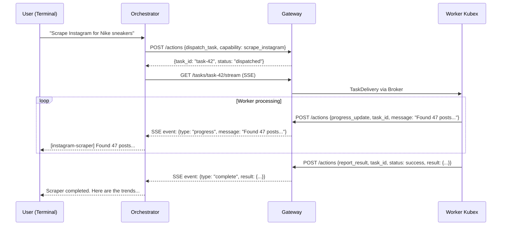

#### New Action: `progress_update`

Workers can emit progress updates during task execution:

```json
{
  "action": "progress_update",
  "parameters": {
    "task_id": "task-42",
    "message": "Found 47 posts matching criteria",
    "progress_pct": 25,
    "metadata": { "posts_found": 47 }
  }
}
```

- `message`: Human-readable status line (displayed to user)
- `progress_pct`: Optional percentage (0-100) for progress bars
- `metadata`: Optional structured data for programmatic consumption

Policy: `progress_update` is always ALLOW — it's informational, no side effects.

#### Gateway SSE Endpoint

`GET /tasks/{task_id}/stream`

Returns an SSE stream with events:

| Event Type | When | Payload |
|------------|------|---------|
| `dispatched` | Task sent to worker | `{task_id, worker_agent_id, capability}` |
| `accepted` | Worker picks up task | `{task_id, worker_agent_id}` |
| `progress` | Worker sends `progress_update` | `{message, progress_pct, metadata}` |
| `complete` | Worker sends `report_result` with `success` | `{result}` |
| `failed` | Worker sends `report_result` with `failure` | `{error}` |
| `needs_clarification` | Worker needs input | `{question, options}` |
| `cancelled` | Worker harness confirms task cancellation | `{task_id, reason, exit_reason: "cancelled"}` |

The Orchestrator opens this SSE stream immediately after dispatching a task and keeps it open until `complete`, `failed`, `needs_clarification`, or `cancelled`.

#### Kubex Harness (Progress Streaming)

Every worker Kubex container uses a **harness process** (`kubex-harness`) as its entrypoint — not the CLI LLM directly. The harness is responsible for capturing the CLI LLM's output and streaming it to the Gateway as progress updates.

**The harness:**

- Spawns the CLI LLM in a PTY (pseudo-terminal)
- Captures stdout/stderr in buffered chunks
- Forwards chunks to Gateway via `POST /tasks/{task_id}/progress`
- Proxies MCP tool calls between the CLI LLM and the MCP bridge
- Subscribes to Redis channel `control:{agent_id}` on startup for cancel commands and other control signals (see Section 30.8 — Task Cancellation)

##### Progress Payload

```json
{
  "action": "progress_update",
  "task_id": "t1-abc",
  "chunk_type": "stdout | stderr | status",
  "content": "Scraping page 3 of 12...",
  "sequence": 42,
  "timestamp": "2026-03-07T10:00:00Z"
}
```

- `chunk_type: "stdout"` — raw LLM output tokens
- `chunk_type: "stderr"` — error output
- `chunk_type: "status"` — structured status (e.g., `"tool call: search_instagram"`)
- `sequence` — monotonic counter for ordering (handles SSE reconnect reordering)

##### Transport: Gateway to Redis Pub/Sub to SSE

- Worker harness POSTs chunks to `POST /tasks/{task_id}/progress`
- Gateway publishes to Redis pub/sub channel `progress:{task_id}`
- Gateway exposes `GET /tasks/{task_id}/stream` SSE endpoint
- Orchestrator subscribes to SSE for dispatched tasks

##### Chunking Configuration

```yaml
KUBEX_PROGRESS_BUFFER_MS=500    # Buffer window in ms (min: 100, max: 5000, default: 500)
KUBEX_PROGRESS_MAX_CHUNK_KB=16  # Flush early if buffer hits size limit (default: 16KB)
```

- **500ms default:** ~2 updates/sec, balances responsiveness vs Gateway load
- **16KB max chunk:** safety valve for large LLM output dumps
- Configurable per-container via environment variables

##### Worker Container Architecture

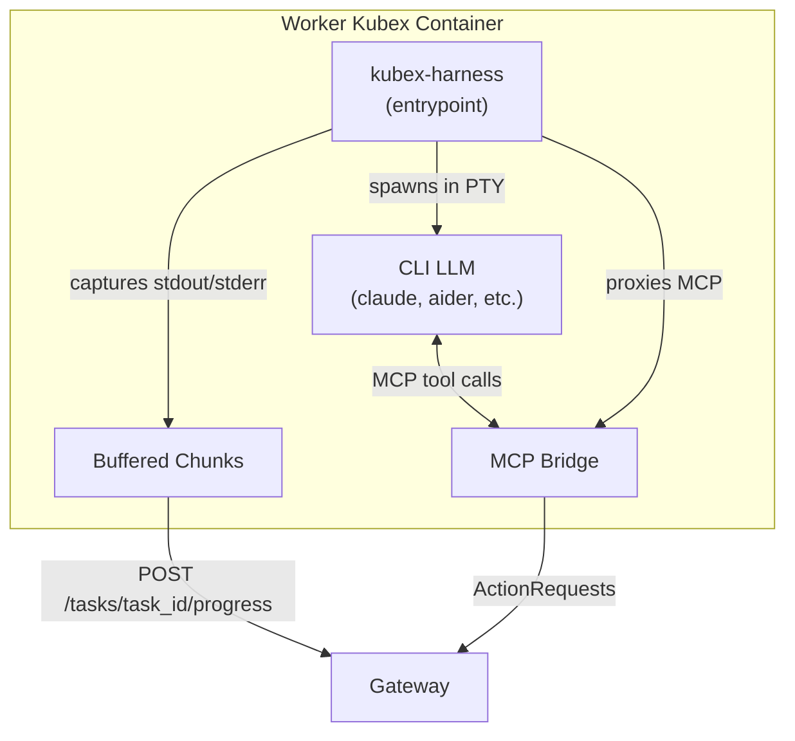

##### MVP vs Post-MVP

**MVP (Option A — MCP tool polling):**

- Orchestrator's MCP bridge exposes `subscribe_task_progress(task_id)` and `get_task_progress(task_id)` tools
- MCP bridge opens SSE connection in background when subscribed
- Orchestrator LLM polls progress via MCP tools and relays conversationally to user
- Simple, no terminal multiplexing needed

**Post-MVP (Option B — Terminal streaming):**

- Orchestrator's harness subscribes to SSE directly
- Writes worker output to terminal bypassing the LLM
- Enables true real-time multi-stream with terminal multiplexing (split panes or labeled output blocks)

##### Harness Behavior by Kubex Role

| Concern | Worker Kubex | Orchestrator Kubex |
|---|---|---|
| Harness captures stdout? | Yes — POSTs to Gateway | No (user sees directly) |
| Harness subscribes to SSE? | No | Yes (Option B, post-MVP) |
| LLM interaction | Autonomous (no stdin) | Interactive (docker exec -it) |

##### End-to-End Sequence (Harness + MCP Polling)

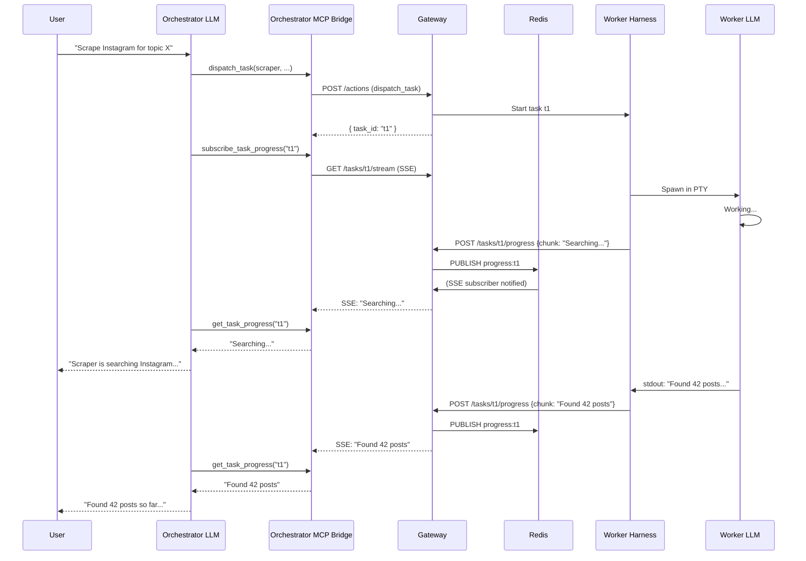

#### LLM Token Streaming (Post-MVP Enhancement)

For deeper visibility, workers can stream their LLM's raw output tokens via the harness. Since the harness already captures all stdout from the PTY, raw token streaming is a natural extension — the harness simply sets `chunk_type: "stdout"` on the progress payload instead of summarizing.

However, raw token streaming is high-bandwidth and may be noisy for end users. A better default is structured `message` progress updates at meaningful milestones (e.g., "Scraping page 3 of 5", "Analyzing sentiment..."). Raw token streaming should be opt-in via a `--verbose` or `--stream-tokens` flag.

#### MCP Bridge Integration

The MCP bridge runs **inside the Orchestrator container** (pre-packaged at `/app/mcp-bridge/`). It connects to the Gateway over the internal Docker network (`http://gateway:8080`). No port exposure is needed for Orchestrator to Gateway communication.

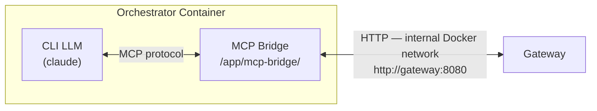

The MCP bridge adapter wraps progress streaming as MCP tools:

| MCP Tool | Maps To | Description |
|----------|---------|-------------|
| `subscribe_task_progress` | Opens `GET /tasks/{task_id}/stream` SSE | Subscribe to a worker task's progress stream; MCP bridge holds SSE connection in background |
| `get_task_progress` | Reads buffered SSE events | Poll latest progress chunks received since last call; returns accumulated `content` and `chunk_type` entries |
| `cancel_task` | `POST /tasks/{task_id}/cancel` | Cancel a running task; accepts `task_id` (required) and `reason` (optional). Cancellation confirmed asynchronously via SSE `cancelled` event |
| `progress_update` | `POST /tasks/{task_id}/progress` | (Worker-side) Send a structured progress update for a task to the Gateway |

The Orchestrator LLM calls `subscribe_task_progress` after dispatching a task, then periodically calls `get_task_progress` to check on the worker. The MCP bridge manages the SSE connection lifecycle internally.

#### Action Items
- [ ] MVP: Add `progress_update` action to Gateway action vocabulary
- [ ] MVP: Implement `GET /tasks/{task_id}/stream` SSE endpoint on Gateway
- [ ] MVP: Implement `POST /tasks/{task_id}/progress` endpoint on Gateway (harness chunk receiver)
- [ ] MVP: Implement Redis pub/sub fan-out for progress chunks (`progress:{task_id}` channels)
- [ ] MVP: Build `kubex-harness` entrypoint binary — PTY spawn, stdout/stderr capture, chunk buffering, Gateway POST
- [ ] MVP: Add `KUBEX_PROGRESS_BUFFER_MS` and `KUBEX_PROGRESS_MAX_CHUNK_KB` env var support to harness
- [ ] MVP: Add `subscribe_task_progress`, `get_task_progress`, and `cancel_task` MCP tools to Orchestrator MCP bridge
- [ ] MVP: Add `progress_update` MCP tool to worker MCP bridge
- [ ] MVP: Orchestrator MCP bridge subscribes to SSE stream after dispatch
- [ ] Post-MVP: Implement Option B — Orchestrator harness subscribes to SSE directly with terminal multiplexing
- [ ] Post-MVP: Add `--stream-tokens` flag for raw LLM output streaming
- [ ] Post-MVP: Add progress bar rendering in Command Center UI

---

### 30.8 Task Cancellation

When the user wants to cancel a running task, the cancellation flows from the Orchestrator through the Gateway to the worker harness via a dedicated Redis control channel. The harness performs graceful escalation to ensure the worker process is cleanly terminated.

#### Cancel Flow

```
User: "cancel that"
  → Orchestrator calls cancel_task(task_id) via MCP
    → Gateway POST /tasks/{task_id}/cancel
      → Gateway publishes to Redis control channel control:{agent_id}
        → Worker harness receives cancel signal
          → Sends abort keystroke to PTY
          → Waits grace period, escalates if needed
          → Reports task_status: "cancelled" back to Gateway
            → Gateway notifies Orchestrator via SSE
```

#### Cancel Sequence Diagram

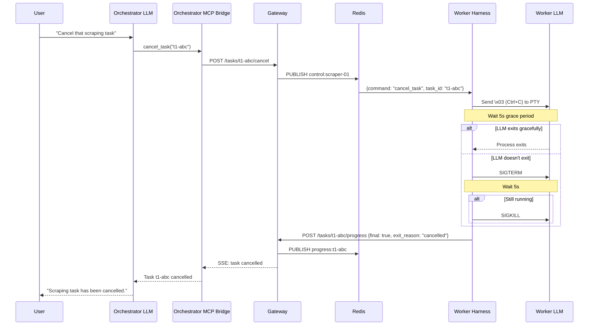

#### Graceful Escalation

The harness performs a 3-step escalation when a cancel command is received:

1. **Step 1:** Send `\x03` (Ctrl+C) to PTY — wait grace period
2. **Step 2:** Send SIGTERM to process — wait grace period
3. **Step 3:** Send SIGKILL to process — done

Each step waits `KUBEX_ABORT_GRACE_PERIOD_S` seconds before escalating to the next.

#### Configuration

```yaml
KUBEX_ABORT_KEYSTROKE="\x03"       # default: Ctrl+C, configurable per CLI type
KUBEX_ABORT_GRACE_PERIOD_S=5       # time between escalation steps (default: 5s)
```

- `KUBEX_ABORT_KEYSTROKE`: The keystroke sent to the PTY in step 1. Default is `\x03` (Ctrl+C). Configurable per CLI type (e.g., some CLI tools may need a different interrupt sequence).
- `KUBEX_ABORT_GRACE_PERIOD_S`: Time in seconds to wait between escalation steps. Default is 5 seconds.

#### Harness Control Channel

The harness subscribes to Redis channel `control:{agent_id}` on startup. This is a separate path from the task delivery mechanism (Redis Streams via the Broker) and is dedicated to out-of-band control signals.

**Control message schema:**

```json
{
  "command": "cancel_task",
  "task_id": "t1-abc",
  "reason": "user_requested",
  "timestamp": "2026-03-07T10:00:00Z"
}
```

- `command`: The control command type. MVP supports `cancel_task` only.
- `task_id`: The task to cancel. The harness verifies this matches the currently running task.
- `reason`: Human-readable reason (e.g., `"user_requested"`, `"timeout"`, `"budget_exceeded"`).
- `timestamp`: ISO 8601 timestamp of the cancel request.

#### Cancel Response

When a task is cancelled, the harness sends a final progress update with `final: true` and `exit_reason: "cancelled"`:

```json
{
  "action": "progress_update",
  "task_id": "t1-abc",
  "chunk_type": "status",
  "content": "Task cancelled (user requested)",
  "sequence": 99,
  "timestamp": "2026-03-07T10:00:05Z",
  "final": true,
  "exit_reason": "cancelled"
}
```

The Gateway receives this, publishes to the `progress:{task_id}` Redis pub/sub channel, and closes the SSE stream with a `cancelled` event. The Orchestrator's MCP bridge receives the SSE event and reports the cancellation to the CLI LLM.

#### Gateway API

`POST /tasks/{task_id}/cancel`

- Accepts an optional `reason` field in the JSON body (default: `"user_requested"`)
- Resolves `task_id` to the assigned `agent_id` (from Broker task metadata)
- Publishes a cancel command to Redis channel `control:{agent_id}`
- Returns `{ "status": "cancel_requested", "task_id": "..." }` immediately (cancellation is asynchronous)
- Policy: Only the dispatching agent (Orchestrator) can cancel a task. The Gateway verifies the caller is the task's originator.

#### MCP Tool

The Orchestrator's MCP bridge exposes:

| MCP Tool | Maps To | Description |
|----------|---------|-------------|
| `cancel_task` | `POST /tasks/{task_id}/cancel` | Cancel a running task. Accepts `task_id` (required) and `reason` (optional). Returns immediately; cancellation is confirmed asynchronously via SSE. |

#### SSE Event

When the task is cancelled, the SSE stream emits a terminal event:

| Event Type | When | Payload |
|------------|------|---------|
| `cancelled` | Worker harness confirms cancellation | `{task_id, reason, exit_reason: "cancelled"}` |

This is a terminal event — the SSE stream closes after emitting it (same behavior as `complete` or `failed`).

#### Action Items

- [ ] MVP: Implement `POST /tasks/{task_id}/cancel` endpoint on Gateway — resolve task_id to agent_id, publish cancel command to Redis `control:{agent_id}` channel
- [ ] MVP: Add `cancel_task` MCP tool to Orchestrator MCP bridge (`agents/orchestrator/mcp-bridge/tools/cancel.py`)
- [ ] MVP: Implement harness Redis `control:{agent_id}` subscription — subscribe on startup, listen for cancel commands
- [ ] MVP: Implement harness graceful escalation — 3-step: Ctrl+C → SIGTERM → SIGKILL with configurable grace period
- [ ] MVP: Add `KUBEX_ABORT_KEYSTROKE` and `KUBEX_ABORT_GRACE_PERIOD_S` env var support to harness
- [ ] MVP: Add `final` and `exit_reason` fields to progress update schema in kubex-common
- [ ] MVP: Add `cancelled` event type to SSE stream on Gateway
- [ ] MVP: Implement cancel authorization — verify caller is the task's originating agent
- [ ] Post-MVP: Support bulk cancellation (`POST /tasks/cancel` with list of task_ids)
- [ ] Post-MVP: Support cancellation reason categories (user_requested, timeout, budget_exceeded, policy_violation)

---

### 30.9 CLI LLM Authentication & Credential Management

> **Cross-references:** Section 8 (Secrets Management Strategy in docs/infrastructure.md), Section 6.4 (LLM API Keys Gateway-Only in MVP.md), Section 3.5 (Kubex Manager in MVP.md).

The CLI LLM running inside each Kubex container needs credentials to call LLM providers. The auth complexity comes from the **LLM provider**, not the CLI LLM framework. OpenClaw using an Anthropic API key is trivial. OpenClaw using Google Gemini OAuth is the same flow as Claude Code's OAuth.

#### 30.9.1 Gateway LLM Proxy Model

> **Decision (2026-03-08):** All LLM API calls are proxied through the Gateway. Workers never hold LLM API keys. CLI LLMs inside Kubex containers are configured with `*_BASE_URL` env vars pointing to Gateway proxy endpoints. The Gateway injects the real API key and forwards to the provider transparently. See docs/gateway.md Section 13.9.1 for full design.

**API Key Providers (Anthropic, OpenAI, OpenRouter, Ollama):**
- User pastes key during `./kubexclaw setup`
- Stored in `secrets/llm-api-keys.json` — mounted into **Gateway only**
- Kubex Manager sets `*_BASE_URL` env vars on workers pointing to Gateway proxy (e.g., `ANTHROPIC_BASE_URL=http://gateway:8080/v1/proxy/anthropic`)
- CLI LLM sends requests to Gateway; Gateway injects real API key and forwards to provider
- Zero interaction needed at worker deployment time
- **Workers do NOT receive `ANTHROPIC_API_KEY` or `OPENAI_API_KEY` env vars**

**OAuth Providers (Google Gemini, GitHub Copilot, Claude Code/Anthropic OAuth):**
- User runs `./kubexclaw auth <provider>` once on host
- Browser-based OAuth consent flow (or device code flow for Claude Code)
- LLM API tokens stored in `secrets/llm-oauth-tokens.json` — mounted into **Gateway only**
- CLI auth tokens (e.g., Claude Code OAuth for CLI identity) stored in `secrets/cli-credentials/<provider>/` — mounted into workers (these authenticate the CLI itself, not the LLM API)
- Gateway manages token refresh centrally (to avoid race conditions with multiple containers)
- Access tokens cached in Redis db4, refresh tokens in secrets files

#### 30.9.2 Secrets Directory Structure

```
secrets/
├── llm-api-keys.json                    # API key providers
├── llm-oauth-tokens.json                # OAuth refresh tokens (Gateway-managed)
└── cli-credentials/
    ├── claude/
    │   └── credentials.json             # Claude Code OAuth token
    ├── openclaw/
    │   └── auth-profiles.json           # OpenClaw OAuth profiles
    └── aider/
        └── credentials.json             # If needed
```

#### 30.9.3 Setup CLI

```bash
./kubexclaw setup                  # Interactive walkthrough of all providers
./kubexclaw auth anthropic         # API key — just paste it
./kubexclaw auth google-gemini     # OAuth — opens browser for consent
./kubexclaw auth claude            # OAuth — device code flow
./kubexclaw reauth google-gemini   # Re-auth if token revoked/expired
```

The setup script is **provider-scoped, not CLI-scoped**. The provider determines the auth flow — not which CLI LLM framework uses it.

#### 30.9.4 Setup Flow (Interactive)

```
$ ./kubexclaw setup

KubexClaw Setup
===============

Configure LLM providers:

1. Anthropic (API key)
   → Paste your API key: sk-ant-...
   ✓ Saved to secrets/llm-api-keys.json

2. Google Gemini (OAuth)
   → Paste your GCP Client ID: 1234....apps.googleusercontent.com
   → Paste your Client Secret: GOCSPX-...
   → Opening browser for authorization...
   → Paste the authorization code: 4/0Adeu...
   ✓ Tokens exchanged. Refresh token saved.

3. OpenAI (API key)
   → Paste your API key: sk-proj-...
   ✓ Saved to secrets/llm-api-keys.json

Skip remaining providers? (y/n): y

✓ Secrets written. Run 'docker compose up -d' to start.
```

#### 30.9.5 Worker Deployment (Automated by Kubex Manager)

When Kubex Manager spins up a worker:

1. Reads agent manifest to determine CLI LLM type and required providers
2. Sets `*_BASE_URL` env vars pointing to Gateway proxy endpoints (e.g., `ANTHROPIC_BASE_URL=http://gateway:8080/v1/proxy/anthropic`) — **no API keys injected**
3. For OAuth CLI LLMs (e.g., Claude Code): mounts CLI auth token files from `secrets/cli-credentials/<provider>/` (for CLI identity, not for LLM API access)
4. CLI LLM inside container sends LLM requests to the Gateway proxy; Gateway injects the real API key and forwards to the provider
5. Worker starts working immediately — zero interaction

#### 30.9.6 Agent Manifest Declares Provider Requirements

The `providers` field declares which LLM providers this agent needs access to **via Gateway proxy** — not which credentials to mount. Kubex Manager translates this into `*_BASE_URL` env vars.

```yaml
# agents/instagram-scraper/manifest.yaml
agent_id: instagram-scraper
cli: openclaw
providers:
  - anthropic    # Kubex Manager sets ANTHROPIC_BASE_URL=http://gateway:8080/v1/proxy/anthropic
skills:
  - web-scraping
  - data-extraction
```

```yaml
# agents/data-analyst/manifest.yaml
agent_id: data-analyst
cli: claude
providers:
  - claude       # Kubex Manager sets ANTHROPIC_BASE_URL + mounts CLI OAuth token
skills:
  - data-analysis
```

#### 30.9.7 Orchestrator (Special Case)

- Accessed via `docker exec -it orchestrator claude`
- On first run, Claude Code detects no browser, uses device code flow
- User opens URL on host browser, approves
- Token stored inside container (persisted via Docker volume)
- Alternatively: auth on host first, mount token file (same as workers)

#### 30.9.8 OpenClaw Headless Configuration

OpenClaw is fully headless-friendly:

- **LLM provider access:** set `*_BASE_URL` env vars pointing to Gateway proxy (e.g., `ANTHROPIC_BASE_URL=http://gateway:8080/v1/proxy/anthropic`) — no API keys in worker containers
- **Config:** pre-populate `~/.openclaw/openclaw.json` (JSON5) and bind-mount
- **Skills/tools:** pre-write `AGENTS.md`, `SOUL.md`, `TOOLS.md` workspace files
- **Tool restrictions per agent** via config:

```json5
{
  tools: {
    allow: ["read", "exec", "write"],
    deny: ["browser", "canvas"]
  }
}
```

- **OAuth providers:** mount pre-populated `auth-profiles.json`

#### 30.9.9 Token Refresh Architecture

Gateway is the only service that refreshes OAuth tokens. Workers read mounted token files (read-only). If a provider rotates the refresh token, Gateway updates the secrets file (mounted read-write for Gateway only).

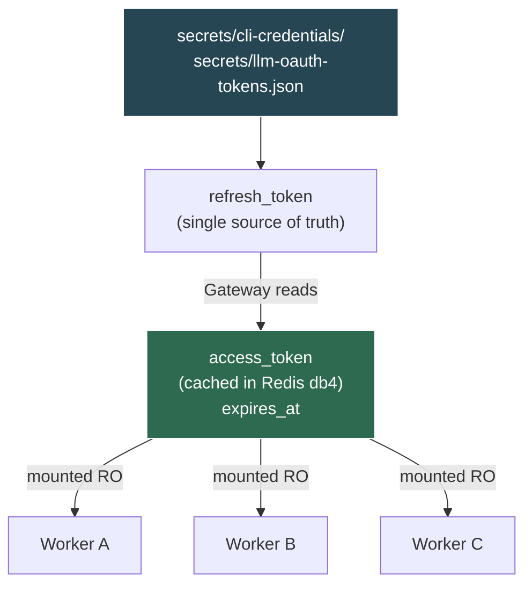

#### 30.9.10 Worker Auth Flow

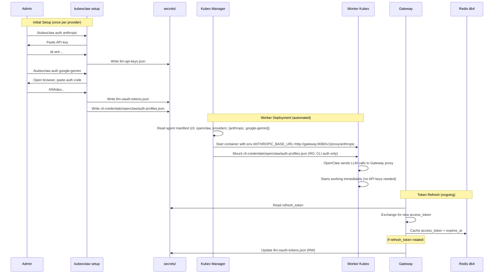

#### 30.9.11 Provider Auth Summary

| Provider Auth | Setup | Worker Deployment |
|---|---|---|
| API key (Anthropic, OpenAI, OpenRouter) | Paste key during `./kubexclaw setup` | Set `*_BASE_URL` env var pointing to Gateway proxy. No API key in worker. |
| OAuth (Google Gemini, GitHub Copilot) | `./kubexclaw auth <provider>` opens browser | Set `*_BASE_URL` env var. Mount CLI auth token if needed. Gateway refreshes LLM tokens centrally. |
| OAuth device flow (Claude Code) | `./kubexclaw auth claude` — device code | Set `ANTHROPIC_BASE_URL` env var. Mount CLI OAuth token. Gateway refreshes LLM tokens centrally. |

#### 30.9.12 Action Items

- [ ] Build `kubexclaw setup` CLI script (Python, interactive provider walkthrough)
- [ ] Build `kubexclaw auth <provider>` command (per-provider auth flow)
- [ ] Build `kubexclaw reauth <provider>` command (re-authorization)
- [ ] Create secrets directory structure and `.gitignore` for secrets/
- [ ] Add agent manifest schema with `cli` and `providers` fields
- [ ] Implement Gateway token refresh loop (check expiry every 60s, refresh 5min early)
- [ ] Implement Kubex Manager credential mounting (read manifest, mount appropriate files)
- [ ] Add OpenClaw headless config templates (openclaw.json, AGENTS.md, SOUL.md)
- [ ] Document provider-specific setup instructions (GCP Console for Gemini, etc.)
- [ ] Post-MVP: Command Center UI for credential management

---

### 30.6 Framework-Agnostic Agent Interface (Post-MVP)

The architecture supports replacing OpenClaw with any MCP-compatible CLI LLM.

#### MCP Bridge Pattern

A lightweight MCP server acts as the adapter between any CLI LLM and the KubexClaw infrastructure:

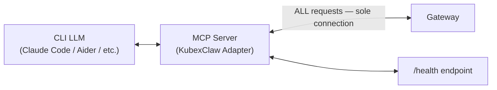

The MCP server exposes KubexClaw actions as MCP tools, mapping each directly to the canonical ActionRequest vocabulary (Section 16.2). The MCP server connects only to the Gateway — no direct Broker, Registry, or Redis connections. Task dispatch and result polling both go through the Gateway's API:

| MCP Tool | Maps To | Description |
|----------|---------|-------------|
| `http_get` | ActionRequest `http_get` | Fetch URL via Gateway egress proxy |
| `http_post` | ActionRequest `http_post` | POST via Gateway egress proxy |
| `dispatch_task` | ActionRequest `dispatch_task` | Send task to another Kubex via Gateway (Gateway writes to Broker internally) |
| `report_result` | ActionRequest `report_result` | Return task result to dispatcher |
| `query_knowledge` | ActionRequest `query_knowledge` | Query Graphiti knowledge graph |
| `store_knowledge` | ActionRequest `store_knowledge` | Store to OpenSearch + Graphiti |
| `search_corpus` | ActionRequest `search_corpus` | Search OpenSearch document corpus |
| `send_email` | ActionRequest `send_email` | Send email via Gateway (HITL-gated) |

The CLI LLM calls MCP tools naturally. The MCP server translates each call to an ActionRequest, sends it to the Gateway, and returns the response. The LLM never knows it's inside KubexClaw.

#### Adapter Responsibilities

The MCP server adapter (~300 lines) handles:
1. **Task result polling** — polls Gateway `GET /tasks/{task_id}/result` for incoming results and clarifications; feeds task context to the LLM. No direct Broker/Redis connection.
2. **ActionRequest translation** — wraps MCP tool calls as ActionRequest JSON
3. **Gateway communication** — HTTP POST to Gateway (`POST /actions`), handles `ALLOW / DENY / ESCALATE` responses; this is the sole connection
4. **Health endpoint** — exposes `/health` on a configured port
5. **Graceful shutdown** — catches SIGTERM, drains in-flight tasks
6. **Secret loading** — reads `/run/secrets/` bind mounts, injects into MCP server config (see Section 8)

#### Why MCP is the Right Abstraction

- All major CLI LLMs support MCP (Claude Code, Cursor, Windsurf, etc.)
- Tool definitions are declarative JSON — easy to generate from the ActionRequest vocabulary (Section 16.2)
- The CLI LLM's native conversation loop handles user interaction (for Orchestrator)
- No SDK dependency — works with any MCP-compatible agent
- The LLM's own reasoning handles tool selection — KubexClaw just provides the tools

### 30.7 Action Items

- [x] Define Orchestrator as the sole human-facing interface
- [x] Design clarification flow (worker → Orchestrator → user)
- [x] Define `needs_clarification` result status
- [x] Define `request_user_input` action
- [x] Design timeout/fallback policy
- [x] Document MCP bridge pattern for framework-agnostic agents
- [x] Establish Orchestrator single-connection model: HTTP to Gateway (internal Docker network) only, no direct Broker/Redis access
- [x] Containerize Orchestrator — Docker label auth, MCP bridge pre-packaged, `docker exec` interaction model
- [ ] MVP: Build `agents/orchestrator/Dockerfile` — CLI LLM + MCP bridge pre-packaged
- [ ] MVP: Add `orchestrator` service to `docker-compose.yml` with Docker labels
- [ ] MVP: Build MCP Bridge server (`agents/orchestrator/mcp-bridge/`) — Gateway client uses `http://gateway:8080` (internal network, no token)
- [ ] MVP: Implement Gateway task result API endpoint (`GET /tasks/{task_id}/result`) for Orchestrator polling
- [ ] MVP: Implement Gateway `dispatch_task` handler — evaluate policy then write TaskDelivery to Broker
- [ ] MVP: Implement Gateway `report_result` handler — receive from worker, store result in Broker by task_id
- [ ] MVP: Add `needs_clarification` status to `report_result` schema in kubex-common
- [ ] MVP: Add `request_user_input` to Gateway action vocabulary
- [ ] Post-MVP: Expose WebSocket/chat API endpoint from Orchestrator container (multi-user support)
- [ ] Post-MVP: Add API token auth path to Gateway for remote/external Orchestrators (Option B)
- [ ] Post-MVP: Integrate user channels (Slack, email) for async escalation
