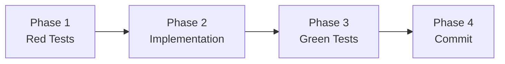
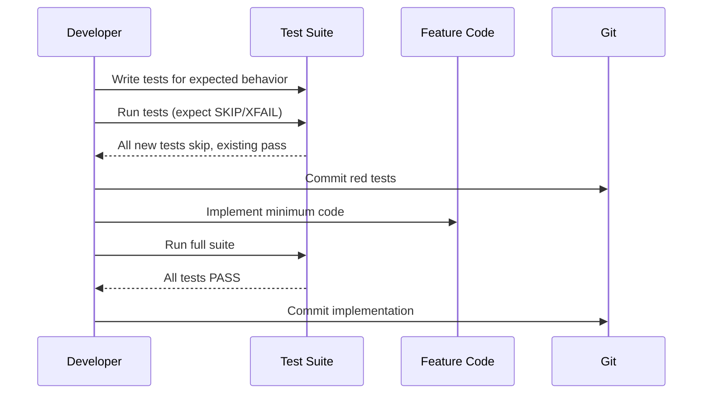

---
skill:
  name: "implement-feature"
  version: "0.1.0"
  description: "Red-green testing workflow for all feature development. Write failing tests first, implement to pass, verify no regressions."
  category: "development"
  tags:
    - "testing"
    - "tdd"
    - "red-green"
    - "workflow"
    - "development"
  tools: []
  applies_to: "all feature implementation work"
---

# Implement Feature Skill

This skill defines the mandatory red-green testing workflow for all feature development in the KubexClaw project. Every new feature follows the same four-phase cycle: write failing tests, implement the feature, verify all tests pass, commit with proper messages.

This pattern was used across all 6 implementation waves (703+ tests) and is non-negotiable for new work.

## Workflow Overview



## Phase 1: Red Tests

Write tests **before** any feature code exists. Tests should exercise the expected behavior and fail or skip gracefully until the implementation is in place.

### Steps

1. **Analyze requirements.** Read the feature spec, acceptance criteria, and any referenced architecture docs. Identify the behaviors that need testing.

2. **Choose test layers.** Decide which test types are needed based on what the feature touches:

   | Feature Type | Test Layers |
   |---|---|
   | New service endpoint | E2E + unit |
   | New library function | Unit (+ integration if it touches Redis/Docker) |
   | New policy rule | Unit + policy fixtures |
   | New agent capability | E2E + unit |
   | Cross-service workflow | E2E + integration |

3. **Write the tests.** Place them in the correct directory:
   - `tests/unit/test_*.py` -- isolated logic tests, mocked dependencies
   - `tests/integration/test_*.py` -- tests with real or faked external services (fakeredis, TestClient)
   - `tests/e2e/test_*.py` -- full service flow tests
   - `tests/chaos/test_*.py` -- failure injection tests (nightly only)

4. **Make tests skip gracefully.** Since the feature code does not exist yet, tests must not crash on import. Use one of these patterns:

   **Pattern A -- skipif on missing module:**
   ```python
   import pytest
   try:
       from services.gateway.gateway.new_feature import NewFeature
       HAS_FEATURE = True
   except ImportError:
       HAS_FEATURE = False

   @pytest.mark.skipif(not HAS_FEATURE, reason="Feature not implemented yet")
   def test_new_feature_does_something():
       ...
   ```

   **Pattern B -- skip entire module:**
   ```python
   import pytest
   pytest.importorskip("services.gateway.gateway.new_feature")
   ```

   **Pattern C -- expected failure:**
   ```python
   @pytest.mark.xfail(reason="Not implemented yet", strict=True)
   def test_new_feature():
       ...
   ```

5. **Run the tests.** Confirm they skip or fail as expected:
   ```bash
   python -m pytest tests/ -v --tb=short
   ```
   All new tests should show SKIPPED or XFAIL. Zero new tests should PASS (that would mean the test is not actually testing anything new). All existing tests must still pass.

6. **Commit red tests separately:**
   ```
   Wave X spec-driven E2E tests (red): <description>
   ```
   Include the count of new tests in the commit message body.

## Phase 2: Implementation

Write the minimum code needed to make the red tests pass. No speculative features, no over-engineering.

### Steps

1. **Follow existing patterns.** Read the existing code in the same service or module before writing. Match the structure, naming conventions, and error handling style.

2. **Prefer editing over creating.** Add to existing files when possible. Only create new files when the feature genuinely needs a new module.

3. **Security first.** Every implementation must consider:
   - No command injection (sanitize shell inputs)
   - No unvalidated user input reaching queries or templates
   - Least privilege (agents only get what they need)
   - Fail closed on security checks
   - No secrets in logs or API responses

4. **Write minimum code.** The tests define the acceptance criteria. Satisfy them and stop. Refactoring comes later.

5. **Handle imports.** Remove or update the skip markers in the red tests as the implementation lands -- the tests should now be able to import the feature code.

## Phase 3: Green Tests

Run the full test suite and verify everything passes.

### Steps

1. **Run all tests:**
   ```bash
   python -m pytest tests/ -v
   ```

2. **Check results:**
   - All new tests must PASS (not SKIP, not XFAIL)
   - All existing tests must still PASS (no regressions)
   - Zero failures, zero errors

3. **If tests fail:**
   - Fix the implementation code (not the tests, unless the test itself has a bug)
   - Re-run until green
   - If a test expectation was wrong, fix it and document why in the commit message

4. **Check coverage** (if applicable):
   ```bash
   python -m pytest tests/ --cov=<module> --cov-report=term-missing
   ```
   Minimum coverage thresholds:
   - `kubex-common`: 90%
   - Gateway Policy Engine: 95%
   - Kubex Manager / Broker: 80%
   - Agent skills: 70%

## Phase 4: Commit & Record

Separate commits for tests and implementation preserve the red-green history. Always commit completed work and update the progress file.

### Commit Structure

| Commit | Format | Example |
|---|---|---|
| Red tests | `Wave X spec-driven E2E tests (red): <desc>` | `Wave 4 spec-driven E2E tests (red): Kubex Manager + Agent Harness` |
| Implementation | `Wave X: <desc>` | `Wave 4: Kubex Manager + Base Agent Harness (4A, 4B)` |

### Commit Message Body

Include a test count summary in the body of each commit:

```
Wave 4: Kubex Manager + Base Agent Harness (4A, 4B)

- 49 E2E tests now passing (were SKIPPED)
- 75 new unit tests added
- 124 total new tests, 400 total project tests
```

### Commit Rules

- **Always commit when done.** Every completed phase (red tests, implementation) gets its own commit immediately. Do not leave uncommitted work.
- Do not combine red tests and implementation in one commit
- Do not commit with failing tests (except the intentional red test commit where new tests skip/xfail)
- Do not skip the test run ("it looks right" is not verification)
- Do not delete tests that are hard to pass -- fix the code instead

### Record Progress

After committing, **always update MEMORY.md** with what was accomplished:

1. **Update the implementation status** section with the new feature, commit hash, and test counts
2. **Update the git history** section with the new commit(s)
3. **Record any key decisions or learnings** that would help future sessions
4. **Update any remaining items** lists to reflect what was completed

This ensures the next session can pick up exactly where you left off without re-reading the entire codebase.

## Quick Reference



## Error Handling

- **Import errors in red tests:** Use the skip patterns from Phase 1. Never let missing imports crash the test runner.
- **Flaky tests:** If a test passes sometimes and fails sometimes, fix the flakiness before committing. Common causes: timing issues, shared state, missing test isolation.
- **Fixture conflicts:** Use `conftest.py` at the appropriate directory level. Avoid global fixtures that affect unrelated tests.
